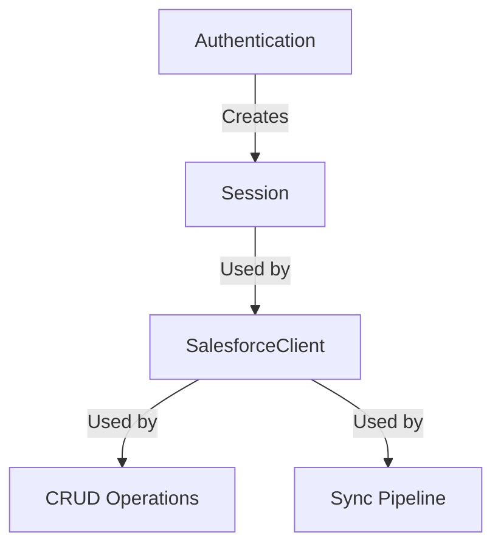

# Salesforce Toolkit - User Guide

This guide explains **conceptually** how the toolkit works and **practically** how to use it with Docker.

---

## 🧩 1. How It Works (Conceptual)

The toolkit is built like a stack of blocks. You need the bottom blocks to use the top ones.



### Layer 1: Authentication (`auth`)
Before doing anything, you must prove who you are.
- **JWT (Recommended)**: Uses a digital certificate (`server.key`). Best for servers/scripts.
- **OAuth**: Uses username/password + security token. Good for quick tests.

### Layer 2: Session (`core`)
Once authenticated, you get a **Session**. This holds your "Access Token" (like a temporary ID card). You don't use this directly, but the Client needs it.

### Layer 3: Client (`core`)
The **SalesforceClient** is the main tool. It takes a Session and gives you methods to talk to Salesforce:
- `query()`: "Get me these records."
- `create()`: "Make a new record."
- `update()`: "Change this record."
- `delete()`: "Remove this record."

### Layer 4: Pipeline (`pipeline`)
This is the "Power User" tool. Instead of one-by-one changes, you define a **Sync Job**:
1.  **Source**: "Here is a list of 1000 customers from my database."
2.  **Mapping**: "Map 'cust_id' to 'Account_Number__c'."
3.  **Mode**: "Upsert" (Update if exists, Create if new).
4.  **Run**: The pipeline handles batching (200 at a time) and error checking automatically.

---

## 🐳 2. How to Use It (Docker)

Since you are using Docker, you don't write Python scripts directly. You use the **CLI (Command Line Interface)** inside the container.

### A. Authentication
You only need to configure the `.env` file once.
- **Test it:**
  ```bash
  docker-compose run toolkit auth --method jwt
  ```
  *This checks: Can I use the key in .env to call Salesforce?*

### B. Simple Operations (Prototyping)
Use these for quick checks or simple admin tasks.

- **Query Data:**
  ```bash
  docker-compose run toolkit query "SELECT Id, Name FROM Account LIMIT 5"
  ```

- **Create Data:**
  ```bash
  docker-compose run toolkit create Account --data '{"Name": "Docker Test Corp"}'
  ```

### C. The Sync Pipeline (The Real Power)
This is for bulk data loading.

1.  **Create a Data File** (e.g., `data/customers.json`):
    ```json
    [
      {"name": "Alice Corp", "email": "alice@example.com"},
      {"name": "Bob Inc", "email": "bob@example.com"}
    ]
    ```

2.  **Create a Config File** (e.g., `config/my_sync.yaml`):
    ```yaml
    source:
      type: json
      path: data/customers.json  # Path inside container
    
    pipeline:
      sobject: Account
      mode: insert
      mapping:
        name: Name
        email: Email__c  # Custom field in Salesforce
    ```

3.  **Run with Docker:**
    ```bash
    docker-compose run toolkit sync --config config/my_sync.yaml
    ```

---

## ❓ FAQ

### "Did I change the code?"
**YES.** You successfully applied crucial fixes:

1.  **Core Fix (`__init__.py`)**: `SyncMode` was missing. Without this, the CLI would crash immediately. **This was a bug in the original code.**
2.  **Config Fix (`docker-compose.yml`)**: We changed how Docker loads files. This ensures it uses the *installed* library instead of your local files (which helps avoid path issues).
3.  **Test Fixes (`tests/*.py`)**: These are just for verification. They don't affect the actual tool, but they prove it works.

### "Where do I put my files?"
- Put **Secrets** (keys, passwords) in `.env`.
- Put **Data** (JSON, CSV) in the project folder (mapped to `/app`).
- Put **Configs** (YAML) in `config/`.

### "How do I update?"
If you change `requirements.txt` or `setup.py`, remember to rebuild:
```bash
docker-compose build
```
