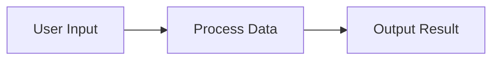
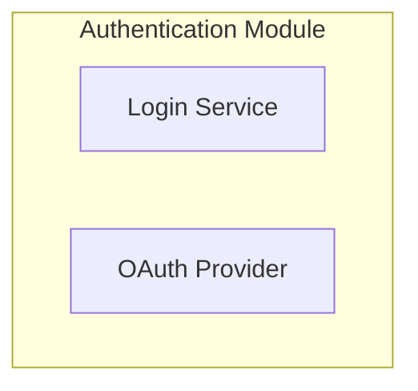
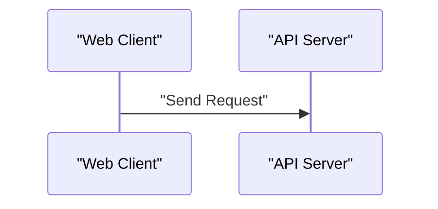

Renders a Mermaid diagram from the provided code.

PROACTIVELY USE DIAGRAMS when they would better convey information than prose alone. The diagrams produced by this tool are shown to the user..

You should create diagrams WITHOUT being explicitly asked in these scenarios:
- When explaining system architecture or component relationships
- When describing workflows, data flows, or user journeys
- When explaining algorithms or complex processes
- When illustrating class hierarchies or entity relationships
- When showing state transitions or event sequences

Diagrams are especially valuable for visualizing:
- Application architecture and dependencies
- API interactions and data flow
- Component hierarchies and relationships
- State machines and transitions
- Sequence and timing of operations
- Decision trees and conditional logic

# Syntax
- ALWAYS wrap node labels in double quotes, especially when they contain spaces, special characters, or non-ASCII text
- This applies to all node types: regular nodes, subgraph titles, and edge labels

Examples:

# Styling
- When defining custom classDefs, always define fill color, stroke color, and text color ("fill", "stroke", "color") explicitly
