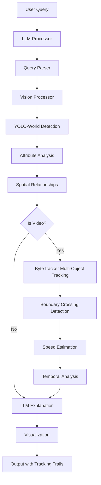

# 🧠 Langvio: Natural Language Computer Vision

<dlangvioiv align="center">


[](https://www.python.org/downloads/)
[](https://opensource.org/licenses/MIT)
[](https://badge.fury.io/py/langvio)
[](https://langvio.readthedocs.io/)

**Connect language models to vision models for natural language visual analysis**

[🚀 Quick Start](#-quick-start) • [📖 Documentation](https://langvio.readthedocs.io/) • [🎯 Examples](#-examples) • [🔧 Installation](#-installation) • [🤝 Contributing](#-contributing)

</dlangvioiv>

---

## ✨ What is Langvio?

Langvio bridges the gap between **human language** and **computer vision**. Ask questions about images and videos in plain English, and get intelligent analysis powered by state-of-the-art vision models and language models.

### 🎯 Key Features

- **🗣️ Natural Language Interface**: Ask questions like "Count all red cars" or "Find people wearing yellow"
- **🎥 Multi-Modal Support**: Works with both images and videos
- **🚀 Powered by YOLO-World v2**: Fast, accurate object detection without predefined classes
- **📹 ByteTracker Integration**: Advanced multi-object tracking for video analysis with boundary crossing detection
- **🤖 LLM Integration**: Supports OpenAI GPT and Google Gemini for intelligent explanations
- **📊 Advanced Analytics**: Object counting, speed estimation, spatial relationships, temporal tracking
- **🎨 Visual Output**: Generates annotated images/videos with detection highlights and tracking trails
- **🌐 Web Interface**: Includes a Flask web app for easy interaction
- **🔧 Extensible**: Easy to add new models and capabilities

## 🎬 See It In Action

```python
import langvio

# Create a pipeline
pipeline = langvio.create_pipeline()

# Analyze an image
result = pipeline.process(
    query="Count how many people are wearing red shirts",
    media_path="street_scene.jpg"
)

print(result['explanation'])
# Output: "I found 3 people wearing red shirts in the image. 
#          Two are located in the center-left area, and one is on the right side."

# View the annotated result
print(f"Annotated image saved to: {result['output_path']}")
```

## 🔧 Installation

### Basic Installation

```bash
pip install langvio
```

### With LLM Provider Support

Choose your preferred language model provider:

```bash
# For OpenAI models (GPT-3.5, GPT-4)
pip install langvio[openai]

# For Google Gemini models
pip install langvio[google]

# For all supported providers
pip install langvio[all-llm]

# For development
pip install langvio[dev]
```

### Environment Setup

1. **Create a `.env` file** for your API keys:

```bash
# Copy the template
cp .env.template .env
```

2. **Add your API keys** to `.env`:

```env
# For OpenAI
OPENAI_API_KEY=your_openai_api_key_here

# For Google Gemini  
GOOGLE_API_KEY=your_google_api_key_here
```

3. **Langvio automatically loads** these environment variables!

## 🚀 Quick Start

### Basic Usage

```python
import langvio

# Create a pipeline (automatically detects available LLM providers)
pipeline = langvio.create_pipeline()

# Process an image
result = pipeline.process(
    query="What objects are in this image?",
    media_path="path/to/your/image.jpg"
)

print(result['explanation'])
print(f"Output: {result['output_path']}")
```

### Video Analysis

```python
# Analyze videos with temporal understanding
result = pipeline.process(
    query="Count vehicles crossing the intersection",
    media_path="traffic_video.mp4"
)

# Get detailed analysis including speed and movement patterns
print(result['explanation'])
```

### Web Interface

```bash
# Launch the web interface
cd webapp
python app.py

# Visit http://localhost:5000 in your browser
```

## 🎯 Examples

### Object Detection & Counting

```python
# Count specific objects
pipeline.process("How many cars are in this parking lot?", "parking.jpg")

# Find objects by attributes  
pipeline.process("Find all red objects in this image", "scene.jpg")

# Spatial relationships
pipeline.process("What objects are on the table?", "kitchen.jpg")
```

### Video Analysis with ByteTracker

```python
# Track movement patterns (uses ByteTracker for multi-object tracking)
pipeline.process("Track people walking through the scene", "crowd.mp4")

# Boundary crossing detection (ByteTracker tracks entry/exit)
pipeline.process("How many vehicles entered vs exited the intersection?", "traffic.mp4")

# Speed analysis (uses tracked trajectories from ByteTracker)
pipeline.process("What's the average speed of vehicles?", "highway.mp4")

# Activity detection with temporal tracking
pipeline.process("Detect any unusual activities", "security_footage.mp4")

# Object counting with tracking
pipeline.process("Count people entering and exiting the building", "entrance.mp4")
```

### Advanced Queries

```python
# Complex multi-part analysis
pipeline.process(
    "Count people and vehicles, identify their locations, and note distinctive colors",
    "street_scene.jpg"
)

# Verification tasks
pipeline.process("Is there a dog in this image?", "park_scene.jpg")

# Temporal analysis
pipeline.process("How many people entered vs exited the building?", "entrance.mp4")
```

## 🏗️ Architecture



### Core Components

- **🧠 LLM Processor**: Parses queries and generates explanations (OpenAI, Google Gemini)
- **👁️ Vision Processor**: Detects objects and attributes using YOLO-World v2
- **📹 ByteTracker**: Multi-object tracking system for video analysis with boundary crossing detection
- **🎨 Media Processor**: Creates visualizations and handles I/O
- **⚙️ Pipeline**: Orchestrates the entire workflow

## 📊 Supported Models

### Vision Models
- **YOLO-World v2** (small, medium, large, extra-large)
  - `yolo_world_v2_s` - Small (fastest)
  - `yolo_world_v2_m` - Medium (balanced, default)
  - `yolo_world_v2_l` - Large (most accurate)
  - `yolo_world_v2_x` - Extra-large (highest accuracy)
- Automatic model selection based on performance needs

### Language Models
- **OpenAI**: GPT-3.5 Turbo (`gpt-3.5`), GPT-4 Turbo (`gpt-4`)
- **Google**: Gemini Pro (`gemini`)
- Extensible architecture for adding more providers

## 🛠️ Configuration

### Custom Configuration

```yaml
# config.yaml
llm:
  default: "gemini"
  models:
    gemini:
      model_name: "gemini-2.0-flash"
      model_kwargs:
        temperature: 0.2

vision:
  default: "yolo_world_v2_m"
  models:
    yolo_world_v2_m:
      type: "yolo_world"
      model_name: "yolov8m-worldv2"
      confidence: 0.45
      # ByteTracker configuration
      track_thresh: 0.3      # Detection confidence threshold for tracking
      track_buffer: 70       # Frames to keep lost tracks
      match_thresh: 0.6      # IoU threshold for track matching

media:
  output_dir: "./results"
  visualization:
    box_color: [0, 255, 0]
    line_thickness: 2
```

```python
# Use custom configuration
pipeline = langvio.create_pipeline(config_path="config.yaml")
```

### Command Line Interface

```bash
# Basic usage
langvio --query "Count the cars" --media image.jpg

# With custom configuration
langvio --query "Find red objects" --media scene.jpg --config custom.yaml

# List available models
langvio --list-models
```

## 🌟 Advanced Features

### Video Tracking with ByteTracker

Langvio uses **ByteTracker** for robust multi-object tracking in videos. ByteTracker is a state-of-the-art tracking algorithm that maintains object identity across video frames, even through occlusions and complex scenes.

**Key ByteTracker Capabilities:**

- **Multi-Object Tracking**: Tracks multiple objects simultaneously with unique persistent IDs
- **Boundary Crossing Detection**: Automatically detects when objects enter/exit defined regions
- **Object Counting**: Accurate counting with entry/exit tracking (in/out counts)
- **Speed Estimation**: Calculates object speeds based on tracked trajectories over time
- **Track Persistence**: Maintains object identity even through occlusions and temporary disappearances
- **Configurable Tracking**: Adjustable thresholds for tracking confidence, buffer, and matching

**ByteTracker Technical Features:**
- Kalman filter-based motion prediction for smooth tracking
- IoU-based data association for matching detections to tracks
- Track buffer management for handling occlusions (configurable buffer size)
- High/low confidence detection handling for robust tracking
- Automatic track initialization and termination

### YOLO-World v2 + ByteTracker Integration

The combination of YOLO-World v2 detection and ByteTracker tracking provides:

- **Seamless Integration**: YOLO-World detections feed directly into ByteTracker for tracking
- **Efficient Processing**: Optimized frame sampling (default: every 5th frame, every 2nd for tracking tasks)
- **Track File Management**: Saves/loads tracking data as JSON for faster re-analysis
- **Visualization**: Draws tracking trails, object IDs, and trajectories on video output
- **Performance**: Handles real-time video processing with configurable quality/speed tradeoffs

### Spatial Relationship Analysis

- **Positional Understanding**: "objects on the table", "cars in the parking lot"
- **Relative Positioning**: left/right, above/below, near/far relationships
- **Containment Detection**: objects inside other objects

### Temporal Analysis (Video)

Powered by ByteTracker multi-object tracking:

- **Movement Patterns**: Track object trajectories and behaviors across frames
- **Activity Recognition**: Detect activities and interactions over time
- **Temporal Relationships**: Understand object co-occurrence and interactions
- **Trajectory Analysis**: Visualize and analyze object movement paths
- **Entry/Exit Tracking**: Monitor objects crossing boundaries or entering/exiting regions

### Color & Attribute Detection

- **Advanced Color Recognition**: 50+ color categories with confidence scoring
- **Size Classification**: Automatic small/medium/large categorization
- **Multi-attribute Analysis**: Combined color, size, and position analysis

## 🚀 Performance & Optimization

### Model Selection Strategy

```python
# Automatic model selection based on use case
pipeline = langvio.create_pipeline()  # Uses best available model

# Manual model selection for specific needs
pipeline = langvio.create_pipeline(
    vision_name="yolo_world_v2_l",  # High accuracy
    llm_name="gpt-4"                # Advanced reasoning
)
```

### Optimization Tips

- **YOLO-World models**: Better accuracy for complex scenes with flexible object detection
- **Model selection**: Use smaller models (`yolo_world_v2_s`) for speed, larger (`yolo_world_v2_l`) for accuracy
- **Confidence thresholds**: Adjust based on precision/recall needs (lower = more detections)
- **Frame sampling**: Control video processing speed vs accuracy (default: every 5th frame)
- **Environment variables**: Use `LANGVIO_DEFAULT_LLM` and `LANGVIO_DEFAULT_VISION` to set defaults

## 🧪 Testing

Langvio includes a comprehensive test suite. Run tests with:

```bash
# Install test dependencies
pip install langvio[dev]

# Run all tests
pytest

# Run with coverage
pytest --cov=langvio --cov-report=html

# Run specific test file
pytest tests/test_config.py
```

See [tests/README.md](tests/README.md) for more testing information.

## 🤝 Contributing

We welcome contributions! Here's how to get started:

### Development Setup

```bash
# Clone the repository
git clone https://github.com/MugheesMehdi07/langvio.git
cd langvio

# Install in development mode
pip install -e .[dev]

# Run tests
pytest

# Format code
black langvio/
isort langvio/
```

### Contributing Guidelines

1. **Fork** the repository
2. **Create** a feature branch (`git checkout -b feature/amazing-feature`)
3. **Commit** your changes (`git commit -m 'Add amazing feature'`)
4. **Push** to the branch (`git push origin feature/amazing-feature`)
5. **Open** a Pull Request

## 📚 Documentation

- **📖 [Full Documentation](https://langvio.readthedocs.io/)**: Comprehensive guides and API reference
- **🎯 [Examples](./examples/)**: Ready-to-run example scripts
- **🌐 [Web App](./webapp/)**: Flask web interface for easy testing
- **⚙️ [Configuration](./examples/config_examples/)**: Sample configuration files

## 🔗 Links & Resources

- **🐙 [GitHub Repository](https://github.com/MugheesMehdi07/langvio)**
- **📦 [PyPI Package](https://pypi.org/project/langvio/)**
- **📖 [Documentation](https://langvio.readthedocs.io/)**
- **🐛 [Issue Tracker](https://github.com/MugheesMehdi07/langvio/issues)**
- **💬 [Discussions](https://github.com/MugheesMehdi07/langvio/discussions)**

## 📄 License

This project is licensed under the **MIT License** - see the [LICENSE](LICENSE) file for details.

## 🙏 Acknowledgments

- **Ultralytics** for the amazing YOLO-World v2 models
- **ByteTracker** algorithm for robust multi-object tracking
- **LangChain** for LLM integration framework
- **OpenAI** and **Google** for language model APIs
- **OpenCV** for computer vision utilities

---

<div align="center">

**⭐ Star us on GitHub if Langvio helps you!**

[⭐ Star](https://github.com/MugheesMehdi07/langvio) • [🔗 Share](https://twitter.com/intent/tweet?text=Check%20out%20Langvio%20-%20Natural%20Language%20Computer%20Vision!&url=https://github.com/MugheesMehdi07/langvio) • [🐛 Report Bug](https://github.com/MugheesMehdi07/langvio/issues)

</div>