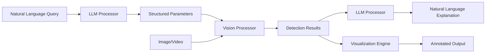

# Langvio Documentation

Welcome to **Langvio** - a powerful Python framework that connects large language models (LLMs) with computer vision models to enable natural language visual analysis.

**Version:** 0.0.1 | **Python:** 3.8+ | **License:** MIT

## What is Langvio?

Langvio bridges the gap between natural language understanding and computer vision by allowing you to analyze images and videos using simple, conversational queries. Instead of writing complex computer vision code, you can ask questions like:

- "Count how many people are in this image"
- "Find all red objects in this video" 
- "Are there any vehicles moving from left to right?"
- "Describe the spatial relationships between objects"

## Key Features

### 🔍 **Natural Language Interface**
Query visual content using everyday language - no computer vision expertise required.

### 🤖 **Multi-Modal Integration** 
Seamlessly connects leading LLMs (OpenAI GPT, Google Gemini) with state-of-the-art vision models (YOLO-World v2).

### 📊 **Rich Analysis Capabilities**
- Object detection and identification
- Object counting and tracking
- Attribute analysis (color, size, position)
- Spatial relationship detection
- Motion analysis and speed estimation
- Activity recognition

### 🎯 **YOLO-World v2 + ByteTracker Enhanced**
Advanced features powered by YOLO-World v2 detection and ByteTracker multi-object tracking:
- Precise object counting with boundary crossing detection
- Speed estimation and movement analysis based on tracked trajectories
- Robust multi-object tracking across video frames with persistent IDs
- Flexible object detection without predefined classes
- Kalman filter-based motion prediction for smooth tracking
- Track persistence through occlusions and complex scenes

### 🌐 **Flexible Deployment**
- Python API for integration
- Web interface for interactive use
- Command-line interface for automation
- Configurable pipeline architecture

### 🚀 **Production Ready**
- Memory-optimized processing
- Configurable confidence thresholds
- Comprehensive error handling and logging
- Extensible architecture for custom models
- Comprehensive test suite

## Quick Example

```python
import langvio

# Create a pipeline
pipeline = langvio.create_pipeline()

# Analyze an image with natural language
result = pipeline.process(
    query="Count how many people are wearing red clothing",
    media_path="street_scene.jpg"
)

print(f"Analysis: {result['explanation']}")
print(f"Visualization saved to: {result['output_path']}")
```

## Supported Use Cases

### 🏭 **Industrial & Manufacturing**
- Quality control and defect detection
- Assembly line monitoring
- Safety compliance verification
- Inventory management

### 🚗 **Transportation & Traffic**
- Vehicle counting and classification
- Traffic flow analysis
- Speed monitoring
- Parking space management

### 🏥 **Healthcare & Research**
- Medical image analysis
- Research data analysis
- Equipment monitoring
- Patient safety applications

### 🛒 **Retail & E-commerce**
- Product catalog analysis
- Customer behavior insights
- Inventory tracking
- Visual search applications

### 🏠 **Security & Surveillance**
- Perimeter monitoring
- Activity detection
- Crowd analysis
- Incident investigation

## Architecture Overview

Langvio uses a modular pipeline architecture:



### Core Components

- **LLM Processors**: Parse queries and generate explanations (OpenAI GPT, Google Gemini)
- **Vision Processors**: Perform object detection and analysis using YOLO-World v2
- **ByteTracker**: Multi-object tracking system for video analysis with boundary crossing detection
- **Media Processors**: Handle visualization and output generation with tracking trails
- **Configuration System**: Flexible model and parameter management

## Getting Started

### Installation

```bash
# Basic installation
pip install langvio

# With OpenAI support
pip install langvio[openai]

# With Google Gemini support  
pip install langvio[google]

# With all LLM providers
pip install langvio[all-llm]
```

### Environment Setup

Create a `.env` file in your project directory:

```bash
# Required: LLM API Keys (at least one)
OPENAI_API_KEY=your_openai_key
GOOGLE_API_KEY=your_google_key

# Optional: Default model selection
LANGVIO_DEFAULT_LLM=gemini
LANGVIO_DEFAULT_VISION=yolo_world_v2_m

# Optional: Performance settings
CUDA_VISIBLE_DEVICES=0
PYTORCH_CUDA_ALLOC_CONF=expandable_segments:True
```

Langvio automatically loads these environment variables using `python-dotenv`.

### First Analysis

```python
import langvio

# Create pipeline with best available models
pipeline = langvio.create_pipeline()

# Process an image
result = pipeline.process(
    query="What objects are in this image?",
    media_path="path/to/your/image.jpg"
)

print(result['explanation'])
```

# Langvio Documentation

## Quick Links
- [Getting Started](getting-started.md) - Installation and first analysis
- [Configuration](configuration.md) - Customize models and settings
- [Examples](examples.md) - Practical use cases and code samples
- [API Reference](api-reference.md) - Complete function documentation
- [Advanced Features](advanced-features.md) - Complex workflows and optimization

## Additional Resources
- [GitHub Repository](https://github.com/MugheesMehdi07/langvio)
- [PyPI Package](https://pypi.org/project/langvio/)
- [Issues & Support](https://github.com/MugheesMehdi07/langvio/issues)

## Community & Support

- **GitHub**: [github.com/MugheesMehdi07/langvio](https://github.com/MugheesMehdi07/langvio)
- **Issues**: Report bugs and request features on GitHub
- **Discussions**: Join the community discussions
- **Documentation**: Complete API reference and guides

## License

Langvio is released under the MIT License. See [License](license.md) for details.

---