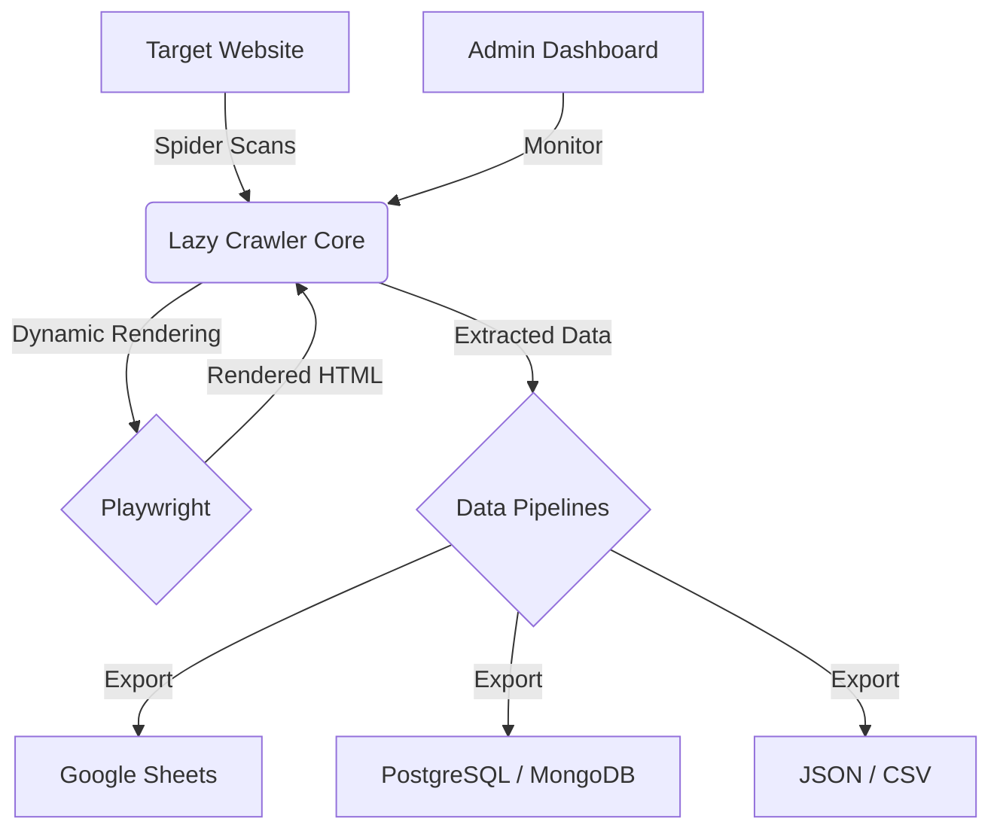

<div align="center">
    <h1>Lazy Crawler</h1>
    <p><strong>Extensible web crawling and data extraction framework.</strong></p>
    <p>A technical foundation for building scalable data pipelines using Scrapy and Playwright.</p>
    <a href="https://github.com/pradip-p/lazy-crawler/releases">
        
    </a>
</div>

## 🌐 Architecture Overview



<br/>

<div align="center">

| **Core Stack**    |    |
| :---------------- | :---------------------------------------------------------------------------------------------------------------------------------------------------------------------------------------------------------------------------------------------------------------------------------------------------------------------------- |
| **Code Quality**  | [](https://www.python.org/dev/peps/pep-0008/) [](https://pre-commit.com)                                                                         |
| **Documentation** | [](https://pradip-p.github.io/lazy-crawler/) [](https://github.com/pradip-p/lazy-crawler/blob/main/LICENSE.md)                                                                     |

</div>

---

**Lazy Crawler** is an extensible web crawling framework designed for both developers and organizations that need robust data extraction pipelines. It combines the speed of **Scrapy** with the dynamic rendering capabilities of **Playwright** to handle modern websites that use heavy JavaScript.

## What is Lazy Crawler?

If you need to collect data from websites—whether it's product prices, news articles, or social media updates—Lazy Crawler handles the hard parts for you:

- **Automatic Scrolling & Clicking**: It can "browse" like a human to see content that only appears when you scroll or click.
- **Multiple Save Locations**: Send your data directly to Excel (CSV), Google Sheets, or professional databases (PostgreSQL/MongoDB).
- **Security & Reliability**: Built-in protection against being blocked, including smart rate limiting and proxy support.
- **Easy Dashboard**: A simple web interface to see how your data collection is going in real-time.

## Features

- **Automated Workflows**: Fast setup for new data collection tasks ("spiders").
- **Modern Web Support**: Built-in Playwright integration for sites like Amazon, Twitter, or React apps.
- **Google Sheets Integration**: Push data directly to your spreadsheets for easy sharing.
- **Smart Rate Limiting (Enhanced)**: Protects the application and target websites from abuse by ensuring fair usage, now with advanced IP and user identification that cannot be easily bypassed.
- **Integrated Proxy Manager**: Built-in system for automatic proxy rotation and health checks, compatible with both Scrapy and Playwright.
- **Developer First**: Clean, modular code that is easy to extend.
- **Production Ready**: Full Docker support for stable, long-running deployments.

## Quick Start

### 1. Installation

This project uses **uv** for dependency management.

```bash
# Install from PyPI
pip install lazy-crawler

# OR install locally with uv
uv add lazy-crawler
```

For development:

```bash
# Initialize and sync dependencies
uv sync
```

> [!NOTE]
> Install Playwright browser binaries after the initial setup:
> `playwright install`

### 2. Static Site Crawler

Create `my_agent.py`:

```python
import scrapy
from lazy_crawler.crawler.spiders.base_crawler import LazyBaseCrawler
from scrapy.crawler import CrawlerProcess

class MyAgent(LazyBaseCrawler):
    name = "my_agent"

    def start_requests(self):
        yield scrapy.Request("https://example.com", self.parse)

    def parse(self, response):
        yield {
            "title": response.css("h1::text").get(),
            "url": response.url
        }

process = CrawlerProcess()
process.crawl(MyAgent)
process.start()
```

### 3. Dynamic Content (JavaScript)

Leverage Playwright for sites that require browser rendering:

```python
class DynamicAgent(LazyBaseCrawler):
    name = "dynamic"

    def start_requests(self):
        yield scrapy.Request(
            "https://dynamic-site.com",
            meta={"playwright": True},
            callback=self.parse
        )

    def parse(self, response):
        data = response.css(".rendered-content::text").get()
        yield {"content": data}
```

## Data Management

### 1. MongoDB Integration

**Configuration (.env)**:

```env
MONGO_URI=mongodb://localhost:27017
MONGO_DATABASE=lazy_crawler_db
```

**Settings**:

```python
ITEM_PIPELINES = {
    "lazy_crawler.crawler.pipelines.MongoPipeline": 400,
}
```

### 2. Google Sheets Export

**Configuration (.env)**:

```env
GOOGLE_SHEETS_CREDS_FILE=creds.json
GOOGLE_SHEETS_SPREADSHEET_NAME=CrawlData
GOOGLE_SHEETS_WORKSHEET_NAME=Results
```

### 3. JSON & CSV Export

Enable the built-in pipelines to save to local files:

```python
custom_settings = {
    "ITEM_PIPELINES": {
        # Export to scraped_data.json
        "lazy_crawler.crawler.pipelines.JsonWriterPipeline": 300,

        # Export to scraped_data_{timestamp}.csv
        "lazy_crawler.crawler.pipelines.CSVPipeline": 301,
    }
}
```

### 4. Excel Export

Enable the Excel pipeline to save data as `.xlsx`:

```python
custom_settings = {
    "ITEM_PIPELINES": {
        "lazy_crawler.crawler.pipelines.ExcelWriterPipeline": 302,
    }
}
```

## Dashboard & API

The project includes a dashboard for monitoring crawl progress and exploring extracted data.

**Start the service**:

```bash
uv run python -m lazy_crawler.app.main
```

- **Dashboard**: `http://localhost:8000/`
- **API Documentation**: `http://localhost:8000/docs`

## Docker Deployment (Production)

Deploy using the provided orchestration files:

```bash
# Manual startup
docker compose up --build -d
```

- **Dashboard**: `http://localhost/`
- **API Docs**: `http://localhost/docs`
- **Health**: `http://localhost/health`

## Customization

The framework is designed to be modified. You can extend `LazyBaseCrawler` or implement custom pipelines to handle specific data requirements.

## Contributing

Technical contributions and bug reports are welcome.

## License

Lazy Crawler is licensed under the [MIT License](LICENSE).

---

<div align="center">
    Created by <a href="https://github.com/pradip-p">Pradip P.</a>
</div>
