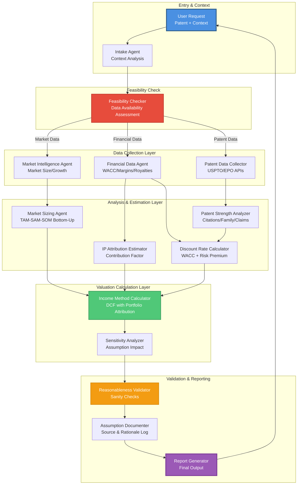
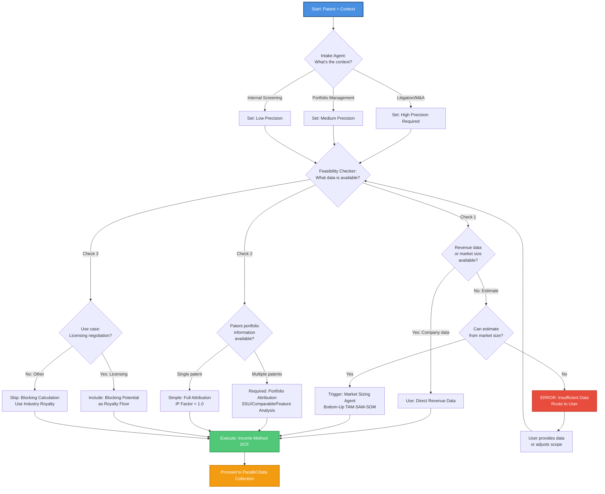
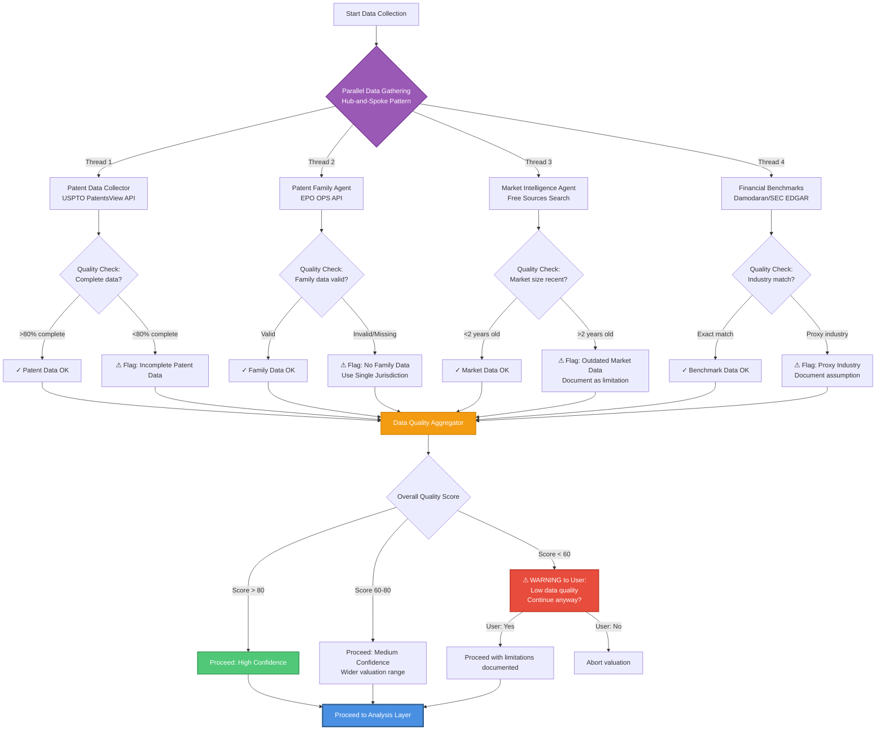

# Patent Valuation Agent Architecture - Decision Flow

**Purpose**: Interactive design document showing the decision process and agent architecture for automated patent valuation using the Marsys framework.

**Status**: 🚧 DRAFT - Under iterative design with stakeholder feedback

---

## 🎯 High-Level Architecture Overview

**Note**: Using Income Method ONLY with free data sources (no Market Method due to paid database requirements).



---

## 🔍 Detailed Decision Flow: Income Method Only

**Simplified**: No method selection needed - always use Income Method with free data sources.



---

## 📊 Data Collection & Quality Assessment Flow

**Note**: Only free data sources - no comparables search (requires paid databases).



---

## 🧮 Income Method Calculation Flow (with Three Complexities)

```mermaid
graph TD
    START_INCOME[Income Method Selected] --> COMPLEXITY_CHECK{Check Three Complexities}

    COMPLEXITY_CHECK -->|Complexity 1| PORTFOLIO_ATTR[Portfolio Attribution Required?]
    COMPLEXITY_CHECK -->|Complexity 2| COMMERCIALIZATION[Commercialization Probability?]
    COMPLEXITY_CHECK -->|Complexity 3| USE_CASE_CHECK[Use Case: Licensing Negotiation?]

    PORTFOLIO_ATTR -->|Multiple patents| ATTR_METHOD{Choose Attribution Method}
    PORTFOLIO_ATTR -->|Single patent| ATTR_100[IP Contribution Factor = 1.0]

    ATTR_METHOD -->|Method 1| SSU[Smallest Salable Unit<br/>Component value / Product value]
    ATTR_METHOD -->|Method 2| COMP_LICENSE[Comparable License Royalty<br/>If available]
    ATTR_METHOD -->|Method 3| FEATURE_ANALYSIS[Feature Value Analysis<br/>% contribution of features]

    SSU --> ATTR_FACTOR[Calculate: IP Contribution Factor]
    COMP_LICENSE --> ATTR_FACTOR
    FEATURE_ANALYSIS --> ATTR_FACTOR
    ATTR_100 --> ATTR_FACTOR

    COMMERCIALIZATION -->|Early stage| TRL_CRL[TRL/CRL Assessment<br/>Probability < 100%]
    COMMERCIALIZATION -->|Mature/Commercial| PROB_100[Commercialization Probability = 1.0]

    TRL_CRL --> PROB_FACTOR[Calculate: Commercialization Multiplier<br/>0.0 to 1.0]
    PROB_100 --> PROB_FACTOR

    USE_CASE_CHECK -->|Yes: Licensing context| BLOCKING_VALUE[Calculate Blocking Potential:<br/>Competitor design-around cost]
    USE_CASE_CHECK -->|No: Other context| SKIP_BLOCKING[Skip blocking valuation]

    BLOCKING_VALUE --> ROYALTY_FLOOR[Use as Royalty Rate Floor<br/>in DCF calculation]
    SKIP_BLOCKING --> STANDARD_ROYALTY[Use Industry Royalty Benchmark]

    ROYALTY_FLOOR --> DCF_COMPONENTS[Assemble DCF Components]
    STANDARD_ROYALTY --> DCF_COMPONENTS
    ATTR_FACTOR --> DCF_COMPONENTS
    PROB_FACTOR --> DCF_COMPONENTS

    DCF_COMPONENTS --> MARKET_SIZE_EST[Market Sizing Agent:<br/>Bottom-Up TAM-SAM-SOM]
    MARKET_SIZE_EST --> REVENUE_PROJ[Calculate Revenue Projection:<br/>Rev = Market × Share × Growth^t]

    REVENUE_PROJ --> PROFIT_CALC[Calculate Profit:<br/>Profit = Revenue × Margin]
    PROFIT_CALC --> IP_CASH_FLOW[Calculate IP Cash Flow:<br/>CF = Profit × Attribution × Commercialization]

    IP_CASH_FLOW --> DISCOUNT_RATE[Discount Rate Calculator:<br/>WACC + Patent Risk Premium]
    DISCOUNT_RATE --> STRENGTH_ANALYSIS[Patent Strength Analyzer:<br/>Citations/Family/Claims → Risk]

    STRENGTH_ANALYSIS --> RISK_PREMIUM[Calculate Risk Premium:<br/>Technology + Portfolio + Litigation]
    RISK_PREMIUM --> FINAL_DISCOUNT[Final Discount Rate =<br/>WACC + Risk Premium]

    FINAL_DISCOUNT --> DCF_FORMULA[Calculate NPV:<br/>Σ CF_t / (1 + r)^t]
    IP_CASH_FLOW --> DCF_FORMULA

    DCF_FORMULA --> INCOME_VALUE[Income Method Valuation]
    INCOME_VALUE --> SENSITIVITY_INCOME[Sensitivity Analysis:<br/>±20% on key assumptions]

    style START_INCOME fill:#4A90E2,stroke:#2E5C8A,stroke-width:3px,color:#fff
    style COMPLEXITY_CHECK fill:#E74C3C,stroke:#C0392B,stroke-width:2px,color:#fff
    style DCF_FORMULA fill:#50C878,stroke:#3A9B5C,stroke-width:2px,color:#fff
    style INCOME_VALUE fill:#F39C12,stroke:#D68910,stroke-width:3px,color:#fff
```

---

## 📋 Assumption Tracking & Report Generation Flow

```mermaid
graph TD
    START_REPORT[Valuation Complete] --> GATHER_ASSUMPTIONS[Assumption Documenter:<br/>Gather all logged assumptions]

    GATHER_ASSUMPTIONS --> CATEGORIZE{Categorize Assumptions}

    CATEGORIZE -->|Category 1| HIGH_IMPACT[High Impact Assumptions:<br/>Discount Rate, IP Contribution]
    CATEGORIZE -->|Category 2| MEDIUM_IMPACT[Medium Impact Assumptions:<br/>Growth Rate, Margin]
    CATEGORIZE -->|Category 3| LOW_IMPACT[Low Impact Assumptions:<br/>Time horizon, minor adjustments]

    HIGH_IMPACT --> DOCUMENT_SOURCE[For Each Assumption:<br/>Document Source + Rationale]
    MEDIUM_IMPACT --> DOCUMENT_SOURCE
    LOW_IMPACT --> DOCUMENT_SOURCE

    DOCUMENT_SOURCE --> SOURCE_TYPES{Source Type}

    SOURCE_TYPES -->|Free API| LOG_FREE[Log: USPTO/EPO/Damodaran<br/>Data quality: High]
    SOURCE_TYPES -->|Web Research| LOG_WEB[Log: Market research source<br/>Data quality: Medium<br/>Age: X years]
    SOURCE_TYPES -->|Estimation| LOG_EST[Log: Estimated value<br/>Method: [SSU/Feature/etc]<br/>Rationale: [why]]
    SOURCE_TYPES -->|User Provided| LOG_USER[Log: User-provided data<br/>Not independently verified]

    LOG_FREE --> ASSUMPTION_TABLE[Build Assumption Table]
    LOG_WEB --> ASSUMPTION_TABLE
    LOG_EST --> ASSUMPTION_TABLE
    LOG_USER --> ASSUMPTION_TABLE

    ASSUMPTION_TABLE --> SENSITIVITY_REPORT[Sensitivity Analysis Results:<br/>Impact of ±20% changes]
    SENSITIVITY_REPORT --> DATA_QUALITY[Data Quality Assessment:<br/>Completeness + Reliability scores]

    DATA_QUALITY --> LIMITATIONS[Document Limitations:<br/>Missing data, weak comparables, etc]
    LIMITATIONS --> CONFIDENCE_LEVEL[Overall Confidence Level:<br/>High/Medium/Low]

    CONFIDENCE_LEVEL --> REPORT_STRUCTURE{Report Generator:<br/>Structure Output}

    REPORT_STRUCTURE --> EXEC_SUMMARY[1. Executive Summary:<br/>Valuation range + confidence]
    REPORT_STRUCTURE --> METHODOLOGY[2. Methodology:<br/>Which methods used + why]
    REPORT_STRUCTURE --> DATA_SOURCES[3. Data Sources:<br/>Complete source list + access info]
    REPORT_STRUCTURE --> CALCULATIONS[4. Detailed Calculations:<br/>Step-by-step walkthrough]
    REPORT_STRUCTURE --> ASSUMPTIONS_DOC[5. Assumptions Log:<br/>Full table with sources]
    REPORT_STRUCTURE --> SENSITIVITY_DOC[6. Sensitivity Analysis:<br/>Charts + impact tables]
    REPORT_STRUCTURE --> LIMITATIONS_DOC[7. Limitations:<br/>What we couldn't do + why]
    REPORT_STRUCTURE --> APPENDIX[8. Appendix:<br/>Raw data, API responses, etc]

    EXEC_SUMMARY --> FINAL_REPORT[Assemble Final Report]
    METHODOLOGY --> FINAL_REPORT
    DATA_SOURCES --> FINAL_REPORT
    CALCULATIONS --> FINAL_REPORT
    ASSUMPTIONS_DOC --> FINAL_REPORT
    SENSITIVITY_DOC --> FINAL_REPORT
    LIMITATIONS_DOC --> FINAL_REPORT
    APPENDIX --> FINAL_REPORT

    FINAL_REPORT --> OUTPUT_FORMAT{Output Format}
    OUTPUT_FORMAT -->|PDF| GENERATE_PDF[Generate PDF Report]
    OUTPUT_FORMAT -->|JSON| GENERATE_JSON[Generate JSON Output]
    OUTPUT_FORMAT -->|Markdown| GENERATE_MD[Generate Markdown Report]

    GENERATE_PDF --> DELIVER[Deliver to User]
    GENERATE_JSON --> DELIVER
    GENERATE_MD --> DELIVER

    style START_REPORT fill:#4A90E2,stroke:#2E5C8A,stroke-width:3px,color:#fff
    style ASSUMPTION_TABLE fill:#9B59B6,stroke:#7D3C98,stroke-width:2px,color:#fff
    style FINAL_REPORT fill:#50C878,stroke:#3A9B5C,stroke-width:3px,color:#fff
    style DELIVER fill:#F39C12,stroke:#D68910,stroke-width:3px,color:#fff
```

---

## ❓ Key Decision Points for Discussion

Before we proceed to designing the actual agent structure and topology, I need your feedback on these critical decision points:

### 1. **Parallel vs Sequential Data Collection**
**Question**: Should we collect patent data, market data, and financial data in **parallel** (faster but more complex) or **sequentially** (simpler but slower)?

**Option A - Parallel**: Use hub-and-spoke with `parallel_invoke` for 4 data collectors simultaneously
- ✅ Faster (saves 60-70% time if APIs are slow)
- ❌ More complex orchestration
- ❌ Harder to debug

**Option B - Sequential**: Pipeline pattern where each data collector runs after the previous
- ✅ Simpler logic
- ✅ Easier to debug and understand
- ❌ Slower total execution time

**My recommendation**: Start with **Parallel** (Option A) since API calls are I/O-bound and Marsys handles parallel execution well.

**Your preference?** 🤔

---

### 2. **User-in-the-Loop for Critical Decisions**
**Question**: Should the system ask the user for confirmation at critical decision points, or run fully automated?

**Critical decision points**:
- When data quality score < 60 (proceed anyway?)
- When IP contribution factor is estimated (accept estimate or provide better data?)
- When revenue data is missing (use market estimate or abort?)

**Option A - Interactive**: Include User node at decision points, use `ExecutionConfig(user_interaction="terminal")`
- ✅ User can correct mistakes early
- ✅ More defensible (user approved assumptions)
- ❌ Slower (waits for user input)
- ❌ Can't run unattended

**Option B - Fully Automated**: Make all decisions programmatically, document them, ask for review only at the end
- ✅ Fast, can run unattended
- ✅ Good for batch processing
- ❌ Might make wrong assumptions without user knowing
- ❌ User finds issues only after completion

**Option C - Hybrid**: Run automated, but pause and ask user if any quality flags are raised
- ✅ Best of both worlds
- ❌ More complex logic (conditional user interaction)

**My recommendation**: Start with **Option C (Hybrid)** - automated by default, ask user only when quality flags appear.

**Your preference?** 🤔

---

### 3. **Attribution Method Selection**
**Question**: When multiple patents are in a bundle, how should we choose between SSU/Comparable License/Feature Analysis?

**Option A - User Specifies**: User tells us which method to use
- ✅ User has domain knowledge
- ❌ User might not know which is best

**Option B - Automatic Heuristic**:
- If comparable licenses found (free sources like SEC EDGAR) → Use Comparable License method
- Else if product has identifiable components → Use SSU
- Else → Use Feature Analysis
- ✅ Automated
- ❌ Might choose suboptimal method

**Option C - Try All, Report All**: Calculate using all three methods, show range
- ✅ Most comprehensive
- ✅ Shows uncertainty
- ❌ More computation
- ❌ Might confuse user with too many numbers

**My recommendation**: **Option B (Automatic Heuristic)** with fallback to Option C if results diverge significantly.

**Your preference?** 🤔

---

### 4. **Market Sizing: Bottom-Up Detail Level**
**Question**: How detailed should the bottom-up market sizing be?

**Option A - Simple**: TAM only (total addressable market), skip SAM/SOM refinement
- ✅ Faster
- ❌ Less accurate (overestimates)

**Option B - Full TAM-SAM-SOM**: Apply all filters (geographic, distribution, product fit, market share, adoption)
- ✅ More accurate
- ❌ Requires more data and assumptions
- ❌ More opportunities for error

**Option C - Adaptive**: Start with TAM, refine to SAM/SOM only if user provides additional context (geography, target segment, etc.)
- ✅ Flexible
- ❌ More complex logic

**My recommendation**: **Option B (Full TAM-SAM-SOM)** since we want defensible valuations, and we should document conservative assumptions.

**Your preference?** 🤔

---

## 🚀 Next Steps After Your Feedback

Once you provide feedback on the 5 decision points above, I will:

1. **Design the agent definitions** (names, responsibilities, tools, allowed_peers)
2. **Define the topology** (nodes, edges, convergence points)
3. **Create the orchestration code** (Orchestra.run() with proper config)
4. **Define agent prompts** (system prompts for each agent role)
5. **Specify tool functions** (Python functions for APIs, calculations, etc.)
6. **Create the example runner** (complete working example)

**Please review the flowcharts and provide your answers to the 5 questions above.** 🙏

I'm ready to iterate on any part of the flowcharts or decision logic before we proceed to implementation!

---

**Document Status**: ✅ Ready for Review
**Next Action**: Awaiting stakeholder feedback on 5 decision points
