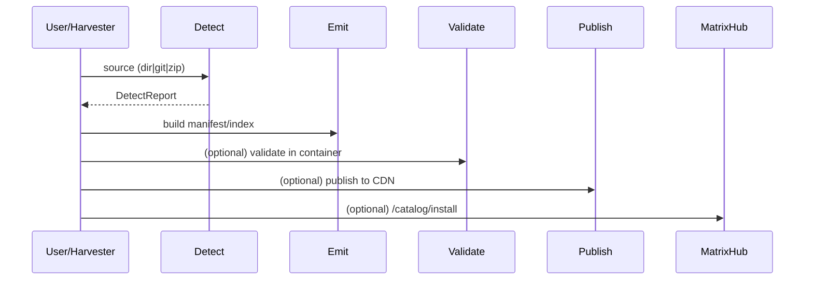

# Architecture

Core modules:

- **detect/** — AST/regex detectors for FastMCP, LangChain, LlamaIndex, AutoGen, CrewAI, Semantic Kernel.
- **emit/** — manifest & index emitters; MatrixHub adapters (optional).
- **register/** — MatrixHub `/catalog/install` (preferred) and gateway fallback.
- **validate/** — local & container sandboxes; MCP probe.
- **publishers/** — S3/GH Pages static publishing + global index shards.
- **services/harvester/** — internet‑scale discovery, workers, and persistence.

## Dataflow

