# Catalog Automation Guide

Complete guide to automating MCP server catalog maintenance using `mcp-ingest`.

---

## Overview

The catalog automation system provides:

- **Daily automated syncs** from upstream sources
- **Pull request-based workflow** for safe updates
- **Comprehensive validation** (structure, schema, duplicates)
- **Simple Makefile interface** for manual operations
- **GitHub Actions workflows** for full automation

---

## Quick Start

### 1. Copy Automation Files

From the `mcp_ingest` repository:

```bash
# Option A: Using the Makefile
cd /path/to/mcp_ingest
make catalog-example

# Option B: Manual copy
cp -r examples/catalog-automation/.github/workflows/ /path/to/catalog/.github/
cp -r examples/catalog-automation/scripts/ /path/to/catalog/scripts/
cp -r examples/catalog-automation/schema/ /path/to/catalog/schema/
cp examples/catalog-automation/Makefile /path/to/catalog/
```

### 2. Run Your First Sync

```bash
cd /path/to/catalog

# Install dependencies
make install

# Run full sync
make sync
```

---

## Architecture

### Components

| Component | Purpose | Location |
|-----------|---------|----------|
| **mcp-ingest** | Harvesting engine | Python package |
| **Makefile** | Automation interface | `Makefile` |
| **GitHub Actions** | Daily automation | `.github/workflows/` |
| **Python Scripts** | Validation & sync | `scripts/` |
| **JSON Schema** | Manifest validation | `schema/` |

### Workflow Diagram

```mermaid
graph TD
    A[Upstream Source] -->|harvest| B[mcp-ingest]
    B -->|manifests| C[Dedupe & Sync]
    C -->|normalized| D[Catalog Directory]
    D -->|scan| E[Rebuild Index]
    E -->|index.json| F[Validation]
    F -->|✓| G[Git Commit]
    G -->|push| H[Pull Request]
    H -->|merge| I[Matrix Hub]
```



---

## Makefile Commands

### Setup Commands

```bash
make install        # Install all dependencies
make install-mcp    # Install only mcp-ingest
make install-tools  # Install only validation tools
```

### Sync Commands

```bash
make sync           # 🚀 Full sync (harvest → dedupe → rebuild → validate)
make harvest        # Step 1: Harvest from upstream
make dedupe         # Step 2: Dedupe and sync
make rebuild-index  # Step 3: Rebuild index.json
make validate       # Step 4: Validate everything
```

### Validation Commands

```bash
make validate              # Run all validations
make validate-structure    # Validate catalog structure
make validate-schema       # Validate manifest schemas
make check-duplicates      # Check for duplicate IDs
make check-index           # Check index consistency
```

### Testing Commands

```bash
make test-sync      # Test in isolated directory (safe)
make dry-run        # Preview what would be synced
```

### Commit Commands

```bash
make commit-sync    # Commit with proper message
make pr             # Show PR creation instructions
```

---

## Configuration

### Environment Variables

```bash
# Source repository to harvest from
SOURCE_REPO=https://github.com/modelcontextprotocol/servers

# Number of parallel workers (default: 8)
MAX_WORKERS=16

# HTTP cache location (for ETag caching)
MCP_INGEST_HTTP_CACHE=.cache
```

### Customization Examples

```bash
# Sync from different source
make sync SOURCE_REPO=https://github.com/your-org/servers

# Use more workers for faster harvesting
make sync MAX_WORKERS=16

# Combine options
make sync SOURCE_REPO=https://... MAX_WORKERS=16
```

---

## GitHub Actions

### Daily Sync Workflow

**File**: `.github/workflows/sync-mcp-servers.yml`

**Schedule**: Daily at 02:15 UTC (customizable)

**What it does**:

1. Harvests MCP servers from upstream
2. Deduplicates and normalizes manifests
3. Rebuilds `index.json` with absolute GitHub URLs
4. Validates everything (structure + schema + duplicates)
5. Creates a pull request with detailed summary

**Manual trigger**:

```bash
# Via GitHub UI
Actions → "Sync MCP Servers (Daily)" → Run workflow

# Via GitHub CLI
gh workflow run sync-mcp-servers.yml \
  -f source_repo=https://github.com/modelcontextprotocol/servers \
  -f max_workers=16
```

### PR Validation Workflow

**File**: `.github/workflows/validate-pr.yml`

**Triggers**: On PRs modifying `servers/`, `index.json`, `schema/`, or `scripts/`

**Checks**:

- ✅ Catalog structure validation
- ✅ Manifest schema validation
- ✅ Duplicate ID detection
- ✅ Index consistency verification
- ✅ Python script linting

---

## Validation Details

### Structure Validation

**Script**: `scripts/validate_catalog.py`

**Checks**:
- `index.json` exists and is valid JSON
- All manifests are valid JSON
- Required fields present (id, name, type)
- Reasonable values (non-empty names, valid IDs)

**Example**:
```bash
python scripts/validate_catalog.py --catalog servers --index index.json
```

### Schema Validation

**Script**: `scripts/validate_schemas.py`

**Schema**: `schema/manifest.schema.json`

**Validates**:
- Field types and formats
- Required vs optional fields
- Enum values (transport types, categories)
- Provenance metadata structure

**Example**:
```bash
python scripts/validate_schemas.py \
  --catalog servers \
  --schema schema/manifest.schema.json
```

### Duplicate Detection

**Script**: `scripts/check_duplicates.py`

**Checks**: No two manifests have the same ID

**Example**:
```bash
python scripts/check_duplicates.py --catalog servers
```

### Index Consistency

**Script**: `scripts/check_index_consistency.py`

**Checks**:
- All manifests in catalog are listed in index
- All entries in index point to existing manifests

**Example**:
```bash
python scripts/check_index_consistency.py \
  --catalog servers \
  --index index.json
```

---

## Sync Process Details

### Phase 1: Harvest

**Duration**: 2-5 minutes
**Tool**: `mcp-ingest harvest-source`

```bash
mcp-ingest harvest-source https://github.com/modelcontextprotocol/servers \
  --out .harvest \
  --max-parallel 8 \
  -y
```

**Output**: `.harvest/` directory with raw manifests

**Features**:
- Relative link resolution (critical for `modelcontextprotocol/servers`)
- Provenance metadata (timestamp, source, detector, confidence)
- HTTP caching (ETag-based, 90% bandwidth reduction)
- Rate limiting (exponential backoff for GitHub API)

### Phase 2: Dedupe & Sync

**Duration**: 1-2 minutes
**Tool**: `scripts/sync_from_harvest.py`

```bash
python scripts/sync_from_harvest.py \
  --harvest .harvest \
  --catalog servers \
  --verbose
```

**Process**:
1. Reads all `manifest.json` files from harvest
2. Generates fingerprint (source_repo + source_path + name)
3. Removes duplicates (keeps first seen)
4. Generates stable slugs for folder names
5. Writes to `servers/<slug>/manifest.json`

**Deduplication**:
```python
# Fingerprint generation
key = f"{source_repo}|{source_path}|{name}"
fingerprint = hashlib.sha1(key.encode()).hexdigest()
```

**Slug generation**:
```python
# Stable, deterministic slugs
slug = stable_slug(name)  # "My Server!" → "my-server"
```

### Phase 3: Rebuild Index

**Duration**: <1 minute
**Tool**: `scripts/rebuild_index.py`

```bash
python scripts/rebuild_index.py \
  --catalog servers \
  --out index.json \
  --base-url https://raw.githubusercontent.com/agent-matrix/catalog/refs/heads/main
```

**Output**: `index.json` with:
```json
{
  "version": "1.0.0",
  "generated_at": "2025-12-28T10:00:00Z",
  "manifest_count": 1320,
  "manifests": [
    {
      "path": "servers/server-name/manifest.json",
      "url": "https://raw.githubusercontent.com/.../manifest.json",
      "id": "server-id",
      "name": "Server Name",
      "type": "mcp_server"
    }
  ]
}
```

### Phase 4: Validation

**Duration**: 1-2 minutes
**Tools**: All validation scripts

Runs all validation checks in sequence:
1. Structure validation
2. Schema validation
3. Duplicate detection
4. Index consistency

---

## Provenance Metadata

All harvested manifests include rich provenance metadata:

```json
{
  "provenance": {
    "harvested_at": "2025-12-28T10:00:00Z",
    "source_repo": "https://github.com/owner/repo",
    "source_ref": "main",
    "source_path": "src/server",
    "detector": "fastmcp",
    "confidence": 0.95,
    "stars": 1234,
    "forks": 56,
    "harvester": "mcp-ingest",
    "harvester_version": "0.1.0"
  }
}
```

**Uses**:
- **Deduplication**: Fingerprint by source_repo + source_path
- **Ranking**: Sort by stars, filter by confidence
- **Trust Scoring**: Combine detector + confidence + stars
- **Debugging**: Track when/how/why harvested

---

## Troubleshooting

### Common Issues

#### "mcp-ingest: command not found"

```bash
make install-mcp
```

#### "Validation failed with X errors"

```bash
# See detailed errors
make validate

# Or run specific checks
make validate-structure
make validate-schema
make check-duplicates
```

#### "Duplicate IDs found"

```bash
# Find duplicates
make check-duplicates

# Manually resolve duplicates in servers/ directory
# Then rebuild index
make rebuild-index
```

#### "Index inconsistency detected"

```bash
# Rebuild index to fix
make rebuild-index

# Verify
make check-index
```

#### Sync is too slow

```bash
# Use more workers
make sync MAX_WORKERS=16
```

#### GitHub Actions rate limiting

The HTTP cache helps prevent rate limits. If you still hit limits:

1. Check cache is enabled: `MCP_INGEST_HTTP_CACHE=.cache`
2. Use GitHub token: `GITHUB_TOKEN` env var
3. Reduce frequency: Change cron schedule
4. Reduce workers: Lower `max_workers` in workflow

---

## Production Best Practices

### Performance

- Use 8-16 workers for optimal speed
- Run sync during off-peak hours (2-4 AM UTC)
- HTTP caching is automatic (90%+ reduction in API calls)
- ETag cache persists between runs

### Quality

- Always review PRs before merging
- Check for unexpected additions/removals
- Run `make validate` before committing
- Monitor duplicate detection results

### Workflow

1. Let GitHub Actions handle daily syncs
2. Use `make sync` for manual/testing
3. Use `make test-sync` before major changes
4. Always validate before pushing

### Security

- GitHub token used automatically in Actions
- HTTP cache stored locally (`.cache/`)
- All validation runs before catalog updates
- Git history provides complete audit trail

---

## Advanced Usage

### Custom Source Repository

```bash
# Harvest from your own MCP server collection
make sync SOURCE_REPO=https://github.com/your-org/mcp-servers
```

### Harvest Only (No Sync)

```bash
# Just harvest, inspect results
make harvest

# Review .harvest/ directory
ls -la .harvest/

# Then sync if it looks good
make dedupe
make rebuild-index
```

### Validate Existing Catalog

```bash
# Just validate, don't sync
make validate
```

### Custom Validation Rules

Edit `schema/manifest.schema.json` to add custom validation rules:

```json
{
  "properties": {
    "custom_field": {
      "type": "string",
      "pattern": "^custom-.*"
    }
  }
}
```

---

## Integration with Matrix Hub

The catalog is designed for direct consumption by Matrix Hub:

### Index Format

Matrix Hub can ingest from `index.json`:

```json
{
  "manifests": [
    {
      "url": "https://raw.githubusercontent.com/.../manifest.json"
    }
  ]
}
```

### Ingestion Workflow

1. Daily sync updates catalog
2. PR created and merged
3. Matrix Hub polls `index.json`
4. Downloads changed manifests
5. Updates database and search index

### Provenance Integration

Matrix Hub uses provenance for:
- **Deduplication**: Identify duplicate servers
- **Ranking**: Sort by quality metrics
- **Trust Scoring**: Confidence + stars + detector
- **UI Display**: Show source, quality, freshness

---

## Reference

### File Structure

```
catalog/
├── .github/workflows/
│   ├── sync-mcp-servers.yml      # Daily automation
│   └── validate-pr.yml            # PR validation
├── scripts/
│   ├── sync_from_harvest.py      # Dedupe & sync
│   ├── rebuild_index.py          # Index generation
│   ├── validate_catalog.py       # Structure validation
│   ├── validate_schemas.py       # Schema validation
│   ├── check_duplicates.py       # Duplicate detection
│   └── check_index_consistency.py # Index verification
├── schema/
│   └── manifest.schema.json      # JSON schema
├── servers/
│   └── <server-slug>/
│       ├── manifest.json
│       └── index.json
├── index.json                     # Root catalog index
├── Makefile                       # Automation interface
└── AUTOMATION.md                  # Usage guide
```

### Links

- [MCP Ingest Repository](https://github.com/agent-matrix/mcp_ingest)
- [Catalog Repository](https://github.com/agent-matrix/catalog)
- [Matrix Hub](https://github.com/agent-matrix/matrix-hub)
- [Example Implementation](../examples/catalog-automation/)

---

## Next Steps

1. **Setup**: Run `make catalog-example` to copy files
2. **Test**: Run `make test-sync` for safe testing
3. **Deploy**: Push to catalog repo and enable GitHub Actions
4. **Monitor**: Review daily PRs and merge

For more details, see:
- [Getting Started](quickstart.md)
- [Harvesting Guide](harvest-source.md)
- [API Reference](api.md)
