# Production Deployment Guide for MCP KQL Server

This directory contains all necessary artifacts to deploy the MCP KQL Server to Microsoft Azure in a production-ready, secure, and scalable configuration.

## 🏗️ Architecture Overview

The solution uses **Azure Container Apps** for serverless compute, **Managed Identity** for passwordless security, and **Azure Log Analytics** for monitoring.

```mermaid
%%{init: {'theme':'dark', 'themeVariables': {
  'primaryColor':'#1a1a2e',
  'primaryTextColor':'#00d9ff',
  'primaryBorderColor':'#00d9ff',
  'secondaryColor':'#16213e',
  'secondaryTextColor':'#c77dff',
  'secondaryBorderColor':'#c77dff',
  'tertiaryColor':'#0f3460',
  'tertiaryTextColor':'#ffaa00',
  'tertiaryBorderColor':'#ffaa00',
  'lineColor':'#00d9ff',
  'textColor':'#ffffff',
  'mainBkg':'#0a0e27',
  'nodeBorder':'#00d9ff',
  'clusterBkg':'#16213e',
  'clusterBorder':'#9d4edd',
  'titleColor':'#00ffff',
  'edgeLabelBackground':'#1a1a2e',
  'fontFamily':'Inter, Segoe UI, sans-serif',
  'fontSize':'16px',
  'flowchart':{'nodeSpacing':60, 'rankSpacing':80, 'curve':'basis', 'padding':20}
}}}%%
graph TB
    User["👤 User / MCP Client"]
    
    subgraph Azure["☁️ Azure Cloud"]
        direction TB
        
        subgraph Security["🔒 Security Layer"]
            direction LR
            MI["🆔 Managed Identity<br/>(System-Assigned)"]
            NSG["🛡️ Network Security<br/>Group"]
        end
        
        subgraph Compute["⚙️ Compute & Container Services"]
            direction TB
            ACA["🐳 Azure Container App<br/><b>MCP KQL Server</b><br/>─────────<br/>Python FastMCP Runtime"]
            ACR["📦 Azure Container<br/>Registry<br/>─────────<br/>Private Image Storage"]
        end
        
        subgraph Data["💾 Data & Analytics"]
            direction TB
            Kusto["📊 Azure Data Explorer<br/><b>Kusto Cluster</b><br/>─────────<br/>KQL Query Engine"]
            Storage["🗄️ Azure Blob Storage<br/>─────────<br/>Schema Memory Cache"]
        end
        
        subgraph Monitor["📈 Observability"]
            Logs["📋 Log Analytics<br/>Workspace<br/>─────────<br/>Metrics & Diagnostics"]
        end
    end
    
    %% User Interactions
    User ==>|"🌐 HTTPS/SSE<br/>MCP Protocol"| ACA
    
    %% Container Operations
    ACA -.->|"📥 Pull Image<br/>(Startup)"| ACR
    
    %% Security Flow
    ACA -->|"🔐 Authenticate<br/>via OIDC"| MI
    MI ==>|"✅ RBAC Authorization<br/>Database User Role"| Kusto
    NSG -.->|"🚦 Network Rules"| ACA
    
    %% Data Operations
    ACA ==>|"📤 Execute KQL<br/>Query & Analyze"| Kusto
    ACA <-->|"💾 Read/Write<br/>Schema Metadata"| Storage
    
    %% Monitoring
    ACA -->|"📊 Telemetry<br/>Logs & Metrics"| Logs
    Kusto -.->|"📉 Query Metrics"| Logs
    
    %% Styling - Using cyberpunk palette
    style User fill:#1a1a2e,stroke:#00d9ff,stroke-width:4px,color:#00ffff
    style ACA fill:#16213e,stroke:#c77dff,stroke-width:3px,color:#c77dff
    style ACR fill:#1a1a40,stroke:#ffaa00,stroke-width:3px,color:#ffaa00
    style MI fill:#0f3460,stroke:#9d4edd,stroke-width:3px,color:#9d4edd
    style NSG fill:#16213e,stroke:#00d9ff,stroke-width:3px,color:#00d9ff
    style Kusto fill:#1a1a2e,stroke:#ff6600,stroke-width:4px,color:#ff6600
    style Storage fill:#16213e,stroke:#00ffff,stroke-width:2px,color:#00ffff
    style Logs fill:#0f3460,stroke:#c77dff,stroke-width:3px,color:#c77dff
    
    style Azure fill:#0a0e27,stroke:#9d4edd,stroke-width:3px,stroke-dasharray: 5 5,color:#00ffff
    style Security fill:#0a0e27,stroke:#9d4edd,stroke-width:2px,color:#c77dff
    style Compute fill:#0a0e27,stroke:#ff6600,stroke-width:2px,color:#ffaa00
    style Data fill:#0a0e27,stroke:#00d9ff,stroke-width:2px,color:#00d9ff
    style Monitor fill:#0a0e27,stroke:#c77dff,stroke-width:2px,color:#c77dff
    
    %% Vibrant Connection Colors
    linkStyle 0 stroke:#ff6600,stroke-width:3px
    linkStyle 1 stroke:#00d9ff,stroke-width:2px
    linkStyle 2 stroke:#c77dff,stroke-width:2px
    linkStyle 3 stroke:#ffaa00,stroke-width:3px
    linkStyle 4 stroke:#00d9ff,stroke-width:2px
    linkStyle 5 stroke:#ffaa00,stroke-width:3px
    linkStyle 6 stroke:#c77dff,stroke-width:2px
    linkStyle 7 stroke:#00ffff,stroke-width:2px
    linkStyle 8 stroke:#ff6600,stroke-width:2px
```



## ✅ Requirements

Before deploying, ensure you have:

1.  **Azure CLI** installed (`az login`).
2.  **Docker Desktop** (or Docker CLI) installed and running.
3.  **Owner** or **Contributor** access to an Azure Subscription.
4.  **User Access Administrator** permission (to assign roles to Managed Identity).
5.  An existing **Azure Data Explorer (Kusto) Cluster**.

## 🚀 Deployment Steps

We provide automated scripts for both PowerShell and Bash users.

### Option 1: PowerShell (Windows)

1.  Open PowerShell as Administrator (optional, but recommended for module installation).
2.  Navigate to this directory:
    ```powershell
    cd deployment
    ```
3.  Run the deployment script:
    ```powershell
    .\deploy.ps1 -SubscriptionId "YOUR_SUB_ID" -ResourceGroupName "mcp-kql-prod-rg" -ClusterUrl "https://yourcluster.region.kusto.windows.net" -Location "eastus"
    ```

### Option 2: Bash (Linux/Mac/WSL)

1.  Navigate to this directory:
    ```bash
    cd deployment
    ```
2.  Make the script executable:
    ```bash
    chmod +x deploy.sh
    ```
3.  Run the deployment script:
    ```bash
    ./deploy.sh --subscription "YOUR_SUB_ID" --resource-group "mcp-kql-prod-rg" --cluster-url "https://yourcluster.region.kusto.windows.net" --location "eastus"
    ```

## ⚙️ Configuration Details

The deployment script performs the following actions:

1.  **Resource Group**: Creates a new RG if it doesn't exist.
2.  **Container Registry**: Deploys an Azure Container Registry (ACR) to store your Docker images.
3.  **Build & Push**: Builds the Docker image from the root of this repo and pushes it to ACR.
4.  **Infrastructure**: Deploys `main.bicep` which creates:
    *   **Log Analytics Workspace**: For centralized logging.
    *   **Container Apps Environment**: The secure environment for your app.
    *   **User Assigned Identity**: The identity the app uses to talk to Kusto.
    *   **Container App**: The running instance of MCP KQL Server.
5.  **Role Assignment**: Automatically assigns the `Database User` role to the Managed Identity on your Kusto database (if you have permissions).

## 🔒 Security Features

*   **No Hardcoded Secrets**: The application uses `DefaultAzureCredential` which automatically picks up the Managed Identity in Azure.
*   **Least Privilege**: The Managed Identity is only granted `Database User` access.
*   **Network Isolation**: (Optional) The Bicep file can be extended to inject into a VNET.

## 🔍 Troubleshooting

*   **"Principal ... does not have authorization to perform action .../join/action"**:
    *   Ensure you are an **Owner** or **User Access Administrator** on the subscription/resource group to assign roles.
*   **"Container failed to start"**:
    *   Check the "Log Stream" in the Azure Portal for the Container App.
    *   Verify the Kusto Cluster URL is correct.

## 📦 Artifacts

*   `Dockerfile`: Multi-stage build definition.
*   `main.bicep`: Infrastructure as Code definition.
*   `deploy.ps1` / `deploy.sh`: Automation scripts.
