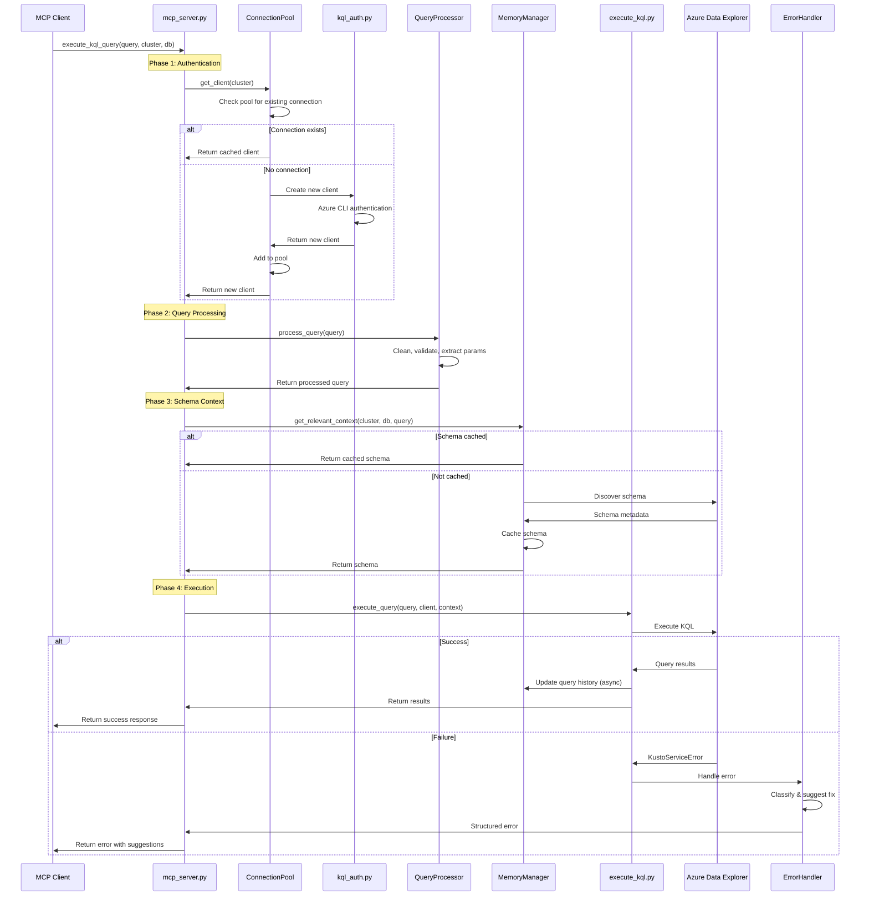
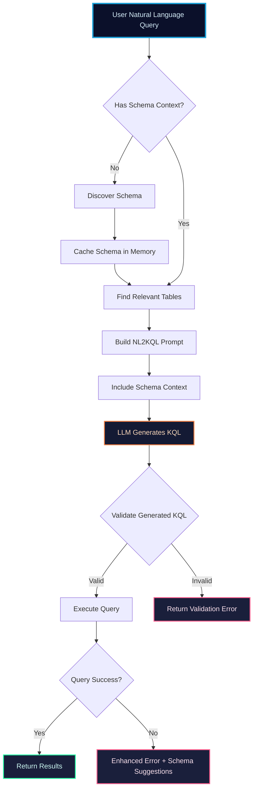
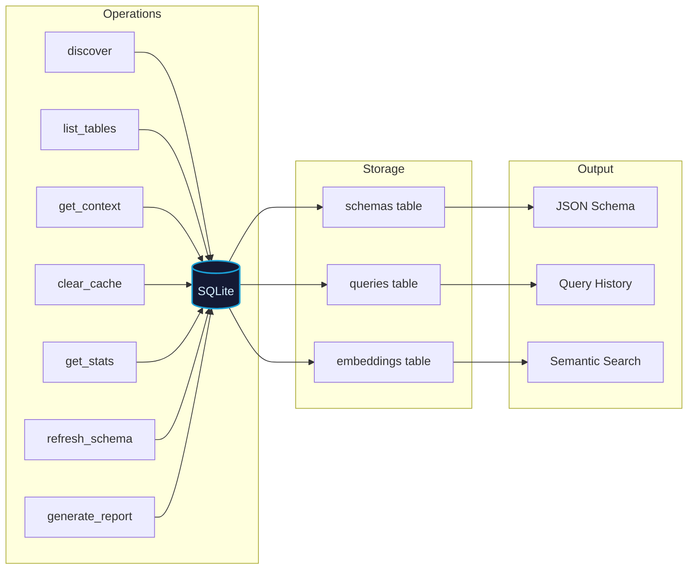
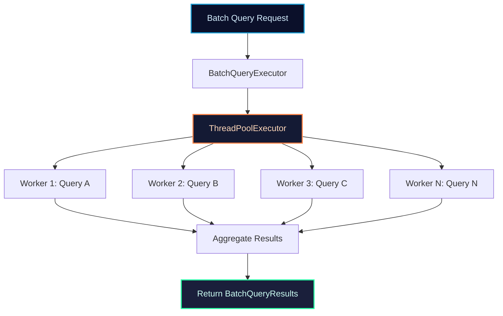
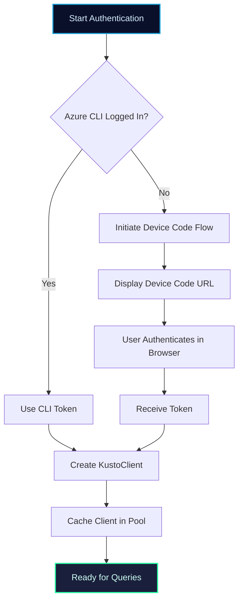

# MCP KQL Server Architecture

**Version**: 2.2.0
**Author**: Arjun Trivedi
**Email**: arjuntrivedi42@yahoo.com
**Last Updated**: December 2025

---

## Table of Contents

1. [System Overview](#1-system-overview)
2. [High-Level Architecture](#2-high-level-architecture)
3. [Core Components](#3-core-components)
4. [Data Flow Diagrams](#4-data-flow-diagrams)
5. [Performance Architecture](#5-performance-architecture)
6. [Memory & Caching Strategy](#6-memory--caching-strategy)
7. [Security Model](#7-security-model)
8. [Module Reference](#8-module-reference)

---

## 1. System Overview

The MCP KQL Server is an AI-augmented service for executing Kusto Query Language (KQL) queries against Azure Data Explorer. It leverages the Model Context Protocol (MCP) to expose capabilities as tools that AI models can consume.

### Key Features

| Feature | Description |
|---------|-------------|
| **Natural Language to KQL** | Convert natural language questions to KQL queries |
| **Schema Memory** | Intelligent caching with SQLite backend |
| **Connection Pooling** | Efficient client reuse and management |
| **Batch Execution** | Execute multiple queries in parallel |
| **Auto-Update** | Automatic version checking from PyPI |

### Design Principles

1. **Zero Configuration**: Works out of the box with Azure CLI authentication
2. **Schema-Driven**: All NL2KQL uses discovered schema, no hardcoded values
3. **Resilient**: Graceful error handling with actionable suggestions
4. **Performant**: Connection pooling, caching, and async operations

---

## 2. High-Level Architecture

```
┌─────────────────────────────────────────────────────────────────────────────┐
│                          MCP Client Environment                              │
│  ┌──────────────┐  ┌──────────────┐  ┌──────────────┐  ┌──────────────┐     │
│  │  Claude AI   │  │   VS Code    │  │  Custom App  │  │  Other MCP   │     │
│  │   Desktop    │  │   Copilot    │  │    Client    │  │   Clients    │     │
│  └──────┬───────┘  └──────┬───────┘  └──────┬───────┘  └──────┬───────┘     │
└─────────┼─────────────────┼─────────────────┼─────────────────┼─────────────┘
          │                 │                 │                 │
          └─────────────────┴────────┬────────┴─────────────────┘
                                     │
                            MCP Protocol (stdio)
                                     │
                                     ▼
┌─────────────────────────────────────────────────────────────────────────────┐
│                        MCP KQL Server (v2.2.0)                               │
│                                                                              │
│  ┌────────────────────────────────────────────────────────────────────────┐ │
│  │                         API Layer (mcp_server.py)                       │ │
│  │  ┌─────────────────────────┐  ┌─────────────────────────────────────┐  │ │
│  │  │  execute_kql_query      │  │  schema_memory                      │  │ │
│  │  │  - Direct KQL execution │  │  - discover, list_tables, get_context│ │ │
│  │  │  - NL2KQL generation    │  │  - generate_report, clear_cache     │  │ │
│  │  └─────────────────────────┘  └─────────────────────────────────────┘  │ │
│  └────────────────────────────────────────────────────────────────────────┘ │
│                                     │                                        │
│  ┌──────────────────────────────────┼──────────────────────────────────────┐│
│  │                     Core Processing Layer                                ││
│  │                                                                          ││
│  │  ┌──────────────┐ ┌──────────────┐ ┌──────────────┐ ┌──────────────┐    ││
│  │  │ QueryProcessor│ │ ErrorHandler │ │SchemaManager │ │ KQLValidator │    ││
│  │  │  (utils.py)  │ │  (utils.py)  │ │  (utils.py)  │ │(kql_validator)│    ││
│  │  └──────────────┘ └──────────────┘ └──────────────┘ └──────────────┘    ││
│  │                                                                          ││
│  │  ┌──────────────┐ ┌──────────────┐ ┌──────────────┐ ┌──────────────┐    ││
│  │  │execute_kql.py│ │ ai_prompts.py│ │ kql_auth.py  │ │version_checker│   ││
│  │  │(KQL Executor)│ │(AI Templates)│ │(Azure Auth)  │ │ (Updates)    │    ││
│  │  └──────────────┘ └──────────────┘ └──────────────┘ └──────────────┘    ││
│  └──────────────────────────────────────────────────────────────────────────┘│
│                                     │                                        │
│  ┌──────────────────────────────────┼──────────────────────────────────────┐│
│  │                     Performance Layer (NEW in v2.2.0)                    ││
│  │                                                                          ││
│  │  ┌────────────────────┐  ┌────────────────────┐  ┌────────────────────┐ ││
│  │  │KustoConnectionPool │  │BatchQueryExecutor  │  │  SchemaPreloader   │ ││
│  │  │ - Client reuse     │  │ - Parallel queries │  │ - Startup loading  │ ││
│  │  │ - Health checks    │  │ - Progress tracking│  │ - Auto refresh     │ ││
│  │  │ - Auto recycling   │  │ - Error aggregation│  │                    │ ││
│  │  └────────────────────┘  └────────────────────┘  └────────────────────┘ ││
│  │                                                                          ││
│  │  ┌────────────────────┐  ┌────────────────────┐                         ││
│  │  │PerformanceMonitor  │  │   Async Utilities  │                         ││
│  │  │ - Metrics tracking │  │ - execute_query_async │                      ││
│  │  │ - P95 latencies    │  │ - execute_queries_async│                     ││
│  │  └────────────────────┘  └────────────────────┘                         ││
│  └──────────────────────────────────────────────────────────────────────────┘│
│                                     │                                        │
│  ┌──────────────────────────────────┼──────────────────────────────────────┐│
│  │                       Data Layer (memory.py)                             ││
│  │                                                                          ││
│  │  ┌────────────────────────────────────────────────────────────────────┐ ││
│  │  │                    MemoryManager (SQLite Backend)                   │ ││
│  │  │                                                                     │ ││
│  │  │  ┌───────────────┐  ┌───────────────┐  ┌───────────────┐           │ ││
│  │  │  │ Schema Cache  │  │ Query History │  │ AI Embeddings │           │ ││
│  │  │  │  - Tables     │  │  - Successful │  │ - Semantic    │           │ ││
│  │  │  │  - Columns    │  │  - Patterns   │  │   Search      │           │ ││
│  │  │  └───────────────┘  └───────────────┘  └───────────────┘           │ ││
│  │  └────────────────────────────────────────────────────────────────────┘ ││
│  │                                                                          ││
│  │  ┌───────────────────────────────────────────────────────────────────┐  ││
│  │  │                 SemanticSearch (sentence-transformers)             │  ││
│  │  │  - Table similarity matching                                       │  ││
│  │  │  - Context-aware table selection                                   │  ││
│  │  └───────────────────────────────────────────────────────────────────┘  ││
│  └──────────────────────────────────────────────────────────────────────────┘│
└─────────────────────────────────────┬────────────────────────────────────────┘
                                      │
                             Azure SDK for Python
                                      │
                                      ▼
┌─────────────────────────────────────────────────────────────────────────────┐
│                       Azure Data Explorer (Kusto)                            │
│                                                                              │
│  ┌──────────────────┐  ┌──────────────────┐  ┌──────────────────┐           │
│  │    Cluster A     │  │    Cluster B     │  │    Cluster N     │           │
│  │  ┌────────────┐  │  │  ┌────────────┐  │  │  ┌────────────┐  │           │
│  │  │ Database 1 │  │  │  │ Database 1 │  │  │  │ Database 1 │  │           │
│  │  │ Database 2 │  │  │  │ Database 2 │  │  │  │ Database 2 │  │           │
│  │  └────────────┘  │  │  └────────────┘  │  │  └────────────┘  │           │
│  └──────────────────┘  └──────────────────┘  └──────────────────┘           │
└─────────────────────────────────────────────────────────────────────────────┘
```

---

## 3. Core Components

### 3.1 Module Responsibilities

| Module | Purpose | Key Classes/Functions |
|--------|---------|----------------------|
| `mcp_server.py` | MCP tool registration & routing | `execute_kql_query()`, `schema_memory()` |
| `execute_kql.py` | KQL execution engine | `kql_execute_tool()`, `_get_kusto_client()` |
| `memory.py` | Persistent schema storage | `MemoryManager`, `SemanticSearch` |
| `utils.py` | Utilities & helpers | `QueryProcessor`, `ErrorHandler`, `SchemaManager` |
| `kql_auth.py` | Azure authentication | `authenticate_kusto()` |
| `kql_validator.py` | Query validation | `KQLValidator` |
| `ai_prompts.py` | NL2KQL prompt templates | `build_nl2kql_prompt()` |
| `constants.py` | Configuration & analyzers | `DynamicSchemaAnalyzer`, `DynamicColumnAnalyzer` |
| `performance.py` | Performance optimization | `KustoConnectionPool`, `BatchQueryExecutor` |
| `version_checker.py` | Auto-update detection | `check_for_updates()`, `startup_version_check()` |

### 3.2 Component Interaction

```
┌─────────────────────────────────────────────────────────────────────┐
│                        Component Dependencies                        │
├─────────────────────────────────────────────────────────────────────┤
│                                                                      │
│  mcp_server.py ──────┬────► execute_kql.py ────► Azure Kusto        │
│        │             │            │                                  │
│        │             │            ▼                                  │
│        │             ├────► memory.py ◄──── utils.py                │
│        │             │            │              │                   │
│        │             │            ▼              ▼                   │
│        │             │      SQLite DB      kql_validator.py          │
│        │             │                                               │
│        │             └────► kql_auth.py ────► Azure Identity         │
│        │                                                             │
│        └────► ai_prompts.py ────► constants.py                       │
│                                                                      │
│        ▼                                                             │
│  performance.py (Connection Pooling, Batch Execution)                │
│                                                                      │
└─────────────────────────────────────────────────────────────────────┘
```

---

## 4. Data Flow Diagrams

### 4.1 Query Execution Flow



### 4.2 NL2KQL Flow



### 4.3 Schema Memory Operations



---

## 5. Performance Architecture

### 5.1 Connection Pooling

```
┌─────────────────────────────────────────────────────────────────┐
│                    KustoConnectionPool                           │
│                                                                  │
│  Configuration:                                                  │
│  ┌────────────────────────────────────────────────────────────┐ │
│  │ max_size: 20          │ idle_timeout: 30 min               │ │
│  │ min_size: 5           │ max_connection_age: 60 min         │ │
│  │ connection_timeout: 30s│ health_check_interval: 60s        │ │
│  └────────────────────────────────────────────────────────────┘ │
│                                                                  │
│  Pool Structure:                                                 │
│  ┌────────────────────────────────────────────────────────────┐ │
│  │ cluster_url_1:                                              │ │
│  │   ├── conn_0: {client, created, last_used, healthy}        │ │
│  │   ├── conn_1: {client, created, last_used, healthy}        │ │
│  │   └── conn_2: {client, created, last_used, healthy}        │ │
│  │                                                             │ │
│  │ cluster_url_2:                                              │ │
│  │   ├── conn_0: {client, created, last_used, healthy}        │ │
│  │   └── conn_1: {client, created, last_used, healthy}        │ │
│  └────────────────────────────────────────────────────────────┘ │
│                                                                  │
│  Statistics:                                                     │
│  ┌────────────────────────────────────────────────────────────┐ │
│  │ total_requests: 1500  │ cache_hits: 1400    │ hit_rate: 93% │ │
│  │ connections_created: 5│ connections_recycled: 2            │ │
│  │ average_wait_time: 2.3ms                                   │ │
│  └────────────────────────────────────────────────────────────┘ │
└─────────────────────────────────────────────────────────────────┘
```

### 5.2 Batch Query Execution



### 5.3 Performance Metrics

| Metric | Description | Target |
|--------|-------------|--------|
| Query Latency (P50) | Median query execution time | < 500ms |
| Query Latency (P95) | 95th percentile latency | < 2s |
| Connection Pool Hit Rate | Reused vs new connections | > 90% |
| Schema Cache Hit Rate | Cached vs discovered schemas | > 95% |
| Error Rate | Failed queries / total queries | < 1% |

---

## 6. Memory & Caching Strategy

### 6.1 SQLite Schema

```sql
-- Schema storage
CREATE TABLE schemas (
    id INTEGER PRIMARY KEY,
    cluster TEXT NOT NULL,
    database TEXT NOT NULL,
    table_name TEXT NOT NULL,
    columns_json TEXT,
    ai_context TEXT,
    discovered_at TIMESTAMP,
    updated_at TIMESTAMP,
    UNIQUE(cluster, database, table_name)
);

-- Query history
CREATE TABLE queries (
    id INTEGER PRIMARY KEY,
    cluster TEXT,
    database TEXT,
    query_text TEXT,
    success BOOLEAN,
    row_count INTEGER,
    execution_time_ms REAL,
    executed_at TIMESTAMP
);

-- Semantic embeddings
CREATE TABLE embeddings (
    id INTEGER PRIMARY KEY,
    table_name TEXT,
    embedding BLOB,
    model_version TEXT,
    created_at TIMESTAMP
);
```

### 6.2 Caching Hierarchy

```
┌─────────────────────────────────────────────────────────────────┐
│                       Caching Layers                             │
├─────────────────────────────────────────────────────────────────┤
│                                                                  │
│  Layer 1: In-Memory (fastest)                                    │
│  ┌─────────────────────────────────────────────────────────────┐│
│  │ - Connection pool clients                                    ││
│  │ - Recent schema lookups (5 min TTL)                          ││
│  │ - Semantic search results                                    ││
│  └─────────────────────────────────────────────────────────────┘│
│                          ▼                                       │
│  Layer 2: SQLite (persistent)                                    │
│  ┌─────────────────────────────────────────────────────────────┐│
│  │ - All discovered schemas                                     ││
│  │ - Query history                                              ││
│  │ - AI embeddings                                              ││
│  │ - Location: ~/.local/share/KQL_MCP/kql_memory.db             ││
│  └─────────────────────────────────────────────────────────────┘│
│                          ▼                                       │
│  Layer 3: Azure (source of truth)                                │
│  ┌─────────────────────────────────────────────────────────────┐│
│  │ - Live schema discovery via .show commands                   ││
│  │ - Query execution                                            ││
│  └─────────────────────────────────────────────────────────────┘│
│                                                                  │
└─────────────────────────────────────────────────────────────────┘
```

---

## 7. Security Model

### 7.1 Authentication Flow



### 7.2 Security Principles

| Principle | Implementation |
|-----------|----------------|
| **No Credential Storage** | Uses Azure CLI tokens, never stores passwords |
| **Encryption in Transit** | All connections use TLS 1.2+ |
| **Local Cache Protection** | SQLite in user profile directory |
| **Query Logging** | Sanitized logs without sensitive data |
| **Timeout Protection** | Configurable query timeouts prevent runaway queries |

---

## 8. Module Reference

### File Structure

```
mcp_kql_server/
├── __init__.py          # Package initialization, exports
├── __main__.py          # Entry point for python -m
├── mcp_server.py        # MCP tool definitions
├── execute_kql.py       # Query execution engine
├── memory.py            # SQLite-backed memory manager
├── utils.py             # Utilities (QueryProcessor, ErrorHandler)
├── kql_auth.py          # Azure authentication
├── kql_validator.py     # KQL syntax validation
├── ai_prompts.py        # NL2KQL prompt templates
├── constants.py         # Configuration, analyzers
├── performance.py       # Connection pooling, batch execution
├── version_checker.py   # Auto-update functionality
└── py.typed             # PEP 561 marker
```

### Key Exports

```python
# From mcp_kql_server
from mcp_kql_server import (
    # Core
    __version__,
    SERVER_NAME,
    
    # Tools
    execute_kql_query,
    schema_memory,
    
    # Memory
    get_memory_manager,
    MemoryManager,
    
    # Performance
    get_connection_pool,
    BatchQueryExecutor,
    
    # Version
    check_for_updates,
    get_current_version,
)
```

---

## Conclusion

The MCP KQL Server v2.2.0 architecture provides a robust, performant, and secure foundation for AI-augmented KQL query execution. The addition of connection pooling, batch execution, and performance monitoring in this version significantly improves throughput and resource utilization.

For questions or contributions, please refer to [CONTRIBUTING.md](../CONTRIBUTING.md).
