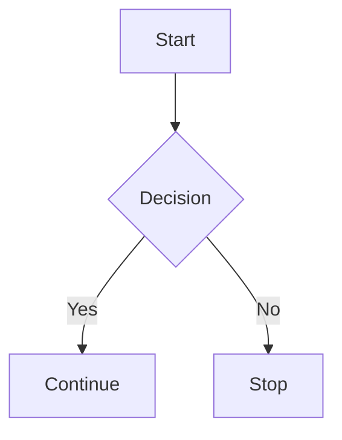

# mermaid-ascii-diagrams

Render **Mermaid diagrams** as **ASCII art** for terminals, plain-text documentation, emails, and environments where graphical rendering is not available.

This tool extracts Mermaid blocks from Markdown and converts them into readable ASCII diagrams.

---

## Features

- Converts Mermaid diagrams to plain ASCII
- Works in terminals and text-only environments
- CLI-first design
- Safe to use in CI, docs pipelines, and code reviews
- No JavaScript, no browser required

---

## Installation

```bash
pip install mermaid-ascii-diagrams
```

Requires **Python 3.9+**.

---

## Command-line usage

### Basic usage

```bash
mermaid-ascii diagram.md
```

This will:
- Read `diagram.md`
- Find all fenced ```mermaid blocks
- Render each diagram as ASCII
- Print the result to stdout

### Redirect output

```bash
mermaid-ascii diagram.md > diagram.txt
```

---

## Example

### Input (Markdown)

````markdown

````

### Output (ASCII)

```
+--------+     +------------+
| Start  | --> | Decision ? |
+--------+     +------------+
                   |    |
                 Yes    No
                   |    |
          +---------+  +------+
          | Continue|  | Stop |
          +---------+  +------+
```

(Exact output depends on terminal width and diagram complexity.)

---

## Supported diagram types

Currently supported or in progress:

- Flowcharts
- Sequence diagrams
- Class diagrams
- State diagrams

Unsupported constructs are ignored gracefully.

---

## Python usage

You can also use the renderer programmatically:

```python
from mermaid_ascii import render

ascii_diagram = render("""
flowchart LR
  A --> B
""")

print(ascii_diagram)
```

---

## Project status

This project is **actively developed** and focused on:
- Correct ASCII layout
- Predictable rendering
- Minimal dependencies
- Mermaid syntax compatibility

Expect improvements rather than breaking changes.

---

## License

MIT License  
Copyright © 2025

---

## Contributing

Issues and pull requests are welcome.

If you’re adding:
- New diagram types
- Layout improvements
- CLI features

please include before/after ASCII output examples.

---

## Why this exists

Mermaid is excellent — but not every environment can render SVGs or HTML.

`mermaid-ascii-diagrams` exists so diagrams remain **readable everywhere**.
