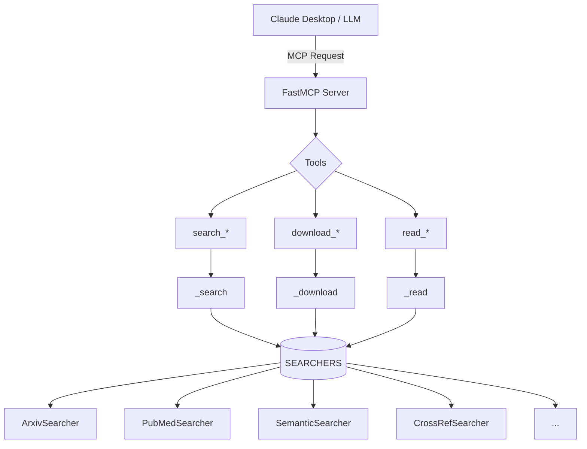

# MCP Server 详解

> **文件位置**: `paper_search_mcp/server.py`  
> **难度**: ⭐⭐⭐⭐ (核心文件)  
> **更新**: 2025年12月 - 工厂函数重构

---

## 概述

`server.py` 是整个项目的**核心入口**，负责：

1. 创建 MCP 服务器
2. 注册所有工具（搜索、下载、阅读）
3. 处理来自 LLM 的请求

### 2025 最佳实践

本项目采用以下最佳实践：

| 实践 | 说明 |
|------|------|
| 工厂函数 | 减少代码重复 |
| `logging` | 替代 `print()` |
| 统一错误处理 | 在工厂函数中集中处理 |
| 搜索器注册表 | 集中管理实例 |

---

## 架构图



---

## 完整代码分析

### 1. 导入和配置

```python
"""
MCP Server - 学术论文搜索服务

2025 最佳实践版本：
- 使用工厂函数减少代码重复
- 统一的错误处理
- 日志记录替代 print()
"""
from typing import List, Dict, Optional, Any
import logging

from mcp.server.fastmcp import FastMCP

from .academic_platforms.arxiv import ArxivSearcher
from .academic_platforms.pubmed import PubMedSearcher
# ... 其他导入

# 日志配置
logger = logging.getLogger(__name__)

# MCP Server 初始化
mcp = FastMCP("paper_search_server")
```

**💡 学习要点**：

1. **模块级文档字符串**: 描述模块功能和设计决策
2. **`logging`**: 专业的日志系统，比 `print()` 更灵活
3. **`FastMCP`**: MCP 框架的高级封装

---

### 2. 搜索器注册表

```python
# 搜索器实例（单例）
SEARCHERS = {
    'arxiv': ArxivSearcher(),
    'pubmed': PubMedSearcher(),
    'biorxiv': BioRxivSearcher(),
    'medrxiv': MedRxivSearcher(),
    'google_scholar': GoogleScholarSearcher(),
    'iacr': IACRSearcher(),
    'semantic': SemanticSearcher(),
    'crossref': CrossRefSearcher(),
}
```

**💡 设计优势**：

1. **集中管理**: 所有搜索器在一处初始化
2. **单例模式**: 每个搜索器只创建一个实例
3. **易于扩展**: 添加新平台只需一行代码

---

### 3. 工厂函数（含错误处理）

```python
async def _search(
    searcher_name: str, 
    query: str, 
    max_results: int = 10,
    **kwargs
) -> List[Dict]:
    """通用搜索函数"""
    searcher = SEARCHERS.get(searcher_name)
    if not searcher:
        logger.error(f"Unknown searcher: {searcher_name}")
        return []
    
    try:
        papers = searcher.search(query, max_results=max_results, **kwargs)
        return [paper.to_dict() for paper in papers]
    except Exception as e:
        logger.error(f"Search failed for {searcher_name}: {e}")
        return []


async def _download(
    searcher_name: str, 
    paper_id: str, 
    save_path: str = "./downloads"
) -> str:
    """通用下载函数"""
    searcher = SEARCHERS.get(searcher_name)
    if not searcher:
        return f"Error: Unknown searcher {searcher_name}"
    
    try:
        return searcher.download_pdf(paper_id, save_path)
    except NotImplementedError as e:
        return str(e)
    except Exception as e:
        logger.error(f"Download failed for {searcher_name}: {e}")
        return f"Error downloading: {str(e)}"


async def _read(
    searcher_name: str, 
    paper_id: str, 
    save_path: str = "./downloads"
) -> str:
    """通用阅读函数"""
    searcher = SEARCHERS.get(searcher_name)
    if not searcher:
        return f"Error: Unknown searcher {searcher_name}"
    
    try:
        return searcher.read_paper(paper_id, save_path)
    except NotImplementedError as e:
        return str(e)
    except Exception as e:
        logger.error(f"Read failed for {searcher_name}: {e}")
        return f"Error reading paper: {str(e)}"
```

**💡 工厂函数优势**：

| 优势 | 说明 |
|------|------|
| 代码复用 | 一次编写，多处使用 |
| 统一错误处理 | 所有搜索器使用相同的错误处理逻辑 |
| 易于维护 | 修改一处即可影响所有工具 |
| 易于测试 | 可以独立测试工厂函数 |

---

### 4. MCP 工具定义

```python
# ============================================================
# arXiv 工具
# ============================================================
@mcp.tool()
async def search_arxiv(query: str, max_results: int = 10) -> List[Dict]:
    """Search academic papers from arXiv.

    Args:
        query: Search query string (e.g., 'machine learning').
        max_results: Maximum number of papers to return (default: 10).
    Returns:
        List of paper metadata in dictionary format.
    """
    return await _search('arxiv', query, max_results)


@mcp.tool()
async def download_arxiv(paper_id: str, save_path: str = "./downloads") -> str:
    """Download PDF of an arXiv paper.

    Args:
        paper_id: arXiv paper ID (e.g., '2106.12345').
        save_path: Directory to save the PDF (default: './downloads').
    Returns:
        Path to the downloaded PDF file.
    """
    return await _download('arxiv', paper_id, save_path)


@mcp.tool()
async def read_arxiv_paper(paper_id: str, save_path: str = "./downloads") -> str:
    """Read and extract text content from an arXiv paper PDF.

    Args:
        paper_id: arXiv paper ID (e.g., '2106.12345').
        save_path: Directory where the PDF is/will be saved.
    Returns:
        str: The extracted text content of the paper.
    """
    return await _read('arxiv', paper_id, save_path)
```

**💡 工具定义简化**：

重构前（每个工具都有完整逻辑）：
```python
@mcp.tool()
async def search_arxiv(query: str, max_results: int = 10) -> List[Dict]:
    async with httpx.AsyncClient() as client:
        try:
            papers = arxiv_searcher.search(query, max_results=max_results)
            return [paper.to_dict() for paper in papers]
        except Exception as e:
            print(f"Error: {e}")
            return []
```

重构后（使用工厂函数）：
```python
@mcp.tool()
async def search_arxiv(query: str, max_results: int = 10) -> List[Dict]:
    return await _search('arxiv', query, max_results)
```

---

### 5. 特殊工具处理

有些工具有特殊参数，需要单独处理：

```python
@mcp.tool()
async def search_semantic(
    query: str, year: Optional[str] = None, max_results: int = 10
) -> List[Dict]:
    """Search academic papers from Semantic Scholar.

    Args:
        query: Search query string.
        year: Optional year filter (e.g., '2019', '2016-2020').
        max_results: Maximum number of papers to return.
    """
    kwargs = {'year': year} if year else {}
    return await _search('semantic', query, max_results, **kwargs)


@mcp.tool()
async def search_iacr(
    query: str, max_results: int = 10, fetch_details: bool = True
) -> List[Dict]:
    """Search IACR ePrint Archive.
    
    特殊参数需要单独处理
    """
    searcher = SEARCHERS['iacr']
    try:
        papers = searcher.search(query, max_results, fetch_details)
        return [paper.to_dict() for paper in papers] if papers else []
    except Exception as e:
        logger.error(f"IACR search failed: {e}")
        return []
```

---

### 6. 服务器入口

```python
if __name__ == "__main__":
    # 配置日志
    logging.basicConfig(
        level=logging.INFO,
        format='%(asctime)s - %(name)s - %(levelname)s - %(message)s'
    )
    
    # 运行 MCP 服务器
    mcp.run(transport="stdio")
```

**💡 学习要点**：

1. **日志配置**: 设置格式和级别
2. **`transport="stdio"`**: 使用标准输入/输出通信（Claude Desktop 默认）

---

## 工具分类

### 搜索工具

| 工具 | 平台 | 特殊参数 |
|------|------|----------|
| `search_arxiv` | arXiv | - |
| `search_pubmed` | PubMed | - |
| `search_biorxiv` | bioRxiv | - |
| `search_medrxiv` | medRxiv | - |
| `search_semantic` | Semantic Scholar | `year` |
| `search_crossref` | CrossRef | `filter`, `sort` |
| `search_iacr` | IACR ePrint | `fetch_details` |
| `search_google_scholar` | Google Scholar | - |

### 下载工具

| 工具 | 说明 |
|------|------|
| `download_arxiv` | 直接下载 |
| `download_semantic` | 需要 PDF URL |
| `download_pubmed` | ❌ 不支持 |
| `download_crossref` | ❌ 不支持 |

### 阅读工具

| 工具 | 输出格式 |
|------|----------|
| `read_arxiv_paper` | Markdown (PyMuPDF4LLM) |
| `read_semantic_paper` | Markdown |
| `read_pubmed_paper` | ❌ 返回错误信息 |

---

## 最佳实践总结

### ✅ 推荐做法

```python
# 1. 使用注册表管理实例
SEARCHERS = {'arxiv': ArxivSearcher(), ...}

# 2. 使用工厂函数减少重复
async def _search(name, query, max_results):
    return SEARCHERS[name].search(query, max_results)

# 3. 使用 logging
logger.error(f"Search failed: {e}")
```

### ❌ 避免做法

```python
# 1. 每个工具都重复相同代码
@mcp.tool()
async def search_arxiv(...):
    try:
        papers = arxiv_searcher.search(...)
        ...
    except Exception as e:
        print(f"Error: {e}")  # 不要用 print

# 2. 全局实例散落各处
arxiv_searcher = ArxivSearcher()  # 在文件顶部
pubmed_searcher = PubMedSearcher()  # 难以管理
```

---

## 扩展：添加新平台

添加新的学术平台只需 3 步：

### 1. 创建搜索器

```python
# paper_search_mcp/academic_platforms/new_platform.py
class NewPlatformSearcher(PaperSource):
    def search(self, query, max_results=10):
        ...
    def download_pdf(self, paper_id, save_path):
        ...
    def read_paper(self, paper_id, save_path):
        ...
```

### 2. 注册搜索器

```python
# server.py
from .academic_platforms.new_platform import NewPlatformSearcher

SEARCHERS = {
    ...,
    'new_platform': NewPlatformSearcher(),
}
```

### 3. 添加工具

```python
@mcp.tool()
async def search_new_platform(query: str, max_results: int = 10) -> List[Dict]:
    """Search papers from New Platform."""
    return await _search('new_platform', query, max_results)
```

---

## 参考资料

- [FastMCP 文档](https://github.com/jlowin/fastmcp)
- [MCP 官方规范](https://modelcontextprotocol.io/)
- [Python logging 模块](https://docs.python.org/3/library/logging.html)
