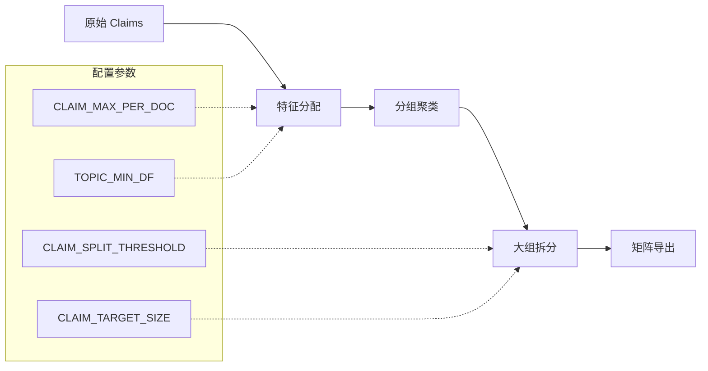

# Claim Grouping 参数配置指南

本文档介绍 Claim Grouping 系统的可配置参数、影响及最佳实践。

> **相关文档**:
> - [KNOWLEDGE_GRAPH.md](./KNOWLEDGE_GRAPH.md) - 图谱系统完整说明
> - [TAXONOMY_REFERENCE.md](./TAXONOMY_REFERENCE.md) - 词表规则详解
> - [MCP_TOOLS_REFERENCE.md](./MCP_TOOLS_REFERENCE.md) - 相关工具 API

---

## 概览



---

## 配置方式

### 1. 环境变量 (.env)
```bash
CLAIM_SPLIT_THRESHOLD=150
CLAIM_MAX_PER_DOC=100
```

### 2. YAML 配置文件
```bash
cp config.yaml.example config.yaml
# 编辑 config.yaml
```

### 3. 数据库表 (Taxonomy 词表)
```sql
-- 查看词表
SELECT * FROM taxonomy_terms WHERE kind = 'outcome';

-- 添加新词
INSERT INTO taxonomy_terms (kind, family, pattern, priority)
VALUES ('outcome', 'returns', 'abnormal return', 5);
```

或使用 MCP 工具：
```python
taxonomy_upsert_term(kind="outcome", family="returns", pattern="stock return", priority=5)
taxonomy_list_terms(kind="outcome")
```

---

## 参数详解

### 1. CLAIM_SPLIT_THRESHOLD
| 属性 | 值 |
|------|-----|
| **默认值** | 150 |
| **类型** | int |
| **影响** | 控制何时拆分大型 claim 组 |

**原理**：当组内 claims 数量超过此阈值时，使用 TF-IDF + KMeans 自动拆分为子组。

**选择建议**：
| 数据规模 | 推荐值 | 原因 |
|----------|--------|------|
| < 3000 claims | 150-200 | 避免过度拆分 |
| 3000-10000 claims | 100-150 | 平衡精度与可管理性 |
| > 10000 claims | 80-120 | 保持组大小可控 |

**调优方法**：
- 检查当前 `max_group_size`：若 < 100，无需降低阈值
- 目标：P90 group size 在 30-80 之间

---

### 2. CLAIM_TARGET_SIZE
| 属性 | 值 |
|------|-----|
| **默认值** | 120 |
| **类型** | int |
| **影响** | 拆分后每个子组的目标大小 |

**公式**：`子组数 = ceil(原组大小 / target_size)`

**选择建议**：通常设为 `split_threshold * 0.8`

---

### 3. CLAIM_MAX_PER_DOC
| 属性 | 值 |
|------|-----|
| **默认值** | 100 |
| **类型** | int |
| **影响** | 每篇文档处理的最大 claim 数 |

**原理**：限制单篇论文对分组的"垄断性"影响。

**选择建议**：
| 数据特征 | 推荐值 |
|----------|--------|
| 单篇 claims 少 (< 50) | 50-80 |
| 单篇 claims 多 (50-100) | 100-150 |
| 部分论文 claims 极多 (> 200) | 200+ 或不限制 |

**调优信号**：
- 若 coverage < 90%，需提高此值
- 可查询：`SELECT MAX(n) FROM (SELECT doc_id, COUNT(*) n FROM claims GROUP BY doc_id) t`

---

### 4. CLAIM_TOP_K_PER_GROUP
| 属性 | 值 |
|------|-----|
| **默认值** | 10 |
| **类型** | int |
| **影响** | 导出时每组返回的代表性 claims 数量 |

**选择建议**：
- 综述写作：10-15（足够代表性）
- 详细分析：20-30
- 调试/审查：50+

---

### 5. TOPIC_MIN_DF
| 属性 | 值 |
|------|-----|
| **默认值** | 3 |
| **类型** | int |
| **影响** | topic 选择时的最小文档频率 |

**原理**：df < min_df 的 topic 太具体，可能是噪声。

**选择建议**：
| 文档数 | 推荐值 |
|--------|--------|
| < 50 | 2-3 |
| 50-200 | 3-5 |
| > 200 | 5-10 |

---

### 6. TAXONOMY_GENERAL_THRESHOLD
| 属性 | 值 |
|------|-----|
| **默认值** | 0.3 |
| **类型** | float |
| **影响** | general 占比警告阈值 |

**含义**：当 `outcome_family = 'general'` 的 claims 占比超过此值时，建议扩展词表。

**目标**：
- < 30%：健康
- 30-50%：需要扩展词表
- > 50%：词表覆盖严重不足

---

## Taxonomy 词表配置

### 数据库表结构
```sql
CREATE TABLE taxonomy_terms (
  term_id      BIGSERIAL PRIMARY KEY,
  kind         TEXT NOT NULL,   -- 'outcome' | 'treatment' | 'setting'
  family       TEXT NOT NULL,   -- 归类名称，如 'earnings', 'returns'
  pattern      TEXT NOT NULL,   -- 匹配模式 (ILIKE 子串)
  priority     INT DEFAULT 100, -- 优先级（越小越优先）
  enabled      BOOLEAN DEFAULT TRUE
);
```

### 优先级规则
```
priority 1-10:   极高优先级（精确术语）
priority 10-30:  高优先级（核心概念）
priority 30-50:  中等优先级
priority 50-100: 低优先级（泛化匹配）
```

### 示例词表
```sql
-- Outcome families
('outcome', 'returns', 'abnormal return', 5),
('outcome', 'returns', 'stock return', 8),
('outcome', 'earnings', 'earnings', 10),
('outcome', 'volatility', 'volatility', 10),
('outcome', 'valuation', 'market value', 15),

-- Treatment families
('treatment', 'regulation', 'regulation', 10),
('treatment', 'shock', 'crisis', 12),

-- Setting
('setting', 'us', 'united states', 10),
('setting', 'china', 'china', 10),
```

---

## TF-IDF + KMeans 参数 (内部)

用于 `split_large_claim_groups_v1_2` 的内部参数：

| 参数 | 值 | 说明 |
|------|-----|------|
| `max_features` | 500 | TF-IDF 最大特征数 |
| `min_df` | 2 | 最小文档频率 |
| `max_df` | 0.9 | 最大文档频率比例 |
| `n_init` | 10 | KMeans 初始化次数 |
| `random_state` | 0 | 固定随机种子（确保可复现）|

参考：[scikit-learn 聚类文档](https://scikit-learn.org/stable/modules/clustering.html)

---

## 监控与调优

### 定期检查指标
```bash
python3 scripts/ab_testing.py metrics
```

### 健康指标
| 指标 | 健康范围 |
|------|----------|
| coverage | > 95% |
| max_group_size | < split_threshold |
| taxonomy_hit_rate | > 20% |
| avg_group_size | 20-80 |
| general 占比 | < 30% |

### 调优工作流
1. 检查 `coverage`：若 < 90%，提高 `CLAIM_MAX_PER_DOC`
2. 检查 `taxonomy_hit_rate`：若 < 20%，扩展词表
3. 检查 `max_group_size`：若 > threshold，降低 `CLAIM_SPLIT_THRESHOLD`
4. 检查 `general 占比`：若 > 30%，扩展词表

---

## 数据规模与参数关系

| 论文数 | Claims 数 | 推荐 split_threshold | 推荐 max_per_doc |
|--------|-----------|----------------------|------------------|
| < 50 | < 3000 | 150-200 | 100 |
| 50-200 | 3000-15000 | 100-150 | 150 |
| 200-500 | 15000-50000 | 80-120 | 200 |
| > 500 | > 50000 | 60-100 | 不限制 |

---

## 常见问题

### Q: 为什么 general 占比很高？
A: 词表覆盖不足。扩展 `taxonomy_terms` 表，添加领域特定术语。

### Q: 为什么 coverage < 100%？
A: 检查 `max_claims_per_doc` 是否足够大。查询 `SELECT MAX(n) FROM (SELECT doc_id, COUNT(*) n FROM claims GROUP BY doc_id) t`

### Q: 数据量增加后参数需要调整吗？
A: 是的。主要关注：
- `CLAIM_SPLIT_THRESHOLD`：数据量翻倍时考虑降低 20-30%
- `TOPIC_MIN_DF`：文档数增加后适当提高
