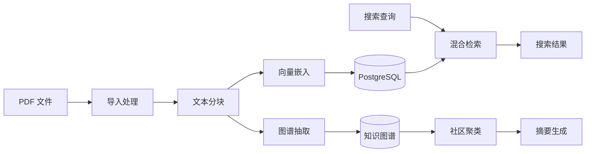

# Paperlib MCP 技术文档

本目录包含 Paperlib MCP 系统的完整技术文档。

## 文档索引

### 🏗️ 系统架构
| 文档 | 说明 |
|------|------|
| [ARCHITECTURE.md](./ARCHITECTURE.md) | 系统整体架构、技术栈、核心模块、数据流程图 |
| [DATABASE_SCHEMA.md](./DATABASE_SCHEMA.md) | 数据库表结构、索引策略、ER 图、迁移指南 |

### 🔍 核心功能
| 文档 | 说明 |
|------|------|
| [EMBEDDING_SYSTEM.md](./EMBEDDING_SYSTEM.md) | 文本嵌入、向量检索、混合搜索 (FTS + pgvector) |
| [KNOWLEDGE_GRAPH.md](./KNOWLEDGE_GRAPH.md) | 知识图谱 (GraphRAG)、实体抽取、社区发现、Claim 分组 |

### 📖 API 参考
| 文档 | 说明 |
|------|------|
| [MCP_TOOLS_REFERENCE.md](./MCP_TOOLS_REFERENCE.md) | 48+ MCP 工具完整 API 参考 |

### ⚙️ 配置与调优
| 文档 | 说明 |
|------|------|
| [PARAMETER_GUIDE.md](./PARAMETER_GUIDE.md) | Claim Grouping 参数配置、调优指南 |
| [TAXONOMY_REFERENCE.md](./TAXONOMY_REFERENCE.md) | 词表规则参考、扩展指南 |

---

## 快速导航

### 新用户入门
1. 阅读 [ARCHITECTURE.md](./ARCHITECTURE.md) 了解系统概览
2. 查看 [MCP_TOOLS_REFERENCE.md](./MCP_TOOLS_REFERENCE.md) 了解可用工具
3. 参考 README.md (父目录) 进行安装和配置

### 开发者指南
1. [DATABASE_SCHEMA.md](./DATABASE_SCHEMA.md) - 理解数据模型
2. [EMBEDDING_SYSTEM.md](./EMBEDDING_SYSTEM.md) - 理解检索实现
3. [KNOWLEDGE_GRAPH.md](./KNOWLEDGE_GRAPH.md) - 理解图谱构建

### 高级配置
1. [PARAMETER_GUIDE.md](./PARAMETER_GUIDE.md) - 参数调优
2. [TAXONOMY_REFERENCE.md](./TAXONOMY_REFERENCE.md) - 词表定制

---

## 核心概念

### 数据流概览

### 技术栈

| 层次 | 技术 |
|------|------|
| 协议层 | FastMCP (MCP 协议) |
| 存储层 | PostgreSQL 16 + pgvector |
| 对象存储 | MinIO (S3 兼容) |
| 嵌入模型 | OpenRouter API (text-embedding-3-small) |
| LLM | OpenRouter API (可配置) |
| PDF 处理 | PyMuPDF4LLM |
| 图聚类 | igraph + Leiden |

### 关键表

| 表名 | 用途 |
|------|------|
| `documents` | 文档元数据 |
| `chunks` | 文本块 + FTS 索引 |
| `chunk_embeddings` | 向量嵌入 |
| `entities` | 知识图谱实体 |
| `mentions` | 实体出处追溯 |
| `relations` | 实体间关系 |
| `claims` | 研究结论 |
| `communities` | 主题社区 |

---

## 文档更新日志

| 日期 | 更新内容 |
|------|---------|
| 2024-12-20 | 创建完整技术文档套件 |
