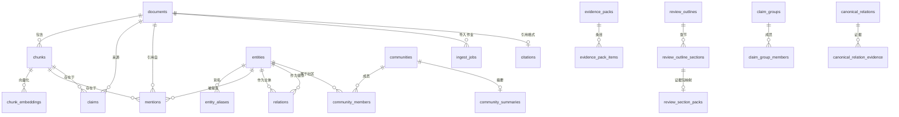

# 数据库架构文档

本文档详细描述 Paperlib MCP 的 PostgreSQL 数据库表结构、索引和迁移策略。

## 数据库概览



---

## 1. 基础表 (001_schema.sql)

### documents - 文档主表

```sql
CREATE TABLE documents (
    doc_id          TEXT PRIMARY KEY,           -- SHA256 哈希
    title           TEXT,                       -- 论文标题
    authors         TEXT,                       -- 作者（逗号分隔）
    year            INT,                        -- 发表年份
    venue           TEXT,                       -- 期刊/会议
    doi             TEXT,                       -- DOI 标识符
    url             TEXT,                       -- 论文链接
    pdf_bucket      TEXT NOT NULL DEFAULT 'papers',
    pdf_key         TEXT NOT NULL,              -- papers/{sha256}.pdf
    pdf_sha256      TEXT UNIQUE,                -- 文件哈希（去重）
    created_at      TIMESTAMPTZ DEFAULT now(),
    updated_at      TIMESTAMPTZ DEFAULT now()
);
```

**设计说明**:
- `doc_id` 使用 SHA256 哈希确保唯一性
- `pdf_sha256` 用于检测重复导入
- 元数据字段允许为空（可后续补充）

### chunks - 文本块表

```sql
CREATE TABLE chunks (
    chunk_id        BIGSERIAL PRIMARY KEY,
    doc_id          TEXT NOT NULL REFERENCES documents(doc_id) ON DELETE CASCADE,
    chunk_index     INT NOT NULL,               -- 块序号（从 0 开始）
    section         TEXT,                       -- 章节标识
    page_start      INT,                        -- 起始页（从 1 开始）
    page_end        INT,                        -- 结束页
    text            TEXT NOT NULL,              -- 文本内容
    token_count     INT,                        -- 估算 token 数
    tsv             TSVECTOR GENERATED ALWAYS AS (to_tsvector('english', text)) STORED,
    UNIQUE (doc_id, chunk_index)
);

CREATE INDEX chunks_doc_idx ON chunks(doc_id);
CREATE INDEX chunks_tsv_gin ON chunks USING GIN (tsv);
```

**设计说明**:
- `tsv` 是自动生成的全文搜索向量
- GIN 索引支持高效全文搜索
- `ON DELETE CASCADE` 确保文档删除时自动清理

### chunk_embeddings - 向量嵌入表

```sql
CREATE TABLE chunk_embeddings (
    chunk_id        BIGINT PRIMARY KEY REFERENCES chunks(chunk_id) ON DELETE CASCADE,
    embedding_model TEXT NOT NULL,              -- 模型标识
    embedding       VECTOR(1536) NOT NULL       -- pgvector 向量类型
);

CREATE INDEX chunk_emb_hnsw_cos
    ON chunk_embeddings USING hnsw (embedding vector_cosine_ops);
```

**设计说明**:
- 分离存储便于模型升级时重新生成
- HNSW 索引支持高效近似最近邻搜索
- `vector_cosine_ops` 使用余弦相似度

### citations - 引用格式表

```sql
CREATE TABLE citations (
    doc_id          TEXT PRIMARY KEY REFERENCES documents(doc_id) ON DELETE CASCADE,
    bibtex          TEXT,                       -- BibTeX 格式
    apa             TEXT,                       -- APA 格式
    created_at      TIMESTAMPTZ DEFAULT now()
);
```

---

## 2. 导入管理表 (002_m1_migration.sql)

### ingest_jobs - 导入作业表

```sql
CREATE TABLE ingest_jobs (
    job_id        BIGSERIAL PRIMARY KEY,
    doc_id        TEXT NOT NULL,
    status        TEXT NOT NULL DEFAULT 'pending',  -- pending/running/completed/failed
    current_stage TEXT,                             -- HASHED/UPLOADED/EXTRACTED/CHUNKED/EMBEDDED/COMMITTED
    started_at    TIMESTAMPTZ DEFAULT now(),
    finished_at   TIMESTAMPTZ,
    error         TEXT
);

CREATE INDEX ingest_jobs_doc_idx ON ingest_jobs(doc_id);
CREATE INDEX ingest_jobs_status_idx ON ingest_jobs(status);
```

### ingest_job_items - 阶段详情表

```sql
CREATE TABLE ingest_job_items (
    id          BIGSERIAL PRIMARY KEY,
    job_id      BIGINT NOT NULL REFERENCES ingest_jobs(job_id) ON DELETE CASCADE,
    stage       TEXT NOT NULL,               -- HASHED/UPLOADED/EXTRACTED/CHUNKED/EMBEDDED/COMMITTED
    status      TEXT NOT NULL,               -- pending/running/completed/failed
    message     TEXT,
    created_at  TIMESTAMPTZ DEFAULT now()
);

CREATE INDEX ingest_job_items_job_idx ON ingest_job_items(job_id);
```

**导入流程状态机**:
```
HASHED → UPLOADED → EXTRACTED → CHUNKED → EMBEDDED → COMMITTED
```

### evidence_packs - 证据包表

```sql
CREATE TABLE evidence_packs (
    pack_id     BIGSERIAL PRIMARY KEY,
    query       TEXT NOT NULL,               -- 构建查询
    params_json JSONB,                       -- 参数快照 {k, alpha, per_doc_limit, ...}
    created_at  TIMESTAMPTZ DEFAULT now()
);

CREATE TABLE evidence_pack_items (
    id        BIGSERIAL PRIMARY KEY,
    pack_id   BIGINT NOT NULL REFERENCES evidence_packs(pack_id) ON DELETE CASCADE,
    doc_id    TEXT NOT NULL,
    chunk_id  BIGINT NOT NULL,
    rank      INT                            -- 排序位置
);

CREATE INDEX evidence_pack_items_pack_idx ON evidence_pack_items(pack_id);
```

---

## 3. GraphRAG 表 (003_m2_graphrag.sql)

### entities - 实体表

```sql
CREATE TABLE entities (
    entity_id       BIGSERIAL PRIMARY KEY,
    type            TEXT NOT NULL,           -- Paper/Topic/MeasureProxy/IdentificationStrategy/...
    canonical_name  TEXT NOT NULL,           -- 规范名称
    canonical_key   TEXT NOT NULL,           -- 规范键（去重用）
    normalized      JSONB DEFAULT '{}',      -- 归一化元数据
    confidence      FLOAT DEFAULT 1.0,
    is_locked       BOOLEAN DEFAULT FALSE,   -- 锁定防止自动合并
    created_at      TIMESTAMPTZ DEFAULT now(),
    updated_at      TIMESTAMPTZ DEFAULT now(),
    UNIQUE (type, canonical_key)
);

CREATE INDEX entities_type_idx ON entities(type);
CREATE INDEX entities_canonical_key_idx ON entities(canonical_key);
CREATE INDEX entities_is_locked_idx ON entities(is_locked) WHERE is_locked = TRUE;
```

**实体类型**:
| 类型 | 说明 | 示例 |
|------|------|------|
| Paper | 论文本身 | 由 doc_id 标识 |
| Topic | 研究主题 | Monetary Policy, Inflation |
| MeasureProxy | 度量/代理变量 | Stock Returns, Volatility |
| IdentificationStrategy | 识别策略 | IV, DiD, RDD |
| Method | 研究方法 | OLS, Panel Regression |
| Setting | 研究情境 | US Market, China 2000-2020 |
| DataSource | 数据来源 | CRSP, Compustat |
| Mechanism | 机制 | Information Channel |
| LimitationGap | 局限性/空白 | Small Sample Size |

### entity_aliases - 实体别名表

```sql
CREATE TABLE entity_aliases (
    alias_id        BIGSERIAL PRIMARY KEY,
    entity_id       BIGINT NOT NULL REFERENCES entities(entity_id) ON DELETE CASCADE,
    alias           TEXT NOT NULL,           -- 原始别名
    alias_norm      TEXT NOT NULL,           -- 归一化别名
    alias_type      TEXT DEFAULT 'extracted',  -- extracted/manual/synonym
    created_at      TIMESTAMPTZ DEFAULT now()
);

CREATE INDEX entity_aliases_entity_idx ON entity_aliases(entity_id);
CREATE INDEX entity_aliases_norm_idx ON entity_aliases(alias_norm);
CREATE UNIQUE INDEX entity_aliases_unique_idx ON entity_aliases(entity_id, alias_norm);
```

### mentions - 实体提及表

```sql
CREATE TABLE mentions (
    mention_id      BIGSERIAL PRIMARY KEY,
    entity_id       BIGINT NOT NULL REFERENCES entities(entity_id) ON DELETE CASCADE,
    doc_id          TEXT NOT NULL REFERENCES documents(doc_id) ON DELETE CASCADE,
    chunk_id        BIGINT NOT NULL REFERENCES chunks(chunk_id) ON DELETE CASCADE,
    page_start      INT,
    page_end        INT,
    span_start      INT,                     -- chunk 文本中的起始位置
    span_end        INT,                     -- chunk 文本中的结束位置
    quote           TEXT,                    -- 原文引用
    confidence      FLOAT DEFAULT 1.0,
    created_at      TIMESTAMPTZ DEFAULT now()
);

CREATE INDEX mentions_entity_idx ON mentions(entity_id);
CREATE INDEX mentions_doc_idx ON mentions(doc_id);
CREATE INDEX mentions_chunk_idx ON mentions(chunk_id);
```

**用途**: 追溯每个实体在原文中的出处

### relations - 关系表

```sql
CREATE TABLE relations (
    rel_id          BIGSERIAL PRIMARY KEY,
    subj_entity_id  BIGINT NOT NULL REFERENCES entities(entity_id) ON DELETE CASCADE,
    predicate       TEXT NOT NULL,           -- PAPER_HAS_TOPIC/PAPER_USES_MEASURE/...
    obj_entity_id   BIGINT NOT NULL REFERENCES entities(entity_id) ON DELETE CASCADE,
    qualifiers      JSONB DEFAULT '{}',      -- 额外限定条件
    confidence      FLOAT DEFAULT 1.0,
    evidence        JSONB DEFAULT '{}',      -- {doc_id, chunk_id, quote, page_start, page_end}
    relation_hash   TEXT UNIQUE,             -- 去重哈希
    created_at      TIMESTAMPTZ DEFAULT now()
);

CREATE INDEX relations_subj_idx ON relations(subj_entity_id);
CREATE INDEX relations_obj_idx ON relations(obj_entity_id);
CREATE INDEX relations_predicate_idx ON relations(predicate);
```

**关系谓词**:
| 谓词 | 主体 | 客体 |
|------|------|------|
| PAPER_HAS_TOPIC | Paper | Topic |
| PAPER_USES_MEASURE | Paper | MeasureProxy |
| PAPER_IDENTIFIES_WITH | Paper | IdentificationStrategy |
| PAPER_USES_METHOD | Paper | Method |
| PAPER_IN_SETTING | Paper | Setting |
| PAPER_USES_DATA | Paper | DataSource |
| PAPER_PROPOSES_MECHANISM | Paper | Mechanism |
| PAPER_NOTES_LIMITATION | Paper | LimitationGap |

### claims - 结论表

```sql
CREATE TABLE claims (
    claim_id        BIGSERIAL PRIMARY KEY,
    doc_id          TEXT NOT NULL REFERENCES documents(doc_id) ON DELETE CASCADE,
    chunk_id        BIGINT NOT NULL REFERENCES chunks(chunk_id) ON DELETE CASCADE,
    claim_text      TEXT NOT NULL,           -- 结论原文
    sign            TEXT,                    -- positive/negative/mixed/null
    effect_size_text TEXT,                   -- 效应量描述
    conditions      JSONB DEFAULT '{}',      -- 适用条件
    confidence      FLOAT DEFAULT 1.0,
    evidence        JSONB DEFAULT '{}',
    claim_hash      TEXT UNIQUE,             -- 去重哈希
    created_at      TIMESTAMPTZ DEFAULT now()
);

CREATE INDEX claims_doc_idx ON claims(doc_id);
CREATE INDEX claims_chunk_idx ON claims(chunk_id);
CREATE INDEX claims_sign_idx ON claims(sign);
```

### communities - 社区表

```sql
CREATE TABLE communities (
    comm_id         BIGSERIAL PRIMARY KEY,
    level           TEXT NOT NULL DEFAULT 'macro',  -- macro/micro
    method          TEXT NOT NULL DEFAULT 'leiden',
    params          JSONB DEFAULT '{}',             -- {resolution, min_df, ...}
    created_at      TIMESTAMPTZ DEFAULT now()
);

CREATE TABLE community_members (
    id              BIGSERIAL PRIMARY KEY,
    comm_id         BIGINT NOT NULL REFERENCES communities(comm_id) ON DELETE CASCADE,
    entity_id       BIGINT NOT NULL REFERENCES entities(entity_id) ON DELETE CASCADE,
    role            TEXT DEFAULT 'member',          -- member/hub
    weight          FLOAT DEFAULT 1.0,
    created_at      TIMESTAMPTZ DEFAULT now(),
    UNIQUE (comm_id, entity_id)
);

CREATE TABLE community_summaries (
    id              BIGSERIAL PRIMARY KEY,
    comm_id         BIGINT NOT NULL REFERENCES communities(comm_id) ON DELETE CASCADE UNIQUE,
    summary_json    JSONB NOT NULL,
    updated_at      TIMESTAMPTZ DEFAULT now()
);

CREATE INDEX communities_level_idx ON communities(level);
CREATE INDEX community_members_comm_idx ON community_members(comm_id);
CREATE INDEX community_members_entity_idx ON community_members(entity_id);
CREATE INDEX community_summaries_comm_idx ON community_summaries(comm_id);
```

### entity_merge_log - 合并日志表

```sql
CREATE TABLE entity_merge_log (
    id              BIGSERIAL PRIMARY KEY,
    from_entity_id  BIGINT NOT NULL,         -- 被合并的实体（已删除）
    to_entity_id    BIGINT NOT NULL,         -- 目标实体
    reason          TEXT,
    merged_at       TIMESTAMPTZ DEFAULT now()
);

CREATE INDEX entity_merge_log_to_idx ON entity_merge_log(to_entity_id);
```

---

## 4. Review 表 (004_m3_review.sql)

### review_outlines - 综述大纲表

```sql
CREATE TABLE review_outlines (
    outline_id      TEXT PRIMARY KEY,        -- UUID
    topic           TEXT NOT NULL,
    outline_style   TEXT NOT NULL DEFAULT 'econ_finance_canonical',
    sources_json    JSONB,                   -- {comm_ids, doc_ids, ...}
    created_at      TIMESTAMPTZ DEFAULT now()
);

CREATE INDEX review_outlines_topic_idx ON review_outlines(topic);
CREATE INDEX review_outlines_style_idx ON review_outlines(outline_style);
```

### review_outline_sections - 章节表

```sql
CREATE TABLE review_outline_sections (
    id              BIGSERIAL PRIMARY KEY,
    outline_id      TEXT NOT NULL REFERENCES review_outlines(outline_id) ON DELETE CASCADE,
    section_id      TEXT NOT NULL,           -- research_question/measurement/identification/...
    title           TEXT NOT NULL,
    description     TEXT,
    ord             INT NOT NULL,            -- 显示顺序
    sources_json    JSONB,
    keywords        TEXT[],
    UNIQUE (outline_id, section_id)
);

CREATE INDEX review_outline_sections_outline_idx ON review_outline_sections(outline_id);
```

### review_section_packs - 章节证据包映射

```sql
CREATE TABLE review_section_packs (
    outline_id      TEXT NOT NULL,
    section_id      TEXT NOT NULL,
    pack_id         BIGINT NOT NULL REFERENCES evidence_packs(pack_id) ON DELETE CASCADE,
    params          JSONB NOT NULL,
    created_at      TIMESTAMPTZ DEFAULT now(),
    PRIMARY KEY (outline_id, section_id)
);

CREATE INDEX review_section_packs_pack_idx ON review_section_packs(pack_id);
```

---

## 5. 规范化表 (004_m4_canonicalization.sql)

### canonical_relations - 规范化关系表

```sql
CREATE TABLE canonical_relations (
    canon_rel_id    SERIAL PRIMARY KEY,
    subj_entity_id  INT NOT NULL REFERENCES entities(entity_id) ON DELETE CASCADE,
    predicate_norm  TEXT NOT NULL,
    obj_entity_id   INT NOT NULL REFERENCES entities(entity_id) ON DELETE CASCADE,
    qualifiers_norm JSONB DEFAULT '{}',
    canonical_key   TEXT UNIQUE NOT NULL,    -- SHA256 哈希
    created_at      TIMESTAMPTZ DEFAULT now()
);

CREATE TABLE canonical_relation_evidence (
    id              SERIAL PRIMARY KEY,
    canon_rel_id    INT NOT NULL REFERENCES canonical_relations(canon_rel_id) ON DELETE CASCADE,
    doc_id          TEXT NOT NULL REFERENCES documents(doc_id) ON DELETE CASCADE,
    chunk_id        INT REFERENCES chunks(chunk_id) ON DELETE SET NULL,
    quote           TEXT,
    confidence      REAL DEFAULT 0.8,
    source_rel_id   INT REFERENCES relations(rel_id) ON DELETE SET NULL,
    created_at      TIMESTAMPTZ DEFAULT now()
);

CREATE INDEX idx_canonical_relations_subj ON canonical_relations(subj_entity_id);
CREATE INDEX idx_canonical_relations_obj ON canonical_relations(obj_entity_id);
CREATE INDEX idx_canonical_relation_evidence_rel ON canonical_relation_evidence(canon_rel_id);
CREATE INDEX idx_canonical_relation_evidence_doc ON canonical_relation_evidence(doc_id);
```

### claim_groups - Claim 分组表

```sql
CREATE TABLE claim_groups (
    group_id        SERIAL PRIMARY KEY,
    group_key       TEXT UNIQUE NOT NULL,    -- 分组键
    topic_entity_id INT REFERENCES entities(entity_id) ON DELETE SET NULL,
    sign            TEXT,
    setting         TEXT,
    id_family       TEXT,
    created_at      TIMESTAMPTZ DEFAULT now()
);

CREATE TABLE claim_group_members (
    id              SERIAL PRIMARY KEY,
    group_id        INT NOT NULL REFERENCES claim_groups(group_id) ON DELETE CASCADE,
    claim_id        INT NOT NULL REFERENCES claims(claim_id) ON DELETE CASCADE,
    similarity      REAL DEFAULT 1.0,
    created_at      TIMESTAMPTZ DEFAULT now(),
    UNIQUE(group_id, claim_id)
);

CREATE INDEX idx_claim_group_members_group ON claim_group_members(group_id);
CREATE INDEX idx_claim_group_members_claim ON claim_group_members(claim_id);
```

---

## 6. 索引策略

### 向量索引

```sql
-- HNSW 索引参数
-- m: 每个节点最大连接数（默认 16）
-- ef_construction: 构建时搜索深度（默认 64）
CREATE INDEX chunk_emb_hnsw_cos
    ON chunk_embeddings USING hnsw (embedding vector_cosine_ops)
    WITH (m = 16, ef_construction = 64);

-- 搜索时可调整 ef_search
SET hnsw.ef_search = 100;  -- 更高精度
SET hnsw.ef_search = 40;   -- 更快速度
```

### 全文索引

```sql
-- GIN 索引（自动更新）
CREATE INDEX chunks_tsv_gin ON chunks USING GIN (tsv);

-- 搜索示例
SELECT * FROM chunks 
WHERE tsv @@ plainto_tsquery('english', 'monetary policy');
```

### 业务索引

```sql
-- 高频查询路径
CREATE INDEX entities_type_idx ON entities(type);
CREATE INDEX mentions_entity_idx ON mentions(entity_id);
CREATE INDEX claims_sign_idx ON claims(sign);

-- 部分索引（只索引满足条件的行）
CREATE INDEX entities_is_locked_idx ON entities(is_locked) 
    WHERE is_locked = TRUE;
```

---

## 7. 迁移策略

### 迁移文件顺序

```
initdb/
├── 001_schema.sql          # 基础表
├── 002_m1_migration.sql    # 导入管理、证据包
├── 003_m2_graphrag.sql     # GraphRAG 核心表
├── 004_m3_review.sql       # Review 基础设施
└── 004_m4_canonicalization.sql  # 规范化表
```

### 迁移执行

```bash
# Docker Compose 自动执行
docker-compose up -d

# 手动执行
psql -h localhost -U paper -d paperlib -f initdb/001_schema.sql
psql -h localhost -U paper -d paperlib -f initdb/002_m1_migration.sql
# ...
```

### 新增迁移

1. 创建新文件 `005_new_feature.sql`
2. 使用 `CREATE TABLE IF NOT EXISTS` 确保幂等
3. 使用 `CREATE INDEX IF NOT EXISTS` 避免重复
4. 在 `apply_migration.py` 中注册

---

## 8. 维护操作

### 统计表大小

```sql
SELECT 
    relname AS table_name,
    pg_size_pretty(pg_total_relation_size(relid)) AS total_size,
    pg_size_pretty(pg_relation_size(relid)) AS table_size,
    pg_size_pretty(pg_indexes_size(relid)) AS index_size
FROM pg_catalog.pg_statio_user_tables
ORDER BY pg_total_relation_size(relid) DESC;
```

### 重建索引

```sql
-- 重建单个索引
REINDEX INDEX chunk_emb_hnsw_cos;

-- 重建表的所有索引
REINDEX TABLE chunks;

-- 并发重建（不锁表）
REINDEX INDEX CONCURRENTLY chunk_emb_hnsw_cos;
```

### 清理孤立数据

```sql
-- 查找没有 embedding 的 chunks
SELECT c.chunk_id, c.doc_id 
FROM chunks c
LEFT JOIN chunk_embeddings ce ON c.chunk_id = ce.chunk_id
WHERE ce.chunk_id IS NULL;

-- 查找没有 mentions 的 entities
SELECT e.entity_id, e.canonical_name
FROM entities e
LEFT JOIN mentions m ON e.entity_id = m.entity_id
WHERE m.mention_id IS NULL
  AND e.type != 'Paper';
```

### 备份与恢复

```bash
# 备份
pg_dump -h localhost -U paper -d paperlib > backup.sql

# 只备份结构
pg_dump -h localhost -U paper -d paperlib --schema-only > schema.sql

# 恢复
psql -h localhost -U paper -d paperlib < backup.sql
```
