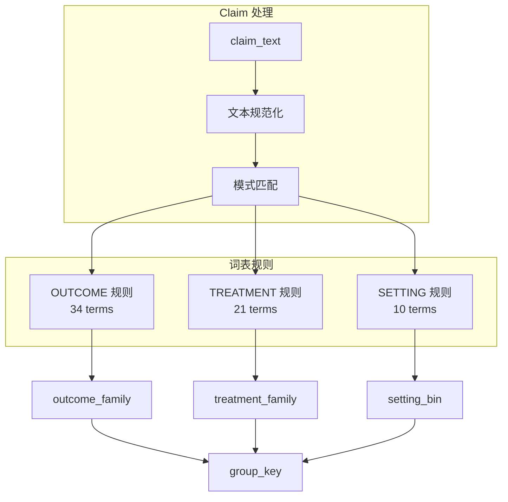

# Taxonomy 词表参考手册

本文档详细介绍 Claim Grouping 的词表规则系统。

> **相关文档**:
> - [PARAMETER_GUIDE.md](./PARAMETER_GUIDE.md) - 参数配置指南
> - [KNOWLEDGE_GRAPH.md](./KNOWLEDGE_GRAPH.md) - 图谱系统说明
> - [MCP_TOOLS_REFERENCE.md](./MCP_TOOLS_REFERENCE.md) - 词表管理工具

---

## 概述

Taxonomy 词表用于将 claims 自动分类到语义家族（family），是 Claim Grouping 系统的核心组件。



### 作用
1. **标准化**：将不同表述的同一概念归类到统一 family
2. **分组依据**：`outcome_family` 和 `treatment_family` 是 group_key 的组成部分
3. **降低 general 占比**：提高词表覆盖率可减少未分类 claims

### 匹配机制
```
claim_text (规范化后) 是否包含 pattern → 返回对应 family
优先级：priority 越小越优先匹配
无匹配：返回 "general"
```

---

## 当前词表 (65 terms)

### OUTCOME (34 terms)
结果变量 / 因变量的分类

| Family | Pattern | Priority | 说明 |
|--------|---------|----------|------|
| **returns** | return | 5 | 收益率相关 |
| returns | stock return | 5 | 股票收益 |
| returns | abnormal return | 5 | 异常收益 |
| returns | performance | 15 | 业绩表现 |
| **volatility** | volatility | 8 | 波动性 |
| volatility | variance | 8 | 方差 |
| volatility | risk | 12 | 风险 |
| **earnings** | earnings | 10 | 盈余 |
| earnings | profit | 10 | 利润 |
| earnings | accrual | 10 | 应计项目 |
| **investment** | capex | 10 | 资本支出 |
| investment | capital expenditure | 10 | 资本支出 |
| investment | investment | 15 | 投资 |
| **liquidity** | liquidity | 10 | 流动性 |
| liquidity | trading volume | 10 | 交易量 |
| **cost_capital** | cost of capital | 10 | 资本成本 |
| cost_capital | discount rate | 10 | 折现率 |
| **valuation** | valuation | 12 | 估值 |
| valuation | market value | 12 | 市值 |
| valuation | price | 15 | 价格 |
| **disclosure** | disclosure | 12 | 披露 |
| disclosure | transparency | 12 | 透明度 |
| **audit** | audit | 12 | 审计 |
| audit | auditor | 12 | 审计师 |
| **esg** | esg | 20 | ESG |
| esg | csr | 20 | 企业社会责任 |
| esg | environment | 20 | 环境 |
| esg | social | 20 | 社会 |
| **innovation** | innovation | 30 | 创新 |
| innovation | r&d | 30 | 研发 |
| innovation | patent | 30 | 专利 |
| **governance** | governance | 40 | 治理 |
| governance | board | 40 | 董事会 |
| governance | ceo | 40 | CEO |

### TREATMENT (21 terms)
处理变量 / 自变量的分类

| Family | Pattern | Priority | 说明 |
|--------|---------|----------|------|
| **merger** | m&a | 8 | 并购 |
| merger | merger | 10 | 合并 |
| merger | acquisition | 10 | 收购 |
| **regulation** | regulation | 10 | 监管 |
| regulation | policy | 15 | 政策 |
| regulation | law | 15 | 法律 |
| **shock** | shock | 10 | 冲击 |
| shock | crisis | 10 | 危机 |
| shock | event | 20 | 事件 |
| **information** | asymmetry | 10 | 信息不对称 |
| information | information | 15 | 信息 |
| **institutional** | institutional | 12 | 机构 |
| institutional | ownership | 12 | 所有权 |
| **earnings** | earnings | 10 | 盈余管理 |
| earnings | profit | 10 | 利润 |
| **esg** | esg | 20 | ESG |
| esg | environment | 20 | 环境 |
| **innovation** | innovation | 30 | 创新 |
| innovation | r&d | 30 | 研发 |
| **governance** | governance | 40 | 治理 |
| governance | board | 40 | 董事会 |

### SETTING (10 terms)
研究情境 / 样本范围的分类

| Family | Pattern | Priority | 说明 |
|--------|---------|----------|------|
| **us** | united states | 10 | 美国 |
| us | u.s. | 10 | 美国 |
| **china** | china | 10 | 中国 |
| china | chinese | 10 | 中国 |
| **europe** | europe | 10 | 欧洲 |
| europe | european | 10 | 欧洲 |
| **emerging** | emerging market | 10 | 新兴市场 |
| **finance** | financial sector | 12 | 金融行业 |
| **manufacturing** | manufacturing | 15 | 制造业 |
| **tech** | technology | 15 | 科技行业 |

---

## 最佳实践

### 1. 优先级设置

```
1-10:   高优先级（精确、专业术语）
        例：abnormal return, m&a, cost of capital
        
10-30:  中等优先级（常见学术词汇）
        例：earnings, volatility, regulation
        
30-50:  低优先级（泛化概念）
        例：innovation, governance
        
50-100: 兜底优先级（非常宽泛的匹配）
```

### 2. 避免冲突

**问题**：`return` 可能同时匹配 "stock return" 和 "return on investment"

**解决**：
- 更具体的 pattern 设置更高优先级
- 例：`abnormal return (5)` > `return (8)` > `performance (15)`

### 3. 词表扩展策略

1. **从 general 中挖掘**
   ```sql
   SELECT claim_text, COUNT(*) 
   FROM claim_features cf
   JOIN claims c ON c.claim_id = cf.claim_id
   WHERE outcome_family = 'general'
   GROUP BY claim_text
   ORDER BY COUNT(*) DESC
   LIMIT 20;
   ```

2. **按领域扩展**
   - 金融：liquidity, solvency, leverage, dividend
   - 会计：audit, internal control, restatement
   - 管理：CEO, compensation, turnover

3. **渐进式添加**
   - 每次添加 5-10 个词，重新评估命中率
   - 避免一次性大批量导入

### 4. 命中率目标

| 阶段 | 目标命中率 | 说明 |
|------|-----------|------|
| 初始 | > 15% | 基本可用 |
| 成熟 | 25-40% | 主要概念覆盖 |
| 理想 | 40-60% | 精细分类 |

> 注意：100% 命中率不是目标，`general` 类本身有意义

### 5. 质量检查

```sql
-- 检查命中率
SELECT outcome_family, COUNT(*) as n, 
       ROUND(100.0 * COUNT(*) / SUM(COUNT(*)) OVER (), 2) as pct
FROM claim_features 
GROUP BY outcome_family 
ORDER BY n DESC;

-- 检查某个 family 的实际内容（验证准确性）
SELECT c.claim_text 
FROM claim_features cf
JOIN claims c ON c.claim_id = cf.claim_id
WHERE cf.outcome_family = 'returns'
LIMIT 10;
```

---

## 管理操作

### 添加词条
```python
# MCP 工具
taxonomy_upsert_term(
    kind="outcome",
    family="leverage",
    pattern="debt ratio",
    priority=10
)
```

```sql
-- SQL
INSERT INTO taxonomy_terms (kind, family, pattern, priority)
VALUES ('outcome', 'leverage', 'debt ratio', 10);
```

### 禁用词条
```sql
UPDATE taxonomy_terms SET enabled = FALSE WHERE pattern = 'risk';
```

### 批量导入
```sql
INSERT INTO taxonomy_terms (kind, family, pattern, priority) VALUES
('outcome', 'leverage', 'leverage', 10),
('outcome', 'leverage', 'debt', 12),
('outcome', 'dividend', 'dividend', 10),
('outcome', 'dividend', 'payout', 12);
```

### 重新计算 claim features
```python
# 修改词表后需要重新分配
assign_claim_features_v1_2()
build_claim_groups_v1_2()
```

---

## 领域扩展建议

### 金融学
```sql
('outcome', 'leverage', 'leverage', 10),
('outcome', 'leverage', 'debt ratio', 10),
('outcome', 'dividend', 'dividend', 10),
('outcome', 'dividend', 'payout', 12),
('outcome', 'solvency', 'solvency', 12),
('outcome', 'solvency', 'bankruptcy', 10),
```

### 会计学
```sql
('outcome', 'internal_control', 'internal control', 10),
('outcome', 'internal_control', 'material weakness', 8),
('outcome', 'restatement', 'restatement', 10),
('outcome', 'restatement', 'misstatement', 10),
```

### 公司金融
```sql
('treatment', 'compensation', 'compensation', 10),
('treatment', 'compensation', 'incentive', 12),
('treatment', 'ceo_change', 'ceo turnover', 8),
('treatment', 'ceo_change', 'succession', 10),
```
