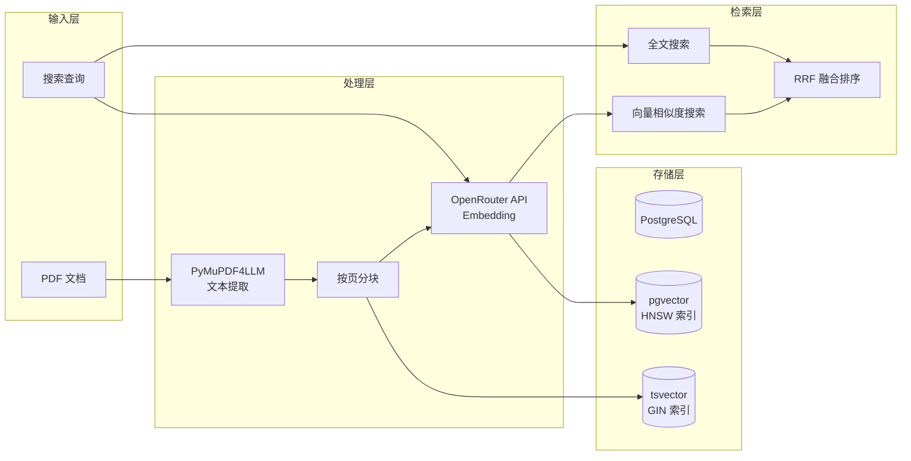
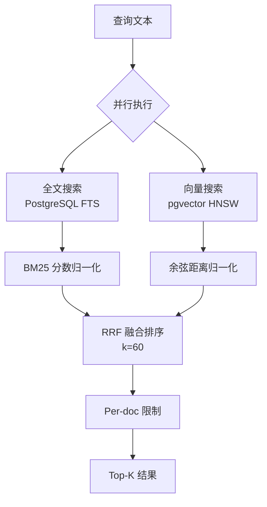

# 文本嵌入与向量检索系统

本文档详细描述 Paperlib MCP 的文本嵌入生成和向量检索实现。

## 系统概览



---

## 1. 文本提取与分块

### 1.1 PDF 文本提取 (`pdf_extract.py`)

使用 **PyMuPDF4LLM** 进行文本提取，优势：
- 输出 LLM 优化的 Markdown 格式
- 智能表格检测和格式化
- 保留文档结构（标题、列表）
- 多栏布局处理

```python
def extract_pdf(
    file_path: str | Path,
    *,
    table_strategy: str = "lines_strict",
    ignore_images: bool = True,
) -> PdfExtractResult:
    """从 PDF 文件提取文本"""
    page_data = pymupdf4llm.to_markdown(
        str(file_path),
        page_chunks=True,           # 按页返回
        table_strategy=table_strategy,
        ignore_images=ignore_images,
    )
    # 返回 PdfExtractResult 包含所有页面
```

**表格检测策略**:

| 策略 | 说明 | 适用场景 |
|------|------|---------|
| `lines_strict` | 仅检测有可见线条的表格 | 推荐，精度高 |
| `lines` | 检测有线条的表格（宽松） | 表格边框不完整 |
| `text` | 基于文本对齐检测 | 无边框表格 |
| `explicit` | 仅检测明确标记的表格 | 最保守 |

### 1.2 文本分块 (`chunking.py`)

采用 **按页分块** 策略，每页形成一个独立 chunk：

```python
@dataclass
class Chunk:
    chunk_index: int  # 从 0 开始
    page_start: int   # 起始页码（从 1 开始）
    page_end: int     # 结束页码（从 1 开始）
    text: str
    char_count: int
    
    @property
    def estimated_tokens(self) -> int:
        """估算 token 数（约 4 字符 = 1 token）"""
        return self.char_count // 4
```

**分块特点**:
- 保持页面语义完整性
- 便于引用定位（精确到页码）
- 适合学术论文结构

**文本清理**:
```python
def sanitize_text(text: str) -> str:
    """移除 null 字节等问题字符"""
    return text.replace('\x00', '')  # PostgreSQL JSON 兼容
```

---

## 2. Embedding 生成 (`embeddings.py`)

### 2.1 API 配置

| 参数 | 默认值 | 说明 |
|------|--------|------|
| `embedding_model` | `openai/text-embedding-3-small` | 模型标识 |
| `embedding_batch_size` | 64 | 批处理大小 |
| `openrouter_base_url` | `https://openrouter.ai/api/v1` | API 端点 |

### 2.2 单条 Embedding

```python
def get_embedding(text: str) -> list[float]:
    """获取单个文本的 embedding 向量 (1536 维)"""
    embeddings = get_embeddings_batch([text])
    return embeddings[0]
```

### 2.3 批量 Embedding

```python
def get_embeddings_batch(texts: list[str]) -> list[list[float]]:
    """批量获取文本的 embedding 向量"""
    url = f"{settings.openrouter_base_url}/embeddings"
    headers = {
        "Authorization": f"Bearer {settings.openrouter_api_key}",
        "Content-Type": "application/json",
    }
    payload = {
        "model": settings.embedding_model,
        "input": texts,
    }
    
    with httpx.Client(timeout=60.0) as client:
        response = client.post(url, json=payload, headers=headers)
        response.raise_for_status()
    
    # 按 index 排序确保顺序
    embeddings_data = sorted(data["data"], key=lambda x: x["index"])
    return [item["embedding"] for item in embeddings_data]
```

### 2.4 异步并发批处理

```python
async def aget_embeddings_chunked(
    texts: list[str], 
    batch_size: int | None = None,
    concurrency: int = 5
) -> list[list[float]]:
    """分批并行获取大量文本的 embedding 向量"""
    actual_batch_size = batch_size or settings.embedding_batch_size
    
    # 准备批次
    batches = [texts[i:i + actual_batch_size] 
               for i in range(0, len(texts), actual_batch_size)]
    
    # 并发控制
    sem = asyncio.Semaphore(concurrency)
    results = [None] * len(batches)
    
    async def process_batch(idx, batch_texts):
        async with sem:
            embeddings = await aget_embeddings_batch(batch_texts)
            results[idx] = embeddings
    
    tasks = [process_batch(idx, b) for idx, b in enumerate(batches)]
    await asyncio.gather(*tasks)
    
    # 展平结果
    return [e for batch in results if batch for e in batch]
```

**并发参数**:
- `batch_size`: 每批文本数量（默认 64）
- `concurrency`: 最大并发请求数（默认 5）

---

## 3. 数据库存储

### 3.1 表结构

```sql
-- 文本块表
CREATE TABLE chunks (
    chunk_id        BIGSERIAL PRIMARY KEY,
    doc_id          TEXT NOT NULL REFERENCES documents(doc_id),
    chunk_index     INT NOT NULL,
    page_start      INT,
    page_end        INT,
    text            TEXT NOT NULL,
    token_count     INT,
    -- 全文搜索向量（自动生成）
    tsv             TSVECTOR GENERATED ALWAYS AS (to_tsvector('english', text)) STORED,
    UNIQUE (doc_id, chunk_index)
);

-- Embedding 表
CREATE TABLE chunk_embeddings (
    chunk_id        BIGINT PRIMARY KEY REFERENCES chunks(chunk_id),
    embedding_model TEXT NOT NULL,
    embedding       VECTOR(1536) NOT NULL  -- pgvector 类型
);
```

### 3.2 索引策略

```sql
-- HNSW 向量索引（余弦相似度）
CREATE INDEX chunk_emb_hnsw_cos
ON chunk_embeddings USING hnsw (embedding vector_cosine_ops);

-- GIN 全文索引
CREATE INDEX chunks_tsv_gin ON chunks USING GIN (tsv);

-- 业务索引
CREATE INDEX chunks_doc_idx ON chunks(doc_id);
```

**HNSW 索引参数**:
- `m`: 最大连接数（默认 16）
- `ef_construction`: 构建时搜索深度（默认 64）
- 适合百万级向量的 ANN 搜索

---

## 4. 混合检索 (`search.py`)

### 4.1 检索架构



### 4.2 全文搜索

```python
def search_fts(query: str, limit: int = 50) -> list[dict]:
    """PostgreSQL 全文搜索"""
    sql = """
    SELECT c.chunk_id, c.doc_id, c.page_start, c.page_end,
           LEFT(c.text, 500) AS text,
           ts_rank_cd(c.tsv, plainto_tsquery('english', %s)) AS rank
    FROM chunks c
    WHERE c.tsv @@ plainto_tsquery('english', %s)
    ORDER BY rank DESC
    LIMIT %s
    """
    return query_all(sql, (query, query, limit))
```

**FTS 特点**:
- 使用 PostgreSQL 内置 `tsvector` 和 `tsquery`
- `ts_rank_cd` 计算覆盖密度排名
- 支持布尔运算符（AND, OR, NOT）

### 4.3 向量搜索

```python
def search_vector(query_embedding: list[float], limit: int = 50) -> list[dict]:
    """pgvector 向量搜索"""
    sql = """
    SELECT c.chunk_id, c.doc_id, c.page_start, c.page_end,
           LEFT(c.text, 500) AS text,
           1 - (ce.embedding <=> %s::vector) AS similarity
    FROM chunk_embeddings ce
    JOIN chunks c ON c.chunk_id = ce.chunk_id
    ORDER BY ce.embedding <=> %s::vector
    LIMIT %s
    """
    embedding_str = "[" + ",".join(map(str, query_embedding)) + "]"
    return query_all(sql, (embedding_str, embedding_str, limit))
```

**向量搜索特点**:
- 使用 `<=>` 运算符计算余弦距离
- HNSW 索引提供近似最近邻搜索
- 相似度 = 1 - 余弦距离

### 4.4 混合搜索融合

```python
def hybrid_search(
    query: str,
    k: int = 10,
    alpha: float = 0.6,        # 向量权重
    fts_topn: int = 50,
    vec_topn: int = 50,
    per_doc_limit: int | None = None,
) -> SearchResponse:
    """混合搜索（FTS + 向量）"""
    
    # 并行执行 FTS 和向量搜索
    fts_results = search_fts(query, fts_topn)
    query_embedding = get_embedding(query)
    vec_results = search_vector(query_embedding, vec_topn)
    
    # 分数归一化
    fts_scores = normalize_scores(fts_results, "rank")
    vec_scores = normalize_scores(vec_results, "similarity")
    
    # RRF 融合
    combined = {}
    for chunk_id, score in fts_scores.items():
        combined[chunk_id] = (1 - alpha) * score
    for chunk_id, score in vec_scores.items():
        combined[chunk_id] = combined.get(chunk_id, 0) + alpha * score
    
    # 排序和截取
    sorted_results = sorted(combined.items(), key=lambda x: x[1], reverse=True)
    
    # 应用 per_doc_limit
    if per_doc_limit:
        results = apply_per_doc_limit(sorted_results, per_doc_limit)
    
    return results[:k]
```

**参数说明**:

| 参数 | 默认值 | 说明 |
|------|--------|------|
| `k` | 10 | 返回结果数量 |
| `alpha` | 0.6 | 向量搜索权重 (0-1) |
| `fts_topn` | 50 | FTS 候选数量 |
| `vec_topn` | 50 | 向量候选数量 |
| `per_doc_limit` | 3 | 每文档最大 chunk 数 |

**Alpha 选择建议**:
- `alpha=0.8`: 偏重语义相似（适合概念性查询）
- `alpha=0.6`: 平衡（推荐默认值）
- `alpha=0.4`: 偏重关键词匹配（适合精确术语搜索）

### 4.5 Per-doc 限制

```python
def apply_per_doc_limit(
    results: list[SearchResult],
    per_doc_limit: int | None,
) -> list[SearchResult]:
    """每文档最多返回 N 个 chunk（避免单篇论文刷屏）"""
    if not per_doc_limit:
        return results
    
    doc_counts = defaultdict(int)
    filtered = []
    
    for result in results:
        if doc_counts[result.doc_id] < per_doc_limit:
            filtered.append(result)
            doc_counts[result.doc_id] += 1
    
    return filtered
```

---

## 5. 搜索解释工具

```python
def explain_search(query: str, ...) -> ExplainSearchResponse:
    """详细搜索解释（用于调试）"""
    return {
        "final_results": [...],      # 最终 Top-K
        "fts_only_hits": [...],      # 仅 FTS 命中
        "vec_only_hits": [...],      # 仅向量命中
        "intersection_hits": [...],  # 两者都命中
        "stats": {
            "fts_candidates": 50,
            "vec_candidates": 50,
            "intersection_count": 15,
        }
    }
```

---

## 6. 性能优化

### 6.1 Embedding 缓存

- 文档导入时一次性生成所有 chunk embeddings
- 存储在 `chunk_embeddings` 表中复用
- 搜索时只需生成查询 embedding

### 6.2 批量处理

```python
# PDF 导入时的批量 embedding
embeddings = await aget_embeddings_chunked(
    texts=[chunk["text"] for chunk in chunks],
    batch_size=64,
    concurrency=5
)
```

### 6.3 索引优化

```sql
-- 调整 HNSW 参数（构建时间 vs 精度权衡）
CREATE INDEX chunk_emb_hnsw_cos
ON chunk_embeddings USING hnsw (embedding vector_cosine_ops)
WITH (m = 16, ef_construction = 64);

-- 搜索时设置 ef_search
SET hnsw.ef_search = 100;
```

### 6.4 内存估算

| 数据规模 | 文档数 | Chunks | Embedding 存储 |
|----------|--------|--------|---------------|
| 小型 | 100 | ~2000 | ~12 MB |
| 中型 | 500 | ~10000 | ~60 MB |
| 大型 | 2000 | ~40000 | ~240 MB |

*按每 chunk 1536 维 × 4 字节 ≈ 6KB 估算*

---

## 7. 常见问题

### Q1: 为什么使用 OpenRouter 而不是直接调用 OpenAI?

A: OpenRouter 提供统一接口访问多种模型，便于切换和比较不同 embedding 模型。

### Q2: 如何更换 Embedding 模型?

A: 修改 `.env` 中的 `EMBEDDING_MODEL`，然后使用 `reembed_document` 工具重新生成 embeddings。

```bash
# .env
EMBEDDING_MODEL=openai/text-embedding-3-large
```

### Q3: 向量维度不匹配怎么办?

A: 需要重建 `chunk_embeddings` 表和索引：
```sql
ALTER TABLE chunk_embeddings ALTER COLUMN embedding TYPE vector(3072);
DROP INDEX chunk_emb_hnsw_cos;
CREATE INDEX chunk_emb_hnsw_cos ON chunk_embeddings 
    USING hnsw (embedding vector_cosine_ops);
```

### Q4: 搜索结果不理想怎么调优?

A: 使用 `explain_search` 工具分析：
- 如果 FTS 命中多但向量命中少 → 降低 alpha
- 如果向量命中多但 FTS 命中少 → 提高 alpha
- 如果交集很小 → 检查查询词是否在文档中出现
