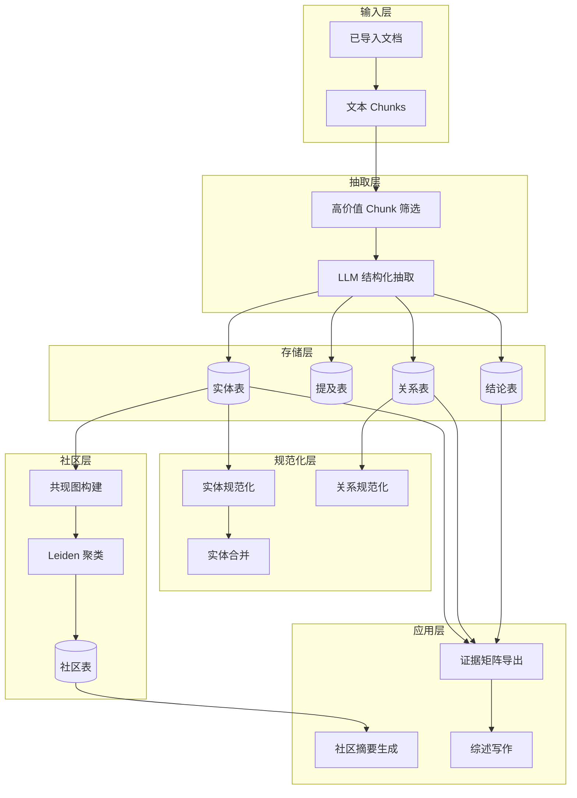
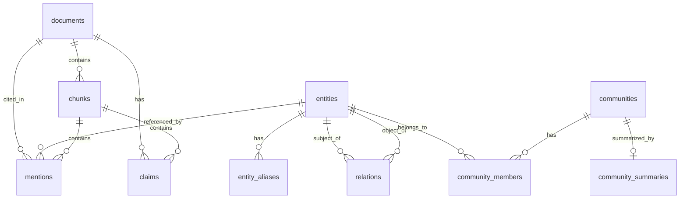
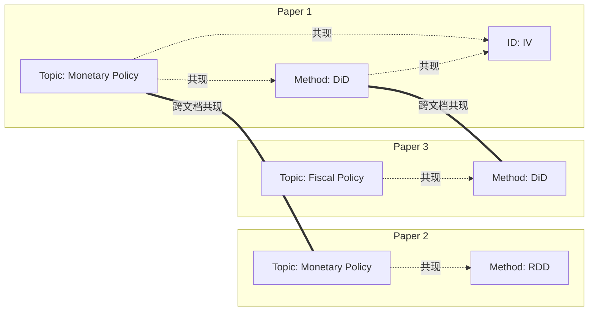

# 知识图谱系统 (GraphRAG)

本文档详细描述 Paperlib MCP 的知识图谱构建、社区发现和结构化综述生成系统。

## 系统概览

GraphRAG 系统将学术论文转化为结构化知识图谱，支持：
- **实体抽取**: 研究主题、方法、变量、数据源等
- **关系抽取**: Paper-Entity 关系和 Entity-Entity 关系
- **结论抽取**: 研究发现、效应方向、适用条件
- **社区发现**: 基于共现图的主题聚类
- **综述生成**: 自动化文献综述生成



---

## 1. 数据模型

### 1.1 实体类型 (EntityType)

```python
class EntityType(str, Enum):
    Paper = "Paper"                        # 论文本身
    Topic = "Topic"                        # 研究主题
    MeasureProxy = "MeasureProxy"          # 度量/代理变量
    IdentificationStrategy = "IdentificationStrategy"  # 识别策略
    Method = "Method"                      # 研究方法
    Setting = "Setting"                    # 研究场景
    DataSource = "DataSource"              # 数据来源
    Mechanism = "Mechanism"                # 机制
    LimitationGap = "LimitationGap"        # 局限性/研究空白
```

### 1.2 关系谓词 (Predicate)

```python
class Predicate(str, Enum):
    PAPER_HAS_TOPIC = "PAPER_HAS_TOPIC"
    PAPER_USES_MEASURE = "PAPER_USES_MEASURE"
    PAPER_IDENTIFIES_WITH = "PAPER_IDENTIFIES_WITH"
    PAPER_USES_METHOD = "PAPER_USES_METHOD"
    PAPER_IN_SETTING = "PAPER_IN_SETTING"
    PAPER_USES_DATA = "PAPER_USES_DATA"
    PAPER_PROPOSES_MECHANISM = "PAPER_PROPOSES_MECHANISM"
    PAPER_NOTES_LIMITATION = "PAPER_NOTES_LIMITATION"
    CLAIM_SUPPORTS = "CLAIM_SUPPORTS"
    CLAIM_CONTRADICTS = "CLAIM_CONTRADICTS"
```

### 1.3 结论方向 (ClaimSign)

```python
class ClaimSign(str, Enum):
    POSITIVE = "positive"   # 正向效应
    NEGATIVE = "negative"   # 负向效应
    MIXED = "mixed"         # 混合效应
    NULL = "null"           # 零效应
```

---

## 2. 数据库表结构

### 2.1 核心表



### 2.2 实体表 (entities)

```sql
CREATE TABLE entities (
    entity_id       BIGSERIAL PRIMARY KEY,
    type            TEXT NOT NULL,          -- EntityType 枚举值
    canonical_name  TEXT NOT NULL,          -- 规范名称
    canonical_key   TEXT NOT NULL,          -- 规范键（用于去重）
    normalized      JSONB DEFAULT '{}',     -- 归一化元数据
    confidence      FLOAT DEFAULT 1.0,
    is_locked       BOOLEAN DEFAULT FALSE,  -- 锁定防止自动合并
    created_at      TIMESTAMPTZ DEFAULT now(),
    UNIQUE (type, canonical_key)
);
```

### 2.3 提及表 (mentions)

```sql
CREATE TABLE mentions (
    mention_id      BIGSERIAL PRIMARY KEY,
    entity_id       BIGINT REFERENCES entities(entity_id),
    doc_id          TEXT REFERENCES documents(doc_id),
    chunk_id        BIGINT REFERENCES chunks(chunk_id),
    page_start      INT,
    page_end        INT,
    span_start      INT,              -- 在 chunk 中的位置
    span_end        INT,
    quote           TEXT,             -- 原文引用
    confidence      FLOAT DEFAULT 1.0
);
```

### 2.4 关系表 (relations)

```sql
CREATE TABLE relations (
    rel_id          BIGSERIAL PRIMARY KEY,
    subj_entity_id  BIGINT REFERENCES entities(entity_id),
    predicate       TEXT NOT NULL,
    obj_entity_id   BIGINT REFERENCES entities(entity_id),
    qualifiers      JSONB DEFAULT '{}',     -- 额外限定条件
    confidence      FLOAT DEFAULT 1.0,
    evidence        JSONB DEFAULT '{}',     -- {doc_id, chunk_id, quote}
    relation_hash   TEXT UNIQUE             -- 去重哈希
);
```

### 2.5 结论表 (claims)

```sql
CREATE TABLE claims (
    claim_id        BIGSERIAL PRIMARY KEY,
    doc_id          TEXT REFERENCES documents(doc_id),
    chunk_id        BIGINT REFERENCES chunks(chunk_id),
    claim_text      TEXT NOT NULL,          -- 结论原文
    sign            TEXT,                   -- positive/negative/mixed/null
    effect_size_text TEXT,                  -- 效应量描述
    conditions      JSONB DEFAULT '{}',     -- 适用条件
    confidence      FLOAT DEFAULT 1.0,
    evidence        JSONB DEFAULT '{}',
    claim_hash      TEXT UNIQUE
);
```

### 2.6 社区表 (communities)

```sql
CREATE TABLE communities (
    comm_id         BIGSERIAL PRIMARY KEY,
    level           TEXT NOT NULL DEFAULT 'macro',  -- macro/micro
    method          TEXT NOT NULL DEFAULT 'leiden',
    params          JSONB DEFAULT '{}',     -- {resolution, min_df, ...}
    created_at      TIMESTAMPTZ DEFAULT now()
);

CREATE TABLE community_members (
    id              BIGSERIAL PRIMARY KEY,
    comm_id         BIGINT REFERENCES communities(comm_id),
    entity_id       BIGINT REFERENCES entities(entity_id),
    role            TEXT DEFAULT 'member',  -- member/hub
    weight          FLOAT DEFAULT 1.0
);

CREATE TABLE community_summaries (
    id              BIGSERIAL PRIMARY KEY,
    comm_id         BIGINT UNIQUE REFERENCES communities(comm_id),
    summary_json    JSONB NOT NULL,         -- 结构化摘要
    updated_at      TIMESTAMPTZ DEFAULT now()
);
```

---

## 3. 图谱抽取 (`graph_extract.py`)

### 3.1 高价值 Chunk 筛选

```python
HIGH_VALUE_KEYWORDS = [
    "result", "finding", "evidence", "show", "demonstrate",
    "significant", "effect", "impact", "influence", "coefficient",
    "identification", "strategy", "instrument", "regression",
    "measurement", "proxy", "data", "limitation", "mechanism",
    "instrumental variable", "iv", "fixed effect", "causal",
]

def _select_high_value_chunks_internal(
    doc_id: str | None = None,
    max_chunks: int = 60,
    keyword_mode: str = "default",
) -> list[HighValueChunk]:
    """筛选包含关键方法/结果内容的 chunks"""
    keywords = HIGH_VALUE_KEYWORDS if keyword_mode == "default" else HIGH_VALUE_KEYWORDS_STRICT
    
    # SQL 查询：检查 chunk 是否包含关键词
    # 返回每个 chunk 的匹配原因
```

### 3.2 LLM 结构化抽取

**系统提示**:
```python
EXTRACTION_SYSTEM_PROMPT = """You are an expert at extracting structured information from academic papers.
You extract: entities, mentions, relations, and claims.

Entity types: Topic, MeasureProxy, IdentificationStrategy, Method, Setting, DataSource, Mechanism, LimitationGap

Relation predicates: PAPER_HAS_TOPIC, PAPER_USES_MEASURE, PAPER_IDENTIFIES_WITH, ...

You MUST output valid JSON following the exact schema provided.
Every entity, relation, and claim MUST have an evidence quote from the original text."""
```

**用户提示模板**:
```python
EXTRACTION_USER_PROMPT_TEMPLATE = """Analyze this excerpt from an academic paper:

## Text to analyze:
{chunk_text}

## Required JSON Schema:
{
  "entities": [
    {
      "temp_id": "e1",
      "type": "Topic|MeasureProxy|...",
      "name": "entity name",
      "confidence": 0.0-1.0
    }
  ],
  "mentions": [
    {
      "entity_temp_id": "e1",
      "quote": "exact quote from text",
      "confidence": 0.0-1.0
    }
  ],
  "relations": [...],
  "claims": [...]
}

## Guidelines:
1. SELECTIVITY IS KEY: Extract ONLY the most significant entities (max 10 per chunk)
2. EVIDENCE QUOTES: Keep quotes minimal (max 15 words)
3. For claims: Include complete finding with direction (positive/negative/mixed/null)
"""
```

### 3.3 异步并行抽取

```python
async def extract_graph_v1_run(
    doc_id: str | None = None,
    chunk_ids: list[int] | None = None,
    mode: str = "high_value_only",
    max_chunks: int = 60,
    llm_model: str | None = None,
    min_confidence: float = 0.8,
    concurrency: int = 60,
) -> ExtractGraphOut:
    """并行抽取图谱要素"""
    
    # 1. 筛选高价值 chunks
    chunks = _select_high_value_chunks_internal(doc_id, max_chunks)
    
    # 2. 并发调用 LLM
    sem = asyncio.Semaphore(concurrency)
    
    async def process_single_chunk(chunk):
        async with sem:
            result = await acall_llm_extract(chunk["text"], llm_model)
            return (chunk, result)
    
    tasks = [process_single_chunk(c) for c in chunks]
    results = await asyncio.gather(*tasks)
    
    # 3. 写入数据库
    for chunk, extraction in results:
        # Upsert entities
        # Insert mentions, relations, claims
```

### 3.4 实体规范化

```python
def normalize_alias(text: str) -> str:
    """归一化别名：小写、去标点、空白归一"""
    text = text.lower()
    text = re.sub(r'[^\w\s]', '', text)
    text = re.sub(r'\s+', ' ', text)
    return text.strip()

def generate_canonical_key(
    entity_type: EntityType, 
    name: str, 
    normalized: dict | None = None
) -> str:
    """生成 canonical_key 用于去重"""
    # Topic: 直接使用规范化名称
    # MeasureProxy: 使用名称 + normalized 属性
    # Method: 使用名称
    alias_norm = normalize_alias(name)
    return alias_norm
```

### 3.5 去重机制

```python
def compute_relation_hash(subj_id, predicate, obj_id, quote) -> str:
    """计算关系哈希，用于去重"""
    content = f"{subj_id}|{predicate}|{obj_id}|{quote}"
    return hashlib.sha256(content.encode()).hexdigest()[:32]

def compute_claim_hash(doc_id, chunk_id, claim_text) -> str:
    """计算 claim 哈希，用于去重"""
    content = f"{doc_id}|{chunk_id}|{claim_text}"
    return hashlib.sha256(content.encode()).hexdigest()[:32]
```

---

## 4. 实体规范化 (`graph_canonicalize.py`)

### 4.1 自动合并

```python
def canonicalize_entities_v1(
    types: list[EntityType] = [Topic, MeasureProxy, IdentificationStrategy, Method],
    suggest_only: bool = False,
    max_groups: int = 5000,
) -> CanonicalizeEntitiesOut:
    """规范化并合并重复实体"""
    
    # 1. 按 canonical_key 分组
    groups = {}
    for entity in entities:
        key = entity.canonical_key
        if key not in groups:
            groups[key] = []
        groups[key].append(entity)
    
    # 2. 合并同一组内的实体
    for key, entities in groups.items():
        if len(entities) > 1:
            winner = entities[0]  # 保留第一个
            for loser in entities[1:]:
                if not loser.is_locked:
                    merge_entity(loser.id, winner.id)
```

### 4.2 手动合并

```python
def merge_entities(
    from_entity_id: int,
    to_entity_id: int,
    reason: str,
) -> MergeEntitiesOut:
    """手动合并两个实体"""
    
    # 1. 迁移所有 mentions
    UPDATE mentions SET entity_id = to_entity_id WHERE entity_id = from_entity_id
    
    # 2. 迁移所有 relations
    UPDATE relations SET subj_entity_id = to_entity_id WHERE subj_entity_id = from_entity_id
    UPDATE relations SET obj_entity_id = to_entity_id WHERE obj_entity_id = from_entity_id
    
    # 3. 记录合并日志
    INSERT INTO entity_merge_log (from_entity_id, to_entity_id, reason)
    
    # 4. 删除源实体
    DELETE FROM entities WHERE entity_id = from_entity_id
```

### 4.3 锁定保护

```python
def lock_entity(entity_id: int, is_locked: bool = True):
    """锁定/解锁实体，防止自动合并"""
    UPDATE entities SET is_locked = is_locked WHERE entity_id = entity_id
```

---

## 5. 社区发现 (`graph_community.py`)

### 5.1 共现图构建



**边权重计算**:

```python
EDGE_TYPE_WEIGHTS = {
    (Topic, Method): 2.0,
    (Topic, MeasureProxy): 2.0,
    (Topic, IdentificationStrategy): 1.5,
    (MeasureProxy, IdentificationStrategy): 1.5,
    (Topic, Setting): 1.0,
    (IdentificationStrategy, Setting): 1.0,
}

def get_edge_weight(type1: str, type2: str) -> float:
    """获取两种实体类型之间的边权重"""
    pair = tuple(sorted([type1, type2]))
    return EDGE_TYPE_WEIGHTS.get(pair, 1.0)
```

### 5.2 Leiden 聚类

```python
def build_communities_v1(
    level: str = "macro",     # macro 或 micro
    min_df: int = 3,          # 节点最小文档频率
    resolution: float = 1.0,  # Leiden 分辨率
    max_nodes: int = 20000,
    rebuild: bool = False,
) -> BuildCommunitiesOut:
    """构建主题社区"""
    
    # 1. 筛选高频实体
    entities = SELECT entity_id, type FROM entities 
               WHERE df >= min_df
    
    # 2. 构建共现图
    edges = []
    for paper in papers:
        paper_entities = get_entities_for_paper(paper)
        for e1, e2 in combinations(paper_entities, 2):
            weight = get_edge_weight(e1.type, e2.type)
            edges.append((e1.id, e2.id, weight))
    
    # 3. igraph 图构建
    g = igraph.Graph()
    g.add_vertices(entity_ids)
    g.add_edges(edges)
    g.es['weight'] = weights
    
    # 4. Leiden 聚类
    partition = g.community_leiden(
        weights='weight',
        resolution=resolution,
        objective_function='modularity'
    )
    
    # 5. 写入数据库
    for comm_idx, members in enumerate(partition):
        INSERT INTO communities (level, method, params)
        for entity_id in members:
            INSERT INTO community_members (comm_id, entity_id, weight)
```

**参数说明**:

| 参数 | 默认值 | 说明 |
|------|--------|------|
| `level` | "macro" | 社区层级 |
| `min_df` | 3 | 最小文档频率（过滤噪声） |
| `resolution` | 1.0 | 分辨率（越高社区越小） |
| `max_nodes` | 20000 | 最大节点数限制 |

---

## 6. 社区摘要生成 (`graph_summarize.py`)

### 6.1 摘要结构

```json
{
  "scope": {
    "description": "Brief description of what this research community studies",
    "key_topics": ["topic1", "topic2"],
    "evidence": [{"doc_id": "...", "page_start": N, "page_end": N}]
  },
  "measures": {
    "description": "Common outcome variables and proxies used",
    "key_measures": ["measure1", "measure2"],
    "evidence": [...]
  },
  "identification": {
    "description": "Identification strategies employed",
    "key_strategies": ["strategy1", "strategy2"],
    "evidence": [...]
  },
  "consensus": {
    "description": "Main findings where literature agrees",
    "key_findings": ["finding1", "finding2"],
    "evidence": [...]
  },
  "debates": {
    "description": "Areas of disagreement or conflicting results",
    "key_debates": ["debate1", "debate2"],
    "evidence": [...]
  },
  "gaps": {
    "description": "Identified research gaps and future directions",
    "key_gaps": ["gap1", "gap2"],
    "evidence": [...]
  },
  "entry_points": {
    "description": "Suggested papers to start reading",
    "recommended_papers": [{"doc_id": "...", "title": "...", "reason": "..."}]
  },
  "coverage": "high|medium|low",
  "needs_human_review": true|false
}
```

### 6.2 摘要生成流程

```python
async def summarize_community_v1_run(
    comm_id: int,
    pack_id: int | None = None,
    llm_model: str | None = None,
    max_chunks: int = 100,
) -> SummarizeCommunityOut:
    """生成社区结构化摘要"""
    
    # 1. 获取社区 top entities
    top_entities = query_all("""
        SELECT e.canonical_name, e.type, cm.weight
        FROM community_members cm
        JOIN entities e ON e.entity_id = cm.entity_id
        WHERE cm.comm_id = %s
        ORDER BY cm.weight DESC
        LIMIT 20
    """, (comm_id,))
    
    # 2. 构建/获取证据包
    if not pack_id:
        pack_id = build_community_evidence_pack(comm_id, max_chunks)
    
    # 3. 格式化证据
    evidence_text = format_evidence_for_prompt(evidence_items)
    
    # 4. 调用 LLM 生成摘要
    summary_json = await acall_llm_summarize(
        top_entities=format_entities(top_entities),
        evidence_text=evidence_text,
        llm_model=llm_model
    )
    
    # 5. 保存摘要
    INSERT INTO community_summaries (comm_id, summary_json)
    
    # 6. 生成 Markdown
    markdown = summary_to_markdown(summary_json, comm_id)
    
    return SummarizeCommunityOut(
        comm_id=comm_id,
        summary_json=summary_json,
        markdown=markdown
    )
```

---

## 7. Claim 分组 (`graph_claim_grouping.py` + `graph_v12.py`)

### 7.1 分组键构成

```
group_key = (
    primary_topic_key,    # 主题
    outcome_family,       # 因变量家族
    treatment_family,     # 自变量家族
    sign,                 # 效应方向
    id_family,           # 识别策略
    setting_bin          # 研究情境
)
```

### 7.2 Claim Features 分配

```python
def assign_claim_features_v1_2(scope: str = "all"):
    """为 claims 分配预计算特征"""
    
    # 1. 加载 taxonomy 词表规则
    outcome_rules = load_taxonomy("outcome")
    treatment_rules = load_taxonomy("treatment")
    
    # 2. 匹配每个 claim
    for claim in claims:
        text_norm = normalize_text(claim.claim_text)
        
        # 匹配 outcome family
        outcome_family = match_family(text_norm, outcome_rules)
        
        # 匹配 treatment family
        treatment_family = match_family(text_norm, treatment_rules)
        
        # 选择 primary topic
        primary_topic = select_primary_topic(claim.doc_id)
        
        # 写入 claim_features 表
        INSERT INTO claim_features (
            claim_id, primary_topic_key, outcome_family, 
            treatment_family, sign, id_family, setting_bin
        )
```

### 7.3 TF-IDF + KMeans 拆分

```python
def split_large_claim_groups_v1_2(
    split_threshold: int = 150,
    target_size: int = 120,
):
    """拆分超大 claim groups"""
    
    # 1. 找出超大组
    large_groups = SELECT group_id, COUNT(*) as size 
                   FROM claim_group_members 
                   GROUP BY group_id 
                   HAVING COUNT(*) > split_threshold
    
    for group_id, size in large_groups:
        # 2. 获取组内 claims
        claims = get_group_claims(group_id)
        
        # 3. TF-IDF 向量化
        vectorizer = TfidfVectorizer(
            max_features=500,
            min_df=2,
            max_df=0.9
        )
        tfidf_matrix = vectorizer.fit_transform(claim_texts)
        
        # 4. KMeans 聚类
        n_clusters = ceil(size / target_size)
        kmeans = KMeans(
            n_clusters=n_clusters,
            n_init=10,
            random_state=0
        )
        labels = kmeans.fit_predict(tfidf_matrix)
        
        # 5. 创建子组
        for sub_idx in range(n_clusters):
            sub_claims = claims[labels == sub_idx]
            create_subgroup(group_id, sub_idx, sub_claims)
```

---

## 8. 证据矩阵导出

### 8.1 Paper Matrix

```python
def export_evidence_matrix_v1(comm_id: int) -> dict:
    """导出论文级证据矩阵"""
    return {
        "paper_matrix": [
            {
                "doc_id": "...",
                "title": "...",
                "authors": "...",
                "year": 2024,
                "topics": ["topic1", "topic2"],
                "methods": ["method1"],
                "identification": ["iv", "did"],
                "claim_count": 5
            },
            ...
        ]
    }
```

### 8.2 Claim Matrix (Grouped)

```python
def export_claim_matrix_grouped_v1_2(
    comm_id: int | None = None,
    top_k_per_group: int = 10,
) -> dict:
    """导出分组 claim 矩阵"""
    return {
        "groups": [
            {
                "group_id": 1,
                "group_key": "monetary_policy|returns|shock|positive|iv|us",
                "size": 25,
                "claims": [
                    {
                        "claim_id": 123,
                        "doc_id": "...",
                        "claim_text": "We find that monetary policy shocks significantly affect stock returns...",
                        "sign": "positive",
                        "confidence": 0.95,
                        "page_start": 15
                    },
                    ...
                ]
            },
            ...
        ]
    }
```

---

## 9. 工具速查表

| 工具名 | 功能 | 关键参数 |
|--------|------|---------|
| `graph_health_check` | 检查图谱健康状态 | `include_counts` |
| `select_high_value_chunks` | 筛选高价值 chunks | `doc_id`, `max_chunks` |
| `extract_graph_v1` | 抽取图谱要素 | `doc_id`, `concurrency` |
| `extract_graph_missing` | 补抽未处理文档 | `limit_docs` |
| `canonicalize_entities_v1` | 实体规范化合并 | `types`, `suggest_only` |
| `merge_entities` | 手动合并实体 | `from_id`, `to_id` |
| `lock_entity` | 锁定实体 | `entity_id` |
| `build_communities_v1` | 构建社区 | `level`, `resolution` |
| `summarize_community_v1` | 生成社区摘要 | `comm_id`, `style` |
| `summarize_all_communities` | 批量生成摘要 | `level`, `concurrency` |
| `export_evidence_matrix_v1` | 导出证据矩阵 | `comm_id`, `format` |
| `assign_claim_features_v1_2` | 分配 claim 特征 | `scope` |
| `build_claim_groups_v1_2` | 构建 claim 分组 | `scope` |
| `split_large_claim_groups_v1_2` | 拆分大组 | `split_threshold` |
| `export_claim_matrix_grouped_v1_2` | 导出分组矩阵 | `top_k_per_group` |

---

## 10. 典型工作流

### 10.1 完整知识图谱构建

```python
# 1. 健康检查
graph_health_check()

# 2. 批量抽取（已导入文档）
extract_graph_missing(limit_docs=50)

# 3. 实体规范化
canonicalize_entities_v1(suggest_only=False)

# 4. 构建社区
build_communities_v1(level="macro", resolution=1.0)

# 5. 生成社区摘要
summarize_all_communities(level="macro", concurrency=5)

# 6. 导出证据矩阵
export_evidence_matrix_v1(comm_id=1)
```

### 10.2 Claim 分组与分析

```python
# 1. 分配 claim 特征
assign_claim_features_v1_2()

# 2. 构建分组
build_claim_groups_v1_2()

# 3. 拆分大组
split_large_claim_groups_v1_2(split_threshold=150)

# 4. 导出分析
export_claim_matrix_grouped_v1_2(top_k_per_group=10)
```
