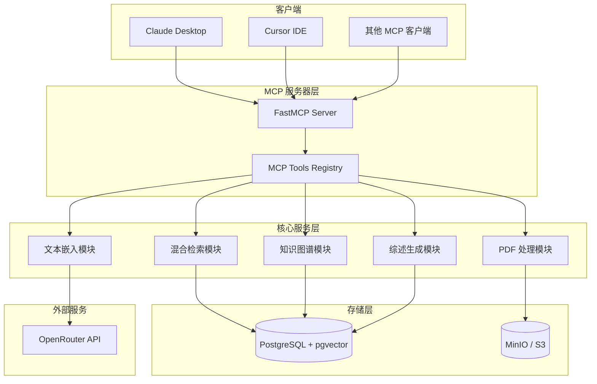
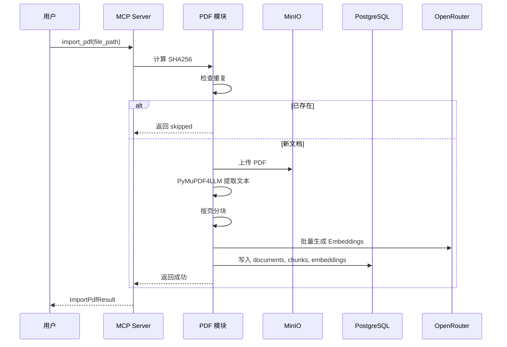
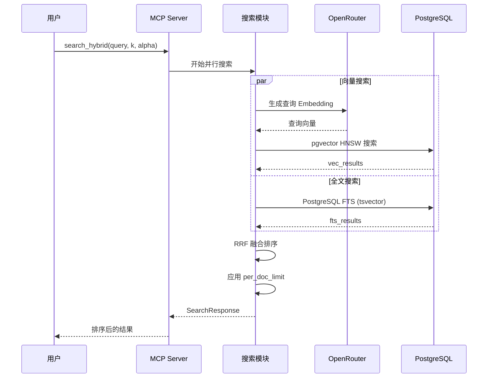
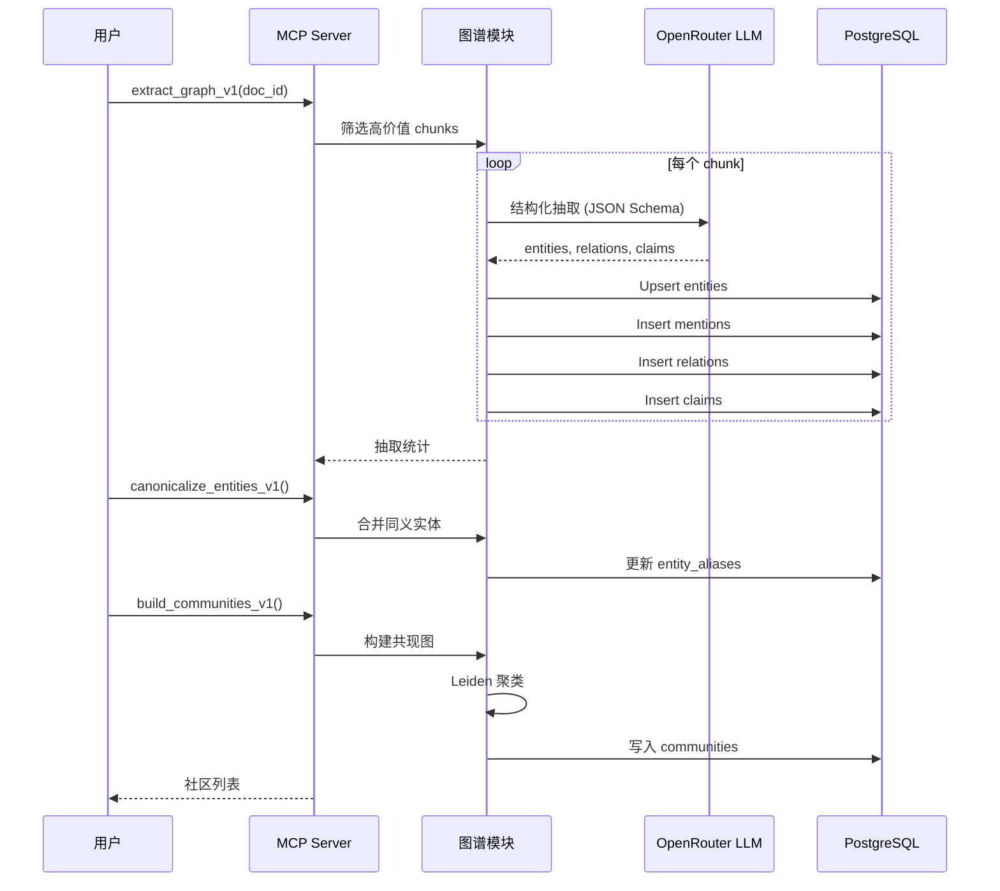

# Paperlib MCP 系统架构

本文档详细描述 Paperlib MCP 系统的整体架构、核心组件及其交互方式。

## 系统概述

Paperlib MCP 是一个基于 Model Context Protocol (MCP) 的学术文献管理系统，提供 PDF 导入、混合检索、知识图谱构建和文献综述生成等功能。



## 技术栈

| 组件 | 技术选型 | 版本要求 | 说明 |
|------|---------|---------|------|
| **MCP 协议** | FastMCP | - | MCP 协议实现框架 |
| **配置管理** | Pydantic Settings | v2.x | 环境变量 + .env 配置 |
| **数据库** | PostgreSQL | 16+ | 主数据存储 |
| **向量扩展** | pgvector | 0.5+ | 向量相似度搜索 |
| **对象存储** | MinIO (S3 兼容) | - | PDF 文件存储 |
| **PDF 处理** | PyMuPDF4LLM | - | PDF 文本提取 (Markdown) |
| **文本嵌入** | OpenRouter API | - | text-embedding-3-small |
| **HTTP 客户端** | httpx | - | 异步 HTTP 请求 |
| **S3 客户端** | boto3 | - | MinIO/S3 操作 |
| **图聚类** | igraph + Leiden | - | 社区发现算法 |

---

## 核心模块详解

### 1. 服务器入口 (`server.py`)

MCP 服务器的入口点，负责初始化 FastMCP 实例并注册所有工具模块。

```python
# 创建 MCP 服务器实例
mcp = FastMCP(
    "Paper Library MCP",
    instructions="文献管理与检索 MCP 服务器"
)

# 注册工具模块（按功能分组）
register_health_tools(mcp)      # 健康检查
register_import_tools(mcp)      # PDF 导入
register_search_tools(mcp)      # 混合检索
register_fetch_tools(mcp)       # 数据获取
register_writing_tools(mcp)     # 综述写作

# M2 GraphRAG 工具
register_graph_extract_tools(mcp)     # 图谱抽取
register_graph_canonicalize_tools(mcp) # 实体规范化
register_graph_community_tools(mcp)   # 社区构建
register_graph_summarize_tools(mcp)   # 摘要生成
register_graph_maintenance_tools(mcp) # 维护工具

# M3 Review 工具
register_review_tools(mcp)

# M4 Canonicalization & Grouping 工具
register_graph_relation_canonicalize_tools(mcp)
register_graph_claim_grouping_tools(mcp)
register_graph_v12_tools(mcp)
```

### 2. 配置管理 (`settings.py` + `config.py`)

#### 环境配置 (`settings.py`)

使用 Pydantic Settings 从环境变量和 `.env` 文件读取配置：

```python
class Settings(BaseSettings):
    # PostgreSQL 配置
    postgres_user: str = "paper"
    postgres_password: str = "paper"
    postgres_db: str = "paperlib"
    postgres_host: str = "localhost"
    postgres_port: int = 5432
    
    # MinIO/S3 配置
    minio_root_user: str = "minio"
    minio_root_password: str = "minio123"
    minio_bucket: str = "papers"
    s3_endpoint: str = "http://localhost:9000"
    
    # OpenRouter 配置
    openrouter_api_key: str = ""
    openrouter_base_url: str = "https://openrouter.ai/api/v1"
    embedding_model: str = "openai/text-embedding-3-small"
    
    # LLM 模型配置
    llm_model: str = "openai/gpt-4o-mini"
    embedding_batch_size: int = 64
```

#### 参数配置 (`config.py`)

支持 YAML 文件 + 环境变量的多层配置：

```python
DEFAULTS = {
    "CLAIM_SPLIT_THRESHOLD": 150,    # 触发拆分的组大小阈值
    "CLAIM_TARGET_SIZE": 120,        # 拆分后目标组大小
    "CLAIM_MAX_PER_DOC": 100,        # 每篇文档最大 claim 数
    "TOPIC_MIN_DF": 3,               # topic 最小文档频率
}

# 优先级: 环境变量 > config.yaml > 默认值
```

### 3. 数据库层 (`db.py`)

封装 PostgreSQL 操作，使用 psycopg3 + dict_row：

```python
def get_connection() -> psycopg.Connection:
    """获取数据库连接"""
    settings = get_settings()
    return psycopg.connect(settings.pg_dsn, row_factory=dict_row)

@contextmanager
def get_db():
    """数据库连接上下文管理器"""
    conn = get_connection()
    try:
        yield conn
        conn.commit()
    except Exception:
        conn.rollback()
        raise
    finally:
        conn.close()
```

### 4. 对象存储层 (`storage.py`)

封装 S3/MinIO 操作，使用 boto3：

```python
def get_s3_client():
    """获取 S3 客户端（兼容 MinIO）"""
    settings = get_settings()
    return boto3.client(
        "s3",
        endpoint_url=settings.s3_endpoint,
        aws_access_key_id=settings.s3_access_key,
        aws_secret_access_key=settings.s3_secret_key,
        config=Config(signature_version="s3v4"),
        region_name="us-east-1",
    )
```

---

## 数据流程

### PDF 导入流程



### 混合检索流程



### 知识图谱构建流程



---

## 工具模块概览

| 模块 | 文件 | 工具数 | 说明 |
|------|------|--------|------|
| 健康检查 | `health.py` | 1 | 系统状态检查 |
| PDF 导入 | `import_pdf.py` | 2 | PDF 导入、状态查询 |
| 搜索 | `search.py` | 4 | 混合/向量/全文搜索 |
| 获取 | `fetch.py` | 7 | 文档/chunk CRUD |
| 写作 | `writing.py` | 5 | 证据包、综述生成 |
| 图谱抽取 | `graph_extract.py` | 4 | 图谱抽取、健康检查 |
| 实体规范化 | `graph_canonicalize.py` | 3 | 实体合并、锁定 |
| 社区构建 | `graph_community.py` | 2 | Leiden 聚类 |
| 摘要生成 | `graph_summarize.py` | 3 | 社区摘要、矩阵导出 |
| 维护 | `graph_maintenance.py` | 3 | 状态、清理 |
| 关系规范化 | `graph_relation_canonicalize.py` | 2 | 关系合并 |
| Claim 分组 | `graph_claim_grouping.py` | 2 | Claim 聚类 |
| v1.2 增强 | `graph_v12.py` | 5 | 词表、特征分配 |
| Review | `review.py` | 5 | 大纲、章节生成 |

**总计**: 48+ MCP 工具

---

## 部署架构

### Docker Compose 架构

```yaml
services:
  postgres:
    image: pgvector/pgvector:pg16
    ports:
      - "5432:5432"
    volumes:
      - ./pgdata:/var/lib/postgresql/data
      - ./initdb:/docker-entrypoint-initdb.d
      
  minio:
    image: minio/minio
    ports:
      - "9000:9000"   # API
      - "9001:9001"   # Console
    volumes:
      - ./minio-data:/data
      
  adminer:
    image: adminer
    ports:
      - "8080:8080"
```

### 运行模式

1. **STDIO 模式** (推荐)
   ```bash
   uv run python -m paperlib_mcp.server
   ```

2. **FastMCP CLI**
   ```bash
   uv run fastmcp run src/paperlib_mcp/server.py:mcp
   ```

3. **Cursor/Claude Desktop 配置**
   ```json
   {
     "mcpServers": {
       "paperlib": {
         "command": "uv",
         "args": ["--directory", "/path/to/paperlib_mcp", "run", "python", "-m", "paperlib_mcp.server"]
       }
     }
   }
   ```

---

## 扩展性设计

### 模块化工具注册

每个工具模块通过 `register_*_tools(mcp)` 函数注册，支持：
- 独立开发和测试
- 按需加载
- 版本化升级（如 v1 → v1.2）

### 配置热加载

```python
from paperlib_mcp.config import reload
reload()  # 重新加载 config.yaml，清除缓存
```

### 数据库迁移

SQL 迁移脚本按顺序执行：
```
initdb/
├── 001_schema.sql          # 基础表结构
├── 002_m1_migration.sql    # 导入状态、证据包
├── 003_m2_graphrag.sql     # GraphRAG 表
├── 004_m3_review.sql       # Review 表
└── 004_m4_canonicalization.sql  # 规范化表
```

---

## 性能优化

### 索引策略

```sql
-- HNSW 向量索引（余弦相似度）
CREATE INDEX chunk_emb_hnsw_cos 
ON chunk_embeddings USING hnsw (embedding vector_cosine_ops);

-- GIN 全文索引
CREATE INDEX chunks_tsv_gin ON chunks USING GIN (tsv);

-- 业务索引
CREATE INDEX entities_canonical_key_idx ON entities(canonical_key);
CREATE INDEX mentions_entity_idx ON mentions(entity_id);
```

### 异步并行

- Embedding 批量生成：使用 `asyncio.Semaphore` 控制并发
- 图谱抽取：异步并行处理多个 chunks
- 搜索：FTS 和向量搜索并行执行

### 缓存策略

- `@lru_cache` 缓存配置实例
- Topic DF 预计算缓存表
- 社区摘要持久化存储
