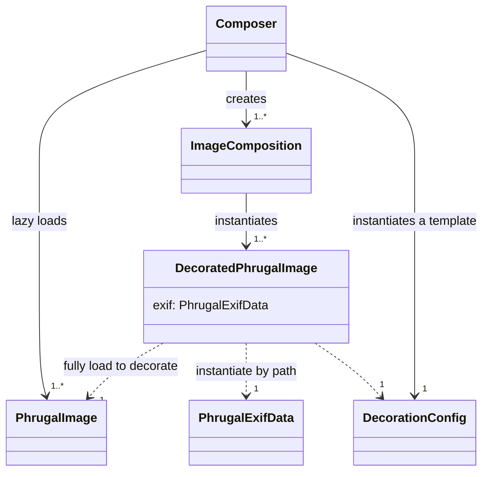

# architecture draft

```mermaid
classDiagram
    class PhrugalImage {
    }

    class DecoratedPhrugalImage {
        exif: PhrugalExifData
    }

    class Composer {
    }

    class ImageComposition {
    }

    class PhrugalExifData {
    }

    class DecorationConfig {
    }

    Composer --> "1..*" ImageComposition: creates
    Composer --> "1..*" PhrugalImage: lazy loads
    ImageComposition --> "1..*" DecoratedPhrugalImage: instantiates
    DecoratedPhrugalImage ..> "1" PhrugalImage: fully load to decorate
    DecoratedPhrugalImage ..> "1" PhrugalExifData: instantiate by path
    DecoratedPhrugalImage ..> "1" DecorationConfig: 
    Composer --> "1" DecorationConfig: instantiates a template
```