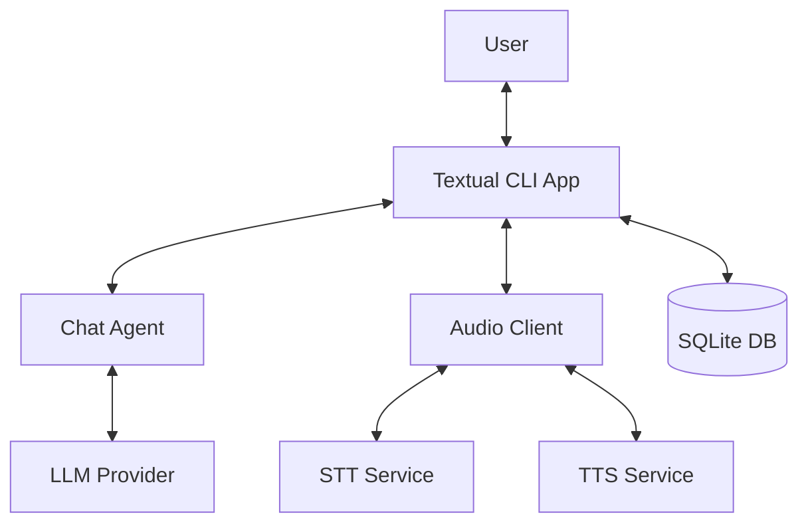

# Architecture

## High-Level Design

## Core Components

### Chat Agent
The `ChatAgent` (`ai_term.cli.core.agent`) handles interaction with the LLM using LangChain. It manages system prompts (including speech optimization) and tool calling.

::: ai_term.cli.core.agent.ChatAgent

### Audio Client
The `AudioClient` (`ai_term.cli.core.audio_client`) communicates with the STT and TTS microservices.

::: ai_term.cli.core.audio_client.AudioClient

### MCP Manager
The `MCPManager` (`ai_term.cli.core.mcp_manager`) orchestrates Model Context Protocol servers, allowing the agent to use external tools.

::: ai_term.cli.core.mcp_manager.MCPManager
