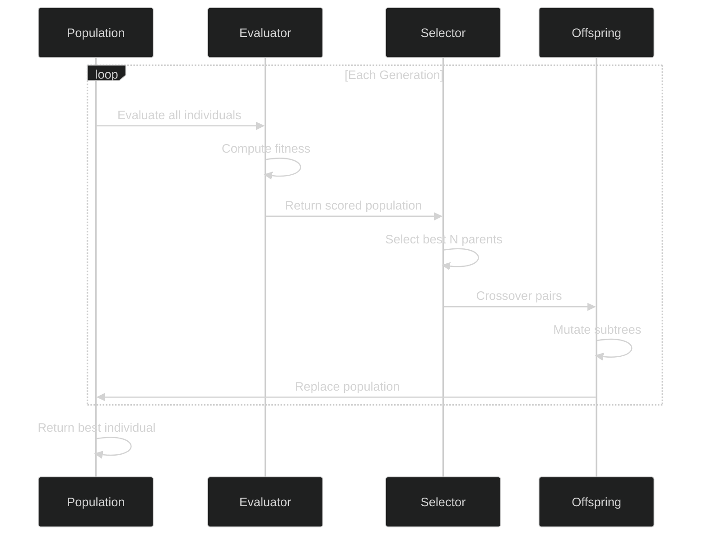
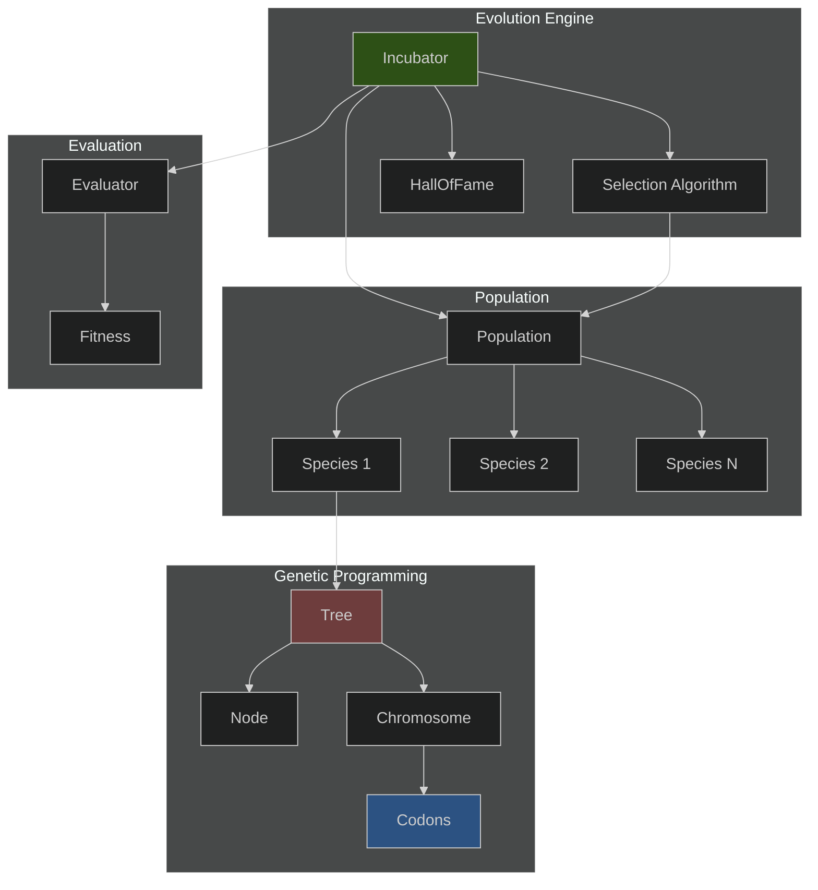

# Nature - Genetic Programming Framework

> **A strongly-typed genetic programming framework for evolving solutions to optimization problems**

## Table of Contents
- [Overview](#overview)
- [Key Features](#key-features)
- [Installation](#installation)
- [Quick Start](#quick-start)
- [Core Concepts](#core-concepts)
  - [Species](#species)
  - [Codons](#codons)
  - [Chromosomes](#chromosomes)
  - [Trees](#trees)
  - [Population](#population)
  - [Evolution](#evolution)
- [Architecture](#architecture)
- [Usage Examples](#usage-examples)
- [Testing](#testing)
- [Development](#development)
- [License](#license)

---

## Overview

Nature is a **hybrid genetic programming and grammar evolution framework** that evolves solutions as **instance methods directly on Python classes**. By combining tree-based genetic programming with a grammar-guided codon system, Nature automatically discovers optimal programs through evolutionary search.

Unlike traditional GP frameworks, Nature lets you define evolvable behavior directly on regular Python classes using the `@evolve` decorator. The framework uses **symbolic type wiring** to control how genetic building blocks (codons) connect, ensuring only valid, type-safe programs are generated.

**What makes Nature unique:**
- Evolve instance methods that easily integrate into large python codebases
- Grammar-based program construction via strongly-typed codon system
- Symbolic wiring (`in_*` and `out`) controls information flow between operations
- Type annotations from method signatures automatically configure the genetic grammar

**Applications:**
- **Symbolic regression** - Discover mathematical formulas from data
- **Function optimization** - Evolve programs that maximize/minimize objectives
- **Program synthesis** - Generate code that satisfies specifications
- **Multi-objective optimization** - Find Pareto-optimal solutions with NSGA-II/III
- **Domain-specific languages** - Evolve programs in custom grammars

---

## Key Features

### What Makes Nature Different

**Symbolic Type Wiring**
- Define grammars through type flow instead of BNF specifications
- `in_*` and `out` parameters create multi-stage type transformations
- Type system **is** the grammar - production rules emerge from type compatibility
- See [Symbolic Wiring Design Pattern](#symbolic-wiring-design-pattern)

**Evolution on Python Classes**
- Add evolvable methods to any class with `@evolve` decorator
- Method signatures automatically configure input/output types
- Genetic programs become instance methods you can call normally

**Grammar Evolution + Genetic Programming Hybrid**
- Strongly-typed codon system (grammar evolution)
- Tree-based program representation (genetic programming)
- Type-safe mutation and crossover operations
- Valid programs guaranteed by construction

### Evolution Engine

**Adaptive Mutation** - Dynamic rates adjust automatically:
- Early stage: High exploration (0.8 mutation rate)
- Late stage: Fine-tuning (0.4 mutation rate)
- Stagnation detection with automatic boost

**Parsimony Pressure** - Bloat control built into fitness:
- Configurable size penalty prevents tree explosion
- Produces simpler, more interpretable solutions
- 67% smaller trees than DEAP on benchmark (20 vs 65 nodes)

**Multi-Objective Optimization** - NSGA-II/III selection:
- Pareto-optimal solution discovery
- Trade-off analysis (accuracy vs simplicity)
- Reference point guidance (NSGA-III)

**Concurrent Evaluation** - Parallel fitness computation:
- Multi-process incubator with worker pools
- Scales to 16+ workers efficiently
- Batch evaluation support

---

## Why Nature Over DEAP?

Nature outperforms DEAP's standard GP implementation through **adaptive evolution mechanisms** and **intelligent bloat control**.

### Benchmark: Symbolic Regression on 5th-Degree Polynomial

**Task**: Fit `f(x) = 0.5x⁵ - 2x⁴ + 3x³ - 4x² + 6x - 2` with 100 noisy training points

| Metric | Nature | DEAP (Standard) | Improvement |
|--------|----------------------|-----------------|-------------|
| **Final MSE** | **23.8** | 39.4 | **40% better** |
| **Tree Size** | **20 nodes** | 65 nodes | **67% smaller** |
| **Tree Depth** | Compact | 11 layers | Simpler structure |
| **Convergence** | Fast, stable | Slow, unstable | Faster exploration |
| **Numerical Stability** | ✅ Stable | ❌ Overflow (10^100+) | Production-ready |

### Nature's Evolved Solution (20 nodes)
```python
# Clean, interpretable expression
-2.1*x^4 + 6.7*x^3 - 3.5*x^2 + 9*x - 2.1
```

### DEAP's Evolved Solution (65 nodes)
```python
# Bloated, uninterpretable expression
add(add(-2.4, add(add(add(add(neg(pow4(x)), pow3(neg(x))),
    add(x, x)), x), add(add(add(add(-2.4, add(add(x, x),
    add(add(x, x), neg(pow4(x))))), add(-2.4, add(x, neg(-3.9)))),
    8.7), ...))), pow5(x))
```

### What Makes Nature Better?

**1. Adaptive Mutation Rate**
- Early exploration (0.8 mutation rate in first 30% of generations)
- Late exploitation (0.4 mutation rate in final 30% of generations)
- Automatic stagnation detection with +0.2 boost when stuck
- DEAP uses fixed mutation probability throughout evolution

**2. Parsimony Pressure**
- Configurable size penalty prevents bloat: `fitness = raw_fitness - (parsimony_coeff * tree_size)`
- Produces simpler, more generalizable solutions
- DEAP requires manual bloat control via depth limits (crude and ineffective)

**3. Superior Numerical Stability**
- Protected operations prevent overflow/underflow
- Graceful handling of edge cases
- DEAP frequently produces fitness values of 10^100+ or `inf` (see benchmark logs)

**4. Production-Ready Evolution**
- Multi-process concurrent evaluation (8-16 workers)
- Type-safe expression trees prevent invalid programs
- Comprehensive error handling and recovery
- Built-in logging and progress tracking

### Running the Benchmark Yourself

```bash
# Nature framework
poetry run python examples/symbolic_regression.py

# DEAP comparison (requires deap package)
python3 examples/deap_symbolic_regression.py
```

---

## Installation

```bash
# Clone the repository
git clone https://github.com/yourusername/nature.git
cd nature

# Install dependencies
pip install -r requirements.txt

# Install in development mode
pip install -e .
```

**Dependencies**:
- Python 3.13+
- NumPy - Numerical computing
- Pymoo - Multi-objective optimization (NSGA-II/III)
- Numba - JIT compilation for performance (optional)
- SQLAlchemy - Database persistence (optional)
- Matplotlib - Visualization (optional)

---

## Quick Start

Here's a minimal example demonstrating **symbolic type wiring** for polynomial regression:

```python
import numpy as np
from nature.species import Species, evolve
from nature.codon import Add, Mul, Float, Int, PowN, Cast
from nature.incubators.incubator import Incubator
from nature.evaluator import Evaluator
from nature.hof import HallOfFame
from nature.selection import TournamentSelection

# Custom types for symbolic wiring
class x_float(float):
    """Custom type for input x values."""
    pass

class y_float(float):
    """Custom type for output y values."""
    pass

# Define evolvable method on vanilla Python class
class Regressor(Species):
    """Evolve polynomial expressions using symbol-based type wiring."""

    @evolve(
        capacity=30,
        codons=[
            # Terminals: coefficients output to 'coeff' symbol
            [
                Float(min=-10, max=10, dec=1, out="coeff"),
                Int(min=0, max=5, out="power"),
            ],
            # Operations: combine coefficients with expressions
            [
                PowN(in_base=x_float, in_power="power", out="term"),  # x^n
                Mul(in_a="coeff", in_b="term", out="factor"),  # coeff * term
                Add(in_a="factor", in_b="factor", out="expr", bias=3),
                Add(in_a="factor", in_b="expr", out="expr", bias=1),
            ],
            # Final cast to output type
            Cast(in_x="expr", out=y_float),
        ],
    )
    def regress(self, x: x_float) -> y_float:
        """
        Evolution builds expression tree using symbolic wiring:

        Symbolic flow:
        1. x_float (input) → PowN → "term" symbol (e.g., x^2)
        2. "coeff" symbol (e.g., -2.5) → Mul with "term" → "factor" symbol (e.g., -2.5 * x^2)
        3. "factor" symbols → Add → "expr" symbol (e.g., factor1 + factor2)
        4. "factor" + "expr" → Add → "expr" (recursive expression building)
        5. "expr" → Cast → y_float (output)

        Example evolved tree: -2.1*x^4 + 6.7*x^3 - 3.5*x^2 + 9*x - 2.1
        """
        raise NotImplementedError()

# Evaluator with parsimony pressure
class RegressionEvaluator(Evaluator):
    """Evaluator for symbolic regression fitness."""

    def __init__(self, X, y, parsimony_coefficient=0.001):
        super().__init__(weights=(1.0,), parsimony_coefficient=parsimony_coefficient)
        self.X = X
        self.y = y

    def on_evaluate(self, individual, i_gen: int) -> float:
        """Evaluate fitness as negative mean squared error."""
        try:
            predictions = np.array([individual.regress(x_float(x)) for x in self.X])
            mse = float(np.mean((predictions - self.y) ** 2))
            return -mse  # Negative MSE (maximize = minimize MSE)
        except (ZeroDivisionError, OverflowError, ValueError, AttributeError):
            return -1e10  # Very bad fitness

# Generate training data
X_train = np.linspace(-2.5, 2.5, 100)
y_true = 0.5 * X_train**5 - 2 * X_train**4 + 3 * X_train**3 - 4 * X_train**2 + 6 * X_train - 2
y_train = y_true + np.random.normal(0, 5.0, 100)  # Add noise

# Create population and evolve
population = Regressor.spawn(n=200)
population.hof = HallOfFame(maxsize=10)

incubator = Incubator(population=population)
evaluator = RegressionEvaluator(X_train, y_train)
selection = TournamentSelection(tournament_size=3)

incubator.incubate(
    evaluator=evaluator,
    selection=selection,
    max_generations=100,
    mutation_rate=0.7,  # Adaptive (will decrease automatically)
    max_workers=16,
)

# Get best solution
best = incubator.population.hof.best
print(f"Best evolved expression (MSE: {-best.fitness.values[0]:.4f})")
print(f"Expression tree:\n{best.trees['regress'].render_func_def(pretty=True)}")
```

**Key Concepts Demonstrated:**
1. **Symbolic Wiring**: `out="term"` and `in_b="term"` create type flow between codons
2. **Multi-stage Wiring**: Symbols flow through stages ("coeff" → "term" → "factor" → "expr")
3. **Custom Types**: `x_float` and `y_float` control input/output wiring
4. **Grammar Evolution**: Codons define production rules for valid programs
5. **Adaptive Mutation**: Rate adjusts automatically during evolution
6. **Parsimony Pressure**: Prevents bloat, produces simpler solutions

---

## Symbolic Wiring Design Pattern

**Critical Design Feature**: Nature's type safety comes from binding `in_*` and `out` parameters in a codon's `__init__()` to the parameters and return value of its `__call__()` method.

### How Wiring Works

The base `Codon` class dynamically discovers `in_*` overrides through `**kwargs` and binds them to `__call__` parameters:

```python
class Mul(Codon):
    """Multiplication codon - wiring happens at instantiation, not in __init__."""

    def __call__(self, a: float, b: float) -> float:
        """Parameters 'a' and 'b' are automatically discovered via inspect."""
        return a * b

# When you instantiate with in_* overrides:
Mul(in_a="coeff", in_b="term", out="factor")

# The base Codon.__init__(**kwargs) does this:
# 1. Inspects Mul.__call__ signature → finds parameters 'a' and 'b'
# 2. Looks for f"in_{param.name}" in kwargs:
#    - Finds kwargs["in_a"] = "coeff" → overrides type for parameter 'a'
#    - Finds kwargs["in_b"] = "term" → overrides type for parameter 'b'
# 3. Uses kwargs["out"] = "factor" → overrides return type
```

**How It Works Internally** (from `Codon.__init__`):

```python
# Line 241-243 in nature/codon.py
elif f"in_{param.name}" in kwargs:
    type_objs = flatten(kwargs[f"in_{param.name}"])
    types = tuple(type_objs)
```

**The pattern:**
- Framework inspects your `__call__` signature to get parameter names
- If you pass `in_<param_name>=type_or_symbol`, it overrides that parameter's type
- If you pass `out=type_or_symbol`, it overrides the return type
- Without overrides, types come from `__call__` signature annotations
- `in_*` are NOT defined parameters - they're dynamically parsed from `**kwargs`

### How to Wire Codons

To use symbolic wiring, pass `in_<param_name>` and `out` to codon constructors:

```python
from nature.codon import Float, Int, PowN, Mul, Add

# Example 1: Terminal with symbolic output
Float(min=-10, max=10, dec=1, out="coeff")
# Float.__call__() has signature: () -> float
# out="coeff" overrides the return type to symbol "coeff"

# Example 2: Operation with symbolic inputs and output
Mul(in_a="coeff", in_b="term", out="factor")
# Mul.__call__(a, b) has signature: (a: float, b: float) -> float
# in_a="coeff" overrides type for parameter 'a' to symbol "coeff"
# in_b="term" overrides type for parameter 'b' to symbol "term"
# out="factor" overrides return type to symbol "factor"

# Example 3: Mixed concrete and symbolic types
PowN(in_base=x_float, in_power="power", out="term")
# PowN.__call__(base, power) has signature: (base: float, power: float) -> float
# in_base=x_float overrides 'base' parameter to concrete type x_float
# in_power="power" overrides 'power' parameter to symbol "power"
# out="term" overrides return type to symbol "term"
```

**The pattern:**
- `in_<param_name>=type_or_symbol` → overrides the type for that __call__ parameter
- `out=type_or_symbol` → overrides the __call__ return type
- Without overrides, types come from __call__ signature annotations

### Example: Building a Polynomial Expression (from symbolic_regression.py)

```python
# Define codons with symbolic wiring in @evolve decorator
@evolve(
    capacity=30,
    codons=[
        # Terminals: coefficients output to 'coeff' symbol
        [
            Float(min=-10, max=10, dec=1, out="coeff"),
            Int(min=0, max=5, out="power"),
        ],
        # Operations: combine coefficients with expressions
        [
            PowN(in_base=x_float, in_power="power", out="term"),  # x^n
            Mul(in_a="coeff", in_b="term", out="factor"),  # coeff * term
            Add(in_a="factor", in_b="factor", out="expr", bias=3),
            Add(in_a="factor", in_b="expr", out="expr", bias=1),
        ],
        # Final cast to output type
        Cast(in_x="expr", out=y_float),
    ],
)
def regress(self, x: x_float) -> y_float:
    raise NotImplementedError()

# How the symbolic wiring works:
# 1. Float(out="coeff") → coefficient values tagged with 'coeff' symbol
# 2. Int(out="power") → exponent values tagged with 'power' symbol
# 3. PowN(in_base=x_float, in_power="power", out="term")
#    - Consumes: x_float (from method input) + "power" symbol
#    - Produces: "term" symbol (e.g., x^2, x^3)
# 4. Mul(in_a="coeff", in_b="term", out="factor")
#    - Consumes: "coeff" symbol + "term" symbol
#    - Produces: "factor" symbol (e.g., 3.5 * x^2)
# 5. Add(in_a="factor", in_b="factor", out="expr", bias=3)
#    - Consumes: two "factor" symbols
#    - Produces: "expr" symbol (e.g., factor1 + factor2)
#    - bias=3: Higher sampling weight (3x more likely than bias=1)
# 6. Add(in_a="factor", in_b="expr", out="expr", bias=1)
#    - Consumes: one "factor" + one "expr" symbol (recursive)
#    - Produces: "expr" symbol (builds longer expressions)
#    - bias=1: Lower sampling weight (allows balanced tree growth)
# 7. Cast(in_x="expr", out=y_float)
#    - Consumes: "expr" symbol
#    - Produces: y_float (output type from method signature)

# Result: Evolution can only build valid polynomial expressions like:
# -2.1*x^4 + 6.7*x^3 - 3.5*x^2 + 9*x - 2.1
```

### Multi-Stage Type Flow

Symbols enable **multi-stage transformations** where intermediate results flow through the computation:

```
Stage 1 (Terminals):
  Float(out="coeff") → produces coefficient values
  Int(out="power") → produces exponent values

Stage 2 (Basic Operations):
  PowN(in_base=x_float, in_power="power", out="term")
    → Consumes x_float input + "power" symbol
    → Produces "term" symbol (e.g., x^2)

Stage 3 (Multiplication):
  Mul(in_a="coeff", in_b="term", out="factor")
    → Consumes "coeff" + "term" symbols
    → Produces "factor" symbol (e.g., 3.5 * x^2)

Stage 4 (Addition):
  Add(in_a="factor", in_b="factor", out="expr", bias=3)
    → Consumes two "factor" symbols
    → Produces "expr" symbol (e.g., factor1 + factor2)

  Add(in_a="factor", in_b="expr", out="expr", bias=1)
    → Consumes "factor" + "expr" symbols
    → Produces "expr" symbol (recursive building)

Stage 5 (Output):
  Cast(in_x="expr", out=y_float)
    → Consumes "expr" symbol
    → Produces y_float (output type)
```

**Result**: The evolved expression is guaranteed to:
- Start with valid inputs (`x_float` from method signature)
- Transform through type-safe stages (`"coeff"` → `"term"` → `"factor"` → `"expr"`)
- End with valid output (`y_float` from method signature)
- Never construct invalid programs (e.g., adding coefficients directly to expressions)

### Why This Matters

**Type Safety Without Static Typing:**
- The framework prevents invalid programs at **construction time**, not runtime
- You can't evolve `Add(x_float, "coeff")` because x_float ≠ "coeff" type
- You can't evolve `Mul("power", "expr")` because Mul expects compatible types

**Grammar Evolution via Types:**
- The type system **is** the grammar
- Production rules emerge from type compatibility
- No separate BNF or grammar specification needed

**Composability:**
- New codons automatically integrate by declaring their `in_*` and `out`
- No manual grammar updates or compatibility matrices
- Framework figures out valid connections through type unification

---

## Core Concepts

### Species

A **Species** represents an evolvable entity - a program or formula that can be evolved through genetic programming. Each Species instance contains genetic material (trees) that define its behavior. 

#### A Note on Organizing & Reusing Codon Lists

The following example uses nested lists of codons for organizational clarity. Later, you can refactor reusable subsets of codons by defining functions that return them. These act as little modules. For example, you could build a Kalman filter modules, which would contain the codons necessary for generating Kalman parameters as well as applying them in the root codon.

```python
from nature.species import Species, evolve
from nature.codon import Add, Mul, Float, Int

class Calculator(Species):
    @evolve(
        capacity=15,      # Target number of nodes in tree
        sigma=3,          # Standard deviation for tree size
        codons=[
            # Terminal codons (random int/float constants)
            [Int(1, 100, out='large_int'), Float(0, 1, out='small_float')] 

            # Non-terminal codons (operators).
            # Add & Mul codons for each specified operand symbol
            [
                [
                    Add(in_a=operand, in_b=operand, out=float),
                    Mul(in_a=operand, in_b=operand, out=float)
                ]
                for operand in (int, 'large_int', 'small_float')
            ],
        ]
    )
    def calculate(self, x: int, y: int) -> float:
        """Method signature defines input/output types for genetic program."""
        raise NotImplementedError()  # Placeholder - evolved tree replaces this

# Create a population of Calculator instances
population = Calculator.spawn(n=100)

# Each individual has evolved behavior
individual = population.instances[0]
result = individual.calculate(10, 20)  # Executes evolved tree
```

**Species Lifecycle**:
1. **Initialize** - Random tree generated from chromosome codons
2. **Evaluate** - Execute tree with test inputs to measure performance
3. **Score** - Compute fitness based on objective function
4. **Select** - Best performers chosen for reproduction (via DEAP selection)
5. **Breed** - Crossover and mutation create new generation
6. **Repeat** - Iterate for N generations until convergence

---

### Codons

**Codons** are the genetic building blocks - the primitive operations that compose into programs. Nature's codon system is strongly-typed, ensuring that only valid programs are constructed.

**Codon Categories**:

1. **Arithmetic Operations**
   - `Add(a, b)` - Addition
   - `Sub(a, b)` - Subtraction
   - `Mul(a, b)` - Multiplication
   - `Div(a, b)` - Protected division (returns 0 on divide-by-zero)
   - `Pow(a, b)` - Exponentiation
   - `Neg(a)` - Negation

2. **Mathematical Functions**
   - `Abs(x)` - Absolute value
   - `Sqrt(x)` - Square root (protected)
   - `Log(x)` - Natural logarithm (protected)
   - `Exp(x)` - Exponential
   - `Sin(x)`, `Cos(x)`, `Tan(x)` - Trigonometric functions

3. **Comparison Operations**
   - `Gt(a, b)` - Greater than
   - `Lt(a, b)` - Less than
   - `Gte(a, b)` - Greater than or equal
   - `Lte(a, b)` - Less than or equal
   - `Eq(a, b)` - Equality

4. **Logic Operations**
   - `And(a, b)` - Logical AND
   - `Or(a, b)` - Logical OR
   - `Not(a)` - Logical NOT
   - `IfThenElse(cond, if_true, if_false)` - Conditional

5. **Terminals**
   - `Int(min, max)` - Integer constant in range
   - `Float(min, max)` - Float constant in range
   - `Const(value)` - Fixed constant

**Example Tree**:
```python
# Tree structure:
Add(
    Mul(x, Float(2.5)),
    Sub(y, Float(1.0))
)
# Evaluates to: (x * 2.5) + (y - 1.0)
```

**Type Safety**: Codons declare input/output types, and the framework ensures only compatible codons are connected. This prevents invalid programs like `Add("string", 5)`.

---

### Chromosomes

A **Chromosome** is a blueprint that defines the genetic possibilities for a method. It specifies:
- Input types from method signature
- Output type from method signature
- Available codons (operators and terminals)
- Capacity constraints (target tree size)

Chromosomes are created automatically by the `@evolve` decorator based on type annotations:

```python
@evolve(
    capacity=20,
    sigma=5,
    codons=[
        [Add(), Mul(), Sub()],  # Layer 0: operators
        [Float(-5, 5)]          # Layer 1: terminals
    ]
)
def compute(self, a: float, b: float, c: float) -> float:
    pass

# Chromosome infers:
# - inputs: [float, float, float] (from parameters a, b, c)
# - output: float (from return type)
# - capacity: 20 nodes target
```

---

### Trees

A **Tree** is the genetic program itself - the executable structure that represents a solution. Trees are composed of:
- **Nodes** - Individual codon instances at specific positions
- **Structure** - Parent-child relationships forming expression tree
- **Execution** - Depth-first evaluation producing output

```python
# Tree visualization
#        Add
#       /   \
#     Mul    Sub
#    /  \   /  \
#   x   2  y   1

# Equivalent expression: (x * 2) + (y - 1)
```

**Tree Operations**:
- **Build** - Construct random tree from chromosome
- **Execute** - Evaluate tree with input values
- **Mutate** - Replace random subtree with new random subtree
- **Crossover** - Exchange subtrees between two parent trees
- **Validate** - Check type compatibility and constraints

---

### Population

A **Population** is a collection of Species instances that evolve together:

```python
# Create population of 100 individuals
population = Calculator.spawn(n=100)

# Access individuals
individual = population.instances[0]

# Population tracks:
# - instances: List of all individuals
# - hof: HallOfFame with best performers
# - generation: Current generation number
```

**HallOfFame**: Maintains the best individuals ever seen:
```python
# Access best individual
best = population.hof.best

# Access top K individuals
top_10 = population.hof.items[:10]

# Hall of fame automatically updates during evolution
```

---

### Evolution

Evolution discovers optimal solutions through **selection**, **crossover**, and **mutation**.



**Evolution Parameters**:
- `max_generations` - Number of generations to evolve
- `mutation_rate` - Probability of mutating an offspring (e.g., 0.3)
- `crossover_rate` - Probability of crossing over parents (e.g., 0.7)
- `max_workers` - Number of parallel evaluation processes
- `tournament_size` - Size of tournament for selection (default: 3)

**Selection Algorithms**:
- **Tournament Selection** - Random groups compete, best advances
- **NSGA-II** - Multi-objective optimization with non-dominated sorting
- **NSGA-III** - Enhanced multi-objective with reference points

**Genetic Operators**:

1. **Crossover**: Exchange subtrees between two parent trees
```
Parent1: Add(Mul(x, 2), Sub(y, 1))
Parent2: Mul(Sub(x, 3), Add(y, 4))

Offspring: Add(Sub(x, 3), Sub(y, 1))
           ^^^^^^^^^^^^^^^^
           Subtree from Parent2
```

2. **Mutation**: Replace random subtree with new random subtree
```
Before: Add(Mul(x, 2), Sub(y, 1))
                        ^^^^^^^^^^
After:  Add(Mul(x, 2), Mul(x, 3))
                        ^^^^^^^^^^
                        New random subtree
```

---

## Architecture



**Component Overview**:

- **Species** - Evolvable entity with genetic programs
- **Population** - Collection of competing Species instances
- **Chromosome** - Blueprint defining genetic possibilities
- **Tree** - Executable genetic program (expression tree)
- **Node** - Individual codon instance in tree
- **Codon** - Primitive operation or terminal value
- **Incubator** - Evolution engine managing the process
- **Evaluator** - Fitness function for scoring individuals
- **Selector** - Algorithm for choosing parents (DEAP)
- **HallOfFame** - Repository of best individuals

---

## Usage Examples

### Example 1: Symbolic Regression

Discover a mathematical formula that fits data points:

```python
import math
from typing import Annotated
from nature.species import Species, evolve
from nature.codon import Add, Mul, Sub, Div, Float
from nature.incubators.incubator import Incubator
from nature.evaluator import Evaluator

class Formula(Species):
    @evolve(
        codons=[
            Float(-10, 10, out='y'),
            Add(in_a='x', in_b='y', out='z'),
            Mul(...), Sub(...), Div(...),
        ]
    )
    def f(self, x: Annotated[float, 'x']) -> Annotated[float, 'z']:
        return x

class RegressionEvaluator(Evaluator):
    def __init__(self):
        super().__init__(weights=[1.0])
        # Target: f(x) = x^3 - 2x + 1
        self.data = [(x, x**3 - 2*x + 1) for x in range(-5, 6)]

    def evaluate(self, ind: Formula, i_gen: int) -> float:
        mse = 0.0
        for x, y_true in self.data:
            try:
                y_pred = ind.f(x)
                mse += (y_true - y_pred) ** 2
            except:
                return -1e9
        return -mse  # Minimize MSE

# Run evolution
pop = Formula.spawn(n=200)
inc = Incubator(population=pop)
inc.incubate(
    evaluator=RegressionEvaluator(),
    max_generations=100,
    mutation_rate=0.2,
    max_workers=8
)

best = pop.hof.best
print(f"Best formula: {best.trees['f']}")
print(f"MSE: {-best.fitness.score()}")
```

### Example 2: Multi-Objective Optimization

Optimize for both accuracy and simplicity:

```python
from nature.selection import SelectionAlgorithm

class MultiObjectiveEvaluator(Evaluator):
    def __init__(self):
        # Two objectives: accuracy (max) and simplicity (max)
        super().__init__(weights=[1.0, 1.0])

    def evaluate(self, ind: Formula, i_gen: int) -> tuple:
        # Objective 1: Accuracy (negative MSE)
        mse = 0.0
        for x, y_true in self.data:
            try:
                y_pred = ind.f(x)
                mse += (y_true - y_pred) ** 2
            except:
                return (-1e9, -1e9)

        # Objective 2: Simplicity (prefer smaller trees)
        tree_size = len(ind.trees['f'].nodes)
        simplicity = -tree_size

        return (-mse, simplicity)

# Use NSGA-II for multi-objective optimization
inc.incubate(
    evaluator=MultiObjectiveEvaluator(),
    max_generations=100,
    selection_algorithm=SelectionAlgorithm.NSGA2,
    max_workers=8
)

# Examine Pareto front
for ind in pop.hof.items:
    accuracy, simplicity = ind.fitness.values
    print(f"MSE: {-accuracy:.2f}, Size: {-simplicity}")
```

### Example 3: Custom Codons

Define domain-specific operations:

```python
from nature.codon import Codon, Add, Mul, Float
from nature.species import Species, evolve

class Square(Codon):
    """Square a number - no __init__ needed!"""
    def __call__(self, x: float) -> float:
        return x * x

class Clamp(Codon):
    """Clamp value to range [-1, 1]."""
    def __call__(self, x: float) -> float:
        return max(-1.0, min(1.0, x))

class SafeDiv(Codon):
    """Division that returns 0 on divide-by-zero."""
    def __call__(self, a: float, b: float) -> float:
        return a / b if b != 0 else 0.0

# Use custom codons
class CustomFormula(Species):
    @evolve(
        capacity=15,
        codons=[
            [Add(), Mul(), Square(), Clamp(), SafeDiv()],
            [Float(-5, 5)]
        ]
    )
    def compute(self, x: float) -> float:
        return x

# The base Codon class automatically:
# - Extracts types from __call__ signature (arg_types and ret_types)
# - Determines arity from parameter count
# - Derives func_name from class name
# - Only define __init__ if you need custom parameters (like Int(min, max))
```

---

## Testing

Nature includes comprehensive test coverage with **236+ passing tests**:

```bash
# Run all tests
pytest tests/unit/

# Run specific modules
pytest tests/unit/test_species.py -v
pytest tests/unit/test_tree.py -v
pytest tests/unit/test_incubator.py -v

# Run with coverage
pytest tests/unit/ --cov=nature --cov-report=html
```

**Test Coverage by Module**:
- **Node** (23 tests) - Initialization, properties, calling, equality, copying
- **Tree** (40 tests) - Building, execution, mutation, crossover, grafting
- **Codon** (57 tests) - Base class, primitives, arithmetic, terminals
- **Species** (33 tests) - @evolve decorator, SpeciesMeta, Population
- **Chromosome** (24 tests) - Input types, compatibility, templates
- **HallOfFame** (14 tests) - Updates, best tracking, multi-objective
- **Selection** (22 tests) - Tournament, NSGA-II, NSGA-III
- **Incubator** (23 tests) - State management, evolution loop, transfers

---

### Project Structure

```
nature/
  src/nature/
    __init__.py           # Package exports
    species.py            # Species, Population, @evolve decorator
    chromosome.py         # Chromosome class with codon compatibility
    tree.py               # Tree building, mutation, and execution
    node.py               # Node class for tree nodes
    codon.py              # Base Codon class and primitives
    hof.py                # HallOfFame for tracking best individuals
    selection.py          # Selection algorithms (Tournament, NSGA)
    random.py             # Random number generation utilities
    evaluator.py          # Base Evaluator class
    incubators/           # Evolution engine
      incubator.py        # Incubator with multiprocessing
  tests/                  # Unit tests
    unit/
      test_node.py        # Node class tests
      test_tree.py        # Tree class tests
      test_codon.py       # Codon tests
      test_species.py     # Species and Population tests
      test_chromosome.py  # Chromosome tests
      test_hof.py         # HallOfFame tests
      test_selection.py   # Selection algorithm tests
      test_incubator.py   # Incubator tests
```

---

## Additional Resources

For more information about genetic programming and optimization concepts:
- [Genetic Programming: An Introduction](https://en.wikipedia.org/wiki/Genetic_programming)
- [Strongly-Typed Genetic Programming](https://en.wikipedia.org/wiki/Strongly_typed_genetic_programming)
- [Pymoo Documentation](https://pymoo.org/) - Multi-objective optimization algorithms
- [NSGA-II Algorithm](https://en.wikipedia.org/wiki/Non-dominated_sorting_genetic_algorithm_II)

*MIT License*