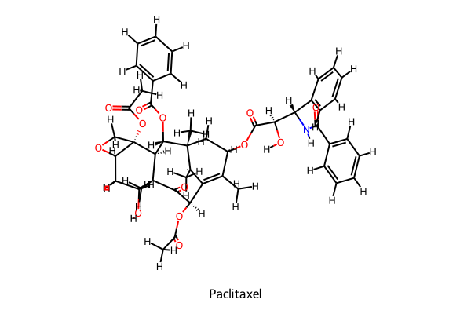
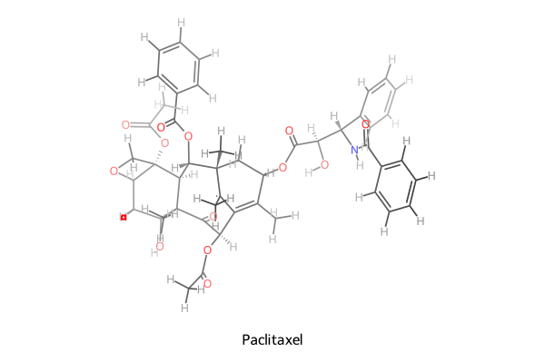
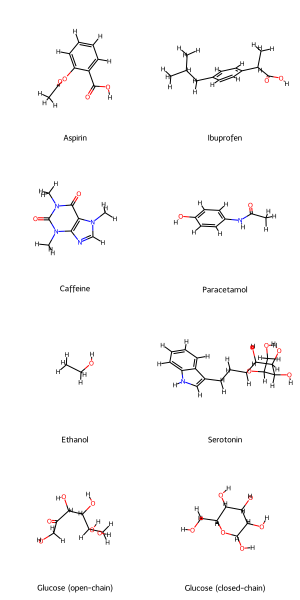
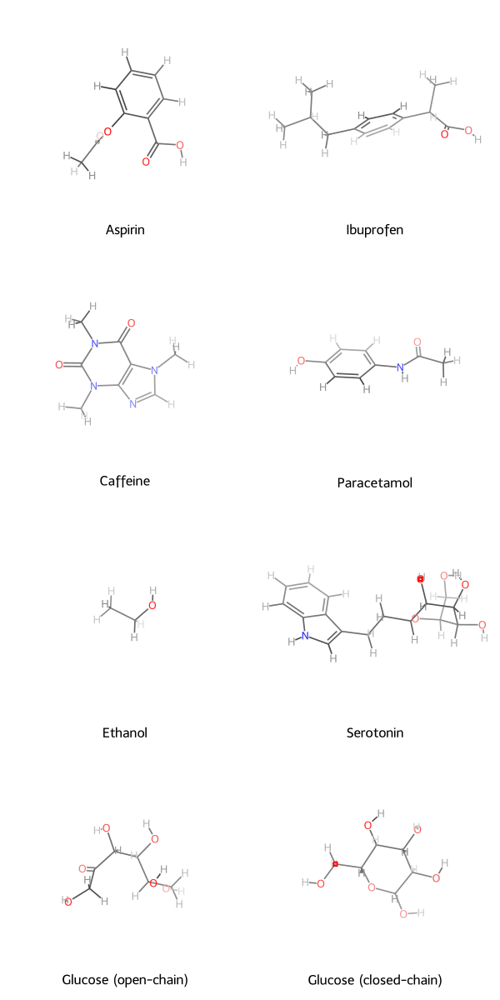
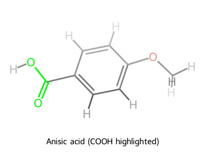
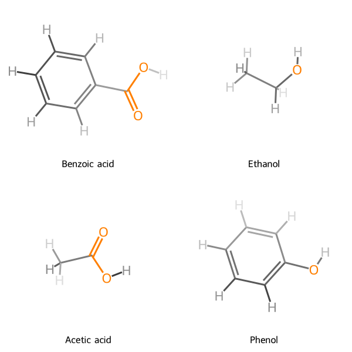

# rdkit-dof

[](LICENSE)

[English](README.md)

`rdkit-dof` 是一个 Python 工具包，它使用 RDKit 为分子提供具备“景深”(Depth of Field, DOF) 或“雾化”效果的精美 2D 图像。通过分子的三维构象，距离观察者较远的原子和键会以更高的透明度和更低的饱和度进行绘制，从而在 2D 图像中创造出视觉上的深度感。

## 效果对比

为了更直观地展示 `rdkit-dof` 的效果，我们将其与 RDKit 的默认绘图功能进行了对比。

### 单分子对比

|                       RDKit 默认效果                        |                 rdkit-dof 景深效果                  |
| :---------------------------------------------------------: | :-------------------------------------------------: |
|  |  |

### 网格（Grid）模式对比

|                   RDKit 默认效果                    |             rdkit-dof 景深效果              |
| :-------------------------------------------------: | :-----------------------------------------: |
|  |  |

### 高亮支持 (Highlighting)

现在您可以在保持景深效果的同时，高亮特定的原子和键。

|                        单分子高亮                         |                       网格高亮                        |
| :-------------------------------------------------------: | :---------------------------------------------------: |
|  |  |

## 技术栈

- **核心:** Python 3.9+
- **化学信息学:** RDKit
- **图像处理:** Pillow
- **配置管理:** Pydantic

## 安装步骤

```bash
pip install rdkit-dof
```

## 使用方法

以下是一个基本的使用示例，展示了如何为一个分子生成带有景深效果的图像。

```python
from rdkit import Chem
from rdkit.Chem.rdDistGeom import EmbedMolecule
from rdkit.Chem.rdForceFieldHelpers import MMFFOptimizeMolecule
from rdkit_dof import MolToDofImage, dofconfig

# 1. 创建一个 RDKit 分子对象，并生成 3D 构象
smiles = "CC1=C2[C@@]([C@]([C@H]([C@@H]3[C@]4([C@H](OC4)C[C@@H]([C@]3(C(=O)[C@@H]2OC(=O)C)C)O)OC(=O)C)OC(=O)c5ccccc5)(C[C@@H]1OC(=O)[C@H](O)[C@@H](NC(=O)c6ccccc6)c7ccccc7)C)C"
mol = Chem.MolFromSmiles(smiles)
mol = Chem.AddHs(mol)
EmbedMolecule(mol, randomSeed=42)
MMFFOptimizeMolecule(mol)

# 2. (可选) 切换到预设的主题
dofconfig.use_style("default")

# 3. 生成并直接保存图像
MolToDofImage(
    mol,
    size=(1000, 800),
    legend="Paclitaxel (Taxol)",
    filename="paclitaxel.svg"
)

print("Image saved to paclitaxel.svg")

# 4. (可选) 显示图像 (在 Jupyter Notebook 中)
svg_img = MolToDofImage(
    mol,
    size=(1000, 800),
    legend="Paclitaxel (Taxol)",
    use_svg=True,
    return_image=True, # 设置为 True 以获取 IPython/Pillow 图像对象
)
svg_img # 显示图像
```

## API

本工具提供两个核心绘图函数：

### `MolToDofImage`

为单个分子生成景深效果图像。

```python
MolToDofImage(
    mol: Chem.Mol,
    size: Optional[tuple[int, int]] = None,
    legend: str = "",
    use_svg: bool = True,
    return_image: bool = True,
    return_drawer: bool = False,
    *,
    settings: Optional[DofDrawSettings] = None,
    highlightAtoms: Optional[Sequence[int]] = None,
    highlightBonds: Optional[Sequence[int]] = None,
    highlightColor: tuple[float, float, float, float] = (1.0, 0.0, 0.0, 0.5),
    filename: Optional[str] = None,
    **kwargs: Any,
) -> Union["SVG", str, Image.Image, bytes, MolDraw2D]
```

- **`mol`**: RDKit 分子对象，需要包含一个 3D 构象。
- **`size`**: 图像尺寸 `(宽, 高)`。
- **`legend`**: 图像下方的图例文字。
- **`use_svg`**: `True` 返回 SVG，`False` 返回 PNG。
- **`return_image`**: `True` 返回 IPython/Pillow 图像对象，`False` 返回原始数据（SVG 为字符串，PNG 为字节）。
- **`return_drawer`**: `True` 返回 `MolDraw2D` 实例，`False` 返回图像数据。
- **`highlightAtoms`**: 需要高亮的原子索引列表。
- **`highlightBonds`**: 需要高亮的键索引列表。
- **`highlightColor`**: 高亮颜色 (RGBA, 0.0-1.0)。
- **`filename`**: 如果提供，图像将保存到此路径。
- **`settings`**: 一个 `DofDrawSettings` 实例，用于局部配置。
- **`**kwargs`**: 其他 RDKit `MolDrawOptions`参数。

### `MolsToGridDofImage`

为分子网格生成景深效果图像，其参数与 RDKit 的 `MolsToGridImage` 类似。

```python
MolsToGridDofImage(
    mols: Sequence[Union[Chem.Mol, Chem.RWMol, None]],
    molsPerRow: int = 3,
    subImgSize: tuple[int, int] = (300, 300),
    legends: Optional[Sequence[Union[str, None]]] = None,
    use_svg: bool = True,
    return_image: bool = True,
    return_drawer: bool = False,
    *,
    settings: Optional[DofDrawSettings] = None,
    highlightAtomLists: Optional[Sequence[Sequence[int]]] = None,
    highlightBondLists: Optional[Sequence[Sequence[int]]] = None,
    highlightColor: tuple[float, float, float, float] = (1.0, 0.0, 0.0, 0.5),
    filename: Optional[str] = None,
    **kwargs: Any,
) -> Union["SVG", str, Image.Image, bytes, MolDraw2D]
```

## 配置项

可以通过一个全局的 `dofconfig` 对象或环境变量（`.env`）来定制绘图效果。

### 全局配置对象

在您的代码中直接修改 `rdkit_dof.dofconfig` 对象的属性。

```python
from rdkit_dof import dofconfig

# 使用预设样式
dofconfig.use_style("nature") # 可选: 'default', 'nature', 'jacs', 'dark'

# 自定义颜色和效果
dofconfig.fog_color = (0.1, 0.1, 0.1) # 背景雾化颜色 (RGB, 0-1)
dofconfig.min_alpha = 0.3             # 最远处原子的最小不透明度
dofconfig.default_size = (500, 500)   # 默认图像尺寸

# 覆盖特定原子的颜色 (原子序数 -> RGB)
dofconfig.atom_colors[8] = (1.0, 0.2, 0.2) # 将氧原子颜色设为亮红色
```

### 环境变量

您也可以通过设置环境变量来定制绘图效果。所有配置属性都有对应的环境变量，名称为 `RDKIT_DOF_` 加上属性名（upper snake case）。

例如，要设置 `fog_color` 为深灰色 (RGB 0.1, 0.1, 0.1)，最小透明度为 0.2，您可以在 `.env` 文件中添加：

```env
# 将雾颜色设为深灰色 (RGB 0.1, 0.1, 0.1)
RDKIT_DOF_FOG_COLOR=[0.1, 0.1, 0.1]
# 调整最小透明度
RDKIT_DOF_MIN_ALPHA=0.2
```

### 主要配置属性

| 属性             | 描述                                      | 默认值 (亮色主题)    |
| ---------------- | ----------------------------------------- | -------------------- |
| `preset_style`   | 预设样式名称                              | `"default"`          |
| `fog_color`      | 雾化/背景颜色 (RGB, 0-1)                  | `(0.95, 0.95, 0.95)` |
| `min_alpha`      | 最远处原子的最小不透明度                  | `0.4`                |
| `default_size`   | `MolToDofImage` 的默认图像尺寸 `(宽, 高)` | `(800, 800)`         |
| `enable_ipython` | 是否启用 IPython 图像显示                 | `True`               |
| `atom_colors`    | 原子颜色映射 `(dict[int, tuple])`         | 基于 `preset_style`  |

## 运行示例

`scripts` 目录下的 `_generate_comparison_images.py` 脚本是生成本文档中所有图像的完整示例。您可以运行它们来复现这些图像：

```bash
# 生成对比图
python scripts/_generate_comparison_images.py
```

## 兼容性说明

- **操作系统:** 本项目是平台无关的，可在 Linux, macOS 和 Windows 上运行。
- **Python 版本:** 需要 Python 3.9 或更高版本。
- **RDKit 版本:** 建议使用 `2023.09` 或更高版本。

## 贡献指南

我们欢迎任何形式的贡献！

1. Fork 本仓库。
2. 创建您的特性分支 (`git checkout -b feature/AmazingFeature`)。
3. 提交您的更改 (`git commit -m 'Add some AmazingFeature'`)。
4. 将您的分支推送到远程 (`git push origin feature/AmazingFeature`)。
5. 发起一个 Pull Request。

## 许可证信息

本项目基于 MIT 许可证进行分发。详情请见 [LICENSE](LICENSE) 文件。
