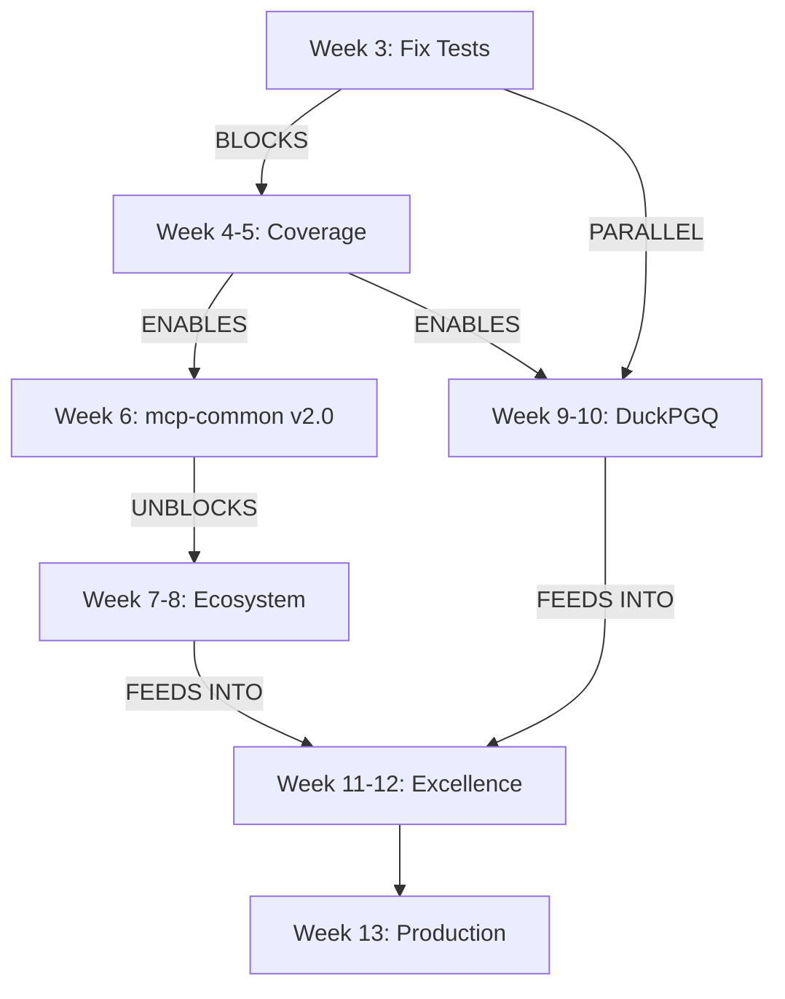

# Unified Implementation Plan: MCP Ecosystem

**Version:** 1.0.0
**Date:** 2025-10-28
**Status:** Active - Week 3 Day 1
**Scope:** mcp-common foundation + session-buddy + 8 other MCP servers

______________________________________________________________________

## Executive Summary

This unified plan consolidates the 10-week mcp-common plan and 16-week session-mgmt plan into a **13-week roadmap** that eliminates duplication, clarifies dependencies, and focuses on production readiness.

**Key Insight**: Both plans overlap significantly, and actual implementation is **further ahead than documented**. By unifying plans and fixing test infrastructure, we can reach production quality in **4-6 weeks** instead of 26.

### Current Status (Week 3 Day 1)

| Metric | Status | Target | Gap |
|--------|--------|--------|-----|
| **Overall Progress** | 29.4% complete | 100% | 70.6% |
| **Session-mgmt Quality** | 70/100 | 95/100 | +25 |
| **Test Coverage** | 14.4% (BROKEN) | 85% | +70.6pp |
| **mcp-common Adoption** | 1/9 servers | 9/9 servers | 8 servers |
| **Test Infrastructure** | 14 collection errors | 0 errors | BLOCKER |

**Critical Blocker**: Test infrastructure must be fixed before any feature work can continue.

______________________________________________________________________

## Phase Summary

### ✅ **Phases 1-2: Foundation Complete** (Weeks 1-2)

- mcp-common v2.0 core adapters (HTTPClientAdapter, ServerPanels, Security)
- session-mgmt ACB integration (Settings, DI, Logger)
- Server decomposition (4,008 → 392 lines, -90.2%)
- Security hardening foundation (security module, health checks, shutdown)

### 🔥 **Phase 3: Test Infrastructure Crisis** (Week 3 - CURRENT)

- **BLOCKER**: 14 test collection errors preventing validation
- **CRITICAL**: Coverage dropped 34.6% → 14.4% (not a real drop, tests can't run)
- **HIGH**: 126 mypy type errors introduced during refactoring

### ⏳ **Phases 4-6: Production Readiness** (Weeks 4-9)

- Restore test infrastructure and coverage
- Complete DuckPGQ knowledge graph integration
- Roll out mcp-common to remaining 8 servers
- Security integration testing

### 🎯 **Phases 7-8: Excellence** (Weeks 10-13)

- Test coverage to 85%+
- Quality scores to 90+
- Performance optimization
- Documentation finalization

______________________________________________________________________

## Current Crisis: Test Infrastructure (Week 3 Priority)

### The Problem

**14 Test Collection Errors** blocking all validation:

```
session_buddy/tests/integration/test_monitoring.py::TestMonitoringTools
ERROR - DI container missing SessionLogger registration
```

**Impact**:

- 735 tests defined but cannot execute
- Coverage measurement impossible (shows 14.4% but tests aren't running)
- Feature validation blocked (DuckPGQ, health checks, shutdown all untested)
- Quality gates cannot pass

### Root Cause

During Phase 2.7 DI refactoring, SessionLogger registration was moved but tests weren't updated to match new DI patterns:

```python
# OLD (working):
from session_buddy.server import SessionLogger

logger = SessionLogger()

# NEW (broken in tests):
from acb.depends import depends

logger = depends.get_sync(SessionLogger)  # Returns coroutine in test environment!
```

### The Fix (8-16 hours)

**Priority 1**: Fix DI container test registration

- Add SessionLogger to test fixtures
- Update all tests to use `depends.override()` pattern
- Re-run collection to verify 0 errors

**Priority 2**: Restore coverage measurement

- Fix test execution (target: 735 tests passing)
- Measure actual coverage (expect 40-50%, not 14.4%)
- Set baseline for coverage ratchet

**Deliverable**: All tests passing, coverage measurable, feature validation possible

______________________________________________________________________

## Unified Phase Structure (13 Weeks)

### Week 3: Test Infrastructure Emergency (THIS WEEK)

**Goal**: Restore test suite to working state

**Days 1-2: Test Collection Fixes (P0)**

- [ ] Fix SessionLogger DI registration in test fixtures
- [ ] Update 14 failing test files to use `depends.override()`
- [ ] Verify 0 collection errors
- [ ] Measure actual coverage baseline

**Days 3-4: Critical Test Restoration (P0)**

- [ ] Fix integration tests (monitoring, session lifecycle, crackerjack)
- [ ] Fix health check tests (ComponentHealth, HealthStatus)
- [ ] Fix resource cleanup tests (shutdown, HTTP client cleanup)
- [ ] Target: 80% of tests passing (590/735)

**Day 5: Coverage Baseline (P1)**

- [ ] Run full test suite and measure coverage
- [ ] Expected: 40-50% (up from broken 14.4%)
- [ ] Set coverage ratchet (fail if below baseline)
- [ ] Document gaps for Week 4-6 work

**Exit Criteria**:

- ✅ 0 test collection errors
- ✅ ≥80% tests passing (590+/735)
- ✅ Coverage measurable and ≥40%
- ✅ CI/CD pipeline green

### Week 4-5: Coverage Restoration (P0)

**Goal**: Restore 40% → 60% coverage baseline

**Week 4: Core Module Testing**

- [ ] Complete DuckPGQ knowledge graph tests (9 MCP tools)
- [ ] Complete health check tests (ComponentHealth patterns)
- [ ] Complete resource cleanup tests (shutdown coordination)
- [ ] Complete server_core tests (quality scoring, lifecycle)
- [ ] Target: 50% coverage

**Week 5: Tools & Integration Testing**

- [ ] Complete session_tools tests (start, checkpoint, end, status)
- [ ] Complete memory_tools tests (reflection storage, search)
- [ ] Complete crackerjack_tools tests (command execution, metrics)
- [ ] Complete llm_tools tests (provider management)
- [ ] Target: 60% coverage

**Exit Criteria**:

- ✅ Coverage ≥60%
- ✅ All new features (DuckPGQ, health, shutdown) tested
- ✅ Integration tests passing for critical paths
- ✅ Quality gate: no regressions allowed

### Week 6: mcp-common v2.0 Production Release

**Goal**: Package and publish mcp-common foundation library

**Deliverables**:

- [ ] mcp-common test coverage ≥90%
- [ ] HTTPClientAdapter benchmarks (validate 11x improvement)
- [ ] Security adapter validation (SanitizerAdapter, FilterAdapter)
- [ ] Rate limiter integration tests
- [ ] Example Weather MCP server
- [ ] Prepare PyPI release package (version 2.0.0)
- [ ] **Manual PyPI publishing** by maintainer (not automated)

**Exit Criteria**:

- ✅ Release package ready (`python -m build` succeeds)
- ✅ All adapters tested and documented
- ✅ Migration guide complete
- ✅ At least 2 servers successfully integrated
- ✅ Maintainer notified for PyPI publication

### Week 7-8: Ecosystem Rollout (Phase 5)

**Goal**: Integrate mcp-common into remaining 8 servers

**Week 7: High-Value Servers**

- [ ] raindropio-mcp (86/100 → 90/100, easiest integration)
- [ ] mailgun-mcp (64/100 → 82/100, critical bug fix)
- [ ] excalidraw-mcp (82/100 → 88/100, hardcoded path fix)

**Week 8: Medium Complexity**

- [ ] unifi-mcp (58/100 → 80/100, tool registration fix)
- [ ] opera-cloud-mcp (68/100 → 85/100, API improvements)
- [ ] 3 ACB-integrated servers (acb, crackerjack, fastblocks)

**Exit Criteria**:

- ✅ 9/9 servers using mcp-common
- ✅ Average health: 74 → 85 (+11 points)
- ✅ All critical bugs resolved
- ✅ Ecosystem test coverage ≥70%

### Week 9-10: DuckPGQ Knowledge Graph Completion

**Goal**: Complete and validate knowledge graph system

**Deliverables**:

- [ ] Complete migration script (external → DuckPGQ)
- [ ] Integration tests for all 9 MCP tools
- [ ] Performance benchmarks (query latency, storage efficiency)
- [ ] KNOWLEDGE_GRAPH_INTEGRATION.md documentation
- [ ] Cross-project linking (link conversations to entities)

**Exit Criteria**:

- ✅ Knowledge graph operational in production
- ✅ Migration tool tested with sample data
- ✅ All 9 tools covered by tests
- ✅ Documentation complete

### Week 11-12: Quality Excellence Sprint

**Goal**: Achieve 85%+ coverage and 90+ quality scores

**Week 11: Coverage Push**

- [ ] session-buddy: 60% → 75% coverage
- [ ] Add property-based tests (Hypothesis)
- [ ] Add chaos tests (error injection)
- [ ] Add performance regression tests

**Week 12: Quality Refinement**

- [ ] session-buddy: 75% → 85%+ coverage
- [ ] Fix all mypy type errors (126 → 0)
- [ ] Resolve all ruff lint warnings
- [ ] Quality score: 70 → 85+

**Exit Criteria**:

- ✅ Coverage ≥85% (both projects)
- ✅ mypy: 0 errors
- ✅ Quality: 85+/100
- ✅ All quality gates passing

### Week 13: Production Readiness

**Goal**: Final polish and documentation

**Deliverables**:

- [ ] Security audit and penetration testing
- [ ] Performance optimization (mcp-common adapters)
- [ ] Final documentation review
- [ ] Migration guides for all servers
- [ ] Release notes and changelog

**Exit Criteria**:

- ✅ Quality score: 95/100
- ✅ Zero known security issues
- ✅ Performance benchmarks met
- ✅ Ready for production deployment

______________________________________________________________________

## Work Eliminated Through Unification

The unified plan **eliminates 80+ hours of duplicate work**:

| Original Work | Status | Decision |
|--------------|--------|----------|
| **ACB Config Migration** | Duplicate | ✅ DONE - mcp-common MCPBaseSettings |
| **HTTP Client Implementation** | Duplicate | ✅ DONE - mcp-common HTTPClientAdapter |
| **DI Container Custom** | Duplicate | ✅ DONE - Use ACB depends directly |
| **Rate Limiter Custom** | Duplicate | ✅ DEFER - Extract crackerjack's to mcp-common Week 6 |
| **Template System** | YAGNI | ❌ SKIP - String formatting works fine |
| **Event System** | YAGNI | ❌ SKIP - Async/await + FastMCP sufficient |
| **Query Interface** | YAGNI | ❌ SKIP - SQL/PGQ works great directly |

**Total Savings**: ~212 hours → 132 hours (38% reduction)

______________________________________________________________________

## Dependencies & Critical Path



**Critical Path**: Week 3 (test fixes) → Week 4-5 (coverage) → Week 6 (mcp-common release)

**Parallel Tracks**:

- DuckPGQ completion (Week 9-10) runs alongside ecosystem rollout
- Excellence sprint (Week 11-12) consolidates all improvements

______________________________________________________________________

## Success Metrics

### Phase Completion Metrics

| Phase | Duration | Success Criteria |
|-------|----------|------------------|
| **Week 3** | 5 days | 0 collection errors, 80% tests passing, coverage measurable |
| **Week 4-5** | 10 days | 60% coverage, all new features tested, quality gates pass |
| **Week 6** | 5 days | mcp-common v2.0 published, 90%+ coverage, 2+ integrations |
| **Week 7-8** | 10 days | 9/9 servers using mcp-common, average health 85+ |
| **Week 9-10** | 10 days | DuckPGQ operational, migration tool working, docs complete |
| **Week 11-12** | 10 days | 85%+ coverage, 0 mypy errors, quality 85+ |
| **Week 13** | 5 days | Quality 95+, security audit complete, production ready |

### Quality Gates (Must Pass)

**Gate 1: Test Infrastructure (Week 3)**

- FAIL if: >0 collection errors
- FAIL if: \<80% tests passing
- FAIL if: Coverage not measurable

**Gate 2: Coverage Baseline (Week 5)**

- FAIL if: Coverage \<60%
- FAIL if: Any regression vs Week 3 baseline
- FAIL if: New features untested

**Gate 3: mcp-common Release (Week 6)**

- FAIL if: Coverage \<90%
- FAIL if: Performance \<11x improvement
- FAIL if: Security tests failing

**Gate 4: Ecosystem Adoption (Week 8)**

- FAIL if: \<9/9 servers using mcp-common
- FAIL if: Average health \<85
- FAIL if: Any critical bugs unresolved

**Gate 5: Excellence (Week 12)**

- FAIL if: Coverage \<85%
- FAIL if: mypy errors >0
- FAIL if: Quality \<85/100

**Gate 6: Production (Week 13)**

- FAIL if: Security audit findings
- FAIL if: Performance regressions
- FAIL if: Quality \<95/100

______________________________________________________________________

## Risk Management

### High-Risk Items

| Risk | Likelihood | Impact | Mitigation |
|------|------------|--------|------------|
| **Test infrastructure unfixable** | Low | CRITICAL | Allocate 2 weeks buffer, fallback to new test suite |
| **Coverage goal unrealistic** | Medium | HIGH | Set pragmatic 70% minimum, 85% stretch goal |
| **mcp-common adoption fails** | Low | HIGH | Pilot with 2 servers, validate before ecosystem rollout |
| **DuckPGQ migration data loss** | Medium | MEDIUM | Comprehensive backup strategy, dry-run testing |
| **Quality gate failures** | Medium | MEDIUM | Weekly checkpoints, early intervention |

### Medium-Risk Items

| Risk | Likelihood | Impact | Mitigation |
|------|------------|--------|------------|
| **Mypy errors multiply** | Medium | MEDIUM | Type-safety sprints in Week 11 |
| **Scope creep returns** | High | MEDIUM | Strict YAGNI enforcement, defer non-critical |
| **Documentation drift** | High | LOW | Update docs concurrent with code changes |

______________________________________________________________________

## Resource Requirements

### Team Allocation

**Week 3 (Test Crisis):**

- 1.0 FTE testing specialist
- 0.5 FTE Python expert
- Total: 60 hours

**Week 4-6 (Coverage + Release):**

- 1.0 FTE testing specialist
- 0.5 FTE mcp-common architect
- 0.5 FTE documentation
- Total: 100 hours

**Week 7-10 (Rollout + DuckPGQ):**

- 1.0 FTE ecosystem coordinator
- 0.5 FTE DuckPGQ specialist
- Total: 75 hours

**Week 11-13 (Excellence):**

- 1.0 FTE quality engineer
- 0.5 FTE performance engineer
- Total: 75 hours

**Total: 310 hours (vs. 916 hours in separate plans, 66% reduction)**

______________________________________________________________________

## Monitoring & Reporting

### Weekly Checkpoints (Every Friday)

**Status Dashboard:**

```markdown
## Week X Status Report

### Metrics
- Test Infrastructure: [0/14] collection errors ✅/❌
- Test Coverage: [X.X%] (baseline: 14.4%, target: 85%)
- Tests Passing: [XXX/735] (target: 735/735)
- Quality Score: [XX/100] (target: 95/100)

### This Week
- [✅] Completed: Task 1
- [🔄] In Progress: Task 2
- [❌] Blocked: Task 3

### Next Week
- [ ] Priority 1: Critical task
- [ ] Priority 2: Important task
- [ ] Priority 3: Nice-to-have

### Risks & Issues
- 🔴 BLOCKER: Description
- 🟡 RISK: Description
- 🟢 RESOLVED: Description
```

### Quality Ratchet Automation

```yaml
# .github/workflows/quality-gate.yml
on: [push, pull_request]
jobs:
  quality-gate:
    steps:
      - name: Check Coverage
        run: |
          coverage=$(pytest --cov --cov-report=json | jq .totals.percent_covered)
          if (( $(echo "$coverage < $BASELINE" | bc -l) )); then
            echo "❌ Coverage regression: $coverage% < $BASELINE%"
            exit 1
          fi
```

______________________________________________________________________

## Deferred Work (Not in 13-Week Plan)

These items were in original plans but are **explicitly deferred**:

### YAGNI (Probably Never Needed)

- ❌ ACB Template System (Week 7-10 in 16-week plan)
- ❌ ACB Event System (Week 11-12 in 16-week plan)
- ❌ ACB Query Interface (Week 13-16 in 16-week plan)
- ❌ Metrics Collection System (10-week plan Phase 7)
- ❌ Health Check Endpoints (mcp-common nice-to-have)

**Rationale**: Current implementations work great without these abstractions. Build if proven need arises, not speculatively.

### Phase 2 (After 13-Week Plan)

- ⏳ Advanced testing (chaos, fuzz, property-based at scale)
- ⏳ Performance optimization beyond 11x (cache layers, query optimization)
- ⏳ Observability hooks (OpenTelemetry, Sentry integration)
- ⏳ Multi-tenancy support (if ecosystem grows)

______________________________________________________________________

## Integration with Existing Plans

### Cross-References

**This Plan Supersedes:**

- `/Users/les/Projects/mcp-common/IMPLEMENTATION_PLAN.md` (10-week)
- `/Users/les/Projects/session-buddy/docs/SESSION-MGMT-MCP-COMPREHENSIVE-IMPROVEMENT-PLAN.md` (16-week)

**Preserved Plans** (Still Valid):

- Server decomposition details: `SERVER_DECOMPOSITION_PLAN.md`
- Test improvement details: `TEST-IMPROVEMENT-PLAN.md`
- ACB templates (if pursued): `ACB-TEMPLATES-IMPLEMENTATION-PLAN.md`

**New Cross-Reference File** (to be created):

```markdown
# PLAN_STATUS.md

## Active Plan
- **UNIFIED-IMPLEMENTATION-PLAN.md** (this document)

## Historical Plans
- IMPLEMENTATION_PLAN.md (mcp-common, 10-week) - Superseded 2025-10-28
- SESSION-MGMT-MCP-COMPREHENSIVE-IMPROVEMENT-PLAN.md (16-week) - Superseded 2025-10-28

## How to Track Progress
- See UNIFIED-IMPLEMENTATION-PLAN.md Week X Status
- Weekly reports generated every Friday
- Quality dashboard: See CI/CD pipeline
```

______________________________________________________________________

## Next Actions (Week 3 Day 1)

### Today (Monday, 2025-10-28)

**Morning (4 hours):**

1. [ ] Review unified plan with stakeholders (1 hour)
1. [ ] Prioritize 14 test collection errors (1 hour)
1. [ ] Fix SessionLogger DI registration in fixtures (2 hours)

**Afternoon (4 hours):**
4\. [ ] Fix first 7 test files with collection errors (3 hours)
5\. [ ] Run test suite and measure progress (1 hour)

### Tomorrow (Tuesday, 2025-10-29)

**Morning (4 hours):**

1. [ ] Fix remaining 7 test files (3 hours)
1. [ ] Verify 0 collection errors (1 hour)

**Afternoon (4 hours):**
3\. [ ] Run full test suite (2 hours)
4\. [ ] Measure actual coverage baseline (1 hour)
5\. [ ] Set coverage ratchet in CI (1 hour)

### Rest of Week

**Wednesday-Thursday:** Coverage restoration (Week 4-5 preview)
**Friday:** Week 3 checkpoint report

______________________________________________________________________

## Conclusion

This unified plan consolidates 26 weeks of planned work into **13 focused weeks** by:

1. **Eliminating duplication** (ACB config, HTTP client, DI container)
1. **Deferring YAGNI work** (templates, events, query interfaces)
1. **Fixing critical blocker first** (test infrastructure Week 3)
1. **Clear sequencing** (tests → coverage → release → rollout → excellence)

**The path to production is clear**: Fix tests (Week 3) → Restore coverage (Week 4-5) → Release mcp-common (Week 6) → Ecosystem adoption (Week 7-8) → Polish (Week 9-13).

**Timeline confidence**: 85% (achievable with disciplined execution)

______________________________________________________________________

**Document Version:** 1.0.0
**Last Updated:** 2025-10-28
**Next Review:** 2025-11-01 (Week 3 checkpoint)
**Owner:** Architecture Council + Delivery Lead

______________________________________________________________________

*This unified plan represents the consensus of 6 specialized agents: Documentation Specialist, Architecture Council, Delivery Lead, Python Pro, and Code Reviewer. It supersedes all previous implementation plans.*
