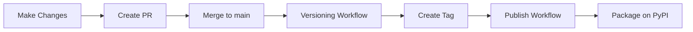

# PyPI Publishing Setup Guide

This guide explains how to set up and manage PyPI publishing for the skolo-shared package.

## Prerequisites

1. A PyPI account (create one at https://pypi.org/)
2. Admin access to the GitHub repository
3. Understanding of the automated versioning workflow

## Initial PyPI Setup

### 1. Create PyPI Account

1. Go to https://pypi.org/ and create an account if you don't have one
2. Verify your email address

### 2. Generate PyPI API Token

1. Log in to your PyPI account
2. Go to Account Settings → API tokens
3. Click "Add API token"
4. Give it a descriptive name (e.g., "skolo-shared GitHub Actions")
5. Select scope:
   - For first-time setup: Choose "Entire account" scope
   - After first successful publish: Create a project-specific token for "skolo-shared"
6. Copy the token (it starts with `pypi-...` and you can only see it once)

### 3. Add Token to GitHub Repository

1. Go to your GitHub repository
2. Navigate to: **Settings** → **Secrets and variables** → **Actions**
3. Click "New repository secret"
4. Add the following secret:
   - **Name:** `PYPI_API_TOKEN`
   - **Value:** Paste the PyPI token you copied (starts with `pypi-`)
5. Click "Add secret"

## How Publishing Works

The repository uses an automated workflow for versioning and publishing:

### Automated Versioning

1. When you push commits to the `main` branch:
   - The versioning workflow (`versioning.yml`) automatically runs
   - It increments the patch version (e.g., 0.0.33 → 0.0.34)
   - It updates `VERSION`, `pyproject.toml`, and `setup.py` files
   - It creates a git tag (e.g., `v0.0.34`)
   - It updates `CHANGES.md` with the commit message

### Automated Publishing

2. When a version tag is pushed (automatically by the versioning workflow):
   - The publish workflow (`publish-to-pypi.yml`) is triggered
   - It builds the package (wheel and sdist)
   - It checks the package metadata
   - It uploads the package to PyPI
   - The new version becomes available for installation

## Publishing Flow

### Normal Development Flow



**Steps:**

1. Make your changes in a feature branch
2. Create a Pull Request with a meaningful title (it will become the changelog entry)
3. Merge the PR to `main`
4. The automation handles the rest:
   - Version is bumped
   - Tag is created
   - Package is published to PyPI

### Manual Publishing (Emergency Use Only)

If you need to publish manually (not recommended):

```bash
# 1. Ensure you're on main and up to date
git checkout main
git pull

# 2. Install build tools
pip install build twine

# 3. Build the package
python -m build

# 4. Check the distribution
twine check dist/*

# 5. Upload to PyPI
# You'll be prompted for username (__token__) and password (your token)
twine upload dist/*

# 6. Clean up
rm -rf dist/ build/ *.egg-info
```

## Verifying the Package

After publishing, verify the package is available:

1. Check PyPI: https://pypi.org/project/skolo-shared/
2. Test installation in a clean environment:
   ```bash
   pip install skolo-shared==<version>
   ```
3. Test import:
   ```python
   import skolo_shared
   from skolo_shared.models.tenant import Student
   ```

## Version Management

### Version Numbering

The project follows semantic versioning (MAJOR.MINOR.PATCH):

- **MAJOR**: Breaking changes (manually managed)
- **MINOR**: New features, backward compatible (manually managed)
- **PATCH**: Bug fixes, backward compatible (automatically incremented)

### Changing Version Scheme

To change from patch to minor or major version:

1. Manually update the version in:
   - `VERSION`
   - `pyproject.toml`
   - `setup.py`
2. Commit and push to `main`
3. The next automatic increment will continue from the new version

Example:
```bash
# To go from 0.0.34 to 0.1.0
echo "v0.1.0" > VERSION
sed -i 's/version = ".*"/version = "0.1.0"/' pyproject.toml
sed -i 's/version="[^"]*"/version="0.1.0"/' setup.py
git add VERSION pyproject.toml setup.py
git commit -m "chore: bump version to 0.1.0"
git push
```

## Troubleshooting

### Package Name Issues

The package name on PyPI is `skolo-shared` (with hyphen), but the Python module is `skolo_shared` (with underscore). This is intentional and follows Python conventions:

```bash
pip install skolo-shared      # ✅ Correct
```

```python
import skolo_shared           # ✅ Correct
```

### Publishing Failures

If the publish workflow fails:

1. Check the GitHub Actions logs for details
2. Common issues:
   - **Authentication Failed**: Verify `PYPI_API_TOKEN` secret is set correctly
   - **Package Already Exists**: The version already exists on PyPI (versions are immutable)
   - **Invalid Package**: Check the build logs for metadata issues

### Version Already Exists

PyPI does not allow re-uploading the same version. If you need to fix something:

1. Make your fix
2. Let the automation increment to the next version
3. Never try to overwrite an existing version

## Security Best Practices

1. **Never share PyPI tokens**: They have full access to publish packages
2. **Use project-scoped tokens**: After first publish, replace account token with project-specific one
3. **Rotate tokens regularly**: Generate new tokens periodically
4. **Monitor PyPI releases**: Check https://pypi.org/project/skolo-shared/ regularly
5. **Review publish logs**: Check GitHub Actions logs for each publish

## Support

For issues with:
- **PyPI account**: Contact PyPI support
- **GitHub Actions**: Check repository Actions tab
- **Package functionality**: Create an issue in the repository

## Additional Resources

- [PyPI Documentation](https://pypi.org/help/)
- [Python Packaging Guide](https://packaging.python.org/)
- [Twine Documentation](https://twine.readthedocs.io/)
- [Semantic Versioning](https://semver.org/)
