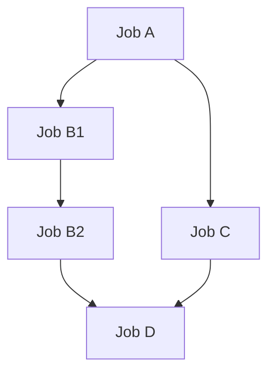

# srunx

[](https://pypi.org/project/srunx/)
[](https://www.python.org/downloads/)
[](LICENSE)
[](https://github.com/ksterx/srunx/actions)

A modern Python library for SLURM workload manager integration with workflow orchestration capabilities.

## Features

- 🧩 **Workflow Orchestration**: YAML-based workflow definitions with Prefect integration
- ⚡ **Fine-Grained Parallel Execution**: Jobs execute immediately when their specific dependencies complete, not entire workflow phases
- 🔗 **Branched Dependency Control**: Independent branches in dependency graphs run simultaneously without false dependencies
- 📊 **Real-Time Monitoring**: Track job states and GPU resource availability with automatic state detection
- 🔔 **Notification System**: Slack integration and custom callbacks for job state changes
- 🔌 **Remote SSH Integration**: Submit and monitor SLURM jobs on remote servers via SSH
- 📝 **Template System**: Customizable Jinja2 templates for SLURM scripts
- 🛡️ **Type Safe**: Full type hints and mypy compatibility
- 🖥️ **CLI Tools**: Command-line interfaces for both job management and workflows
- 🚀 **Simple Job Submission**: Easy-to-use API for submitting SLURM jobs
- ⚙️ **Flexible Configuration**: Support for various environments (conda, venv, sqsh)
- 📋 **Job Management**: Submit, monitor, cancel, and list jobs
- 🔄 **Error Recovery**: Graceful handling of SLURM command failures and network issues

## Installation

### Using uv (Recommended)

```bash
uv add srunx
```

### Using pip

```bash
pip install srunx
```

### Development Installation

```bash
git clone https://github.com/ksterx/srunx.git
cd srunx
uv sync --dev
```

## Quick Start

You can try the workflow example:

```bash
cd examples
srunx flow run sample_workflow.yaml
```



Jobs run precisely when they're ready, minimizing wasted compute hours. The workflow engine provides fine-grained dependency control: when Job A completes, B1 and C start immediately in parallel. As soon as B1 finishes, B2 starts regardless of C's status. Job D waits only for both B2 and C to complete, enabling maximum parallelization.

## Job and Resource Monitoring

srunx provides comprehensive monitoring capabilities for tracking job states and GPU resource availability on SLURM clusters.

### Monitor Commands

The `srunx monitor` command provides three monitoring modes:

```bash
srunx monitor jobs      # Monitor SLURM job state changes
srunx monitor resources # Monitor GPU resource availability
srunx monitor cluster   # Scheduled periodic status reports
```

### Job Monitoring

Monitor SLURM jobs until completion or continuously track state changes:

```bash
# Monitor single job until completion
srunx monitor jobs 12345

# Monitor multiple jobs
srunx monitor jobs 12345 12346 12347

# Monitor all your jobs
srunx monitor jobs --all

# Continuous monitoring with state change notifications
srunx monitor jobs 12345 --continuous

# With custom poll interval and timeout
srunx monitor jobs 12345 --interval 30 --timeout 3600

# With Slack notifications
srunx monitor jobs 12345 --continuous --notify $WEBHOOK_URL
```

### Resource Monitoring

Monitor GPU resource availability and wait for sufficient resources:

```bash
# Display current resource availability
srunx monitor resources

# Display resources for specific partition
srunx monitor resources --partition gpu

# Wait for 4 GPUs to become available
srunx monitor resources --min-gpus 4

# Continuous resource monitoring with notifications
srunx monitor resources --min-gpus 2 --continuous --notify $WEBHOOK_URL

# Show output in JSON format
srunx monitor resources --format json
```

### Scheduled Cluster Reports

Send periodic SLURM cluster status reports via Slack:

```bash
# Send hourly status reports
srunx monitor cluster --schedule 1h --notify $WEBHOOK_URL

# Send reports every 30 minutes
srunx monitor cluster --schedule 30m --notify $WEBHOOK_URL

# Daily reports at 9 AM (cron format)
srunx monitor cluster --schedule "0 9 * * *" --notify $WEBHOOK_URL

# Customize report contents
srunx monitor cluster --schedule 1h --notify $WEBHOOK_URL \
  --include jobs,resources,running --max-jobs 20
```

### Programmatic Monitoring

```python
from srunx import Slurm
from srunx.monitor import JobMonitor, ResourceMonitor
from srunx.monitor.types import MonitorConfig
from srunx.callbacks import SlackCallback

client = Slurm()

# Submit a job
job = client.submit(job)

# Monitor until completion
monitor = JobMonitor(
    job_ids=[job.job_id],
    config=MonitorConfig(poll_interval=30, timeout=3600)
)
monitor.watch_until()  # Blocks until job completes or timeout

# Continuous monitoring with callbacks
slack_callback = SlackCallback(webhook_url="your_webhook_url")
monitor = JobMonitor(
    job_ids=[job.job_id],
    config=MonitorConfig(poll_interval=10, notify_on_change=True),
    callbacks=[slack_callback]
)
monitor.watch_continuous()  # Ctrl+C to stop
```

**Report includes:**
- 📊 **Job Queue Status**: Pending, running, completed, failed job counts
- 🎮 **GPU Resources**: Total, in-use, available GPUs with utilization percentage
- 🖥️  **Node Statistics**: Total, idle, down nodes
- 👤 **User Jobs**: Your personal job queue status (optional)

**Schedule formats:**
- Interval: `1h`, `30m`, `1d` (hours, minutes, days)
- Cron: `"0 9 * * *"` (minute hour day month weekday)

# Resource monitoring
resource_monitor = ResourceMonitor(
    min_gpus=4,
    partition="gpu",
    config=MonitorConfig(poll_interval=60, timeout=7200)
)
resource_monitor.watch_until()  # Blocks until resources available
```

### Monitor Multiple Jobs

```bash
# Monitor multiple jobs simultaneously
srunx monitor 12345 12346 12347

# Monitor all your jobs
srunx monitor $(srunx list --format json | jq -r '.[].job_id | @sh')
```

### Advanced Monitoring Features

- **Automatic State Detection**: Monitors detect PENDING → RUNNING → COMPLETED/FAILED transitions
- **Error Recovery**: Gracefully handles SLURM command failures and network issues
- **Timeout Support**: Configure maximum monitoring duration with automatic cleanup
- **Callback System**: Integrate with Slack, email, or custom notification systems
- **Resource Thresholds**: Wait for specific GPU counts before proceeding with workflows

## Remote SSH Integration

srunx includes full SSH integration, allowing you to submit and monitor SLURM jobs on remote servers. This functionality was integrated from the [ssh-slurm](https://github.com/ksterx/ssh-slurm) project.

### SSH Quick Start

```bash
# Submit a script to a remote SLURM server
srunx ssh script.sh --host myserver

# Using SSH config profiles
srunx ssh script.py --profile dgx-server

# Direct connection parameters
srunx ssh script.sh --hostname dgx.example.com --username researcher --key-file ~/.ssh/dgx_key
```

### SSH Profile Management

Create and manage connection profiles for easy access to remote servers:

```bash
# Add a profile using SSH config
srunx ssh profile add myserver --ssh-host dgx1 --description "Main DGX server"

# Add a profile with direct connection details
srunx ssh profile add dgx-direct --hostname dgx.example.com --username researcher --key-file ~/.ssh/dgx_key --description "Direct DGX connection"

# List all profiles
srunx ssh profile list

# Set current default profile
srunx ssh profile set myserver

# Show profile details
srunx ssh profile show myserver

# Update profile settings
srunx ssh profile update myserver --description "Updated description"

# Remove a profile
srunx ssh profile remove old-server
```

### SSH Environment Variables

Environment variables can be managed in profiles and passed during job submission:

```bash
# Pass environment variables during job submission
srunx ssh train.py --host myserver --env CUDA_VISIBLE_DEVICES=0,1,2,3
srunx ssh script.py --host myserver --env WANDB_PROJECT=my_project --env-local WANDB_API_KEY

# Environment variables in profiles (stored in profile configuration)
# Add profile with environment variables
srunx ssh profile add gpu-server --hostname gpu.example.com --username user --key-file ~/.ssh/key

# Common environment variables are automatically detected and transferred:
# - HF_TOKEN, HUGGING_FACE_HUB_TOKEN
# - WANDB_API_KEY, WANDB_ENTITY, WANDB_PROJECT  
# - OPENAI_API_KEY, ANTHROPIC_API_KEY
# - CUDA_VISIBLE_DEVICES
# - And many more ML/AI related variables
```

### SSH Job Submission Options

```bash
# Basic job submission
srunx ssh train.py --host myserver

# Job with custom name and monitoring
srunx ssh experiment.sh --profile dgx-server --job-name "ml-experiment-001"

# Pass environment variables
srunx ssh script.py --host myserver --env CUDA_VISIBLE_DEVICES=0,1 --env-local WANDB_API_KEY

# Custom polling and timeout
srunx ssh long_job.sh --host myserver --poll-interval 30 --timeout 7200

# Submit without monitoring
srunx ssh background_job.sh --host myserver --no-monitor

# Keep uploaded files for debugging
srunx ssh debug_script.py --host myserver --no-cleanup
```

### SSH Connection Methods

srunx supports multiple connection methods (in priority order):

1. **SSH Config Host** (`--host` flag): Uses entries from `~/.ssh/config`
2. **Saved Profiles** (`--profile` flag): Uses connection profiles stored in config
3. **Direct Parameters**: Specify connection details directly
4. **Current Profile**: Falls back to the default profile if set

### SSH Configuration Files

- **SSH Config**: `~/.ssh/config` - Standard SSH configuration
- **srunx Profiles**: `~/.config/ssh-slurm.json` - SSH profile storage with environment variables

### SSH Advanced Usage Examples

```bash
# Machine Learning Training Pipeline
srunx ssh train_bert.py --host dgx-server \
  --job-name "bert-large-training" \
  --env CUDA_VISIBLE_DEVICES=0,1,2,3 \
  --env WANDB_PROJECT=nlp_experiments \
  --env-local WANDB_API_KEY \
  --poll-interval 60

# Distributed Training with Multiple Nodes
srunx ssh distributed_train.sh --profile hpc-cluster \
  --job-name "distributed-resnet" \
  --timeout 86400  # 24 hours

# Quick Development Testing
srunx ssh test_model.py --host dev-server \
  --no-monitor \
  --no-cleanup  # Keep files for debugging

# Background Job with Custom Environment
srunx ssh long_experiment.py --host gpu-farm \
  --env PYTORCH_CUDA_ALLOC_CONF=max_split_size_mb:512 \
  --env OMP_NUM_THREADS=8 \
  --no-monitor

# Using SSH Proxy Jump (through SSH config)
# ~/.ssh/config:
# Host gpu-cluster
#   HostName gpu-internal.company.com
#   User researcher  
#   ProxyJump bastion.company.com
#   IdentityFile ~/.ssh/company_key

srunx ssh experiment.py --host gpu-cluster
```

### SSH Troubleshooting

```bash
# Check SSH connectivity
ssh your-hostname  # Test direct SSH connection first

# Analyze proxy connections
srunx ssh-proxy-helper your-hostname --test-connection

# Debug with verbose logging
srunx ssh script.py --host server --verbose

# Keep files for inspection
srunx ssh script.py --host server --no-cleanup
```

### Workflow Orchestration

Create a workflow YAML file:

```yaml
# workflow.yaml
name: ml_pipeline
jobs:
  - name: preprocess
    command: ["python", "preprocess.py"]
    nodes: 1
    memory_per_node: "16GB"

  - name: train
    command: ["python", "train.py"]
    depends_on: [preprocess]
    nodes: 1
    gpus_per_node: 2
    memory_per_node: "32GB"
    time_limit: "8:00:00"
    conda: ml_env

  - name: evaluate
    command: ["python", "evaluate.py"]
    depends_on: [train]
    nodes: 1

  - name: notify
    command: ["python", "notify.py"]
    depends_on: [train, evaluate]
```

Execute the workflow:

```bash
# Run workflow
srunx flow run workflow.yaml

# Validate workflow without execution
srunx flow validate workflow.yaml

# Show execution plan
srunx flow run workflow.yaml --dry-run
```

### Template Variables with Args

You can define reusable variables in the `args` section and use them throughout your workflow with Jinja2 templates:

```yaml
# workflow.yaml
name: ml_experiment
args:
  experiment_name: "bert-fine-tuning-v2"
  dataset_path: "/data/nlp/imdb"
  model_checkpoint: "bert-base-uncased"
  output_dir: "/outputs/{{ experiment_name }}"
  batch_size: 32

jobs:
  - name: preprocess
    command: 
      - "python"
      - "preprocess.py"
      - "--dataset"
      - "{{ dataset_path }}"
      - "--output"
      - "{{ output_dir }}/preprocessed"
    resources:
      nodes: 1
      memory_per_node: "16GB"
    work_dir: "{{ output_dir }}"

  - name: train
    command:
      - "python"
      - "train.py"
      - "--model"
      - "{{ model_checkpoint }}"
      - "--data"
      - "{{ output_dir }}/preprocessed"
      - "--batch-size"
      - "{{ batch_size }}"
      - "--output"
      - "{{ output_dir }}/model"
    depends_on: [preprocess]
    resources:
      nodes: 2
      gpus_per_node: 1
    work_dir: "{{ output_dir }}"
    environment:
      conda: ml_env

  - name: evaluate
    command:
      - "python"
      - "evaluate.py"
      - "--model"
      - "{{ output_dir }}/model"
      - "--dataset"
      - "{{ dataset_path }}"
      - "--output"
      - "{{ output_dir }}/results"
    depends_on: [train]
    work_dir: "{{ output_dir }}"
```

Template variables can be used in:
- `command` arguments
- `work_dir` paths
- Any string field in the job configuration

This approach provides:
- **Reusability**: Define once, use everywhere
- **Maintainability**: Easy to update experiment parameters
- **Consistency**: Avoid typos and ensure consistent naming

## Advanced Usage

### Custom Templates

Create a custom SLURM template:

```bash
#!/bin/bash
#SBATCH --job-name={{ job_name }}
#SBATCH --nodes={{ nodes }}

#SBATCH --gpus-per-node={{ gpus_per_node }}

#SBATCH --time={{ time_limit }}
#SBATCH --output={{ log_dir }}/%x_%j.log

{{ environment_setup }}

srun {{ command }}
```

Use it with your job:

```python
job = client.run(job, template_path="custom_template.slurm.jinja")
```

### Environment Configuration

#### Conda Environment

```python
environment = JobEnvironment(
    conda="my_env",
    env_vars={"CUDA_VISIBLE_DEVICES": "0,1"}
)
```

### Programmatic Workflow Execution

```python
from srunx.workflows import WorkflowRunner

runner = WorkflowRunner.from_yaml("workflow.yaml")
results = runner.run()

print("Job IDs:")
for task_name, job_id in results.items():
    print(f"  {task_name}: {job_id}")
```

### Job Submission

```python
# Submit job without waiting
job = client.submit(job)

# Later, wait for completion
completed_job = client.monitor(job, poll_interval=30)
print(f"Job completed with status: {completed_job.status}")

# Subit and wait for completion
completed_job = client.run(job)
print(f"Job completed with status: {completed_job.status}")
```

### Slack Integration

<div align="center">
  
</div>

```python
from srunx.callbacks import SlackCallback

slack_callback = SlackCallback(webhook_url="your_webhook_url")
runner = WorkflowRunner.from_yaml("workflow.yaml", callbacks=[slack_callback])
```

or you can use the CLI:

```bash
srunx flow run workflow.yaml --slack
```

## API Reference

### Core Classes

#### `Job`

Main job configuration class with resources and environment settings.

#### `JobResource`

Resource allocation specification (nodes, GPUs, memory, time).

#### `JobEnvironment`

Environment setup (conda, venv, sqsh, environment variables).

#### `Slurm`

Main interface for SLURM operations (submit, status, cancel, list).

#### `JobMonitor`

Monitor SLURM jobs until terminal states (COMPLETED, FAILED, CANCELLED, TIMEOUT) with automatic state transition detection and callback support.

#### `ResourceMonitor`

Monitor GPU resource availability on SLURM partitions with threshold-based waiting and state change notifications.

#### `MonitorConfig`

Configuration for monitoring behavior (poll interval, timeout, notification settings).

#### `SlackCallback`

Slack webhook integration for job and resource state notifications with automatic message sanitization.

#### `WorkflowRunner`

Workflow execution engine with YAML support.

### CLI Commands

#### Main CLI (`srunx`)

- `submit` - Submit SLURM jobs
- `status` - Check job status
- `list` - List jobs with optional GPU information
- `cancel` - Cancel jobs
- `monitor` - Comprehensive monitoring with three modes:
  - `jobs` - Monitor SLURM job state changes
  - `resources` - Monitor GPU resource availability
  - `cluster` - Scheduled periodic status reports
- `ssh` - Submit and monitor SLURM jobs on remote hosts over SSH

#### Workflow CLI (`srunx flow`)

- Execute YAML-defined workflows
- Validate workflow files
- Show execution plans

#### SSH CLI (`srunx ssh`)

- Submit scripts to remote SLURM servers via SSH
- `profile` - Manage SSH connection profiles
  - `add` - Add new profile
  - `remove` - Remove profile
  - `list` - List all profiles
  - `set` - Set current profile
  - `show` - Show profile details
  - `update` - Update profile settings
  - `env` - Manage environment variables

## Configuration

### Environment Variables

- `SLURM_LOG_DIR`: Default directory for SLURM logs (default: `logs`)

### Template Locations

srunx includes built-in templates:

- `base.slurm.jinja`: Basic job template
- `advanced.slurm.jinja`: Full-featured template with all options

## Development

### Setup Development Environment

```bash
git clone https://github.com/ksterx/srunx.git
cd srunx
uv sync --dev
```

### Run Tests

```bash
uv run pytest
```

### Type Checking

```bash
uv run mypy .
```

### Code Formatting

```bash
uv run ruff check .
uv run ruff format .
```

## Examples

### Parameterized Workflow with Args

Here's a complete example showing how to use `args` for a parameterized machine learning workflow:

```yaml
# ml_experiment.yaml
name: bert_fine_tuning
args:
  experiment_id: "exp_20240816_001"
  model_name: "bert-base-uncased"
  dataset_path: "/data/glue/cola"
  learning_rate: 2e-5
  num_epochs: 3
  batch_size: 16
  max_seq_length: 128
  output_base: "/outputs/{{ experiment_id }}"

jobs:
  - name: setup_experiment
    command:
      - "mkdir"
      - "-p"
      - "{{ output_base }}"
      - "{{ output_base }}/logs"
      - "{{ output_base }}/checkpoints"
    resources:
      nodes: 1

  - name: preprocess_data
    command:
      - "python"
      - "preprocess.py"
      - "--dataset_path"
      - "{{ dataset_path }}"
      - "--model_name"
      - "{{ model_name }}"
      - "--max_seq_length"
      - "{{ max_seq_length }}"
      - "--output_dir"
      - "{{ output_base }}/preprocessed"
    depends_on: [setup_experiment]
    resources:
      nodes: 1
      memory_per_node: "32GB"
    work_dir: "{{ output_base }}"
    environment:
      conda: nlp_env

  - name: train_model
    command:
      - "python"
      - "train.py"
      - "--model_name"
      - "{{ model_name }}"
      - "--train_data"
      - "{{ output_base }}/preprocessed/train.json"
      - "--eval_data"
      - "{{ output_base }}/preprocessed/eval.json"
      - "--learning_rate"
      - "{{ learning_rate }}"
      - "--num_epochs"
      - "{{ num_epochs }}"
      - "--batch_size"
      - "{{ batch_size }}"
      - "--output_dir"
      - "{{ output_base }}/checkpoints"
    depends_on: [preprocess_data]
    resources:
      nodes: 1
      gpus_per_node: 1
      memory_per_node: "64GB"
      time_limit: "4:00:00"
    work_dir: "{{ output_base }}"
    environment:
      conda: nlp_env

  - name: evaluate_model
    command:
      - "python"
      - "evaluate.py"
      - "--model_path"
      - "{{ output_base }}/checkpoints"
      - "--test_data"
      - "{{ dataset_path }}/test.json"
      - "--output_file"
      - "{{ output_base }}/evaluation_results.json"
    depends_on: [train_model]
    resources:
      nodes: 1
      gpus_per_node: 1
    work_dir: "{{ output_base }}"
    environment:
      conda: nlp_env

  - name: generate_report
    command:
      - "python"
      - "generate_report.py"
      - "--experiment_id"
      - "{{ experiment_id }}"
      - "--results_file"
      - "{{ output_base }}/evaluation_results.json"
      - "--output_dir"
      - "{{ output_base }}/reports"
    depends_on: [evaluate_model]
    work_dir: "{{ output_base }}"
```

Run the workflow:

```bash
srunx flow run ml_experiment.yaml
```

This approach provides several benefits:

- **Easy experimentation**: Change parameters in one place
- **Reproducible results**: All parameters are documented in the YAML
- **Consistent paths**: Template variables ensure path consistency
- **Environment isolation**: Each experiment gets its own directory

### Machine Learning Pipeline

```python
# Complete ML pipeline example
from srunx import Job, JobResource, JobEnvironment, Slurm

def create_ml_job(script: str, **kwargs) -> Job:
    return Job(
        name=f"ml_{script.replace('.py', '')}",
        command=["python", script] + [f"--{k}={v}" for k, v in kwargs.items()],
        resources=JobResource(
            nodes=1,
            gpus_per_node=1,
            memory_per_node="32GB",
            time_limit="4:00:00"
        ),
        environment=JobEnvironment(conda="pytorch")
    )

client = Slurm()

# Submit preprocessing job
prep_job = create_ml_job("preprocess.py", data_path="/data", output_path="/processed")
prep_job = client.run(prep_job)

# Wait for preprocessing to complete
client.monitor(prep_job)

# Submit training job
train_job = create_ml_job("train.py", data_path="/processed", model_path="/models")
train_job = client.run(train_job)

print(f"Training job {train_job.job_id} submitted")
```

### Distributed Computing

```python
# Multi-node distributed job
distributed_job = Job(
    name="distributed_training",
    command=[
        "mpirun", "-np", "16",
        "python", "distributed_train.py"
    ],
    resources=JobResource(
        nodes=4,
        ntasks_per_node=4,
        cpus_per_task=8,
        gpus_per_node=2,
        memory_per_node="128GB",
        time_limit="12:00:00"
    ),
    environment=JobEnvironment(
        conda="distributed_ml"
    )
)

job = client.run(distributed_job)
```

### Development Workflow

1. Fork the repository
2. Create a feature branch
3. Make your changes
4. Add tests
5. Run type checking and tests
6. Submit a pull request

## License

This project is licensed under the Apache-2.0 License.

## Support

- 🐞 **Issues**: [GitHub Issues](https://github.com/ksterx/srunx/issues)
- 💬 **Discussions**: [GitHub Discussions](https://github.com/ksterx/srunx/discussions)

## Acknowledgments

- Built with [Pydantic](https://pydantic.dev/) for data validation
- Template rendering with [Jinja2](https://jinja.palletsprojects.com/)
- Package management with [uv](https://github.com/astral-sh/uv)
