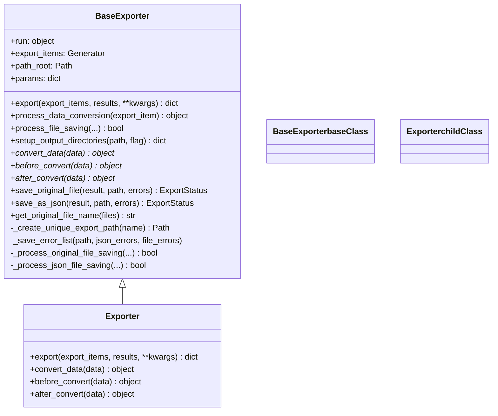
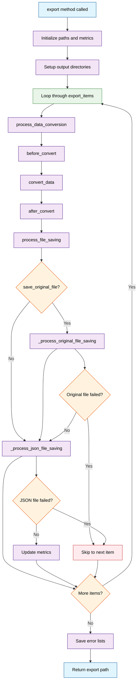

# Export Plugins

Export plugins provide data export and transformation operations for exporting annotated data, ground truth datasets, assignments, and tasks from the Synapse platform.

## Overview

**Available Actions:**

- `export` - Export data from various sources (assignments, ground truth, tasks) with customizable processing

**Use Cases:**

- Exporting annotated datasets for training
- Converting ground truth data to custom formats
- Creating data packages for distribution
- Batch processing of assignment results
- Transforming annotation data for external tools

**Supported Export Targets:**

- `assignment` - Export assignment data with annotations
- `ground_truth` - Export ground truth dataset versions
- `task` - Export task data with associated annotations

## BaseExporter and Exporter Class Architecture

The following diagrams illustrate the relationship between BaseExporter and Exporter classes and their method implementations:



### Method Execution Flow

This flowchart shows the complete execution flow of export operations:



### Key Relationships and Responsibilities

**BaseExporter (Abstract Base Class)**

- **Core Functionality**: Provides complete export workflow infrastructure
- **Template Methods**: `export()` method orchestrates the entire process
- **Hook Methods**: `convert_data()`, `before_convert()`, `after_convert()` for customization
- **Utilities**: File operations, directory setup, error handling, progress tracking

**Exporter (Concrete Implementation)**

- **Inheritance**: Extends `BaseExporter`
- **Minimal Implementation**: Provides basic implementations of abstract methods
- **Pass-through Behavior**: Most methods delegate to parent class
- **Customization Points**: Override conversion methods for specific logic

### Method Categories

- **Core Workflow**: Main export orchestration methods
- **Template/Hook**: Methods designed to be overridden by subclasses
- **File Operations**: Concrete file saving and handling methods
- **Helper/Utility**: Private methods for internal operations

The design follows the **Template Method Pattern** where `BaseExporter.export()` defines the algorithm skeleton, and subclasses customize specific steps through the hook methods.

## Plugin Configuration

Export plugin templates include configuration fields for filtering and plugin discovery:

```yaml
actions:
 export:
 entrypoint: plugin.export.Exporter
 annotation_types:
 - image
 - video
 - audio
 - text
 - pcd
 - prompt

data_types:
 - image
 - video
 - audio
 - text
 - pcd
```

### Configuration Fields

- **data_types**: List of supported data types for filtering export plugins (plugin-level filter)

 - Supported values: `image`, `video`, `audio`, `text`, `pcd`
 - Used by the platform to filter and display relevant export plugins to users based on their data type

- **annotation_types**: List of supported annotation types for filtering export plugins (action-level filter)
 - Supported values: `image`, `video`, `audio`, `text`, `pcd`, `prompt`
 - Defined within each action's configuration (e.g., `actions.export.annotation_types`)
 - Used by the platform to filter and display relevant export plugins to users based on their annotation type
 - Each action can have different annotation type requirements

**Best Practice**: Customize these fields to accurately reflect your plugin's capabilities. The template includes all common types as examples, but you should modify the list to match what your plugin actually supports.

## BaseExporter Class Structure

The new BaseExporter class provides an object-oriented approach for export plugins:

```python
from synapse_sdk.plugins.categories.export.templates.plugin import BaseExporter

class Exporter(BaseExporter):
 """Plugin export action interface for organizing files."""

 def __init__(self, run, export_items, path_root, **params):
 """Initialize the plugin export action class."""
 super().__init__(run, export_items, path_root, **params)

 def convert_data(self, data):
 """Converts the data."""
 return data

 def before_convert(self, data):
 """Preprocesses the data before conversion."""
 return data

 def after_convert(self, data):
 """Post-processes the data after conversion."""
 return data
```

## BaseExporter Core Functionality

### Auto-provided Utilities

- **Complete Export Workflow**: `export()` method handles the complete export process
- **Data Conversion Pipeline**: `process_data_conversion()` handles before_convert → convert_data → after_convert processing
- **File Saving Management**: `process_file_saving()` handles original file and JSON file saving operations (can be overridden)
- **Output Directory Setup**: `setup_output_directories()` creates output directory structure (can be overridden)

### Required Methods (should be implemented by subclasses)

- **convert_data()**: Transform data during export

### Optional Methods (can be overridden by subclasses)

- **save_original_file()**: Save original files from export items
- **save_as_json()**: Save data as JSON files
- **before_convert()**: Pre-process data before conversion
- **after_convert()**: Post-process data after conversion
- **process_file_saving()**: Custom file saving logic
- **additional_file_saving()**: Save additional files after processing all export items

### Helper Methods

- **\_process_original_file_saving()**: Handle original file saving with metrics
- **\_process_json_file_saving()**: Handle JSON file saving with metrics

### Auto-provided Utilities

- Progress tracking via `self.run.set_progress()`
- Logging via `self.run.log_message()` and other run methods
- Error handling and metrics collection via self.run methods

## Additional File Saving

The `additional_file_saving()` method is called after all export items have been processed and is designed for saving files that depend on the collective data from all processed items. This is useful for creating:

- Metadata files (e.g., dataset statistics, class mappings)
- Configuration files (e.g., dataset.yaml for YOLO, classes.txt)
- Summary files (e.g., export reports, processing logs)
- Index files (e.g., file lists, directory structures)

### Method Signature

```python
def additional_file_saving(self, unique_export_path):
 """Save additional files after processing all export items.

 This method is called after the main export loop completes and is intended
 for saving files that need to be created based on the collective data from
 all processed export items (e.g., metadata files, configuration files,
 summary files, etc.).

 Args:
 unique_export_path (str): The unique export directory path where
 additional files should be saved.
 """
 pass
```

### Example Usage

```python
class YOLOExporter(BaseExporter):
 def __init__(self, run, export_items, path_root, **params):
 super().__init__(run, export_items, path_root, **params)
 self.class_names = set()
 self.dataset_stats = {
 'total_images': 0,
 'total_annotations': 0,
 'class_distribution': {}
 }

 def convert_data(self, data):
 # Track classes and stats during conversion
 for annotation in data.get('annotations', []):
 class_name = annotation['class_name']
 self.class_names.add(class_name)
 self.dataset_stats['class_distribution'][class_name] = \
 self.dataset_stats['class_distribution'].get(class_name, 0) + 1

 self.dataset_stats['total_images'] += 1
 self.dataset_stats['total_annotations'] += len(data.get('annotations', []))

 return data # ... rest of conversion logic

 def additional_file_saving(self, unique_export_path):
 """Save YOLO configuration and metadata files."""
 data_dir = Path(unique_export_path) / 'data'
 data_dir.mkdir(exist_ok=True)

 # 1. Save classes.txt file
 classes_file = data_dir / 'classes.txt'
 with classes_file.open('w') as f:
 for class_name in sorted(self.class_names):
 f.write(f"{class_name}\n")
 self.run.log_message(f"Saved classes file: {classes_file}")

 # 2. Save dataset.yaml file
 dataset_config = {
 'path': str(unique_export_path),
 'train': 'images',
 'val': 'images',
 'names': {i: name for i, name in enumerate(sorted(self.class_names))}
 }

 dataset_file = data_dir / 'dataset.yaml'
 with dataset_file.open('w') as f:
 yaml.dump(dataset_config, f, default_flow_style=False)
 self.run.log_message(f"Saved dataset config: {dataset_file}")

 # 3. Save export statistics
 stats_file = data_dir / 'export_stats.json'
 with stats_file.open('w') as f:
 json.dump(self.dataset_stats, f, indent=2)
 self.run.log_message(f"Saved export statistics: {stats_file}")
```

### Common Use Cases

#### 1. Dataset Configuration Files

```python
def additional_file_saving(self, unique_export_path):
 # Create dataset configuration for training frameworks
 config = {
 'dataset_name': self.params.get('name'),
 'created_at': datetime.now().isoformat(),
 'total_samples': len(self.processed_items),
 'classes': list(self.class_mapping.keys())
 }

 config_file = Path(unique_export_path) / 'dataset_config.json'
 with config_file.open('w') as f:
 json.dump(config, f, indent=2)
```

#### 2. Export Summary Reports

```python
def additional_file_saving(self, unique_export_path):
 # Generate export summary
 summary = {
 'export_info': {
 'plugin_name': self.__class__.__name__,
 'export_time': datetime.now().isoformat(),
 'export_path': str(unique_export_path)
 },
 'statistics': self.get_export_statistics(),
 'errors': self.get_error_summary()
 }

 summary_file = Path(unique_export_path) / 'export_summary.json'
 with summary_file.open('w') as f:
 json.dump(summary, f, indent=2)
```

#### 3. Index and Manifest Files

```python
def additional_file_saving(self, unique_export_path):
 # Create file index for processed items
 file_index = []
 for item in self.processed_items:
 file_index.append({
 'original_file': item['original_filename'],
 'json_file': f"{item['stem']}.json",
 'processed_at': item['timestamp']
 })

 index_file = Path(unique_export_path) / 'file_index.json'
 with index_file.open('w') as f:
 json.dump(file_index, f, indent=2)
```

## Key Features

- **Progress Tracking**: Built-in progress monitoring with `run.set_progress()`
- **Error Handling**: Automatic error collection and reporting
- **Metrics Logging**: Track success/failure rates with `run.log_metrics()`
- **File Management**: Handles both original files and processed JSON data
- **Logging**: Comprehensive logging with `run.log_message()` and custom events

## Practical Examples

### YOLO Format Exporter with Custom Directory Structure

Here's a complete example that exports data in YOLO format while leveraging `setup_output_directories` and `process_file_saving`:

```python
from synapse_sdk.plugins.categories.export.templates.plugin import BaseExporter
import os
import json

class YOLOExporter(BaseExporter):
 """Plugin to export data in YOLO format."""

 def __init__(self, run, export_items, path_root, **params):
 super().__init__(run, export_items, path_root, **params)
 self.class_mapping = {}

 def setup_output_directories(self, unique_export_path, save_original_file_flag):
 """Create directories matching YOLO project structure."""
 directories = ['images', 'labels', 'data']

 for directory in directories:
 dir_path = os.path.join(unique_export_path, directory)
 os.makedirs(dir_path, exist_ok=True)
 self.run.log_message(f"Created YOLO directory: {dir_path}")

 return unique_export_path

 def convert_data(self, data):
 """Convert annotation data to YOLO format."""
 converted_annotations = []

 for annotation in data.get('annotations', []):
 # Convert bounding box to YOLO format
 bbox = annotation['geometry']['bbox']
 image_width = data['image']['width']
 image_height = data['image']['height']

 # YOLO format: center_x, center_y, width, height (normalized)
 center_x = (bbox['x'] + bbox['width'] / 2) / image_width
 center_y = (bbox['y'] + bbox['height'] / 2) / image_height
 width = bbox['width'] / image_width
 height = bbox['height'] / image_height

 # Class ID mapping
 class_name = annotation['class_name']
 if class_name not in self.class_mapping:
 self.class_mapping[class_name] = len(self.class_mapping)

 class_id = self.class_mapping[class_name]

 converted_annotations.append({
 'class_id': class_id,
 'center_x': center_x,
 'center_y': center_y,
 'width': width,
 'height': height
 })

 return {
 'yolo_annotations': converted_annotations,
 'class_mapping': self.class_mapping,
 'image_info': data['image']
 }

 def process_file_saving(
 self,
 final_data,
 unique_export_path,
 save_original_file_flag,
 errors_json_file_list,
 errors_original_file_list,
 original_file_metrics_record,
 data_file_metrics_record,
 current_index,
 ):
 """Handle file saving in YOLO format."""
 try:
 export_item = self.export_items[current_index - 1]
 base_name = os.path.splitext(export_item.original_file.name)[0]

 # 1. Save image file to images folder
 if save_original_file_flag:
 images_dir = os.path.join(unique_export_path, 'images')
 image_path = os.path.join(images_dir, export_item.original_file.name)
 import shutil
 shutil.copy2(export_item.original_file.path, image_path)
 self.run.log_message(f"Saved image: {image_path}")

 # 2. Save YOLO label file to labels folder
 labels_dir = os.path.join(unique_export_path, 'labels')
 label_path = os.path.join(labels_dir, f"{base_name}.txt")

 with open(label_path, 'w') as f:
 for ann in final_data.get('yolo_annotations', []):
 line = f"{ann['class_id']} {ann['center_x']} {ann['center_y']} {ann['width']} {ann['height']}\n"
 f.write(line)

 self.run.log_message(f"Saved YOLO label: {label_path}")

 # 3. Save class mapping file (only once)
 if current_index == 1: # Only when processing first file
 classes_path = os.path.join(unique_export_path, 'data', 'classes.txt')
 with open(classes_path, 'w') as f:
 for class_name, class_id in sorted(final_data['class_mapping'].items(), key=lambda x: x[1]):
 f.write(f"{class_name}\n")
 self.run.log_message(f"Saved classes file: {classes_path}")

 return True

 except Exception as e:
 self.run.log_message(f"Error during file saving: {str(e)}", level="error")
 errors_json_file_list.append(f"Export item {current_index}: {str(e)}")
 return True # Return True to continue processing other files
```

This example demonstrates how to leverage BaseExporter's key extension points `setup_output_directories` and `process_file_saving` to:

- Create YOLO project structure (`images/`, `labels/`, `data/`)
- Save image files and YOLO label files in appropriate locations
- Manage class mapping files
- Track progress and handle errors

## Quick Start Guide

Step-by-step guide to create a simple plugin using BaseExporter:

### Step 1: Inherit Base Class

```python
from synapse_sdk.plugins.categories.export.templates.plugin import BaseExporter

class MyExporter(BaseExporter):
 def convert_data(self, data):
 # Required: Implement data transformation logic
 return data # or return transformed data
```

### Step 2: Override Additional Methods as Needed

```python
def before_convert(self, data):
 # Optional: Pre-processing before conversion
 return data

def after_convert(self, converted_data):
 # Optional: Post-processing after conversion
 return converted_data

def save_as_json(self, converted_data, output_path):
 # Optional: Custom save format
 # By default saves as JSON format
 pass
```

### Step 3: Register Plugin

Plugin directory structure:

```
my_plugin/
├── __init__.py
├── plugin.py # MyExporter class definition
└── manifest.yaml # Plugin metadata
```

## Export Action Architecture

The export system has been refactored into a modular architecture with specialized components for different aspects of data export processing:

```mermaid
classDiagram
 %% Light/Dark mode compatible colors with semi-transparency
 classDef baseClass fill:#e1f5fe80,stroke:#0288d1,stroke-width:2px
 classDef childClass fill:#c8e6c980,stroke:#388e3c,stroke-width:2px
 classDef modelClass fill:#fff9c480,stroke:#f57c00,stroke-width:2px
 classDef utilClass fill:#f5f5f580,stroke:#616161,stroke-width:2px
 classDef enumClass fill:#ffccbc80,stroke:#d32f2f,stroke-width:2px

 class ExportAction {
 +name: str = "export"
 +category: PluginCategory.EXPORT
 +method: RunMethod.JOB
 +run_class: ExportRun
 +params_model: ExportParams
 +progress_categories: dict
 +metrics_categories: dict

 +start() dict
 +get_exporter(...) object
 +_get_export_items(target, filter) Generator
 +_create_target_handler(target) object
 }

 class ExportRun {
 +log_message_with_code(code, args, level) None
 +log_export_event(code, args, level) None
 +export_log_json_file(id, file_info, status) None
 +export_log_original_file(id, file_info, status) None
 +ExportEventLog: BaseModel
 +DataFileLog: BaseModel
 +MetricsRecord: BaseModel
 }

 class ExportParams {
 +name: str
 +storage: int
 +target: Literal["assignment", "ground_truth", "task"]
 +filter: dict
 +path: str
 +save_original_file: bool = True
 +extra_params: dict = {}

 +check_storage_exists(value) str
 +validate_target_filter(cls, values) dict
 }

 class LogCode {
 +EXPORT_STARTED: str
 +ITEMS_DISCOVERED: str
 +CONVERSION_STARTED: str
 +CONVERSION_COMPLETED: str
 +FILE_SAVED: str
 +EXPORT_COMPLETED: str
 +EXPORT_FAILED: str
 }

 class ExportStatus {
 +SUCCESS: str = "success"
 +FAILED: str = "failed"
 +SKIPPED: str = "skipped"
 }

 class ExportError {
 +message: str
 +code: str
 }

 class ExportValidationError {
 +message: str
 +field: str
 }

 class ExportTargetError {
 +message: str
 +target: str
 }

 %% Relationships
 ExportAction --> ExportRun : uses
 ExportAction --> ExportParams : validates with
 ExportRun --> LogCode : logs with
 ExportRun --> ExportStatus : tracks status
 ExportAction --> ExportError : may raise
 ExportAction --> ExportValidationError : may raise
 ExportAction --> ExportTargetError : may raise

 %% Apply styles
 class ExportAction baseClass
 class ExportRun childClass
 class ExportParams modelClass
 class LogCode,ExportStatus enumClass
 class ExportError,ExportValidationError,ExportTargetError utilClass
```

### Modular Structure

The export action follows a clean modular organization:

```
synapse_sdk/plugins/categories/export/actions/export/
├── __init__.py # Clean module interfaces
├── action.py # ExportAction class
├── enums.py # ExportStatus, LogCode + LOG_MESSAGES
├── exceptions.py # Export-specific exceptions
├── models.py # ExportParams model
├── run.py # ExportRun class
└── utils.py # Target handlers and utilities
```

**Key Benefits:**

- **Enhanced Maintainability**: Smaller, focused files are easier to understand and modify
- **Code Consistency**: Export action now follows the same pattern as upload action
- **Better Organization**: Related functionality is grouped logically
- **Improved Readability**: Clear separation of concerns across modules

## Creating Export Plugins

Export plugins now use the BaseExporter class-based approach for better organization and reusability. Here's how to create a custom export plugin:

### Step 1: Generate Export Plugin Template

```bash
synapse plugin create
# Select 'export' as category
# Plugin will be created with export template
```

### Step 2: Customize Export Parameters

The `ExportParams` model defines the required parameters:

```python
from synapse_sdk.plugins.categories.export.actions.export.models import ExportParams
from pydantic import BaseModel
from typing import Literal

class CustomExportParams(ExportParams):
 # Add custom parameters
 output_format: Literal['json', 'csv', 'xml'] = 'json'
 include_metadata: bool = True
 compression: bool = False
```

### Step 3: Implement Data Transformation

Implement the required methods in your `Exporter` class in `plugin/export.py`:

```python
from datetime import datetime
from synapse_sdk.plugins.categories.export.templates.plugin import BaseExporter

class Exporter(BaseExporter):
 """Custom export plugin with COCO format conversion."""

 def convert_data(self, data):
 """Convert annotation data to your desired format."""
 # Example: Convert to COCO format
 if data.get('data_type') == 'image_detection':
 return self.convert_to_coco_format(data)
 elif data.get('data_type') == 'image_classification':
 return self.convert_to_classification_format(data)
 return data

 def before_convert(self, export_item):
 """Preprocess data before conversion."""
 # Add validation, filtering, or preprocessing
 if not export_item.get('data'):
 return None # Skip empty items

 # Add custom metadata
 export_item['processed_at'] = datetime.now().isoformat()
 return export_item

 def after_convert(self, converted_data):
 """Post-process converted data."""
 # Add final touches, validation, or formatting
 if 'annotations' in converted_data:
 converted_data['annotation_count'] = len(converted_data['annotations'])
 return converted_data

 def convert_to_coco_format(self, data):
 """Example: Convert to COCO detection format."""
 coco_data = {
 "images": [],
 "annotations": [],
 "categories": []
 }

 # Transform annotation data to COCO format
 for annotation in data.get('annotations', []):
 coco_annotation = {
 "id": annotation['id'],
 "image_id": annotation['image_id'],
 "category_id": annotation['category_id'],
 "bbox": annotation['bbox'],
 "area": annotation.get('area', 0),
 "iscrowd": 0
 }
 coco_data["annotations"].append(coco_annotation)

 return coco_data
```

### Step 4: Configure Export Targets

The export action supports different data sources:

```python
# Filter examples for different targets
filters = {
 # For ground truth export
 "ground_truth": {
 "ground_truth_dataset_version": 123,
 "expand": ["data"]
 },

 # For assignment export
 "assignment": {
 "project": 456,
 "status": "completed",
 "expand": ["data"]
 },

 # For task export
 "task": {
 "project": 456,
 "assignment": 789,
 "expand": ["data_unit", "assignment"]
 }
}
```

### Step 5: Handle File Operations

Customize file saving and organization by overriding BaseExporter methods:

```python
import json
from pathlib import Path
from synapse_sdk.plugins.categories.export.actions.export.enums import ExportStatus

class Exporter(BaseExporter):
 """Custom export plugin with multiple format support."""

 def save_as_json(self, result, base_path, error_file_list):
 """Custom JSON saving with different formats."""
 file_name = Path(self.get_original_file_name(result['files'])).stem

 # Choose output format based on params
 if self.params.get('output_format') == 'csv':
 return self.save_as_csv(result, base_path, error_file_list)
 elif self.params.get('output_format') == 'xml':
 return self.save_as_xml(result, base_path, error_file_list)

 # Default JSON handling
 json_data = result['data']
 file_info = {'file_name': f'{file_name}.json'}

 try:
 with (base_path / f'{file_name}.json').open('w', encoding='utf-8') as f:
 json.dump(json_data, f, indent=4, ensure_ascii=False)
 status = ExportStatus.SUCCESS
 except Exception as e:
 error_file_list.append([f'{file_name}.json', str(e)])
 status = ExportStatus.FAILED

 self.run.export_log_json_file(result['id'], file_info, status)
 return status

 def setup_output_directories(self, unique_export_path, save_original_file_flag):
 """Custom directory structure."""
 # Create format-specific directories
 output_paths = super().setup_output_directories(unique_export_path, save_original_file_flag)

 # Add custom directories based on output format
 format_dir = unique_export_path / self.params.get('output_format', 'json')
 format_dir.mkdir(parents=True, exist_ok=True)
 output_paths['format_output_path'] = format_dir

 return output_paths
```

### Step 6: Usage Examples

Running export plugins with different configurations:

```bash
# Basic export of ground truth data
synapse plugin run export '{
 "name": "my_export",
 "storage": 1,
 "target": "ground_truth",
 "filter": {"ground_truth_dataset_version": 123},
 "path": "exports/ground_truth",
 "save_original_file": true
}' --plugin my-export-plugin

# Export assignments with custom parameters
synapse plugin run export '{
 "name": "assignment_export",
 "storage": 1,
 "target": "assignment",
 "filter": {"project": 456, "status": "completed"},
 "path": "exports/assignments",
 "save_original_file": false,
 "extra_params": {
 "output_format": "coco",
 "include_metadata": true
 }
}' --plugin custom-coco-export
```

## Common Export Patterns

```python
# Pattern 1: Format-specific conversion
class Exporter(BaseExporter):
 def convert_data(self, data):
 """Convert to YOLO format."""
 if data.get('task_type') == 'object_detection':
 return self.convert_to_yolo_format(data)
 return data

# Pattern 2: Conditional file organization
class Exporter(BaseExporter):
 def setup_output_directories(self, unique_export_path, save_original_file_flag):
 # Call parent method
 output_paths = super().setup_output_directories(unique_export_path, save_original_file_flag)

 # Create separate folders by category
 for category in ['train', 'val', 'test']:
 category_path = unique_export_path / category
 category_path.mkdir(parents=True, exist_ok=True)
 output_paths[f'{category}_path'] = category_path

 return output_paths

# Pattern 3: Batch processing with validation
class Exporter(BaseExporter):
 def before_convert(self, export_item):
 # Validate required fields
 required_fields = ['data', 'files', 'id']
 for field in required_fields:
 if field not in export_item:
 raise ValueError(f"Missing required field: {field}")
 return export_item
```

## Development Tips and Best Practices

### 1. Error Handling

```python
def convert_data(self, data):
 try:
 # Conversion logic
 result = self.process_annotations(data)
 return result
 except Exception as e:
 self.run.log_message(f"Error during conversion: {str(e)}", level="error")
 raise # BaseExporter handles errors automatically
```

### 2. Progress Tracking

```python
def convert_data(self, data):
 annotations = data.get('annotations', [])
 total = len(annotations)

 for i, annotation in enumerate(annotations):
 # Update progress (value between 0-100)
 progress = int((i / total) * 100)
 self.run.set_progress(progress)

 # Conversion logic...

 return converted_data
```

### 3. Metrics Collection

```python
def after_convert(self, converted_data):
 # Collect useful metrics
 metrics = {
 'total_exported': len(converted_data.get('annotations', [])),
 'processing_time': time.time() - self.start_time,
 'success_rate': self.calculate_success_rate(),
 }

 self.run.log_metrics(metrics)
 return converted_data
```

### 4. Logging Usage

```python
def convert_data(self, data):
 self.run.log_message("Starting data conversion", level="info")

 if not data.get('annotations'):
 self.run.log_message("No annotation data found", level="warning")
 return data

 # Conversion logic...

 self.run.log_message(f"Conversion complete: processed {len(result)} items", level="success")
 return result
```

### 5. Parameter Handling

```python
def __init__(self, run, export_items, path_root, **params):
 super().__init__(run, export_items, path_root, **params)

 # Handle custom parameters
 self.output_format = params.get('output_format', 'json')
 self.include_metadata = params.get('include_metadata', True)
 self.compression = params.get('compression', False)
```

## Best Practices

### Data Processing

- **Memory Efficiency**: Use generators for processing large datasets
- **Error Recovery**: Implement graceful error handling for individual items
- **Progress Reporting**: Update progress regularly for long-running exports
- **Data Validation**: Validate data structure before conversion

```python
class Exporter(BaseExporter):
 def export(self, export_items=None, results=None, **kwargs):
 """Override the main export method for custom processing."""
 # Use tee to count items without consuming generator
 items_to_process = export_items if export_items is not None else self.export_items
 export_items_count, export_items_process = tee(items_to_process)
 total = sum(1 for _ in export_items_count)

 # Custom processing with error handling
 for no, export_item in enumerate(export_items_process, start=1):
 try:
 # Use the built-in data conversion pipeline
 processed_item = self.process_data_conversion(export_item)
 self.run.set_progress(no, total, category='dataset_conversion')
 except Exception as e:
 self.run.log_message(f"Error processing item {no}: {str(e)}", "ERROR")
 continue

 # Call parent's export method for standard processing
 # or implement your own complete workflow
 return super().export(export_items, results, **kwargs)
```

### File Management

- **Unique Paths**: Prevent file collisions with timestamp or counter suffixes
- **Directory Structure**: Organize output files logically
- **Error Logging**: Track failed files for debugging
- **Cleanup**: Remove temporary files on completion

```python
class Exporter(BaseExporter):
 def setup_output_directories(self, unique_export_path, save_original_file_flag):
 """Create unique export directory structure."""
 # BaseExporter already handles unique path creation via _create_unique_export_path
 # This method sets up the internal directory structure
 output_paths = super().setup_output_directories(unique_export_path, save_original_file_flag)

 # Add custom subdirectories as needed
 custom_dir = unique_export_path / 'custom_output'
 custom_dir.mkdir(parents=True, exist_ok=True)
 output_paths['custom_output_path'] = custom_dir

 return output_paths
```

### Format Conversion

- **Flexible Templates**: Design templates that work with multiple data types
- **Schema Validation**: Validate output against expected schemas
- **Metadata Preservation**: Maintain important metadata during conversion
- **Version Compatibility**: Handle different data schema versions

## Frequently Asked Questions

**Q: Can I implement plugins directly without using BaseExporter?** 
A: Yes, but it's not recommended. BaseExporter provides essential features like progress tracking, error handling, and metrics collection automatically.

**Q: Can I export to multiple file formats simultaneously?** 
A: Yes, you can override the `process_file_saving()` method to save in multiple formats.

**Q: How can I optimize memory usage when processing large datasets?** 
A: Consider using streaming processing in `convert_data()` rather than loading all data at once.

**Q: What should I do if progress is not displaying correctly?** 
A: Make sure you're calling `self.run.set_progress()` at appropriate intervals and using integer values between 0-100.
