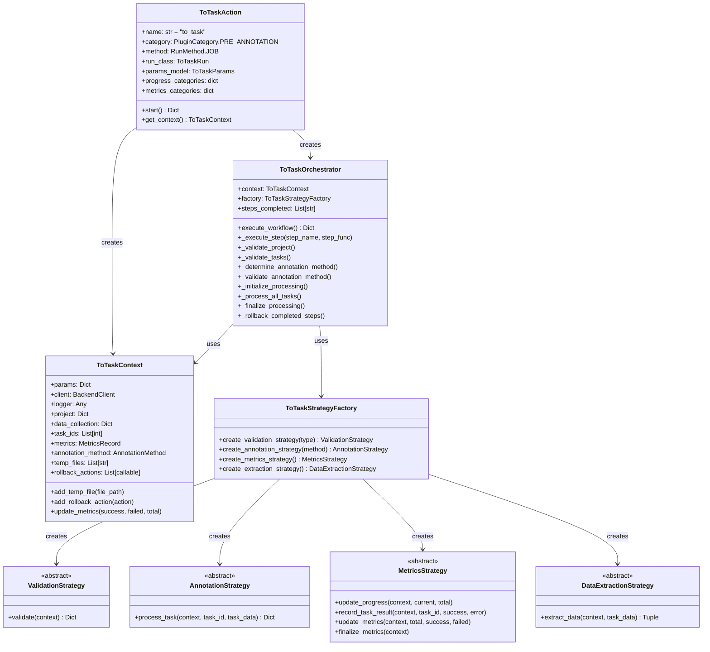
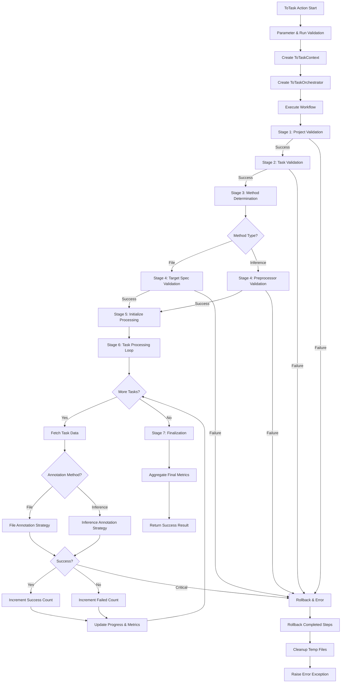

# ToTask Action - SDK Developer Guide

:::info Audience
This guide is for **SDK core developers** working on the ToTaskAction framework, orchestrator, strategies, and workflow engine.

If you're a **plugin developer** creating custom pre-annotation plugins using the AnnotationToTask template, see the [ToTask Template Development](./to-task-template-development.md) guide instead.
:::

This guide provides comprehensive technical documentation for the ToTask action architecture, including design patterns, workflow execution, and extension points for custom strategy implementations.

## Architecture Overview

The ToTask action is built on a modern, maintainable architecture using four key design patterns:

### Design Patterns

#### 1. Strategy Pattern

Enables pluggable algorithms for validation, annotation, metrics, and data extraction. Different strategies can be selected at runtime based on configuration.

#### 2. Facade Pattern

`ToTaskOrchestrator` provides a simplified interface to the complex 7-stage workflow, handling orchestration, error management, and rollback.

#### 3. Factory Pattern

`ToTaskStrategyFactory` creates appropriate strategy instances based on runtime parameters, decoupling strategy creation from usage.

#### 4. Context Pattern

`ToTaskContext` maintains shared state and communication channels between workflow components throughout execution.

## Core Components

### Component Diagram



### ToTaskAction

**File:** `synapse_sdk/plugins/categories/pre_annotation/actions/to_task/action.py`

Entry point for the annotation action.

**Responsibilities:**

- Parameter validation using `ToTaskParams` model
- Execution context creation
- Orchestrator instantiation and execution
- Top-level error handling

**Key Attributes:**

```python
class ToTaskAction(BaseAction):
    name = 'to_task'
    category = PluginCategory.PRE_ANNOTATION
    method = RunMethod.JOB
    run_class = ToTaskRun
    params_model = ToTaskParams

    progress_categories = {
        'annotate_task_data': {
            'label': 'Annotating Task Data',
            'weight': 1.0
        }
    }

    metrics_categories = {
        'annotate_task_data': {
            'label': 'Task Annotation Metrics',
            'metrics': ['success', 'failed', 'stand_by']
        }
    }
```

**Main Method:**

```python
def start(self) -> Dict[str, Any]:
    """Execute the ToTask action workflow"""
    try:
        # Create execution context
        context = self.get_context()

        # Create and execute orchestrator
        orchestrator = ToTaskOrchestrator(context)
        result = orchestrator.execute_workflow()

        return {
            'status': JobStatus.SUCCEEDED,
            'message': f'Successfully processed {result["total"]} tasks'
        }
    except Exception as e:
        return {
            'status': JobStatus.FAILED,
            'message': str(e)
        }
```

### ToTaskOrchestrator

**File:** `synapse_sdk/plugins/categories/pre_annotation/actions/to_task/orchestrator.py`

Facade that orchestrates the 7-stage workflow.

**Responsibilities:**

- Execute workflow stages in sequence
- Track completed steps for rollback
- Handle errors and trigger rollback
- Manage strategy instances

**Key Methods:**

```python
class ToTaskOrchestrator:
    def __init__(self, context: ToTaskContext):
        self.context = context
        self.factory = ToTaskStrategyFactory()
        self.steps_completed = []

        # Initialize validation strategies
        self.project_validation = self.factory.create_validation_strategy('project')
        self.task_validation = self.factory.create_validation_strategy('task')
        self.target_spec_validation = self.factory.create_validation_strategy('target_spec')

        # Initialize metrics strategy
        self.metrics_strategy = self.factory.create_metrics_strategy()

    def execute_workflow(self) -> Dict[str, Any]:
        """Execute the complete 7-stage workflow"""
        try:
            # Stage 1: Validate project
            self._execute_step('project_validation', self._validate_project)

            # Stage 2: Validate tasks
            self._execute_step('task_validation', self._validate_tasks)

            # Stage 3: Determine annotation method
            self._execute_step('method_determination', self._determine_annotation_method)

            # Stage 4: Validate annotation method
            self._execute_step('method_validation', self._validate_annotation_method)

            # Stage 5: Initialize processing
            self._execute_step('processing_initialization', self._initialize_processing)

            # Stage 6: Process all tasks
            self._execute_step('task_processing', self._process_all_tasks)

            # Stage 7: Finalize
            self._execute_step('finalization', self._finalize_processing)

            return self.context.metrics

        except Exception as e:
            # Rollback on any error
            self._rollback_completed_steps()
            raise

    def _execute_step(self, step_name: str, step_func: callable):
        """Execute a workflow step and track completion"""
        step_func()
        self.steps_completed.append(step_name)
        self.context.logger.log_message_with_code(
            LogCode.STEP_COMPLETED, step_name
        )
```

### ToTaskContext

**File:** `synapse_sdk/plugins/categories/pre_annotation/actions/to_task/models.py`

Shared execution context for workflow components.

**Key Attributes:**

```python
class ToTaskContext:
    def __init__(self, params: Dict, client: Any, logger: Any):
        # Configuration
        self.params = params
        self.client = client
        self.logger = logger

        # Project data
        self.project: Optional[Dict] = None
        self.data_collection: Optional[Dict] = None

        # Task data
        self.task_ids: List[int] = []

        # Execution state
        self.annotation_method: Optional[AnnotationMethod] = None
        self.metrics = MetricsRecord(success=0, failed=0, total=0)

        # Cleanup tracking
        self.temp_files: List[str] = []
        self.rollback_actions: List[callable] = []
```

**Helper Methods:**

```python
def add_temp_file(self, file_path: str):
    """Register a temporary file for cleanup"""
    self.temp_files.append(file_path)

def add_rollback_action(self, action: callable):
    """Register a rollback action"""
    self.rollback_actions.append(action)

def update_metrics(self, success_count: int, failed_count: int, total_count: int):
    """Update metrics counters"""
    self.metrics.success = success_count
    self.metrics.failed = failed_count
    self.metrics.total = total_count
```

### ToTaskStrategyFactory

**File:** `synapse_sdk/plugins/categories/pre_annotation/actions/to_task/factory.py`

Factory for creating strategy instances.

**Implementation:**

```python
class ToTaskStrategyFactory:
    def create_validation_strategy(
        self, strategy_type: str
    ) -> ValidationStrategy:
        """Create validation strategy by type"""
        strategies = {
            'project': ProjectValidationStrategy,
            'task': TaskValidationStrategy,
            'target_spec': TargetSpecValidationStrategy
        }

        strategy_class = strategies.get(strategy_type)
        if not strategy_class:
            raise ValueError(f'Unknown validation strategy: {strategy_type}')

        return strategy_class()

    def create_annotation_strategy(
        self, method: AnnotationMethod
    ) -> AnnotationStrategy:
        """Create annotation strategy by method"""
        if method == AnnotationMethod.FILE:
            return FileAnnotationStrategy()
        elif method == AnnotationMethod.INFERENCE:
            return InferenceAnnotationStrategy()
        else:
            raise ValueError(f'Unknown annotation method: {method}')

    def create_metrics_strategy(self) -> MetricsStrategy:
        """Create metrics strategy"""
        return ToTaskMetricsStrategy()

    def create_extraction_strategy(self) -> DataExtractionStrategy:
        """Create data extraction strategy"""
        return FileDataExtractionStrategy()
```

## Strategy Architecture

### Strategy Base Classes

**File:** `synapse_sdk/plugins/categories/pre_annotation/actions/to_task/strategies/base.py`

#### ValidationStrategy

```python
class ValidationStrategy(ABC):
    """Base class for validation strategies"""

    @abstractmethod
    def validate(self, context: ToTaskContext) -> Dict[str, Any]:
        """
        Perform validation

        Args:
            context: Execution context

        Returns:
            Dict with 'success' (bool) and optional 'error' (str)
        """
        pass
```

#### AnnotationStrategy

```python
class AnnotationStrategy(ABC):
    """Base class for annotation strategies"""

    @abstractmethod
    def process_task(
        self,
        context: ToTaskContext,
        task_id: int,
        task_data: Dict[str, Any],
        **kwargs
    ) -> Dict[str, Any]:
        """
        Process a single task annotation

        Args:
            context: Execution context
            task_id: Task ID
            task_data: Task data from API
            **kwargs: Additional parameters

        Returns:
            Dict with 'success' (bool) and optional 'error' (str)
        """
        pass
```

#### MetricsStrategy

```python
class MetricsStrategy(ABC):
    """Base class for metrics tracking"""

    @abstractmethod
    def update_progress(self, context: ToTaskContext, current: int, total: int):
        """Update progress percentage"""
        pass

    @abstractmethod
    def record_task_result(
        self,
        context: ToTaskContext,
        task_id: int,
        success: bool,
        error: Optional[str] = None
    ):
        """Record individual task result"""
        pass

    @abstractmethod
    def update_metrics(
        self,
        context: ToTaskContext,
        total: int,
        success: int,
        failed: int
    ):
        """Update aggregate metrics"""
        pass

    @abstractmethod
    def finalize_metrics(self, context: ToTaskContext):
        """Finalize and log final metrics"""
        pass
```

#### DataExtractionStrategy

```python
class DataExtractionStrategy(ABC):
    """Base class for data extraction"""

    @abstractmethod
    def extract_data(
        self,
        context: ToTaskContext,
        task_data: Dict[str, Any]
    ) -> Tuple[Optional[str], Optional[str]]:
        """
        Extract required data from task

        Args:
            context: Execution context
            task_data: Task data from API

        Returns:
            Tuple of (data_url, original_name)
        """
        pass
```

### Validation Strategy Implementations

**File:** `synapse_sdk/plugins/categories/pre_annotation/actions/to_task/strategies/validation.py`

#### ProjectValidationStrategy

```python
class ProjectValidationStrategy(ValidationStrategy):
    """Validates project and data collection"""

    def validate(self, context: ToTaskContext) -> Dict[str, Any]:
        try:
            # Get project
            project_id = context.params['project']
            project = context.client.get_project(project_id)

            if not project:
                return {
                    'success': False,
                    'error': f'Project {project_id} not found'
                }

            context.project = project

            # Check data collection
            data_collection_id = project.get('data_collection')
            if not data_collection_id:
                return {
                    'success': False,
                    'error': 'Project has no data collection'
                }

            # Get data collection details
            data_collection = context.client.get_data_collection(
                data_collection_id
            )
            context.data_collection = data_collection

            context.logger.log_message_with_code(
                LogCode.PROJECT_VALIDATED,
                project_id,
                data_collection_id
            )

            return {'success': True}

        except Exception as e:
            return {
                'success': False,
                'error': f'Project validation failed: {str(e)}'
            }
```

#### TaskValidationStrategy

```python
class TaskValidationStrategy(ValidationStrategy):
    """Validates and retrieves tasks"""

    def validate(self, context: ToTaskContext) -> Dict[str, Any]:
        try:
            # Get tasks matching filters
            project_id = context.params['project']
            task_filters = context.params['task_filters']

            tasks = context.client.list_tasks(
                project=project_id,
                **task_filters
            )

            if not tasks:
                return {
                    'success': False,
                    'error': 'No tasks found matching filters'
                }

            # Store task IDs
            context.task_ids = [task['id'] for task in tasks]

            context.logger.log_message_with_code(
                LogCode.TASKS_VALIDATED,
                len(context.task_ids)
            )

            return {'success': True}

        except Exception as e:
            return {
                'success': False,
                'error': f'Task validation failed: {str(e)}'
            }
```

#### TargetSpecValidationStrategy

```python
class TargetSpecValidationStrategy(ValidationStrategy):
    """Validates target specification name exists"""

    def validate(self, context: ToTaskContext) -> Dict[str, Any]:
        try:
            target_spec_name = context.params.get('target_specification_name')

            if not target_spec_name:
                return {
                    'success': False,
                    'error': 'target_specification_name is required for file method'
                }

            # Get data collection file specifications
            file_specs = context.data_collection.get('file_specifications', [])
            spec_names = [spec['name'] for spec in file_specs]

            if target_spec_name not in spec_names:
                return {
                    'success': False,
                    'error': f'Target specification "{target_spec_name}" not found'
                }

            context.logger.log_message_with_code(
                LogCode.TARGET_SPEC_VALIDATED,
                target_spec_name
            )

            return {'success': True}

        except Exception as e:
            return {
                'success': False,
                'error': f'Target spec validation failed: {str(e)}'
            }
```

### Annotation Strategy Implementations

**File:** `synapse_sdk/plugins/categories/pre_annotation/actions/to_task/strategies/annotation.py`

#### FileAnnotationStrategy

```python
class FileAnnotationStrategy(AnnotationStrategy):
    """Annotates tasks using JSON files"""

    def process_task(
        self,
        context: ToTaskContext,
        task_id: int,
        task_data: Dict[str, Any],
        **kwargs
    ) -> Dict[str, Any]:
        try:
            # Extract target file URL
            extraction_strategy = FileDataExtractionStrategy()
            url, original_name = extraction_strategy.extract_data(
                context, task_data
            )

            if not url:
                return {
                    'success': False,
                    'error': 'No file URL found for target specification'
                }

            # Download JSON data
            json_data = self._download_json_data(url)

            # Convert to task object
            task_object = self._convert_to_task_object(json_data)

            # Update task
            result = context.client.update_task(
                task_id,
                data={'data': task_object}
            )

            if result:
                context.logger.log_message_with_code(
                    LogCode.ANNOTATION_COMPLETED,
                    task_id
                )
                return {'success': True}
            else:
                return {
                    'success': False,
                    'error': 'Failed to update task'
                }

        except Exception as e:
            return {
                'success': False,
                'error': f'File annotation failed: {str(e)}'
            }

    def _download_json_data(self, url: str) -> Dict[str, Any]:
        """Download and parse JSON from URL"""
        import requests
        response = requests.get(url, timeout=30)
        response.raise_for_status()
        return response.json()

    def _convert_to_task_object(self, json_data: Dict[str, Any]) -> Dict[str, Any]:
        """Convert JSON data to task object format"""
        # Validate and transform as needed
        return json_data
```

#### InferenceAnnotationStrategy

```python
class InferenceAnnotationStrategy(AnnotationStrategy):
    """Annotates tasks using model inference"""

    def process_task(
        self,
        context: ToTaskContext,
        task_id: int,
        task_data: Dict[str, Any],
        **kwargs
    ) -> Dict[str, Any]:
        try:
            # Get preprocessor info
            preprocessor_id = context.params['pre_processor']
            preprocessor_info = self._get_preprocessor_info(
                context, preprocessor_id
            )

            # Ensure preprocessor is running
            self._ensure_preprocessor_running(
                context, preprocessor_info['code']
            )

            # Extract primary image URL
            image_url = self._extract_primary_image_url(task_data)

            if not image_url:
                return {
                    'success': False,
                    'error': 'No primary image found'
                }

            # Call preprocessor API
            inference_params = context.params.get('pre_processor_params', {})
            result = self._call_preprocessor_api(
                preprocessor_info,
                image_url,
                inference_params
            )

            # Convert inference result to task object
            task_object = self._convert_inference_to_task_object(result)

            # Update task
            update_result = context.client.update_task(
                task_id,
                data={'data': task_object}
            )

            if update_result:
                context.logger.log_message_with_code(
                    LogCode.INFERENCE_COMPLETED,
                    task_id
                )
                return {'success': True}
            else:
                return {
                    'success': False,
                    'error': 'Failed to update task with inference results'
                }

        except Exception as e:
            return {
                'success': False,
                'error': f'Inference annotation failed: {str(e)}'
            }

    def _get_preprocessor_info(
        self, context: ToTaskContext, preprocessor_id: int
    ) -> Dict[str, Any]:
        """Get preprocessor details"""
        return context.client.get_plugin_release(preprocessor_id)

    def _ensure_preprocessor_running(
        self, context: ToTaskContext, preprocessor_code: str
    ):
        """Ensure preprocessor is deployed and running"""
        # Check Ray Serve applications
        apps = context.client.list_serve_applications(
            agent=context.params['agent']
        )

        # Find app by code
        app = next(
            (a for a in apps if a['code'] == preprocessor_code),
            None
        )

        if not app or app['status'] != 'RUNNING':
            # Deploy preprocessor
            context.logger.log_message_with_code(
                LogCode.DEPLOYING_PREPROCESSOR,
                preprocessor_code
            )
            # Deployment logic here...

    def _extract_primary_image_url(self, task_data: Dict[str, Any]) -> Optional[str]:
        """Extract primary image URL from task data"""
        data_unit = task_data.get('data_unit', {})
        files = data_unit.get('files', [])

        for file_info in files:
            if file_info.get('is_primary'):
                return file_info.get('url')

        return None

    def _call_preprocessor_api(
        self,
        preprocessor_info: Dict[str, Any],
        image_url: str,
        params: Dict[str, Any]
    ) -> Dict[str, Any]:
        """Call preprocessor API for inference"""
        import requests

        api_url = preprocessor_info['api_endpoint']
        payload = {
            'image_url': image_url,
            **params
        }

        response = requests.post(api_url, json=payload, timeout=60)
        response.raise_for_status()
        return response.json()

    def _convert_inference_to_task_object(
        self, result: Dict[str, Any]
    ) -> Dict[str, Any]:
        """Convert inference results to task object format"""
        # Transform model output to task object structure
        return result
```

## Workflow Execution

### 7-Stage Workflow



### Stage Details

#### Stage 1: Project Validation

```python
def _validate_project(self):
    """Validate project and data collection"""
    result = self.project_validation.validate(self.context)

    if not result['success']:
        raise PreAnnotationToTaskFailed(result.get('error'))

    # Project and data collection now available in context
    self.context.logger.log_message_with_code(
        LogCode.PROJECT_VALIDATION_COMPLETE
    )
```

#### Stage 2: Task Validation

```python
def _validate_tasks(self):
    """Validate and retrieve tasks"""
    result = self.task_validation.validate(self.context)

    if not result['success']:
        raise PreAnnotationToTaskFailed(result.get('error'))

    # Task IDs now available in context.task_ids
    task_count = len(self.context.task_ids)
    self.context.logger.log_message_with_code(
        LogCode.TASKS_FOUND,
        task_count
    )
```

#### Stage 3: Method Determination

```python
def _determine_annotation_method(self):
    """Determine annotation method from parameters"""
    method = self.context.params.get('method')

    if method == 'file':
        self.context.annotation_method = AnnotationMethod.FILE
    elif method == 'inference':
        self.context.annotation_method = AnnotationMethod.INFERENCE
    else:
        raise PreAnnotationToTaskFailed(
            f'Unsupported annotation method: {method}'
        )

    self.context.logger.log_message_with_code(
        LogCode.METHOD_DETERMINED,
        self.context.annotation_method
    )
```

#### Stage 4: Method Validation

```python
def _validate_annotation_method(self):
    """Validate method-specific requirements"""
    if self.context.annotation_method == AnnotationMethod.FILE:
        # Validate target specification
        result = self.target_spec_validation.validate(self.context)

        if not result['success']:
            raise PreAnnotationToTaskFailed(result.get('error'))

    elif self.context.annotation_method == AnnotationMethod.INFERENCE:
        # Validate preprocessor
        preprocessor_id = self.context.params.get('pre_processor')

        if not preprocessor_id:
            raise PreAnnotationToTaskFailed(
                'pre_processor is required for inference method'
            )

        # Additional preprocessor validation...
```

#### Stage 5: Processing Initialization

```python
def _initialize_processing(self):
    """Initialize metrics and progress tracking"""
    total_tasks = len(self.context.task_ids)

    # Reset metrics
    self.context.update_metrics(
        success_count=0,
        failed_count=0,
        total_count=total_tasks
    )

    # Initialize progress
    self.metrics_strategy.update_progress(
        self.context,
        current=0,
        total=total_tasks
    )

    self.context.logger.log_message_with_code(
        LogCode.PROCESSING_INITIALIZED,
        total_tasks
    )
```

#### Stage 6: Task Processing

```python
def _process_all_tasks(self):
    """Process all tasks with annotation strategy"""
    # Create annotation strategy
    annotation_strategy = self.factory.create_annotation_strategy(
        self.context.annotation_method
    )

    success_count = 0
    failed_count = 0
    total_tasks = len(self.context.task_ids)

    # Task query parameters
    task_params = {
        'expand': 'data_unit,data_unit.files'
    }

    # Process each task
    for index, task_id in enumerate(self.context.task_ids, start=1):
        try:
            # Fetch task data
            task_data = self.context.client.get_task(
                task_id,
                params=task_params
            )

            # Execute annotation strategy
            result = annotation_strategy.process_task(
                self.context,
                task_id,
                task_data,
                target_specification_name=self.context.params.get(
                    'target_specification_name'
                )
            )

            # Update counters
            if result['success']:
                success_count += 1
                self.metrics_strategy.record_task_result(
                    self.context,
                    task_id,
                    success=True
                )
            else:
                failed_count += 1
                self.metrics_strategy.record_task_result(
                    self.context,
                    task_id,
                    success=False,
                    error=result.get('error')
                )

        except CriticalError as e:
            # Critical errors stop processing
            raise PreAnnotationToTaskFailed(
                f'Critical error processing task {task_id}: {str(e)}'
            )

        except Exception as e:
            # Task-level errors continue processing
            failed_count += 1
            self.context.logger.log_message_with_code(
                LogCode.TASK_PROCESSING_FAILED,
                task_id,
                str(e)
            )

        # Update progress and metrics
        self.metrics_strategy.update_progress(
            self.context,
            current=index,
            total=total_tasks
        )

        self.context.update_metrics(
            success_count=success_count,
            failed_count=failed_count,
            total_count=total_tasks
        )

        self.metrics_strategy.update_metrics(
            self.context,
            total=total_tasks,
            success=success_count,
            failed=failed_count
        )
```

#### Stage 7: Finalization

```python
def _finalize_processing(self):
    """Finalize metrics and cleanup"""
    self.metrics_strategy.finalize_metrics(self.context)

    # Log completion
    self.context.logger.log_message_with_code(
        LogCode.TO_TASK_COMPLETED,
        self.context.metrics.success,
        self.context.metrics.failed
    )
```

## Error Handling and Rollback

### Rollback Mechanism

```python
def _rollback_completed_steps(self):
    """Rollback all completed workflow steps"""
    self.context.logger.log_message_with_code(
        LogCode.ROLLBACK_STARTED,
        len(self.steps_completed)
    )

    # Rollback steps in reverse order
    for step in reversed(self.steps_completed):
        try:
            rollback_method = getattr(self, f'_rollback_{step}', None)
            if rollback_method:
                rollback_method()
                self.context.logger.log_message_with_code(
                    LogCode.STEP_ROLLED_BACK,
                    step
                )
        except Exception as e:
            self.context.logger.log_message_with_code(
                LogCode.ROLLBACK_FAILED,
                step,
                str(e)
            )

    # Execute custom rollback actions
    for action in reversed(self.context.rollback_actions):
        try:
            action()
        except Exception as e:
            self.context.logger.log_message_with_code(
                LogCode.ROLLBACK_ACTION_FAILED,
                str(e)
            )

    # Cleanup temp files
    self._cleanup_temp_files()
```

### Step-Specific Rollback Methods

```python
def _rollback_project_validation(self):
    """Rollback project validation"""
    self.context.project = None
    self.context.data_collection = None

def _rollback_task_validation(self):
    """Rollback task validation"""
    self.context.task_ids = []

def _rollback_processing_initialization(self):
    """Rollback processing initialization"""
    self.context.metrics = MetricsRecord(success=0, failed=0, total=0)

def _rollback_task_processing(self):
    """Rollback task processing"""
    # Cleanup is handled by temp files
    pass

def _cleanup_temp_files(self):
    """Remove all temporary files"""
    for file_path in self.context.temp_files:
        try:
            if os.path.exists(file_path):
                os.remove(file_path)
        except Exception as e:
            self.context.logger.log_message_with_code(
                LogCode.TEMP_FILE_CLEANUP_FAILED,
                file_path,
                str(e)
            )
```

### Error Levels

**Task-Level Errors:**

- Individual task processing failures
- Logged and counted in metrics
- Workflow continues with remaining tasks

**Critical Errors:**

- System-level failures
- Trigger immediate workflow termination
- Initiate rollback process

**Workflow Errors:**

- Stage validation failures
- Rollback completed stages
- Propagate exception to caller

## Extending the ToTask Action

### Creating Custom Validation Strategies

```python
from synapse_sdk.plugins.categories.pre_annotation.actions.to_task.strategies.base import ValidationStrategy

class CustomBusinessRuleValidationStrategy(ValidationStrategy):
    """Custom validation for business-specific rules"""

    def validate(self, context: ToTaskContext) -> Dict[str, Any]:
        """Validate custom business rules"""
        try:
            # Get tasks
            tasks = context.client.list_tasks(
                project=context.params['project'],
                **context.params['task_filters']
            )

            # Custom validation logic
            for task in tasks:
                # Check business rules
                if not self._meets_business_rules(task):
                    return {
                        'success': False,
                        'error': f'Task {task["id"]} violates business rules'
                    }

            # Store task IDs
            context.task_ids = [task['id'] for task in tasks]

            return {'success': True}

        except Exception as e:
            return {
                'success': False,
                'error': f'Custom validation failed: {str(e)}'
            }

    def _meets_business_rules(self, task: Dict[str, Any]) -> bool:
        """Check if task meets business rules"""
        # Implement your business logic
        return True
```

### Creating Custom Annotation Strategies

```python
from synapse_sdk.plugins.categories.pre_annotation.actions.to_task.strategies.base import AnnotationStrategy

class ExternalAPIAnnotationStrategy(AnnotationStrategy):
    """Annotate using external API service"""

    def process_task(
        self,
        context: ToTaskContext,
        task_id: int,
        task_data: Dict[str, Any],
        **kwargs
    ) -> Dict[str, Any]:
        """Process task using external API"""
        try:
            # Extract image URL
            image_url = self._extract_image_url(task_data)

            # Call external API
            api_url = context.params.get('external_api_url')
            api_key = context.params.get('external_api_key')

            annotations = self._call_external_api(
                api_url,
                api_key,
                image_url
            )

            # Convert to task object
            task_object = self._convert_annotations(annotations)

            # Update task
            result = context.client.update_task(
                task_id,
                data={'data': task_object}
            )

            if result:
                return {'success': True}
            else:
                return {
                    'success': False,
                    'error': 'Failed to update task'
                }

        except Exception as e:
            return {
                'success': False,
                'error': f'External API annotation failed: {str(e)}'
            }

    def _extract_image_url(self, task_data: Dict[str, Any]) -> str:
        """Extract image URL from task data"""
        # Implementation...
        pass

    def _call_external_api(
        self, api_url: str, api_key: str, image_url: str
    ) -> Dict[str, Any]:
        """Call external annotation API"""
        import requests

        response = requests.post(
            api_url,
            headers={'Authorization': f'Bearer {api_key}'},
            json={'image_url': image_url},
            timeout=30
        )
        response.raise_for_status()
        return response.json()

    def _convert_annotations(self, annotations: Dict[str, Any]) -> Dict[str, Any]:
        """Convert external format to task object"""
        # Implementation...
        pass
```

### Integrating Custom Strategies

Update the factory to support custom strategies:

```python
class CustomToTaskStrategyFactory(ToTaskStrategyFactory):
    """Extended factory with custom strategies"""

    def create_validation_strategy(
        self, strategy_type: str
    ) -> ValidationStrategy:
        """Create validation strategy including custom types"""
        strategies = {
            'project': ProjectValidationStrategy,
            'task': TaskValidationStrategy,
            'target_spec': TargetSpecValidationStrategy,
            'business_rules': CustomBusinessRuleValidationStrategy,  # Custom
        }

        strategy_class = strategies.get(strategy_type)
        if not strategy_class:
            raise ValueError(f'Unknown validation strategy: {strategy_type}')

        return strategy_class()

    def create_annotation_strategy(
        self, method: AnnotationMethod
    ) -> AnnotationStrategy:
        """Create annotation strategy including custom methods"""
        if method == AnnotationMethod.FILE:
            return FileAnnotationStrategy()
        elif method == AnnotationMethod.INFERENCE:
            return InferenceAnnotationStrategy()
        elif method == 'external_api':  # Custom
            return ExternalAPIAnnotationStrategy()
        else:
            raise ValueError(f'Unknown annotation method: {method}')
```

## API Reference

### Models and Enums

**File:** `synapse_sdk/plugins/categories/pre_annotation/actions/to_task/models.py`

#### ToTaskParams

```python
class ToTaskParams(BaseModel):
    """Parameters for ToTask action"""

    name: str = Field(..., description="Action name (no whitespace)")
    description: Optional[str] = Field(None, description="Action description")
    project: int = Field(..., description="Project ID")
    agent: int = Field(..., description="Agent ID")
    task_filters: Dict[str, Any] = Field(..., description="Task filter criteria")
    method: str = Field(..., description="Annotation method: 'file' or 'inference'")
    target_specification_name: Optional[str] = Field(
        None,
        description="File specification name (required for file method)"
    )
    model: Optional[int] = Field(None, description="Model ID")
    pre_processor: Optional[int] = Field(
        None,
        description="Pre-processor ID (required for inference method)"
    )
    pre_processor_params: Dict[str, Any] = Field(
        default_factory=dict,
        description="Pre-processor configuration parameters"
    )

    @validator('name')
    def validate_name(cls, v):
        """Validate name has no whitespace"""
        if ' ' in v:
            raise ValueError('Name must not contain whitespace')
        return v

    @validator('method')
    def validate_method(cls, v):
        """Validate method is supported"""
        if v not in ['file', 'inference']:
            raise ValueError('Method must be "file" or "inference"')
        return v
```

#### ToTaskResult

```python
class ToTaskResult(BaseModel):
    """Result from ToTask action"""

    status: JobStatus = Field(..., description="Job status")
    message: str = Field(..., description="Result message")
```

#### MetricsRecord

```python
class MetricsRecord(BaseModel):
    """Metrics tracking record"""

    success: int = Field(0, description="Successfully processed count")
    failed: int = Field(0, description="Failed processing count")
    total: int = Field(0, description="Total tasks count")
```

**File:** `synapse_sdk/plugins/categories/pre_annotation/actions/to_task/enums.py`

#### AnnotationMethod

```python
class AnnotationMethod(str, Enum):
    """Supported annotation methods"""

    FILE = 'file'
    INFERENCE = 'inference'
```

#### LogCode

```python
class LogCode(str, Enum):
    """Type-safe logging codes"""

    # Workflow codes
    TO_TASK_STARTED = 'to_task_started'
    STEP_COMPLETED = 'step_completed'
    TO_TASK_COMPLETED = 'to_task_completed'

    # Validation codes
    PROJECT_VALIDATED = 'project_validated'
    TASKS_VALIDATED = 'tasks_validated'
    TARGET_SPEC_VALIDATED = 'target_spec_validated'
    INVALID_PROJECT_RESPONSE = 'invalid_project_response'
    NO_DATA_COLLECTION = 'no_data_collection'
    TARGET_SPEC_NOT_FOUND = 'target_spec_not_found'

    # Processing codes
    PROCESSING_INITIALIZED = 'processing_initialized'
    ANNOTATING_DATA = 'annotating_data'
    ANNOTATION_COMPLETED = 'annotation_completed'
    TASK_PROCESSING_FAILED = 'task_processing_failed'

    # Inference codes
    ANNOTATING_INFERENCE_DATA = 'annotating_inference_data'
    DEPLOYING_PREPROCESSOR = 'deploying_preprocessor'
    INFERENCE_COMPLETED = 'inference_completed'
    INFERENCE_PROCESSING_FAILED = 'inference_processing_failed'

    # Rollback codes
    ROLLBACK_STARTED = 'rollback_started'
    STEP_ROLLED_BACK = 'step_rolled_back'
    ROLLBACK_FAILED = 'rollback_failed'
    ROLLBACK_ACTION_FAILED = 'rollback_action_failed'

    # Metrics codes
    PROGRESS_UPDATE_FAILED = 'progress_update_failed'
    METRICS_RECORDING_FAILED = 'metrics_recording_failed'
    METRICS_UPDATE_FAILED = 'metrics_update_failed'
    METRICS_FINALIZATION_FAILED = 'metrics_finalization_failed'
```

## Testing

### Unit Testing Strategies

```python
import pytest
from unittest.mock import Mock, patch
from synapse_sdk.plugins.categories.pre_annotation.actions.to_task.strategies.validation import ProjectValidationStrategy

class TestProjectValidationStrategy:
    """Test project validation strategy"""

    def test_validate_success(self):
        """Test successful validation"""
        # Setup
        context = Mock()
        context.params = {'project': 123}
        context.client.get_project.return_value = {
            'id': 123,
            'data_collection': 456
        }
        context.client.get_data_collection.return_value = {
            'id': 456
        }

        # Execute
        strategy = ProjectValidationStrategy()
        result = strategy.validate(context)

        # Assert
        assert result['success'] is True
        assert context.project == {'id': 123, 'data_collection': 456}
        assert context.data_collection == {'id': 456}

    def test_validate_no_project(self):
        """Test validation fails when project not found"""
        # Setup
        context = Mock()
        context.params = {'project': 999}
        context.client.get_project.return_value = None

        # Execute
        strategy = ProjectValidationStrategy()
        result = strategy.validate(context)

        # Assert
        assert result['success'] is False
        assert 'not found' in result['error']

    def test_validate_no_data_collection(self):
        """Test validation fails when no data collection"""
        # Setup
        context = Mock()
        context.params = {'project': 123}
        context.client.get_project.return_value = {
            'id': 123,
            'data_collection': None
        }

        # Execute
        strategy = ProjectValidationStrategy()
        result = strategy.validate(context)

        # Assert
        assert result['success'] is False
        assert 'no data collection' in result['error']
```

### Integration Testing

```python
class TestToTaskIntegration:
    """Integration tests for ToTask workflow"""

    @pytest.fixture
    def mock_context(self):
        """Create mock context"""
        context = Mock(spec=ToTaskContext)
        context.params = {
            'project': 123,
            'agent': 1,
            'task_filters': {'status': 'pending'},
            'method': 'file',
            'target_specification_name': 'annotations'
        }
        context.task_ids = [1, 2, 3]
        return context

    def test_full_workflow_file_method(self, mock_context):
        """Test complete workflow with file method"""
        # Setup orchestrator
        orchestrator = ToTaskOrchestrator(mock_context)

        # Mock validation responses
        mock_context.client.get_project.return_value = {
            'id': 123,
            'data_collection': 456
        }

        # Execute workflow
        result = orchestrator.execute_workflow()

        # Verify all stages completed
        assert 'project_validation' in orchestrator.steps_completed
        assert 'task_validation' in orchestrator.steps_completed
        assert 'finalization' in orchestrator.steps_completed

        # Verify metrics
        assert result.total == 3
```

## Migration Guide

### From Legacy Implementation

If migrating from a legacy ToTask implementation:

**Key Changes:**

1. **Strategy-based architecture** - Replace monolithic logic with strategies
2. **Orchestrated workflow** - 7 defined stages instead of ad-hoc execution
3. **Automatic rollback** - Built-in error recovery
4. **Type-safe logging** - LogCode enum instead of string messages

**Migration Steps:**

1. Update parameter validation to use `ToTaskParams` model
2. Replace custom validation logic with validation strategies
3. Migrate annotation logic to annotation strategies
4. Update error handling to use orchestrator rollback
5. Replace logging with LogCode-based messages

## Best Practices

### Performance

1. **Use appropriate batch sizes** for inference
2. **Filter tasks efficiently** to reduce processing overhead
3. **Implement caching** in custom strategies when appropriate
4. **Monitor memory usage** for large task sets

### Reliability

1. **Validate all inputs** before processing
2. **Implement proper error handling** in custom strategies
3. **Use rollback actions** for cleanup operations
4. **Log detailed error messages** for debugging

### Maintainability

1. **Follow strategy pattern** for new functionality
2. **Use type hints** consistently
3. **Document custom strategies** thoroughly
4. **Write comprehensive tests** for all strategies

## Related Documentation

- [ToTask Overview](./to-task-overview.md) - User guide
- [Pre-annotation Plugin Overview](./pre-annotation-plugin-overview.md) - Category overview
- Plugin Development Guide - General plugin development
- Strategy Pattern - Design pattern details

## Source Code References

- Action: `synapse_sdk/plugins/categories/pre_annotation/actions/to_task/action.py`
- Orchestrator: `synapse_sdk/plugins/categories/pre_annotation/actions/to_task/orchestrator.py`
- Strategies: `synapse_sdk/plugins/categories/pre_annotation/actions/to_task/strategies/`
- Models: `synapse_sdk/plugins/categories/pre_annotation/actions/to_task/models.py`
