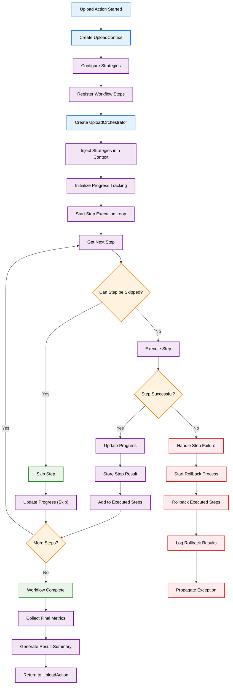

# Upload Action Development

This guide is for SDK developers and contributors who want to understand, extend, or customize the upload action architecture.

## Architecture Overview

The upload system uses a modern, extensible architecture built on proven design patterns. The refactored implementation transforms the previous monolithic approach into a modular, strategy-based system with clear separation of concerns.

### Design Patterns

The architecture leverages several key design patterns:

- **Strategy Pattern**: Pluggable behaviors for validation, file discovery, metadata processing, upload operations, and data unit creation
- **Facade Pattern**: UploadOrchestrator provides a simplified interface to coordinate complex workflows
- **Factory Pattern**: StrategyFactory creates appropriate strategy implementations based on runtime parameters
- **Context Pattern**: UploadContext maintains shared state and communication between workflow components

### Component Architecture

```mermaid
classDiagram
 %% Light/Dark mode compatible colors
 classDef coreClass fill:#e3f2fd,stroke:#1976d2,stroke-width:2px,color:#000000
 classDef strategyClass fill:#e8f5e8,stroke:#388e3c,stroke-width:2px,color:#000000
 classDef stepClass fill:#fff9c4,stroke:#f57c00,stroke-width:2px,color:#000000
 classDef contextClass fill:#ffebee,stroke:#d32f2f,stroke-width:2px,color:#000000

 class UploadAction {
 +name: str = "upload"
 +category: PluginCategory.UPLOAD
 +method: RunMethod.JOB
 +run_class: UploadRun
 +params_model: UploadParams
 +progress_categories: dict
 +metrics_categories: dict
 +strategy_factory: StrategyFactory
 +step_registry: StepRegistry

 +start() dict
 +get_workflow_summary() dict
 +_configure_workflow() None
 +_configure_strategies() dict
 }

 class UploadOrchestrator {
 +context: UploadContext
 +step_registry: StepRegistry
 +strategies: dict
 +executed_steps: list
 +current_step_index: int
 +rollback_executed: bool

 +execute() dict
 +get_workflow_summary() dict
 +get_executed_steps() list
 +is_rollback_executed() bool
 +_execute_step(step) StepResult
 +_handle_step_failure(step, error) None
 +_rollback_executed_steps() None
 }

 class UploadContext {
 +params: dict
 +run: UploadRun
 +client: Any
 +storage: Any
 +pathlib_cwd: Path
 +metadata: dict
 +file_specifications: dict
 +organized_files: list
 +uploaded_files: list
 +data_units: list
 +metrics: dict
 +errors: list
 +strategies: dict
 +rollback_data: dict

 +update(result: StepResult) None
 +get_result() dict
 +has_errors() bool
 +update_metrics(category, metrics) None
 }

 class StepRegistry {
 +_steps: list
 +register(step: BaseStep) None
 +get_steps() list
 +get_total_progress_weight() float
 +clear() None
 }

 class StrategyFactory {
 +create_validation_strategy(params, context) BaseValidationStrategy
 +create_file_discovery_strategy(params, context) BaseFileDiscoveryStrategy
 +create_metadata_strategy(params, context) BaseMetadataStrategy
 +create_upload_strategy(params, context) BaseUploadStrategy
 +create_data_unit_strategy(params, context) BaseDataUnitStrategy
 +get_available_strategies() dict
 }

 class BaseStep {
 <<abstract>>
 +name: str
 +progress_weight: float
 +execute(context: UploadContext) StepResult
 +can_skip(context: UploadContext) bool
 +rollback(context: UploadContext) None
 +create_success_result(data) StepResult
 +create_error_result(error) StepResult
 +create_skip_result() StepResult
 }

 class ExcelSecurityConfig {
 +max_file_size_mb: int = 10
 +max_rows: int = 100000
 +max_columns: int = 50
 +max_file_size_bytes: int
 +from_action_config(action_config) ExcelSecurityConfig
 }

 class StepResult {
 +success: bool
 +data: dict
 +error: str
 +rollback_data: dict
 +skipped: bool
 +original_exception: Exception
 +timestamp: datetime
 }

 %% Strategy Base Classes
 class BaseValidationStrategy {
 <<abstract>>
 +validate_files(files, context) bool
 +validate_security(file_path) bool
 }

 class BaseFileDiscoveryStrategy {
 <<abstract>>
 +discover_files(path, context) list
 +organize_files(files, specs, context) list
 }

 class BaseMetadataStrategy {
 <<abstract>>
 +process_metadata(context) dict
 +extract_metadata(file_path) dict
 }

 class BaseUploadStrategy {
 <<abstract>>
 +upload_files(files, context) list
 +upload_batch(batch, context) list
 }

 class BaseDataUnitStrategy {
 <<abstract>>
 +generate_data_units(files, context) list
 +create_data_unit_batch(batch, context) list
 }

 %% Workflow Steps
 class InitializeStep {
 +name = "initialize"
 +progress_weight = 0.05
 }

 class ProcessMetadataStep {
 +name = "process_metadata"
 +progress_weight = 0.05
 }

 class AnalyzeCollectionStep {
 +name = "analyze_collection"
 +progress_weight = 0.05
 }

 class OrganizeFilesStep {
 +name = "organize_files"
 +progress_weight = 0.10
 }

 class ValidateFilesStep {
 +name = "validate_files"
 +progress_weight = 0.05
 }

 class UploadFilesStep {
 +name = "upload_files"
 +progress_weight = 0.30
 }

 class GenerateDataUnitsStep {
 +name = "generate_data_units"
 +progress_weight = 0.35
 }

 class CleanupStep {
 +name = "cleanup"
 +progress_weight = 0.05
 }

 %% Relationships
 UploadAction --> UploadRun : uses
 UploadAction --> UploadParams : validates with
 UploadAction --> ExcelSecurityConfig : configures
 UploadAction --> UploadOrchestrator : creates and executes
 UploadAction --> StrategyFactory : configures strategies
 UploadAction --> StepRegistry : manages workflow steps
 UploadOrchestrator --> UploadContext : coordinates state
 UploadOrchestrator --> StepRegistry : executes steps from
 UploadOrchestrator --> BaseStep : executes
 BaseStep --> StepResult : returns
 UploadContext --> StepResult : updates with
 StrategyFactory --> BaseValidationStrategy : creates
 StrategyFactory --> BaseFileDiscoveryStrategy : creates
 StrategyFactory --> BaseMetadataStrategy : creates
 StrategyFactory --> BaseUploadStrategy : creates
 StrategyFactory --> BaseDataUnitStrategy : creates
 StepRegistry --> BaseStep : contains

 %% Step inheritance
 InitializeStep --|> BaseStep : extends
 ProcessMetadataStep --|> BaseStep : extends
 AnalyzeCollectionStep --|> BaseStep : extends
 OrganizeFilesStep --|> BaseStep : extends
 ValidateFilesStep --|> BaseStep : extends
 UploadFilesStep --|> BaseStep : extends
 GenerateDataUnitsStep --|> BaseStep : extends
 CleanupStep --|> BaseStep : extends
```



### Step-Based Workflow Execution

The refactored architecture uses a step-based workflow coordinated by the UploadOrchestrator. Each step has a defined responsibility and progress weight.

#### Workflow Steps Overview

| Step | Name | Weight | Responsibility |
| ---- | ------------------- | ------ | -------------------------------------------- |
| 1 | Initialize | 5% | Setup storage, pathlib, and basic validation |
| 2 | Process Metadata | 5% | Handle Excel metadata if provided |
| 3 | Analyze Collection | 5% | Retrieve and validate data collection specs |
| 4 | Organize Files | 10% | Discover and organize files by type |
| 5 | Validate Files | 5% | Security and content validation |
| 6 | Upload Files | 30% | Upload files to storage |
| 7 | Generate Data Units | 35% | Create data units from uploaded files |
| 8 | Cleanup | 5% | Clean temporary resources |

#### Execution Flow



#### Strategy Integration Points

Strategies are injected into the workflow at specific points:

- **Validation Strategy**: Used by ValidateFilesStep
- **File Discovery Strategy**: Used by OrganizeFilesStep
- **Metadata Strategy**: Used by ProcessMetadataStep
- **Upload Strategy**: Used by UploadFilesStep
- **Data Unit Strategy**: Used by GenerateDataUnitsStep

#### Error Handling and Rollback

The orchestrator provides automatic rollback functionality:

1. **Exception Capture**: Preserves original exceptions for debugging
2. **Rollback Execution**: Calls rollback() on all successfully executed steps in reverse order
3. **Graceful Degradation**: Continues rollback even if individual step rollbacks fail
4. **State Preservation**: Maintains execution state for post-failure analysis

## Development Guide

This section provides comprehensive guidance for extending the upload action with custom strategies and workflow steps.

### Creating Custom Strategies

Strategies implement specific behaviors for different aspects of the upload process. Each strategy type has a well-defined interface.

#### Custom Validation Strategy

```python
from synapse_sdk.plugins.categories.upload.actions.upload.strategies.validation.base import BaseValidationStrategy
from synapse_sdk.plugins.categories.upload.actions.upload.context import UploadContext
from pathlib import Path
from typing import List

class CustomValidationStrategy(BaseValidationStrategy):
 """Custom validation strategy with advanced security checks."""

 def validate_files(self, files: List[Path], context: UploadContext) -> bool:
 """Validate files using custom business rules."""
 for file_path in files:
 # Custom validation logic
 if not self._validate_custom_rules(file_path):
 return False

 # Call security validation
 if not self.validate_security(file_path):
 return False
 return True

 def validate_security(self, file_path: Path) -> bool:
 """Custom security validation."""
 # Implement custom security checks
 if file_path.suffix in ['.exe', '.bat', '.sh']:
 return False

 # Check file size
 if file_path.stat().st_size > 100 * 1024 * 1024: # 100MB
 return False

 return True

 def _validate_custom_rules(self, file_path: Path) -> bool:
 """Implement domain-specific validation rules."""
 # Custom business logic
 return True
```

#### Custom File Discovery Strategy

```python
from synapse_sdk.plugins.categories.upload.actions.upload.strategies.file_discovery.base import BaseFileDiscoveryStrategy
from pathlib import Path
from typing import List, Dict, Any

class CustomFileDiscoveryStrategy(BaseFileDiscoveryStrategy):
 """Custom file discovery with advanced filtering."""

 def discover_files(self, path: Path, context: UploadContext) -> List[Path]:
 """Discover files with custom filtering rules."""
 files = []

 if context.get_param('is_recursive', False):
 files = list(path.rglob('*'))
 else:
 files = list(path.iterdir())

 # Apply custom filtering
 return self._apply_custom_filters(files, context)

 def organize_files(self, files: List[Path], specs: Dict[str, Any], context: UploadContext) -> List[Dict[str, Any]]:
 """Organize files using custom categorization."""
 organized = []

 for file_path in files:
 if file_path.is_file():
 category = self._determine_category(file_path)
 organized.append({
 'file_path': file_path,
 'category': category,
 'metadata': self._extract_file_metadata(file_path)
 })

 return organized

 def _apply_custom_filters(self, files: List[Path], context: UploadContext) -> List[Path]:
 """Apply domain-specific file filters."""
 filtered = []
 for file_path in files:
 if self._should_include_file(file_path):
 filtered.append(file_path)
 return filtered

 def _determine_category(self, file_path: Path) -> str:
 """Determine file category using custom logic."""
 ext = file_path.suffix.lower()
 if ext in ['.jpg', '.png', '.gif']:
 return 'images'
 elif ext in ['.pdf', '.doc', '.docx']:
 return 'documents'
 else:
 return 'other'
```

#### Custom Upload Strategy

```python
from synapse_sdk.plugins.categories.upload.actions.upload.strategies.upload.base import BaseUploadStrategy
from typing import List, Dict, Any
import time

class CustomUploadStrategy(BaseUploadStrategy):
 """Custom upload strategy with advanced retry logic."""

 def upload_files(self, files: List[Dict[str, Any]], context: UploadContext) -> List[Dict[str, Any]]:
 """Upload files with custom batching and retry logic."""
 uploaded_files = []
 batch_size = context.get_param('upload_batch_size', 10)

 # Process in custom batches
 for i in range(0, len(files), batch_size):
 batch = files[i:i + batch_size]
 batch_results = self.upload_batch(batch, context)
 uploaded_files.extend(batch_results)

 return uploaded_files

 def upload_batch(self, batch: List[Dict[str, Any]], context: UploadContext) -> List[Dict[str, Any]]:
 """Upload a batch of files with retry logic."""
 results = []

 for file_info in batch:
 max_retries = 3
 for attempt in range(max_retries):
 try:
 result = self._upload_single_file(file_info, context)
 results.append(result)
 break
 except Exception as e:
 if attempt == max_retries - 1:
 # Final attempt failed
 context.add_error(f"Failed to upload {file_info['file_path']}: {e}")
 else:
 # Wait before retry
 time.sleep(2 ** attempt)

 return results

 def _upload_single_file(self, file_info: Dict[str, Any], context: UploadContext) -> Dict[str, Any]:
 """Upload a single file with custom logic."""
 file_path = file_info['file_path']
 storage = context.storage

 # Custom upload logic here
 uploaded_file = {
 'file_path': str(file_path),
 'storage_path': f"uploads/{file_path.name}",
 'size': file_path.stat().st_size,
 'checksum': self._calculate_checksum(file_path)
 }

 return uploaded_file
```

### Creating Custom Workflow Steps

Custom workflow steps extend the base step class and implement the required interface.

#### Custom Processing Step

```python
from synapse_sdk.plugins.categories.upload.actions.upload.steps.base import BaseStep
from synapse_sdk.plugins.categories.upload.actions.upload.context import UploadContext, StepResult
from pathlib import Path
from typing import List, Dict
from datetime import datetime

class CustomProcessingStep(BaseStep):
 """Custom processing step for specialized file handling."""

 @property
 def name(self) -> str:
 return 'custom_processing'

 @property
 def progress_weight(self) -> float:
 return 0.15 # 15% of total workflow

 def execute(self, context: UploadContext) -> StepResult:
 """Execute custom processing logic."""
 try:
 # Custom processing logic
 processed_files = self._process_files(context)

 # Update context with results
 return self.create_success_result({
 'processed_files': processed_files,
 'processing_stats': self._get_processing_stats()
 })

 except Exception as e:
 return self.create_error_result(f'Custom processing failed: {str(e)}')

 def can_skip(self, context: UploadContext) -> bool:
 """Determine if step can be skipped."""
 # Skip if no files to process
 return len(context.organized_files) == 0

 def rollback(self, context: UploadContext) -> None:
 """Rollback custom processing operations."""
 # Clean up any resources created during processing
 self._cleanup_processing_resources(context)

 def _process_files(self, context: UploadContext) -> List[Dict]:
 """Implement custom file processing."""
 processed = []

 for file_info in context.organized_files:
 # Custom processing logic
 result = self._process_single_file(file_info)
 processed.append(result)

 return processed

 def _process_single_file(self, file_info: Dict) -> Dict:
 """Process a single file."""
 return {
 'original': file_info,
 'processed': True,
 'timestamp': datetime.now()
 }

 def _get_processing_stats(self) -> Dict:
 """Get processing statistics."""
 return {}

 def _cleanup_processing_resources(self, context: UploadContext) -> None:
 """Clean up processing resources."""
 pass
```

### Strategy Factory Extension

To make custom strategies available, extend the StrategyFactory:

```python
from synapse_sdk.plugins.categories.upload.actions.upload.factory import StrategyFactory
from typing import Dict

class CustomStrategyFactory(StrategyFactory):
 """Extended factory with custom strategies."""

 def create_validation_strategy(self, params: Dict, context=None):
 """Create validation strategy with custom options."""
 validation_type = params.get('custom_validation_type', 'default')

 if validation_type == 'strict':
 return CustomValidationStrategy()
 else:
 return super().create_validation_strategy(params, context)

 def create_file_discovery_strategy(self, params: Dict, context=None):
 """Create file discovery strategy with custom options."""
 discovery_mode = params.get('discovery_mode', 'default')

 if discovery_mode == 'advanced':
 return CustomFileDiscoveryStrategy()
 else:
 return super().create_file_discovery_strategy(params, context)
```

### Custom Upload Action

For comprehensive customization, extend the UploadAction itself:

```python
from synapse_sdk.plugins.categories.upload.actions.upload.action import UploadAction
from synapse_sdk.plugins.categories.decorators import register_action
from typing import Dict, Any

@register_action
class CustomUploadAction(UploadAction):
 """Custom upload action with extended workflow."""

 name = 'custom_upload'

 def __init__(self, *args, **kwargs):
 super().__init__(*args, **kwargs)
 # Use custom strategy factory
 self.strategy_factory = CustomStrategyFactory()

 def _configure_workflow(self) -> None:
 """Configure custom workflow with additional steps."""
 # Register standard steps
 super()._configure_workflow()

 # Add custom processing step
 self.step_registry.register(CustomProcessingStep())

 def _configure_strategies(self, context=None) -> Dict[str, Any]:
 """Configure strategies with custom parameters."""
 strategies = super()._configure_strategies(context)

 # Add custom strategy
 strategies['custom_processing'] = self._create_custom_processing_strategy()

 return strategies

 def _create_custom_processing_strategy(self):
 """Create custom processing strategy."""
 return CustomProcessingStrategy(self.params)
```

### Testing Custom Components

#### Testing Custom Strategies

```python
import pytest
from unittest.mock import Mock
from pathlib import Path

class TestCustomValidationStrategy:

 def setup_method(self):
 self.strategy = CustomValidationStrategy()
 self.context = Mock()

 def test_validate_files_success(self):
 """Test successful file validation."""
 files = [Path('/test/file1.txt'), Path('/test/file2.jpg')]
 result = self.strategy.validate_files(files, self.context)
 assert result is True

 def test_validate_files_security_failure(self):
 """Test validation failure for security reasons."""
 files = [Path('/test/malware.exe')]
 result = self.strategy.validate_files(files, self.context)
 assert result is False

 def test_validate_large_file_failure(self):
 """Test validation failure for large files."""
 # Mock file stat to return large size
 large_file = Mock(spec=Path)
 large_file.suffix = '.txt'
 large_file.stat.return_value.st_size = 200 * 1024 * 1024 # 200MB

 result = self.strategy.validate_security(large_file)
 assert result is False
```

#### Testing Custom Steps

```python
class TestCustomProcessingStep:

 def setup_method(self):
 self.step = CustomProcessingStep()
 self.context = Mock()
 self.context.organized_files = [
 {'file_path': '/test/file1.txt'},
 {'file_path': '/test/file2.jpg'}
 ]

 def test_execute_success(self):
 """Test successful step execution."""
 result = self.step.execute(self.context)

 assert result.success is True
 assert 'processed_files' in result.data
 assert len(result.data['processed_files']) == 2

 def test_can_skip_with_no_files(self):
 """Test step skipping logic."""
 self.context.organized_files = []
 assert self.step.can_skip(self.context) is True

 def test_rollback_cleanup(self):
 """Test rollback cleanup."""
 # This should not raise an exception
 self.step.rollback(self.context)
```

## API Reference

### Core Components

#### UploadAction

Main upload action class implementing Strategy and Facade patterns.

**Class Attributes:**

- `name = 'upload'` - Action identifier
- `category = PluginCategory.UPLOAD` - Plugin category
- `method = RunMethod.JOB` - Execution method
- `run_class = UploadRun` - Specialized run management
- `params_model = UploadParams` - Parameter validation model
- `strategy_factory: StrategyFactory` - Creates strategy implementations
- `step_registry: StepRegistry` - Manages workflow steps

**Key Methods:**

- `start() -> Dict[str, Any]` - Execute orchestrated upload workflow
- `get_workflow_summary() -> Dict[str, Any]` - Get configured workflow summary
- `_configure_workflow() -> None` - Register workflow steps
- `_configure_strategies(context=None) -> Dict[str, Any]` - Create strategy instances

#### UploadOrchestrator

Facade component coordinating the complete upload workflow with automatic rollback.

**Attributes:**

- `context: UploadContext` - Shared state
- `step_registry: StepRegistry` - Workflow steps
- `strategies: Dict[str, Any]` - Strategy implementations
- `executed_steps: List[BaseStep]` - Successfully executed steps
- `rollback_executed: bool` - Whether rollback was performed

**Key Methods:**

- `execute() -> Dict[str, Any]` - Execute complete workflow
- `get_workflow_summary() -> Dict[str, Any]` - Get execution summary
- `_execute_step(step: BaseStep) -> StepResult` - Execute individual step
- `_rollback_executed_steps() -> None` - Rollback in reverse order

#### UploadContext

Context object maintaining shared state between workflow components.

**State Attributes:**

- `params: Dict` - Upload parameters
- `storage: Any` - Storage configuration
- `metadata: Dict[str, Dict[str, Any]]` - File metadata
- `file_specifications: Dict[str, Any]` - Data collection specs
- `organized_files: List[Dict[str, Any]]` - Organized files
- `uploaded_files: List[Dict[str, Any]]` - Uploaded files
- `data_units: List[Dict[str, Any]]` - Generated data units

**Key Methods:**

- `update(result: StepResult) -> None` - Update with step results
- `get_result() -> Dict[str, Any]` - Generate final result
- `has_errors() -> bool` - Check for errors
- `update_metrics(category: str, metrics: Dict) -> None` - Update metrics

### Workflow Steps

#### BaseStep (Abstract)

Base class for all workflow steps.

**Abstract Properties:**

- `name: str` - Unique step identifier
- `progress_weight: float` - Weight for progress calculation

**Abstract Methods:**

- `execute(context: UploadContext) -> StepResult` - Execute step logic
- `can_skip(context: UploadContext) -> bool` - Determine if skippable
- `rollback(context: UploadContext) -> None` - Rollback operations

**Utility Methods:**

- `create_success_result(data: Dict = None) -> StepResult`
- `create_error_result(error: str, exception: Exception = None) -> StepResult`
- `create_skip_result() -> StepResult`

#### Concrete Steps

**InitializeStep** (`name: "initialize"`, `weight: 0.05`)

- Sets up storage and working directory

**ProcessMetadataStep** (`name: "process_metadata"`, `weight: 0.05`)

- Processes Excel metadata if provided

**AnalyzeCollectionStep** (`name: "analyze_collection"`, `weight: 0.05`)

- Retrieves data collection specs

**OrganizeFilesStep** (`name: "organize_files"`, `weight: 0.10`)

- Discovers and organizes files by type

**ValidateFilesStep** (`name: "validate_files"`, `weight: 0.05`)

- Validates files using validation strategy

**UploadFilesStep** (`name: "upload_files"`, `weight: 0.30`)

- Uploads files using upload strategy

**GenerateDataUnitsStep** (`name: "generate_data_units"`, `weight: 0.35`)

- Creates data units using data unit strategy

**CleanupStep** (`name: "cleanup"`, `weight: 0.05`)

- Cleans temporary resources

### Strategy Base Classes

#### BaseValidationStrategy (Abstract)

**Abstract Methods:**

- `validate_files(files: List[Path], context: UploadContext) -> bool`
- `validate_security(file_path: Path) -> bool`

#### BaseFileDiscoveryStrategy (Abstract)

**Abstract Methods:**

- `discover_files(path: Path, context: UploadContext) -> List[Path]`
- `organize_files(files: List[Path], specs: Dict, context: UploadContext) -> List[Dict]`

#### BaseMetadataStrategy (Abstract)

**Abstract Methods:**

- `process_metadata(context: UploadContext) -> Dict[str, Any]`
- `extract_metadata(file_path: Path) -> Dict[str, Any]`

#### BaseUploadStrategy (Abstract)

**Abstract Methods:**

- `upload_files(files: List[Dict], context: UploadContext) -> List[Dict]`
- `upload_batch(batch: List[Dict], context: UploadContext) -> List[Dict]`

#### BaseDataUnitStrategy (Abstract)

**Abstract Methods:**

- `generate_data_units(files: List[Dict], context: UploadContext) -> List[Dict]`
- `create_data_unit_batch(batch: List[Dict], context: UploadContext) -> List[Dict]`

## Best Practices

### Architecture Patterns

1. **Strategy Selection**: Choose appropriate strategies based on requirements
2. **Step Ordering**: Maintain logical step dependencies
3. **Context Management**: Leverage UploadContext for state sharing

### Performance Optimization

1. **Batch Processing**: Configure optimal batch sizes
2. **Async Operations**: Enable async for I/O-bound operations
3. **Memory Management**: Monitor memory usage in custom strategies

### Security Considerations

1. **Input Validation**: Validate all parameters and file paths
2. **File Content Security**: Implement content-based checks
3. **Path Sanitization**: Validate and sanitize all paths

### Error Handling and Recovery

1. **Graceful Degradation**: Design for partial failure scenarios
2. **Rollback Design**: Implement comprehensive rollback strategies
3. **Detailed Logging**: Use structured logging for debugging

## Migration From Legacy

The upload action maintains 100% backward compatibility. Existing code continues to work without changes.

### Key Changes

**Before (Legacy):**

- Single 900+ line action class
- Hard-coded behaviors
- No extensibility

**After (Refactored):**

- Clean separation with 8 workflow steps
- Pluggable strategies
- Automatic rollback

### Benefits

- Better error handling with automatic rollback
- Detailed progress tracking
- Extensibility with custom strategies
- Better testability

## Recent Architectural Improvements

### Upload Logic Refactoring

**Problem**: The original implementation had unclear separation of concerns where the validation step was performing file processing/filtering operations.

**Solution**: Refactored to move file processing logic from validation step into upload strategies, ensuring proper separation of concerns.

**Changes**:

1. **ValidateFilesStep** - Now only performs specification-based validation
2. **UploadStrategy** - Integrated `_process_files_with_uploader()` to handle plugin file processing before upload
3. **Benefits**: Clearer workflow, better maintainability, backward compatibility maintained

## See Also

- [Upload Plugin Overview](./upload-plugin-overview.md) - User guide and configuration reference
- [BaseUploader Template Guide](./upload-plugin-template.md) - Plugin development using BaseUploader template
