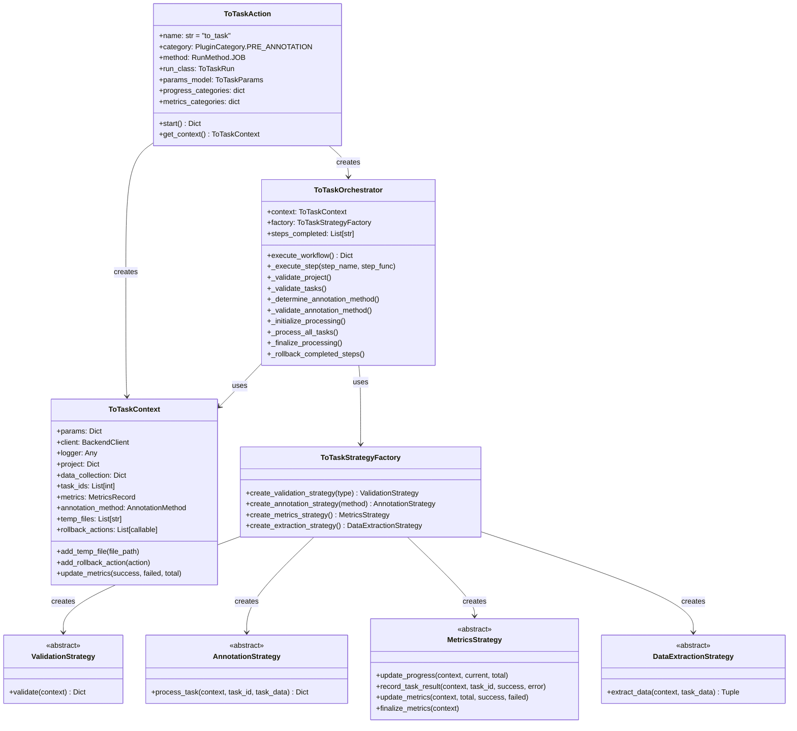
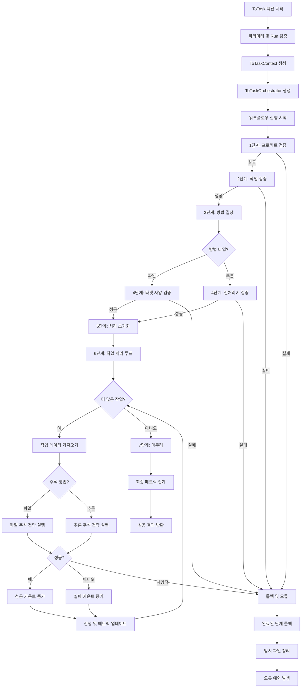

# ToTask 액션 - SDK 개발자 가이드

:::info 대상 독자
이 가이드는 ToTaskAction 프레임워크, 오케스트레이터, 전략 및 워크플로우 엔진을 작업하는 **SDK 핵심 개발자**를 위한 것입니다.

AnnotationToTask 템플릿을 사용하여 커스텀 pre-annotation 플러그인을 생성하는 **플러그인 개발자**라면 [ToTask 템플릿 개발](./to-task-template-development.md) 가이드를 참조하세요.
:::

이 가이드는 ToTask 액션 아키텍처에 대한 포괄적인 기술 문서를 제공하며, 설계 패턴, 워크플로우 실행, 커스텀 전략 구현을 위한 확장 포인트를 포함합니다.

## 아키텍처 개요

ToTask 액션은 네 가지 핵심 설계 패턴을 사용하는 현대적이고 유지보수 가능한 아키텍처로 구축되었습니다:

### 설계 패턴

#### 1. 전략 패턴 (Strategy Pattern)

검증, 주석, 메트릭 및 데이터 추출을 위한 플러그형 알고리즘을 가능하게 합니다. 구성에 따라 런타임에 다른 전략을 선택할 수 있습니다.

#### 2. 퍼사드 패턴 (Facade Pattern)

`ToTaskOrchestrator`는 복잡한 7단계 워크플로우에 대한 단순화된 인터페이스를 제공하며, 오케스트레이션, 오류 관리 및 롤백을 처리합니다.

#### 3. 팩토리 패턴 (Factory Pattern)

`ToTaskStrategyFactory`는 런타임 파라미터에 따라 적절한 전략 인스턴스를 생성하여 전략 생성과 사용을 분리합니다.

#### 4. 컨텍스트 패턴 (Context Pattern)

`ToTaskContext`는 실행 전반에 걸쳐 워크플로우 컴포넌트 간의 공유 상태와 통신 채널을 유지합니다.

## 핵심 컴포넌트

### 컴포넌트 다이어그램



### ToTaskAction

**파일:** `synapse_sdk/plugins/categories/pre_annotation/actions/to_task/action.py`

주석 액션의 진입점입니다.

**책임:**

- `ToTaskParams` 모델을 사용한 파라미터 검증
- 실행 컨텍스트 생성
- 오케스트레이터 인스턴스화 및 실행
- 최상위 오류 처리

**주요 속성:**

```python
class ToTaskAction(BaseAction):
    name = 'to_task'
    category = PluginCategory.PRE_ANNOTATION
    method = RunMethod.JOB
    run_class = ToTaskRun
    params_model = ToTaskParams

    progress_categories = {
        'annotate_task_data': {
            'label': 'Annotating Task Data',
            'weight': 1.0
        }
    }

    metrics_categories = {
        'annotate_task_data': {
            'label': 'Task Annotation Metrics',
            'metrics': ['success', 'failed', 'stand_by']
        }
    }
```

**주요 메서드:**

```python
def start(self) -> Dict[str, Any]:
    """ToTask 액션 워크플로우 실행"""
    try:
        # 실행 컨텍스트 생성
        context = self.get_context()

        # 오케스트레이터 생성 및 실행
        orchestrator = ToTaskOrchestrator(context)
        result = orchestrator.execute_workflow()

        return {
            'status': JobStatus.SUCCEEDED,
            'message': f'Successfully processed {result["total"]} tasks'
        }
    except Exception as e:
        return {
            'status': JobStatus.FAILED,
            'message': str(e)
        }
```

### ToTaskOrchestrator

**파일:** `synapse_sdk/plugins/categories/pre_annotation/actions/to_task/orchestrator.py`

7단계 워크플로우를 오케스트레이션하는 퍼사드입니다.

**책임:**

- 워크플로우 단계를 순차적으로 실행
- 롤백을 위해 완료된 단계 추적
- 오류 처리 및 롤백 트리거
- 전략 인스턴스 관리

**주요 메서드:**

```python
class ToTaskOrchestrator:
    def __init__(self, context: ToTaskContext):
        self.context = context
        self.factory = ToTaskStrategyFactory()
        self.steps_completed = []

        # 검증 전략 초기화
        self.project_validation = self.factory.create_validation_strategy('project')
        self.task_validation = self.factory.create_validation_strategy('task')
        self.target_spec_validation = self.factory.create_validation_strategy('target_spec')

        # 메트릭 전략 초기화
        self.metrics_strategy = self.factory.create_metrics_strategy()

    def execute_workflow(self) -> Dict[str, Any]:
        """완전한 7단계 워크플로우 실행"""
        try:
            # 1단계: 프로젝트 검증
            self._execute_step('project_validation', self._validate_project)

            # 2단계: 작업 검증
            self._execute_step('task_validation', self._validate_tasks)

            # 3단계: 주석 방법 결정
            self._execute_step('method_determination', self._determine_annotation_method)

            # 4단계: 주석 방법 검증
            self._execute_step('method_validation', self._validate_annotation_method)

            # 5단계: 처리 초기화
            self._execute_step('processing_initialization', self._initialize_processing)

            # 6단계: 모든 작업 처리
            self._execute_step('task_processing', self._process_all_tasks)

            # 7단계: 마무리
            self._execute_step('finalization', self._finalize_processing)

            return self.context.metrics

        except Exception as e:
            # 오류 발생 시 롤백
            self._rollback_completed_steps()
            raise

    def _execute_step(self, step_name: str, step_func: callable):
        """워크플로우 단계 실행 및 완료 추적"""
        step_func()
        self.steps_completed.append(step_name)
        self.context.logger.log_message_with_code(
            LogCode.STEP_COMPLETED, step_name
        )
```

### ToTaskContext

**파일:** `synapse_sdk/plugins/categories/pre_annotation/actions/to_task/models.py`

워크플로우 컴포넌트를 위한 공유 실행 컨텍스트입니다.

**주요 속성:**

```python
class ToTaskContext:
    def __init__(self, params: Dict, client: Any, logger: Any):
        # 구성
        self.params = params
        self.client = client
        self.logger = logger

        # 프로젝트 데이터
        self.project: Optional[Dict] = None
        self.data_collection: Optional[Dict] = None

        # 작업 데이터
        self.task_ids: List[int] = []

        # 실행 상태
        self.annotation_method: Optional[AnnotationMethod] = None
        self.metrics = MetricsRecord(success=0, failed=0, total=0)

        # 정리 추적
        self.temp_files: List[str] = []
        self.rollback_actions: List[callable] = []
```

**헬퍼 메서드:**

```python
def add_temp_file(self, file_path: str):
    """정리를 위한 임시 파일 등록"""
    self.temp_files.append(file_path)

def add_rollback_action(self, action: callable):
    """롤백 액션 등록"""
    self.rollback_actions.append(action)

def update_metrics(self, success_count: int, failed_count: int, total_count: int):
    """메트릭 카운터 업데이트"""
    self.metrics.success = success_count
    self.metrics.failed = failed_count
    self.metrics.total = total_count
```

### ToTaskStrategyFactory

**파일:** `synapse_sdk/plugins/categories/pre_annotation/actions/to_task/factory.py`

전략 인스턴스 생성을 위한 팩토리입니다.

**구현:**

```python
class ToTaskStrategyFactory:
    def create_validation_strategy(
        self, strategy_type: str
    ) -> ValidationStrategy:
        """타입별 검증 전략 생성"""
        strategies = {
            'project': ProjectValidationStrategy,
            'task': TaskValidationStrategy,
            'target_spec': TargetSpecValidationStrategy
        }

        strategy_class = strategies.get(strategy_type)
        if not strategy_class:
            raise ValueError(f'Unknown validation strategy: {strategy_type}')

        return strategy_class()

    def create_annotation_strategy(
        self, method: AnnotationMethod
    ) -> AnnotationStrategy:
        """방법별 주석 전략 생성"""
        if method == AnnotationMethod.FILE:
            return FileAnnotationStrategy()
        elif method == AnnotationMethod.INFERENCE:
            return InferenceAnnotationStrategy()
        else:
            raise ValueError(f'Unknown annotation method: {method}')

    def create_metrics_strategy(self) -> MetricsStrategy:
        """메트릭 전략 생성"""
        return ToTaskMetricsStrategy()

    def create_extraction_strategy(self) -> DataExtractionStrategy:
        """데이터 추출 전략 생성"""
        return FileDataExtractionStrategy()
```

## 전략 아키텍처

### 전략 기본 클래스

**파일:** `synapse_sdk/plugins/categories/pre_annotation/actions/to_task/strategies/base.py`

#### ValidationStrategy

```python
class ValidationStrategy(ABC):
    """검증 전략의 기본 클래스"""

    @abstractmethod
    def validate(self, context: ToTaskContext) -> Dict[str, Any]:
        """
        검증 수행

        Args:
            context: 실행 컨텍스트

        Returns:
            'success' (bool) 및 선택적 'error' (str)가 있는 딕셔너리
        """
        pass
```

#### AnnotationStrategy

```python
class AnnotationStrategy(ABC):
    """주석 전략의 기본 클래스"""

    @abstractmethod
    def process_task(
        self,
        context: ToTaskContext,
        task_id: int,
        task_data: Dict[str, Any],
        **kwargs
    ) -> Dict[str, Any]:
        """
        단일 작업 주석 처리

        Args:
            context: 실행 컨텍스트
            task_id: 작업 ID
            task_data: API의 작업 데이터
            **kwargs: 추가 파라미터

        Returns:
            'success' (bool) 및 선택적 'error' (str)가 있는 딕셔너리
        """
        pass
```

#### MetricsStrategy

```python
class MetricsStrategy(ABC):
    """메트릭 추적의 기본 클래스"""

    @abstractmethod
    def update_progress(self, context: ToTaskContext, current: int, total: int):
        """진행 백분율 업데이트"""
        pass

    @abstractmethod
    def record_task_result(
        self,
        context: ToTaskContext,
        task_id: int,
        success: bool,
        error: Optional[str] = None
    ):
        """개별 작업 결과 기록"""
        pass

    @abstractmethod
    def update_metrics(
        self,
        context: ToTaskContext,
        total: int,
        success: int,
        failed: int
    ):
        """집계 메트릭 업데이트"""
        pass

    @abstractmethod
    def finalize_metrics(self, context: ToTaskContext):
        """최종 메트릭 마무리 및 기록"""
        pass
```

#### DataExtractionStrategy

```python
class DataExtractionStrategy(ABC):
    """데이터 추출의 기본 클래스"""

    @abstractmethod
    def extract_data(
        self,
        context: ToTaskContext,
        task_data: Dict[str, Any]
    ) -> Tuple[Optional[str], Optional[str]]:
        """
        작업에서 필요한 데이터 추출

        Args:
            context: 실행 컨텍스트
            task_data: API의 작업 데이터

        Returns:
            (data_url, original_name) 튜플
        """
        pass
```

### 검증 전략 구현

**파일:** `synapse_sdk/plugins/categories/pre_annotation/actions/to_task/strategies/validation.py`

#### ProjectValidationStrategy

```python
class ProjectValidationStrategy(ValidationStrategy):
    """프로젝트 및 데이터 컬렉션 검증"""

    def validate(self, context: ToTaskContext) -> Dict[str, Any]:
        try:
            # 프로젝트 가져오기
            project_id = context.params['project']
            project = context.client.get_project(project_id)

            if not project:
                return {
                    'success': False,
                    'error': f'Project {project_id} not found'
                }

            context.project = project

            # 데이터 컬렉션 확인
            data_collection_id = project.get('data_collection')
            if not data_collection_id:
                return {
                    'success': False,
                    'error': 'Project has no data collection'
                }

            # 데이터 컬렉션 세부정보 가져오기
            data_collection = context.client.get_data_collection(
                data_collection_id
            )
            context.data_collection = data_collection

            context.logger.log_message_with_code(
                LogCode.PROJECT_VALIDATED,
                project_id,
                data_collection_id
            )

            return {'success': True}

        except Exception as e:
            return {
                'success': False,
                'error': f'Project validation failed: {str(e)}'
            }
```

#### TaskValidationStrategy

```python
class TaskValidationStrategy(ValidationStrategy):
    """작업 검증 및 검색"""

    def validate(self, context: ToTaskContext) -> Dict[str, Any]:
        try:
            # 필터와 일치하는 작업 가져오기
            project_id = context.params['project']
            task_filters = context.params['task_filters']

            tasks = context.client.list_tasks(
                project=project_id,
                **task_filters
            )

            if not tasks:
                return {
                    'success': False,
                    'error': 'No tasks found matching filters'
                }

            # 작업 ID 저장
            context.task_ids = [task['id'] for task in tasks]

            context.logger.log_message_with_code(
                LogCode.TASKS_VALIDATED,
                len(context.task_ids)
            )

            return {'success': True}

        except Exception as e:
            return {
                'success': False,
                'error': f'Task validation failed: {str(e)}'
            }
```

#### TargetSpecValidationStrategy

```python
class TargetSpecValidationStrategy(ValidationStrategy):
    """대상 사양 이름이 존재하는지 검증"""

    def validate(self, context: ToTaskContext) -> Dict[str, Any]:
        try:
            target_spec_name = context.params.get('target_specification_name')

            if not target_spec_name:
                return {
                    'success': False,
                    'error': 'target_specification_name is required for file method'
                }

            # 데이터 컬렉션 파일 사양 가져오기
            file_specs = context.data_collection.get('file_specifications', [])
            spec_names = [spec['name'] for spec in file_specs]

            if target_spec_name not in spec_names:
                return {
                    'success': False,
                    'error': f'Target specification "{target_spec_name}" not found'
                }

            context.logger.log_message_with_code(
                LogCode.TARGET_SPEC_VALIDATED,
                target_spec_name
            )

            return {'success': True}

        except Exception as e:
            return {
                'success': False,
                'error': f'Target spec validation failed: {str(e)}'
            }
```

### 주석 전략 구현

**파일:** `synapse_sdk/plugins/categories/pre_annotation/actions/to_task/strategies/annotation.py`

#### FileAnnotationStrategy

```python
class FileAnnotationStrategy(AnnotationStrategy):
    """JSON 파일을 사용한 작업 주석"""

    def process_task(
        self,
        context: ToTaskContext,
        task_id: int,
        task_data: Dict[str, Any],
        **kwargs
    ) -> Dict[str, Any]:
        try:
            # 대상 파일 URL 추출
            extraction_strategy = FileDataExtractionStrategy()
            url, original_name = extraction_strategy.extract_data(
                context, task_data
            )

            if not url:
                return {
                    'success': False,
                    'error': 'No file URL found for target specification'
                }

            # JSON 데이터 다운로드
            json_data = self._download_json_data(url)

            # 작업 객체로 변환
            task_object = self._convert_to_task_object(json_data)

            # 작업 업데이트
            result = context.client.update_task(
                task_id,
                data={'data': task_object}
            )

            if result:
                context.logger.log_message_with_code(
                    LogCode.ANNOTATION_COMPLETED,
                    task_id
                )
                return {'success': True}
            else:
                return {
                    'success': False,
                    'error': 'Failed to update task'
                }

        except Exception as e:
            return {
                'success': False,
                'error': f'File annotation failed: {str(e)}'
            }

    def _download_json_data(self, url: str) -> Dict[str, Any]:
        """URL에서 JSON 다운로드 및 파싱"""
        import requests
        response = requests.get(url, timeout=30)
        response.raise_for_status()
        return response.json()

    def _convert_to_task_object(self, json_data: Dict[str, Any]) -> Dict[str, Any]:
        """JSON 데이터를 작업 객체 형식으로 변환"""
        # 필요에 따라 검증 및 변환
        return json_data
```

#### InferenceAnnotationStrategy

```python
class InferenceAnnotationStrategy(AnnotationStrategy):
    """모델 추론을 사용한 작업 주석"""

    def process_task(
        self,
        context: ToTaskContext,
        task_id: int,
        task_data: Dict[str, Any],
        **kwargs
    ) -> Dict[str, Any]:
        try:
            # 전처리기 정보 가져오기
            preprocessor_id = context.params['pre_processor']
            preprocessor_info = self._get_preprocessor_info(
                context, preprocessor_id
            )

            # 전처리기가 실행 중인지 확인
            self._ensure_preprocessor_running(
                context, preprocessor_info['code']
            )

            # 주 이미지 URL 추출
            image_url = self._extract_primary_image_url(task_data)

            if not image_url:
                return {
                    'success': False,
                    'error': 'No primary image found'
                }

            # 전처리기 API 호출
            inference_params = context.params.get('pre_processor_params', {})
            result = self._call_preprocessor_api(
                preprocessor_info,
                image_url,
                inference_params
            )

            # 추론 결과를 작업 객체로 변환
            task_object = self._convert_inference_to_task_object(result)

            # 작업 업데이트
            update_result = context.client.update_task(
                task_id,
                data={'data': task_object}
            )

            if update_result:
                context.logger.log_message_with_code(
                    LogCode.INFERENCE_COMPLETED,
                    task_id
                )
                return {'success': True}
            else:
                return {
                    'success': False,
                    'error': 'Failed to update task with inference results'
                }

        except Exception as e:
            return {
                'success': False,
                'error': f'Inference annotation failed: {str(e)}'
            }

    def _get_preprocessor_info(
        self, context: ToTaskContext, preprocessor_id: int
    ) -> Dict[str, Any]:
        """전처리기 세부정보 가져오기"""
        return context.client.get_plugin_release(preprocessor_id)

    def _ensure_preprocessor_running(
        self, context: ToTaskContext, preprocessor_code: str
    ):
        """전처리기가 배포되고 실행 중인지 확인"""
        # Ray Serve 애플리케이션 확인
        apps = context.client.list_serve_applications(
            agent=context.params['agent']
        )

        # 코드로 앱 찾기
        app = next(
            (a for a in apps if a['code'] == preprocessor_code),
            None
        )

        if not app or app['status'] != 'RUNNING':
            # 전처리기 배포
            context.logger.log_message_with_code(
                LogCode.DEPLOYING_PREPROCESSOR,
                preprocessor_code
            )
            # 배포 로직...

    def _extract_primary_image_url(self, task_data: Dict[str, Any]) -> Optional[str]:
        """작업 데이터에서 주 이미지 URL 추출"""
        data_unit = task_data.get('data_unit', {})
        files = data_unit.get('files', [])

        for file_info in files:
            if file_info.get('is_primary'):
                return file_info.get('url')

        return None

    def _call_preprocessor_api(
        self,
        preprocessor_info: Dict[str, Any],
        image_url: str,
        params: Dict[str, Any]
    ) -> Dict[str, Any]:
        """추론을 위한 전처리기 API 호출"""
        import requests

        api_url = preprocessor_info['api_endpoint']
        payload = {
            'image_url': image_url,
            **params
        }

        response = requests.post(api_url, json=payload, timeout=60)
        response.raise_for_status()
        return response.json()

    def _convert_inference_to_task_object(
        self, result: Dict[str, Any]
    ) -> Dict[str, Any]:
        """추론 결과를 작업 객체 형식으로 변환"""
        # 모델 출력을 작업 객체 구조로 변환
        return result
```

## 워크플로우 실행

### 7단계 워크플로우



### 단계 세부사항

#### 1단계: 프로젝트 검증

```python
def _validate_project(self):
    """프로젝트 및 데이터 컬렉션 검증"""
    result = self.project_validation.validate(self.context)

    if not result['success']:
        raise PreAnnotationToTaskFailed(result.get('error'))

    # 이제 프로젝트와 데이터 컬렉션을 컨텍스트에서 사용 가능
    self.context.logger.log_message_with_code(
        LogCode.PROJECT_VALIDATION_COMPLETE
    )
```

#### 2단계: 작업 검증

```python
def _validate_tasks(self):
    """작업 검증 및 검색"""
    result = self.task_validation.validate(self.context)

    if not result['success']:
        raise PreAnnotationToTaskFailed(result.get('error'))

    # 이제 작업 ID가 context.task_ids에서 사용 가능
    task_count = len(self.context.task_ids)
    self.context.logger.log_message_with_code(
        LogCode.TASKS_FOUND,
        task_count
    )
```

#### 3단계: 방법 결정

```python
def _determine_annotation_method(self):
    """파라미터에서 주석 방법 결정"""
    method = self.context.params.get('method')

    if method == 'file':
        self.context.annotation_method = AnnotationMethod.FILE
    elif method == 'inference':
        self.context.annotation_method = AnnotationMethod.INFERENCE
    else:
        raise PreAnnotationToTaskFailed(
            f'Unsupported annotation method: {method}'
        )

    self.context.logger.log_message_with_code(
        LogCode.METHOD_DETERMINED,
        self.context.annotation_method
    )
```

#### 4단계: 방법 검증

```python
def _validate_annotation_method(self):
    """방법별 요구사항 검증"""
    if self.context.annotation_method == AnnotationMethod.FILE:
        # 대상 사양 검증
        result = self.target_spec_validation.validate(self.context)

        if not result['success']:
            raise PreAnnotationToTaskFailed(result.get('error'))

    elif self.context.annotation_method == AnnotationMethod.INFERENCE:
        # 전처리기 검증
        preprocessor_id = self.context.params.get('pre_processor')

        if not preprocessor_id:
            raise PreAnnotationToTaskFailed(
                'pre_processor is required for inference method'
            )

        # 추가 전처리기 검증...
```

#### 5단계: 처리 초기화

```python
def _initialize_processing(self):
    """메트릭 및 진행 추적 초기화"""
    total_tasks = len(self.context.task_ids)

    # 메트릭 재설정
    self.context.update_metrics(
        success_count=0,
        failed_count=0,
        total_count=total_tasks
    )

    # 진행 초기화
    self.metrics_strategy.update_progress(
        self.context,
        current=0,
        total=total_tasks
    )

    self.context.logger.log_message_with_code(
        LogCode.PROCESSING_INITIALIZED,
        total_tasks
    )
```

#### 6단계: 작업 처리

```python
def _process_all_tasks(self):
    """주석 전략으로 모든 작업 처리"""
    # 주석 전략 생성
    annotation_strategy = self.factory.create_annotation_strategy(
        self.context.annotation_method
    )

    success_count = 0
    failed_count = 0
    total_tasks = len(self.context.task_ids)

    # 작업 쿼리 파라미터
    task_params = {
        'expand': 'data_unit,data_unit.files'
    }

    # 각 작업 처리
    for index, task_id in enumerate(self.context.task_ids, start=1):
        try:
            # 작업 데이터 가져오기
            task_data = self.context.client.get_task(
                task_id,
                params=task_params
            )

            # 주석 전략 실행
            result = annotation_strategy.process_task(
                self.context,
                task_id,
                task_data,
                target_specification_name=self.context.params.get(
                    'target_specification_name'
                )
            )

            # 카운터 업데이트
            if result['success']:
                success_count += 1
                self.metrics_strategy.record_task_result(
                    self.context,
                    task_id,
                    success=True
                )
            else:
                failed_count += 1
                self.metrics_strategy.record_task_result(
                    self.context,
                    task_id,
                    success=False,
                    error=result.get('error')
                )

        except CriticalError as e:
            # 치명적 오류는 처리 중지
            raise PreAnnotationToTaskFailed(
                f'Critical error processing task {task_id}: {str(e)}'
            )

        except Exception as e:
            # 작업 수준 오류는 처리 계속
            failed_count += 1
            self.context.logger.log_message_with_code(
                LogCode.TASK_PROCESSING_FAILED,
                task_id,
                str(e)
            )

        # 진행 및 메트릭 업데이트
        self.metrics_strategy.update_progress(
            self.context,
            current=index,
            total=total_tasks
        )

        self.context.update_metrics(
            success_count=success_count,
            failed_count=failed_count,
            total_count=total_tasks
        )

        self.metrics_strategy.update_metrics(
            self.context,
            total=total_tasks,
            success=success_count,
            failed=failed_count
        )
```

#### 7단계: 마무리

```python
def _finalize_processing(self):
    """메트릭 마무리 및 정리"""
    self.metrics_strategy.finalize_metrics(self.context)

    # 완료 기록
    self.context.logger.log_message_with_code(
        LogCode.TO_TASK_COMPLETED,
        self.context.metrics.success,
        self.context.metrics.failed
    )
```

## 오류 처리 및 롤백

### 롤백 메커니즘

```python
def _rollback_completed_steps(self):
    """완료된 모든 워크플로우 단계 롤백"""
    self.context.logger.log_message_with_code(
        LogCode.ROLLBACK_STARTED,
        len(self.steps_completed)
    )

    # 역순으로 단계 롤백
    for step in reversed(self.steps_completed):
        try:
            rollback_method = getattr(self, f'_rollback_{step}', None)
            if rollback_method:
                rollback_method()
                self.context.logger.log_message_with_code(
                    LogCode.STEP_ROLLED_BACK,
                    step
                )
        except Exception as e:
            self.context.logger.log_message_with_code(
                LogCode.ROLLBACK_FAILED,
                step,
                str(e)
            )

    # 커스텀 롤백 액션 실행
    for action in reversed(self.context.rollback_actions):
        try:
            action()
        except Exception as e:
            self.context.logger.log_message_with_code(
                LogCode.ROLLBACK_ACTION_FAILED,
                str(e)
            )

    # 임시 파일 정리
    self._cleanup_temp_files()
```

### 단계별 롤백 메서드

```python
def _rollback_project_validation(self):
    """프로젝트 검증 롤백"""
    self.context.project = None
    self.context.data_collection = None

def _rollback_task_validation(self):
    """작업 검증 롤백"""
    self.context.task_ids = []

def _rollback_processing_initialization(self):
    """처리 초기화 롤백"""
    self.context.metrics = MetricsRecord(success=0, failed=0, total=0)

def _rollback_task_processing(self):
    """작업 처리 롤백"""
    # 정리는 임시 파일로 처리됨
    pass

def _cleanup_temp_files(self):
    """모든 임시 파일 제거"""
    for file_path in self.context.temp_files:
        try:
            if os.path.exists(file_path):
                os.remove(file_path)
        except Exception as e:
            self.context.logger.log_message_with_code(
                LogCode.TEMP_FILE_CLEANUP_FAILED,
                file_path,
                str(e)
            )
```

### 오류 레벨

**작업 수준 오류:**

- 개별 작업 처리 실패
- 메트릭에 기록되고 카운트됨
- 워크플로우는 나머지 작업과 계속됨

**치명적 오류:**

- 시스템 수준 실패
- 즉시 워크플로우 종료 트리거
- 롤백 프로세스 시작

**워크플로우 오류:**

- 단계 검증 실패
- 완료된 단계 롤백
- 호출자에게 예외 전파

## ToTask 액션 확장

### 커스텀 검증 전략 생성

```python
from synapse_sdk.plugins.categories.pre_annotation.actions.to_task.strategies.base import ValidationStrategy

class CustomBusinessRuleValidationStrategy(ValidationStrategy):
    """비즈니스별 규칙에 대한 커스텀 검증"""

    def validate(self, context: ToTaskContext) -> Dict[str, Any]:
        """커스텀 비즈니스 규칙 검증"""
        try:
            # 작업 가져오기
            tasks = context.client.list_tasks(
                project=context.params['project'],
                **context.params['task_filters']
            )

            # 커스텀 검증 로직
            for task in tasks:
                # 비즈니스 규칙 확인
                if not self._meets_business_rules(task):
                    return {
                        'success': False,
                        'error': f'Task {task["id"]} violates business rules'
                    }

            # 작업 ID 저장
            context.task_ids = [task['id'] for task in tasks]

            return {'success': True}

        except Exception as e:
            return {
                'success': False,
                'error': f'Custom validation failed: {str(e)}'
            }

    def _meets_business_rules(self, task: Dict[str, Any]) -> bool:
        """작업이 비즈니스 규칙을 충족하는지 확인"""
        # 비즈니스 로직 구현
        return True
```

### 커스텀 주석 전략 생성

```python
from synapse_sdk.plugins.categories.pre_annotation.actions.to_task.strategies.base import AnnotationStrategy

class ExternalAPIAnnotationStrategy(AnnotationStrategy):
    """외부 API 서비스를 사용한 주석"""

    def process_task(
        self,
        context: ToTaskContext,
        task_id: int,
        task_data: Dict[str, Any],
        **kwargs
    ) -> Dict[str, Any]:
        """외부 API를 사용한 작업 처리"""
        try:
            # 이미지 URL 추출
            image_url = self._extract_image_url(task_data)

            # 외부 API 호출
            api_url = context.params.get('external_api_url')
            api_key = context.params.get('external_api_key')

            annotations = self._call_external_api(
                api_url,
                api_key,
                image_url
            )

            # 작업 객체로 변환
            task_object = self._convert_annotations(annotations)

            # 작업 업데이트
            result = context.client.update_task(
                task_id,
                data={'data': task_object}
            )

            if result:
                return {'success': True}
            else:
                return {
                    'success': False,
                    'error': 'Failed to update task'
                }

        except Exception as e:
            return {
                'success': False,
                'error': f'External API annotation failed: {str(e)}'
            }

    def _extract_image_url(self, task_data: Dict[str, Any]) -> str:
        """작업 데이터에서 이미지 URL 추출"""
        # 구현...
        pass

    def _call_external_api(
        self, api_url: str, api_key: str, image_url: str
    ) -> Dict[str, Any]:
        """외부 주석 API 호출"""
        import requests

        response = requests.post(
            api_url,
            headers={'Authorization': f'Bearer {api_key}'},
            json={'image_url': image_url},
            timeout=30
        )
        response.raise_for_status()
        return response.json()

    def _convert_annotations(self, annotations: Dict[str, Any]) -> Dict[str, Any]:
        """외부 형식을 작업 객체로 변환"""
        # 구현...
        pass
```

### 커스텀 전략 통합

커스텀 전략을 지원하도록 팩토리 업데이트:

```python
class CustomToTaskStrategyFactory(ToTaskStrategyFactory):
    """커스텀 전략을 포함한 확장 팩토리"""

    def create_validation_strategy(
        self, strategy_type: str
    ) -> ValidationStrategy:
        """커스텀 타입을 포함한 검증 전략 생성"""
        strategies = {
            'project': ProjectValidationStrategy,
            'task': TaskValidationStrategy,
            'target_spec': TargetSpecValidationStrategy,
            'business_rules': CustomBusinessRuleValidationStrategy,  # 커스텀
        }

        strategy_class = strategies.get(strategy_type)
        if not strategy_class:
            raise ValueError(f'Unknown validation strategy: {strategy_type}')

        return strategy_class()

    def create_annotation_strategy(
        self, method: AnnotationMethod
    ) -> AnnotationStrategy:
        """커스텀 방법을 포함한 주석 전략 생성"""
        if method == AnnotationMethod.FILE:
            return FileAnnotationStrategy()
        elif method == AnnotationMethod.INFERENCE:
            return InferenceAnnotationStrategy()
        elif method == 'external_api':  # 커스텀
            return ExternalAPIAnnotationStrategy()
        else:
            raise ValueError(f'Unknown annotation method: {method}')
```

## API 레퍼런스

### 모델 및 Enum

**파일:** `synapse_sdk/plugins/categories/pre_annotation/actions/to_task/models.py`

#### ToTaskParams

```python
class ToTaskParams(BaseModel):
    """ToTask 액션의 파라미터"""

    name: str = Field(..., description="액션 이름 (공백 불가)")
    description: Optional[str] = Field(None, description="액션 설명")
    project: int = Field(..., description="프로젝트 ID")
    agent: int = Field(..., description="에이전트 ID")
    task_filters: Dict[str, Any] = Field(..., description="작업 필터 기준")
    method: str = Field(..., description="주석 방법: 'file' 또는 'inference'")
    target_specification_name: Optional[str] = Field(
        None,
        description="파일 사양 이름 (파일 방법에 필수)"
    )
    model: Optional[int] = Field(None, description="모델 ID")
    pre_processor: Optional[int] = Field(
        None,
        description="전처리기 ID (추론 방법에 필수)"
    )
    pre_processor_params: Dict[str, Any] = Field(
        default_factory=dict,
        description="전처리기 구성 파라미터"
    )

    @validator('name')
    def validate_name(cls, v):
        """이름에 공백이 없는지 검증"""
        if ' ' in v:
            raise ValueError('Name must not contain whitespace')
        return v

    @validator('method')
    def validate_method(cls, v):
        """방법이 지원되는지 검증"""
        if v not in ['file', 'inference']:
            raise ValueError('Method must be "file" or "inference"')
        return v
```

#### ToTaskResult

```python
class ToTaskResult(BaseModel):
    """ToTask 액션의 결과"""

    status: JobStatus = Field(..., description="작업 상태")
    message: str = Field(..., description="결과 메시지")
```

#### MetricsRecord

```python
class MetricsRecord(BaseModel):
    """메트릭 추적 레코드"""

    success: int = Field(0, description="성공적으로 처리된 수")
    failed: int = Field(0, description="처리 실패 수")
    total: int = Field(0, description="총 작업 수")
```

**파일:** `synapse_sdk/plugins/categories/pre_annotation/actions/to_task/enums.py`

#### AnnotationMethod

```python
class AnnotationMethod(str, Enum):
    """지원되는 주석 방법"""

    FILE = 'file'
    INFERENCE = 'inference'
```

#### LogCode

```python
class LogCode(str, Enum):
    """타입 안전 로깅 코드"""

    # 워크플로우 코드
    TO_TASK_STARTED = 'to_task_started'
    STEP_COMPLETED = 'step_completed'
    TO_TASK_COMPLETED = 'to_task_completed'

    # 검증 코드
    PROJECT_VALIDATED = 'project_validated'
    TASKS_VALIDATED = 'tasks_validated'
    TARGET_SPEC_VALIDATED = 'target_spec_validated'
    INVALID_PROJECT_RESPONSE = 'invalid_project_response'
    NO_DATA_COLLECTION = 'no_data_collection'
    TARGET_SPEC_NOT_FOUND = 'target_spec_not_found'

    # 처리 코드
    PROCESSING_INITIALIZED = 'processing_initialized'
    ANNOTATING_DATA = 'annotating_data'
    ANNOTATION_COMPLETED = 'annotation_completed'
    TASK_PROCESSING_FAILED = 'task_processing_failed'

    # 추론 코드
    ANNOTATING_INFERENCE_DATA = 'annotating_inference_data'
    DEPLOYING_PREPROCESSOR = 'deploying_preprocessor'
    INFERENCE_COMPLETED = 'inference_completed'
    INFERENCE_PROCESSING_FAILED = 'inference_processing_failed'

    # 롤백 코드
    ROLLBACK_STARTED = 'rollback_started'
    STEP_ROLLED_BACK = 'step_rolled_back'
    ROLLBACK_FAILED = 'rollback_failed'
    ROLLBACK_ACTION_FAILED = 'rollback_action_failed'

    # 메트릭 코드
    PROGRESS_UPDATE_FAILED = 'progress_update_failed'
    METRICS_RECORDING_FAILED = 'metrics_recording_failed'
    METRICS_UPDATE_FAILED = 'metrics_update_failed'
    METRICS_FINALIZATION_FAILED = 'metrics_finalization_failed'
```

## 테스트

### 단위 테스트 전략

```python
import pytest
from unittest.mock import Mock, patch
from synapse_sdk.plugins.categories.pre_annotation.actions.to_task.strategies.validation import ProjectValidationStrategy

class TestProjectValidationStrategy:
    """프로젝트 검증 전략 테스트"""

    def test_validate_success(self):
        """성공적인 검증 테스트"""
        # 설정
        context = Mock()
        context.params = {'project': 123}
        context.client.get_project.return_value = {
            'id': 123,
            'data_collection': 456
        }
        context.client.get_data_collection.return_value = {
            'id': 456
        }

        # 실행
        strategy = ProjectValidationStrategy()
        result = strategy.validate(context)

        # 확인
        assert result['success'] is True
        assert context.project == {'id': 123, 'data_collection': 456}
        assert context.data_collection == {'id': 456}

    def test_validate_no_project(self):
        """프로젝트를 찾을 수 없을 때 검증 실패 테스트"""
        # 설정
        context = Mock()
        context.params = {'project': 999}
        context.client.get_project.return_value = None

        # 실행
        strategy = ProjectValidationStrategy()
        result = strategy.validate(context)

        # 확인
        assert result['success'] is False
        assert 'not found' in result['error']

    def test_validate_no_data_collection(self):
        """데이터 컬렉션이 없을 때 검증 실패 테스트"""
        # 설정
        context = Mock()
        context.params = {'project': 123}
        context.client.get_project.return_value = {
            'id': 123,
            'data_collection': None
        }

        # 실행
        strategy = ProjectValidationStrategy()
        result = strategy.validate(context)

        # 확인
        assert result['success'] is False
        assert 'no data collection' in result['error']
```

### 통합 테스트

```python
class TestToTaskIntegration:
    """ToTask 워크플로우 통합 테스트"""

    @pytest.fixture
    def mock_context(self):
        """모의 컨텍스트 생성"""
        context = Mock(spec=ToTaskContext)
        context.params = {
            'project': 123,
            'agent': 1,
            'task_filters': {'status': 'pending'},
            'method': 'file',
            'target_specification_name': 'annotations'
        }
        context.task_ids = [1, 2, 3]
        return context

    def test_full_workflow_file_method(self, mock_context):
        """파일 방법으로 완전한 워크플로우 테스트"""
        # 오케스트레이터 설정
        orchestrator = ToTaskOrchestrator(mock_context)

        # 검증 응답 모의
        mock_context.client.get_project.return_value = {
            'id': 123,
            'data_collection': 456
        }

        # 워크플로우 실행
        result = orchestrator.execute_workflow()

        # 모든 단계 완료 확인
        assert 'project_validation' in orchestrator.steps_completed
        assert 'task_validation' in orchestrator.steps_completed
        assert 'finalization' in orchestrator.steps_completed

        # 메트릭 확인
        assert result.total == 3
```

## 마이그레이션 가이드

### 레거시 구현에서

레거시 ToTask 구현에서 마이그레이션하는 경우:

**주요 변경사항:**

1. **전략 기반 아키텍처** - 단일 로직을 전략으로 대체
2. **오케스트레이션된 워크플로우** - 임의 실행 대신 정의된 7단계
3. **자동 롤백** - 내장된 오류 복구
4. **타입 안전 로깅** - 문자열 메시지 대신 LogCode enum

**마이그레이션 단계:**

1. `ToTaskParams` 모델을 사용하도록 파라미터 검증 업데이트
2. 커스텀 검증 로직을 검증 전략으로 대체
3. 주석 로직을 주석 전략으로 마이그레이션
4. 오케스트레이터 롤백을 사용하도록 오류 처리 업데이트
5. LogCode 기반 메시지로 로깅 대체

## 모범 사례

### 성능

1. 추론을 위한 **적절한 배치 크기 사용**
2. 처리 오버헤드를 줄이기 위해 **작업을 효율적으로 필터링**
3. 적절한 경우 커스텀 전략에 **캐싱 구현**
4. 대규모 작업 세트에 대한 **메모리 사용량 모니터링**

### 신뢰성

1. 처리 전 **모든 입력 검증**
2. 커스텀 전략에 **적절한 오류 처리 구현**
3. 정리 작업을 위해 **롤백 액션 사용**
4. 디버깅을 위한 **상세한 오류 메시지 기록**

### 유지보수성

1. 새로운 기능을 위해 **전략 패턴 따르기**
2. **타입 힌트 일관성 있게 사용**
3. 커스텀 전략을 **철저히 문서화**
4. 모든 전략에 대해 **포괄적인 테스트 작성**

## 관련 문서

- [ToTask 개요](./to-task-overview.md) - 사용자 가이드
- [Pre-annotation 플러그인 개요](./pre-annotation-plugin-overview.md) - 카테고리 개요
- 플러그인 개발 가이드 - 일반 플러그인 개발
- 전략 패턴 - 설계 패턴 세부사항

## 소스 코드 레퍼런스

- Action: `synapse_sdk/plugins/categories/pre_annotation/actions/to_task/action.py`
- Orchestrator: `synapse_sdk/plugins/categories/pre_annotation/actions/to_task/orchestrator.py`
- Strategies: `synapse_sdk/plugins/categories/pre_annotation/actions/to_task/strategies/`
- Models: `synapse_sdk/plugins/categories/pre_annotation/actions/to_task/models.py`
