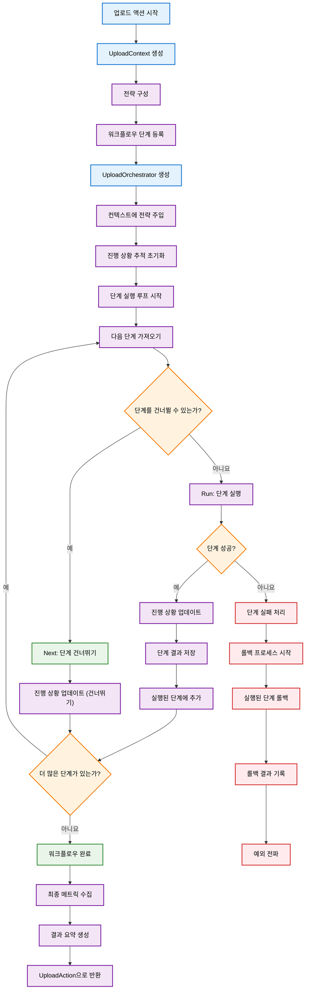

# 업로드 액션 개발

이 가이드는 업로드 액션 아키텍처를 이해, 확장 또는 사용자 정의하려는 SDK 개발자 및 기여자를 위한 것입니다.

## 아키텍처 개요

업로드 시스템은 입증된 디자인 패턴을 기반으로 한 현대적이고 확장 가능한 아키텍처를 사용합니다. 리팩토링된 구현은 이전의 모놀리식 접근 방식을 명확한 관심사 분리를 가진 모듈식, 전략 기반 시스템으로 변환합니다.

### 디자인 패턴

아키텍처는 몇 가지 주요 디자인 패턴을 활용합니다:

- **전략 패턴**: 검증, 파일 검색, 메타데이터 처리, 업로드 작업 및 데이터 단위 생성을 위한 플러그형 동작
- **퍼사드 패턴**: UploadOrchestrator는 복잡한 워크플로우를 조정하기 위한 단순화된 인터페이스를 제공합니다.
- **팩토리 패턴**: StrategyFactory는 런타임 매개변수를 기반으로 적절한 전략 구현을 생성합니다.
- **컨텍스트 패턴**: UploadContext는 워크플로우 구성 요소 간의 공유 상태 및 통신을 유지합니다.

### 구성 요소 아키텍처

```mermaid
classDiagram
 %% 라이트/다크 모드 호환 색상
 classDef coreClass fill:#e3f2fd,stroke:#1976d2,stroke-width:2px,color:#000000
 classDef strategyClass fill:#e8f5e8,stroke:#388e3c,stroke-width:2px,color:#000000
 classDef stepClass fill:#fff9c4,stroke:#f57c00,stroke-width:2px,color:#000000
 classDef contextClass fill:#ffebee,stroke:#d32f2f,stroke-width:2px,color:#000000

 class UploadAction {
 +name: str = "upload"
 +category: PluginCategory.UPLOAD
 +method: RunMethod.JOB
 +run_class: UploadRun
 +params_model: UploadParams
 +progress_categories: dict
 +metrics_categories: dict
 +strategy_factory: StrategyFactory
 +step_registry: StepRegistry

 +start() dict
 +get_workflow_summary() dict
 +_configure_workflow() None
 +_configure_strategies() dict
 }

 class UploadOrchestrator {
 +context: UploadContext
 +step_registry: StepRegistry
 +strategies: dict
 +executed_steps: list
 +current_step_index: int
 +rollback_executed: bool

 +execute() dict
 +get_workflow_summary() dict
 +get_executed_steps() list
 +is_rollback_executed() bool
 +_execute_step(step) StepResult
 +_handle_step_failure(step, error) None
 +_rollback_executed_steps() None
 }

 class UploadContext {
 +params: dict
 +run: UploadRun
 +client: Any
 +storage: Any
 +pathlib_cwd: Path
 +metadata: dict
 +file_specifications: dict
 +organized_files: list
 +uploaded_files: list
 +data_units: list
 +metrics: dict
 +errors: list
 +strategies: dict
 +rollback_data: dict

 +update(result: StepResult) None
 +get_result() dict
 +has_errors() bool
 +update_metrics(category, metrics) None
 }

 class StepRegistry {
 +_steps: list
 +register(step: BaseStep) None
 +get_steps() list
 +get_total_progress_weight() float
 +clear() None
 }

 class StrategyFactory {
 +create_validation_strategy(params, context) BaseValidationStrategy
 +create_file_discovery_strategy(params, context) BaseFileDiscoveryStrategy
 +create_metadata_strategy(params, context) BaseMetadataStrategy
 +create_upload_strategy(params, context) BaseUploadStrategy
 +create_data_unit_strategy(params, context) BaseDataUnitStrategy
 +get_available_strategies() dict
 }

 class BaseStep {
 <<abstract>>
 +name: str
 +progress_weight: float
 +execute(context: UploadContext) StepResult
 +can_skip(context: UploadContext) bool
 +rollback(context: UploadContext) None
 +create_success_result(data) StepResult
 +create_error_result(error) StepResult
 +create_skip_result() StepResult
 }

 class ExcelSecurityConfig {
 +max_file_size_mb: int = 10
 +max_rows: int = 100000
 +max_columns: int = 50
 +max_file_size_bytes: int
 +from_action_config(action_config) ExcelSecurityConfig
 }

 class StepResult {
 +success: bool
 +data: dict
 +error: str
 +rollback_data: dict
 +skipped: bool
 +original_exception: Exception
 +timestamp: datetime
 }

 %% 전략 기본 클래스
 class BaseValidationStrategy {
 <<abstract>>
 +validate_files(files, context) bool
 +validate_security(file_path) bool
 }

 class BaseFileDiscoveryStrategy {
 <<abstract>>
 +discover_files(path, context) list
 +organize_files(files, specs, context) list
 }

 class BaseMetadataStrategy {
 <<abstract>>
 +process_metadata(context) dict
 +extract_metadata(file_path) dict
 }

 class BaseUploadStrategy {
 <<abstract>>
 +upload_files(files, context) list
 +upload_batch(batch, context) list
 }

 class BaseDataUnitStrategy {
 <<abstract>>
 +generate_data_units(files, context) list
 +create_data_unit_batch(batch, context) list
 }

 %% 워크플로우 단계
 class InitializeStep {
 +name = "initialize"
 +progress_weight = 0.05
 }

 class ProcessMetadataStep {
 +name = "process_metadata"
 +progress_weight = 0.05
 }

 class AnalyzeCollectionStep {
 +name = "analyze_collection"
 +progress_weight = 0.05
 }

 class OrganizeFilesStep {
 +name = "organize_files"
 +progress_weight = 0.10
 }

 class ValidateFilesStep {
 +name = "validate_files"
 +progress_weight = 0.05
 }

 class UploadFilesStep {
 +name = "upload_files"
 +progress_weight = 0.30
 }

 class GenerateDataUnitsStep {
 +name = "generate_data_units"
 +progress_weight = 0.35
 }

 class CleanupStep {
 +name = "cleanup"
 +progress_weight = 0.05
 }

 %% 관계
 UploadAction --> UploadRun : 사용
 UploadAction --> UploadParams : 검증
 UploadAction --> ExcelSecurityConfig : 구성
 UploadAction --> UploadOrchestrator : 생성 및 실행
 UploadAction --> StrategyFactory : 전략 구성
 UploadAction --> StepRegistry : 워크플로우 단계 관리
 UploadOrchestrator --> UploadContext : 상태 조정
 UploadOrchestrator --> StepRegistry : 단계 실행
 UploadOrchestrator --> BaseStep : 실행
 BaseStep --> StepResult : 반환
 UploadContext --> StepResult : 업데이트
 StrategyFactory --> BaseValidationStrategy : 생성
 StrategyFactory --> BaseFileDiscoveryStrategy : 생성
 StrategyFactory --> BaseMetadataStrategy : 생성
 StrategyFactory --> BaseUploadStrategy : 생성
 StrategyFactory --> BaseDataUnitStrategy : 생성
 StepRegistry --> BaseStep : 포함

 %% 단계 상속
 InitializeStep --|> BaseStep : 확장
 ProcessMetadataStep --|> BaseStep : 확장
 AnalyzeCollectionStep --|> BaseStep : 확장
 OrganizeFilesStep --|> BaseStep : 확장
 ValidateFilesStep --|> BaseStep : 확장
 UploadFilesStep --|> BaseStep : 확장
 GenerateDataUnitsStep --|> BaseStep : 확장
 CleanupStep --|> BaseStep : 확장
```



### 단계 기반 워크플로우 실행

리팩토링된 아키텍처는 UploadOrchestrator에 의해 조정되는 단계 기반 워크플로우를 사용합니다. 각 단계는 정의된 책임과 진행 가중치를 가집니다.

#### 워크플로우 단계 개요

| 단계 | 이름 | 가중치 | 책임 |
| ---- | ------------------- | ------ | -------------------------------------------- |
| 1 | Initialize | 5% | 스토리지, pathlib 설정 및 기본 검증 |
| 2 | Process Metadata | 5% | 제공된 경우 Excel 메타데이터 처리 |
| 3 | Analyze Collection | 5% | 데이터 컬렉션 사양 검색 및 검증 |
| 4 | Organize Files | 10% | 유형별 파일 검색 및 구성 |
| 5 | Validate Files | 5% | 보안 및 내용 검증 |
| 6 | Upload Files | 30% | 스토리지에 파일 업로드 |
| 7 | Generate Data Units | 35% | 업로드된 파일에서 데이터 단위 생성 |
| 8 | Cleanup | 5% | 임시 리소스 정리 |

#### 실행 흐름



#### 전략 통합 지점

전략은 특정 지점에서 워크플로우에 주입됩니다:

- **검증 전략**: ValidateFilesStep에서 사용
- **파일 검색 전략**: OrganizeFilesStep에서 사용
- **메타데이터 전략**: ProcessMetadataStep에서 사용
- **업로드 전략**: UploadFilesStep에서 사용
- **데이터 단위 전략**: GenerateDataUnitsStep에서 사용

#### 오류 처리 및 롤백

오케스트레이터는 자동 롤백 기능을 제공합니다:

1. **예외 캡처**: 디버깅을 위해 원래 예외를 보존합니다.
2. **롤백 실행**: 성공적으로 실행된 모든 단계에 대해 역순으로 `rollback()`을 호출합니다.
3. **점진적 성능 저하**: 개별 단계 롤백이 실패하더라도 롤백을 계속합니다.
4. **상태 보존**: 실패 후 분석을 위해 실행 상태를 유지합니다.

## 개발 가이드

이 섹션은 사용자 정의 전략 및 워크플로우 단계로 업로드 액션을 확장하기 위한 포괄적인 지침을 제공합니다.

### 사용자 정의 전략 생성

전략은 업로드 프로세스의 다양한 측면에 대한 특정 동작을 구현합니다. 각 전략 유형에는 잘 정의된 인터페이스가 있습니다.

#### 사용자 정의 검증 전략

```python
from synapse_sdk.plugins.categories.upload.actions.upload.strategies.validation.base import BaseValidationStrategy
from synapse_sdk.plugins.categories.upload.actions.upload.context import UploadContext
from pathlib import Path
from typing import List

class CustomValidationStrategy(BaseValidationStrategy):
 """고급 보안 검사를 포함한 사용자 정의 검증 전략."""

 def validate_files(self, files: List[Path], context: UploadContext) -> bool:
 """사용자 정의 비즈니스 규칙을 사용하여 파일을 검증합니다."""
 for file_path in files:
 # 사용자 정의 검증 로직
 if not self._validate_custom_rules(file_path):
 return False

 # 보안 검증 호출
 if not self.validate_security(file_path):
 return False
 return True

 def validate_security(self, file_path: Path) -> bool:
 """사용자 정의 보안 검증."""
 # 사용자 정의 보안 검사 구현
 if file_path.suffix in ['.exe', '.bat', '.sh']:
 return False

 # 파일 크기 확인
 if file_path.stat().st_size > 100 * 1024 * 1024: # 100MB
 return False

 return True

 def _validate_custom_rules(self, file_path: Path) -> bool:
 """도메인별 검증 규칙을 구현합니다."""
 # 사용자 정의 비즈니스 로직
 return True
```

#### 사용자 정의 파일 검색 전략

```python
from synapse_sdk.plugins.categories.upload.actions.upload.strategies.file_discovery.base import BaseFileDiscoveryStrategy
from pathlib import Path
from typing import List, Dict, Any

class CustomFileDiscoveryStrategy(BaseFileDiscoveryStrategy):
 """고급 필터링을 사용한 사용자 정의 파일 검색 전략."""

 def discover_files(self, path: Path, context: UploadContext) -> List[Path]:
 """사용자 정의 필터링 규칙으로 파일을 검색합니다."""
 files = []

 if context.get_param('is_recursive', False):
 files = list(path.rglob('*'))
 else:
 files = list(path.iterdir())

 # 사용자 정의 필터링 적용
 return self._apply_custom_filters(files, context)

 def organize_files(self, files: List[Path], specs: Dict[str, Any], context: UploadContext) -> List[Dict[str, Any]]:
 """사용자 정의 분류를 사용하여 파일을 구성합니다."""
 organized = []

 for file_path in files:
 if file_path.is_file():
 category = self._determine_category(file_path)
 organized.append({
 'file_path': file_path,
 'category': category,
 'metadata': self._extract_file_metadata(file_path)
 })

 return organized

 def _apply_custom_filters(self, files: List[Path], context: UploadContext) -> List[Path]:
 """도메인별 파일 필터를 적용합니다."""
 filtered = []
 for file_path in files:
 if self._should_include_file(file_path):
 filtered.append(file_path)
 return filtered

 def _determine_category(self, file_path: Path) -> str:
 """사용자 정의 로직을 사용하여 파일 카테고리를 결정합니다."""
 ext = file_path.suffix.lower()
 if ext in ['.jpg', '.png', '.gif']:
 return 'images'
 elif ext in ['.pdf', '.doc', '.docx']:
 return 'documents'
 else:
 return 'other'
```

#### 사용자 정의 업로드 전략

```python
from synapse_sdk.plugins.categories.upload.actions.upload.strategies.upload.base import BaseUploadStrategy
from typing import List, Dict, Any
import time

class CustomUploadStrategy(BaseUploadStrategy):
 """고급 재시도 로직을 사용한 사용자 정의 업로드 전략."""

 def upload_files(self, files: List[Dict[str, Any]], context: UploadContext) -> List[Dict[str, Any]]:
 """사용자 정의 배치 및 재시도 로직으로 파일을 업로드합니다."""
 uploaded_files = []
 batch_size = context.get_param('upload_batch_size', 10)

 # 사용자 정의 배치로 처리
 for i in range(0, len(files), batch_size):
 batch = files[i:i + batch_size]
 batch_results = self.upload_batch(batch, context)
 uploaded_files.extend(batch_results)

 return uploaded_files

 def upload_batch(self, batch: List[Dict[str, Any]], context: UploadContext) -> List[Dict[str, Any]]:
 """재시도 로직으로 파일 배치를 업로드합니다."""
 results = []

 for file_info in batch:
 max_retries = 3
 for attempt in range(max_retries):
 try:
 result = self._upload_single_file(file_info, context)
 results.append(result)
 break
 except Exception as e:
 if attempt == max_retries - 1:
 # 마지막 시도 실패
 context.add_error(f"{file_info['file_path']} 업로드 실패: {e}")
 else:
 # 재시도 전 대기
 time.sleep(2 ** attempt)

 return results

 def _upload_single_file(self, file_info: Dict[str, Any], context: UploadContext) -> Dict[str, Any]:
 """사용자 정의 로직으로 단일 파일을 업로드합니다."""
 file_path = file_info['file_path']
 storage = context.storage

 # 여기에 사용자 정의 업로드 로직
 uploaded_file = {
 'file_path': str(file_path),
 'storage_path': f"uploads/{file_path.name}",
 'size': file_path.stat().st_size,
 'checksum': self._calculate_checksum(file_path)
 }

 return uploaded_file
```

### 사용자 정의 워크플로우 단계 생성

사용자 정의 워크플로우 단계는 기본 단계 클래스를 확장하고 필요한 인터페이스를 구현합니다.

#### 사용자 정의 처리 단계

```python
from synapse_sdk.plugins.categories.upload.actions.upload.steps.base import BaseStep
from synapse_sdk.plugins.categories.upload.actions.upload.context import UploadContext, StepResult
from pathlib import Path
from typing import List, Dict
from datetime import datetime

class CustomProcessingStep(BaseStep):
 """특수 파일 처리를 위한 사용자 정의 처리 단계."""

 @property
 def name(self) -> str:
 return 'custom_processing'

 @property
 def progress_weight(self) -> float:
 return 0.15 # 전체 워크플로우의 15%

 def execute(self, context: UploadContext) -> StepResult:
 """사용자 정의 처리 로직을 실행합니다."""
 try:
 # 사용자 정의 처리 로직
 processed_files = self._process_files(context)

 # 결과로 컨텍스트 업데이트
 return self.create_success_result({
 'processed_files': processed_files,
 'processing_stats': self._get_processing_stats()
 })

 except Exception as e:
 return self.create_error_result(f'사용자 정의 처리 실패: {str(e)}')

 def can_skip(self, context: UploadContext) -> bool:
 """단계가 건너뛸 수 있는지 결정합니다."""
 # 처리할 파일이 없으면 건너뛰기
 return len(context.organized_files) == 0

 def rollback(self, context: UploadContext) -> None:
 """사용자 정의 처리 작업을 롤백합니다."""
 # 처리 중에 생성된 모든 리소스 정리
 self._cleanup_processing_resources(context)

 def _process_files(self, context: UploadContext) -> List[Dict]:
 """사용자 정의 파일 처리를 구현합니다."""
 processed = []

 for file_info in context.organized_files:
 # 사용자 정의 처리 로직
 result = self._process_single_file(file_info)
 processed.append(result)

 return processed

 def _process_single_file(self, file_info: Dict) -> Dict:
 """단일 파일을 처리합니다."""
 return {
 'original': file_info,
 'processed': True,
 'timestamp': datetime.now()
 }

 def _get_processing_stats(self) -> Dict:
 """처리 통계를 가져옵니다."""
 return {}

 def _cleanup_processing_resources(self, context: UploadContext) -> None:
 """처리 리소스를 정리합니다."""
 pass
```

### 전략 팩토리 확장

사용자 정의 전략을 사용 가능하게 하려면 StrategyFactory를 확장합니다:

```python
from synapse_sdk.plugins.categories.upload.actions.upload.factory import StrategyFactory
from typing import Dict

class CustomStrategyFactory(StrategyFactory):
 """사용자 정의 전략을 포함한 확장된 팩토리."""

 def create_validation_strategy(self, params: Dict, context=None):
 """사용자 정의 옵션으로 검증 전략을 생성합니다."""
 validation_type = params.get('custom_validation_type', 'default')

 if validation_type == 'strict':
 return CustomValidationStrategy()
 else:
 return super().create_validation_strategy(params, context)

 def create_file_discovery_strategy(self, params: Dict, context=None):
 """사용자 정의 옵션으로 파일 검색 전략을 생성합니다."""
 discovery_mode = params.get('discovery_mode', 'default')

 if discovery_mode == 'advanced':
 return CustomFileDiscoveryStrategy()
 else:
 return super().create_file_discovery_strategy(params, context)
```

### 사용자 정의 업로드 액션

포괄적인 사용자 정의를 위해 UploadAction 자체를 확장합니다:

```python
from synapse_sdk.plugins.categories.upload.actions.upload.action import UploadAction
from synapse_sdk.plugins.categories.decorators import register_action
from typing import Dict, Any

@register_action
class CustomUploadAction(UploadAction):
 """확장된 워크플로우를 가진 사용자 정의 업로드 액션."""

 name = 'custom_upload'

 def __init__(self, *args, **kwargs):
 super().__init__(*args, **kwargs)
 # 사용자 정의 전략 팩토리 사용
 self.strategy_factory = CustomStrategyFactory()

 def _configure_workflow(self) -> None:
 """추가 단계로 사용자 정의 워크플로우를 구성합니다."""
 # 표준 단계 등록
 super()._configure_workflow()

 # 사용자 정의 처리 단계 추가
 self.step_registry.register(CustomProcessingStep())

 def _configure_strategies(self, context=None) -> Dict[str, Any]:
 """사용자 정의 매개변수로 전략을 구성합니다."""
 strategies = super()._configure_strategies(context)

 # 사용자 정의 전략 추가
 strategies['custom_processing'] = self._create_custom_processing_strategy()

 return strategies

 def _create_custom_processing_strategy(self):
 """사용자 정의 처리 전략을 생성합니다."""
 return CustomProcessingStrategy(self.params)
```

### 사용자 정의 구성 요소 테스트

#### 사용자 정의 전략 테스트

```python
import pytest
from unittest.mock import Mock
from pathlib import Path

class TestCustomValidationStrategy:

 def setup_method(self):
 self.strategy = CustomValidationStrategy()
 self.context = Mock()

 def test_validate_files_success(self):
 """성공적인 파일 검증 테스트."""
 files = [Path('/test/file1.txt'), Path('/test/file2.jpg')]
 result = self.strategy.validate_files(files, self.context)
 assert result is True

 def test_validate_files_security_failure(self):
 """보안상의 이유로 검증 실패 테스트."""
 files = [Path('/test/malware.exe')]
 result = self.strategy.validate_files(files, self.context)
 assert result is False

 def test_validate_large_file_failure(self):
 """큰 파일에 대한 검증 실패 테스트."""
 # 큰 크기를 반환하도록 파일 상태 모의
 large_file = Mock(spec=Path)
 large_file.suffix = '.txt'
 large_file.stat.return_value.st_size = 200 * 1024 * 1024 # 200MB

 result = self.strategy.validate_security(large_file)
 assert result is False
```

#### 사용자 정의 단계 테스트

```python
class TestCustomProcessingStep:

 def setup_method(self):
 self.step = CustomProcessingStep()
 self.context = Mock()
 self.context.organized_files = [
 {'file_path': '/test/file1.txt'},
 {'file_path': '/test/file2.jpg'}
 ]

 def test_execute_success(self):
 """성공적인 단계 실행 테스트."""
 result = self.step.execute(self.context)

 assert result.success is True
 assert 'processed_files' in result.data
 assert len(result.data['processed_files']) == 2

 def test_can_skip_with_no_files(self):
 """단계 건너뛰기 로직 테스트."""
 self.context.organized_files = []
 assert self.step.can_skip(self.context) is True

 def test_rollback_cleanup(self):
 """롤백 정리 테스트."""
 # 예외가 발생하지 않아야 함
 self.step.rollback(self.context)
```

## API 참조

### 핵심 구성 요소

#### UploadAction

전략 및 퍼사드 패턴을 구현하는 주요 업로드 액션 클래스.

**클래스 속성:**

- `name = 'upload'` - 액션 식별자
- `category = PluginCategory.UPLOAD` - 플러그인 카테고리
- `method = RunMethod.JOB` - 실행 방법
- `run_class = UploadRun` - 전문화된 실행 관리
- `params_model = UploadParams` - 매개변수 검증 모델
- `strategy_factory: StrategyFactory` - 전략 구현 생성
- `step_registry: StepRegistry` - 워크플로우 단계 관리

**주요 메서드:**

- `start() -> Dict[str, Any]` - 조정된 업로드 워크플로우 실행
- `get_workflow_summary() -> Dict[str, Any]` - 구성된 워크플로우 요약 가져오기
- `_configure_workflow() -> None` - 워크플로우 단계 등록
- `_configure_strategies(context=None) -> Dict[str, Any]` - 전략 인스턴스 생성

#### UploadOrchestrator

자동 롤백 기능으로 전체 업로드 워크플로우를 조정하는 퍼사드 구성 요소.

**속성:**

- `context: UploadContext` - 공유 상태
- `step_registry: StepRegistry` - 워크플로우 단계
- `strategies: Dict[str, Any]` - 전략 구현
- `executed_steps: List[BaseStep]` - 성공적으로 실행된 단계
- `rollback_executed: bool` - 롤백 수행 여부

**주요 메서드:**

- `execute() -> Dict[str, Any]` - 전체 워크플로우 실행
- `get_workflow_summary() -> Dict[str, Any]` - 실행 요약 가져오기
- `_execute_step(step: BaseStep) -> StepResult` - 개별 단계 실행
- `_rollback_executed_steps() -> None` - 역순으로 롤백

#### UploadContext

워크플로우 구성 요소 간의 공유 상태를 유지하는 컨텍스트 객체.

**상태 속성:**

- `params: Dict` - 업로드 매개변수
- `storage: Any` - 스토리지 구성
- `metadata: Dict[str, Dict[str, Any]]` - 파일 메타데이터
- `file_specifications: Dict[str, Any]` - 데이터 컬렉션 사양
- `organized_files: List[Dict[str, Any]]` - 구성된 파일
- `uploaded_files: List[Dict[str, Any]]` - 업로드된 파일
- `data_units: List[Dict[str, Any]]` - 생성된 데이터 단위

**주요 메서드:**

- `update(result: StepResult) -> None` - 단계 결과로 업데이트
- `get_result() -> Dict[str, Any]` - 최종 결과 생성
- `has_errors() -> bool` - 오류 확인
- `update_metrics(category: str, metrics: Dict) -> None` - 메트릭 업데이트

### 워크플로우 단계

#### BaseStep (추상)

모든 워크플로우 단계의 기본 클래스.

**추상 속성:**

- `name: str` - 고유한 단계 식별자
- `progress_weight: float` - 진행률 계산을 위한 가중치

**추상 메서드:**

- `execute(context: UploadContext) -> StepResult` - 단계 로직 실행
- `can_skip(context: UploadContext) -> bool` - 건너뛸 수 있는지 결정
- `rollback(context: UploadContext) -> None` - 작업 롤백

**유틸리티 메서드:**

- `create_success_result(data: Dict = None) -> StepResult`
- `create_error_result(error: str, exception: Exception = None) -> StepResult`
- `create_skip_result() -> StepResult`

#### 구체적인 단계

**InitializeStep** (`name: "initialize"`, `weight: 0.05`)

- 스토리지 및 작업 디렉토리 설정

**ProcessMetadataStep** (`name: "process_metadata"`, `weight: 0.05`)

- 제공된 경우 Excel 메타데이터 처리

**AnalyzeCollectionStep** (`name: "analyze_collection"`, `weight: 0.05`)

- 데이터 컬렉션 사양 검색

**OrganizeFilesStep** (`name: "organize_files"`, `weight: 0.10`)

- 유형별 파일 검색 및 구성

**ValidateFilesStep** (`name: "validate_files"`, `weight: 0.05`)

- 검증 전략을 사용하여 파일 검증

**UploadFilesStep** (`name: "upload_files"`, `weight: 0.30`)

- 업로드 전략을 사용하여 파일 업로드

**GenerateDataUnitsStep** (`name: "generate_data_units"`, `weight: 0.35`)

- 데이터 단위 전략을 사용하여 데이터 단위 생성

**CleanupStep** (`name: "cleanup"`, `weight: 0.05`)

- 임시 리소스 정리

### 전략 기본 클래스

#### BaseValidationStrategy (추상)

**추상 메서드:**

- `validate_files(files: List[Path], context: UploadContext) -> bool`
- `validate_security(file_path: Path) -> bool`

#### BaseFileDiscoveryStrategy (추상)

**추상 메서드:**

- `discover_files(path: Path, context: UploadContext) -> List[Path]`
- `organize_files(files: List[Path], specs: Dict, context: UploadContext) -> List[Dict]`

#### BaseMetadataStrategy (추상)

**추상 메서드:**

- `process_metadata(context: UploadContext) -> Dict[str, Any]`
- `extract_metadata(file_path: Path) -> Dict[str, Any]`

#### BaseUploadStrategy (추상)

**추상 메서드:**

- `upload_files(files: List[Dict], context: UploadContext) -> List[Dict]`
- `upload_batch(batch: List[Dict], context: UploadContext) -> List[Dict]`

#### BaseDataUnitStrategy (추상)

**추상 메서드:**

- `generate_data_units(files: List[Dict], context: UploadContext) -> List[Dict]`
- `create_data_unit_batch(batch: List[Dict], context: UploadContext) -> List[Dict]`

## 모범 사례

### 아키텍처 패턴

1. **전략 선택**: 요구 사항에 따라 적절한 전략 선택
2. **단계 순서**: 논리적 단계 종속성 유지
3. **컨텍스트 관리**: 상태 공유를 위해 UploadContext 활용

### 성능 최적화

1. **배치 처리**: 최적의 배치 크기 구성
2. **비동기 작업**: I/O 바운드 작업에 비동기 활성화
3. **메모리 관리**: 사용자 정의 전략에서 메모리 사용량 모니터링

### 보안 고려 사항

1. **입력 검증**: 모든 매개변수 및 파일 경로 검증
2. **파일 내용 보안**: 내용 기반 검사 구현
3. **경로 살균**: 모든 경로 검증 및 살균

### 오류 처리 및 복구

1. **점진적 성능 저하**: 부분적 실패 시나리오를 위한 설계
2. **롤백 설계**: 포괄적인 롤백 전략 구현
3. **상세 로깅**: 디버깅을 위한 구조화된 로깅 사용

## 레거시로부터의 마이그레이션

업로드 액션은 100% 하위 호환성을 유지합니다. 기존 코드는 변경 없이 계속 작동합니다.

### 주요 변경 사항

**이전 (레거시):**

- 단일 900+ 라인 액션 클래스
- 하드 코딩된 동작
- 확장성 없음

**이후 (리팩토링):**

- 8개의 워크플로우 단계로 깔끔하게 분리
- 플러그형 전략
- 자동 롤백

### 이점

- 자동 롤백으로 더 나은 오류 처리
- 상세한 진행 상황 추적
- 사용자 정의 전략으로 확장성
- 더 나은 테스트 용이성

## 최근 아키텍처 개선사항

### 업로드 로직 리팩토링

**문제**: 원래 구현에서 검증 단계가 파일 처리/필터링 작업을 수행하는 불분명한 관심사 분리가 있었습니다.

**해결책**: 파일 처리 로직을 검증 단계에서 업로드 전략으로 이동하여 적절한 관심사 분리를 보장하도록 리팩토링했습니다.

**변경사항**:

1. **ValidateFilesStep** - 이제 사양 기반 검증만 수행
2. **UploadStrategy** - 업로드 전에 플러그인 파일 처리를 처리하기 위해 `_process_files_with_uploader()` 통합
3. **이점**: 명확한 워크플로우, 더 나은 유지보수성, 하위 호환성 유지

## 참조

- [업로드 플러그인 개요](./upload-plugin-overview.md) - 사용자 가이드 및 구성 참조
- [BaseUploader 템플릿 가이드](./upload-plugin-template.md) - BaseUploader 템플릿을 사용한 플러그인 개발
