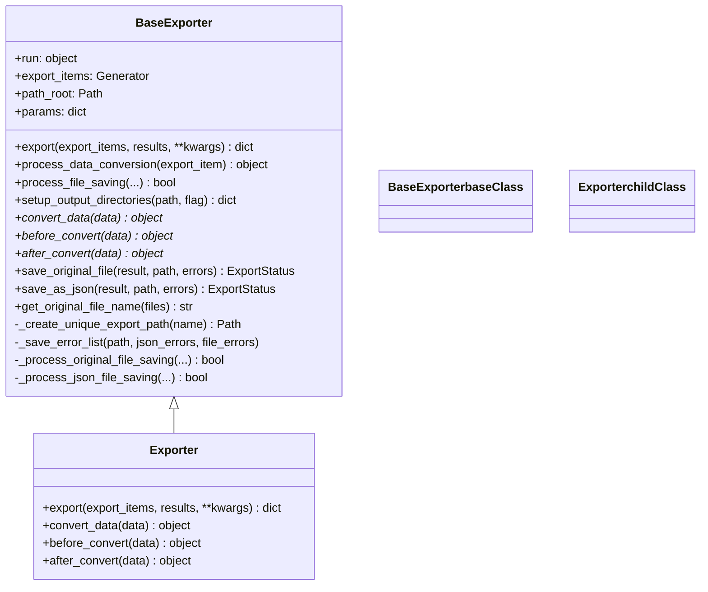
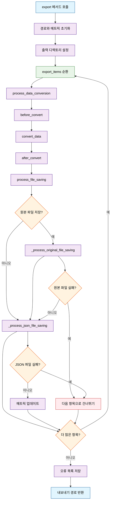

# Export 플러그인

Export 플러그인은 Synapse 플랫폼에서 주석이 달린 데이터, 그라운드 트루스 데이터셋, 할당 및 작업을 내보내기 위한 데이터 내보내기 및 변환 작업을 제공합니다.

## 개요

**사용 가능한 액션:**

- `export` - 다양한 소스(할당, 그라운드 트루스, 작업)에서 사용자 정의 처리와 함께 데이터 내보내기

**사용 사례:**

- 훈련용 주석 데이터셋 내보내기
- 그라운드 트루스 데이터를 사용자 정의 형식으로 변환
- 배포용 데이터 패키지 생성
- 할당 결과의 배치 처리
- 외부 도구용 주석 데이터 변환

**지원되는 내보내기 대상:**

- `assignment` - 주석이 있는 할당 데이터 내보내기
- `ground_truth` - 그라운드 트루스 데이터셋 버전 내보내기
- `task` - 관련 주석이 있는 작업 데이터 내보내기

## BaseExporter와 Exporter 클래스 구조도

다음 다이어그램은 BaseExporter 클래스와 Exporter 클래스 간의 관계와 메서드 구현을 보여줍니다:



### 메서드 실행 플로우

Export 작업의 전체 실행 흐름을 보여주는 플로우차트입니다:



### 주요 관계 및 책임

**BaseExporter (추상 기본 클래스)**

- **핵심 기능**: 완전한 내보내기 워크플로우 인프라 제공
- **템플릿 메서드**: `export()` 메서드가 전체 프로세스 조율
- **훅 메서드**: 커스터마이징을 위한 `convert_data()`, `before_convert()`, `after_convert()`
- **유틸리티**: 파일 작업, 디렉토리 설정, 오류 처리, 진행률 추적

**Exporter (구체적 구현)**

- **상속**: `BaseExporter` 확장
- **최소 구현**: 추상 메서드들의 기본 구현 제공
- **위임 동작**: 대부분의 메서드가 부모 클래스에 위임
- **커스터마이징 지점**: 특정 로직을 위해 변환 메서드 오버라이드

### 메서드 카테고리

- **핵심 워크플로우**: 주요 내보내기 조율 메서드
- **템플릿/훅**: 서브클래스에서 오버라이드하도록 설계된 메서드
- **파일 작업**: 구체적인 파일 저장 및 처리 메서드
- **헬퍼/유틸리티**: 내부 작업을 위한 프라이빗 메서드

이 설계는 **템플릿 메서드 패턴**을 따르며, `BaseExporter.export()`가 알고리즘 골격을 정의하고 서브클래스가 훅 메서드를 통해 특정 단계를 커스터마이징합니다.

## 플러그인 설정

Export 플러그인 템플릿은 필터링 및 플러그인 검색을 위한 설정 필드를 포함합니다:

```yaml
actions:
 export:
 entrypoint: plugin.export.Exporter
 annotation_types:
 - image
 - video
 - audio
 - text
 - pcd
 - prompt

data_types:
 - image
 - video
 - audio
 - text
 - pcd
```

### 설정 필드

- **data_types**: Export 플러그인 필터링을 위한 지원 데이터 타입 목록 (플러그인 레벨 필터)

 - 지원 값: `image`, `video`, `audio`, `text`, `pcd`
 - 플랫폼에서 사용자의 데이터 타입에 따라 관련 export 플러그인을 필터링하고 표시하는 데 사용됩니다

- **annotation_types**: Export 플러그인 필터링을 위한 어노테이션 타입 목록 (액션 레벨 필터)
 - 지원 값: `image`, `video`, `audio`, `text`, `pcd`, `prompt`
 - 각 액션의 설정 내에서 정의됩니다 (예: `actions.export.annotation_types`)
 - 플랫폼에서 사용자의 주석 타입에 따라 관련 export 플러그인을 필터링하고 표시하는 데 사용됩니다
 - 각 액션마다 다른 어노테이션 타입 요구사항을 가질 수 있습니다

**모범 사례**: 플러그인의 실제 기능을 정확히 반영하도록 이 필드들을 커스터마이징하세요. 템플릿에는 모든 일반적인 타입이 예시로 포함되어 있지만, 플러그인이 실제로 지원하는 항목에 맞게 목록을 수정해야 합니다.

## BaseExporter 클래스 구조

새로운 BaseExporter 클래스는 export 플러그인을 위한 객체지향적 접근 방식을 제공합니다:

```python
from synapse_sdk.plugins.categories.export.templates.plugin import BaseExporter

class Exporter(BaseExporter):
 """플러그인 export 액션 인터페이스."""

 def __init__(self, run, export_items, path_root, **params):
 """플러그인 export 액션 클래스를 초기화합니다."""
 super().__init__(run, export_items, path_root, **params)

 def convert_data(self, data):
 """데이터 변환 로직을 구현하세요."""
 return data

 def before_convert(self, data):
 """변환 전 데이터 전처리를 수행합니다."""
 return data

 def after_convert(self, data):
 """변환 후 데이터 후처리를 수행합니다."""
 return data
```

## BaseExporter의 핵심 기능

### 자동 제공 유틸리티

- **완전한 export 워크플로우**: `export()` 메서드가 전체 export 프로세스를 관리
- **데이터 변환 파이프라인**: `process_data_conversion()` 메서드로 before_convert → convert_data → after_convert 처리
- **파일 저장 관리**: `process_file_saving()` 메서드로 원본 파일과 JSON 파일 저장 처리 (오버라이드 가능)
- **디렉토리 설정**: `setup_output_directories()` 메서드로 출력 디렉토리 구조 생성 (오버라이드 가능)

### 필수 메서드 (서브클래스에서 구현해야 함)

- **convert_data()**: export 중 데이터 변환

### 선택적 메서드 (서브클래스에서 오버라이드 가능)

- **save_original_file()**: export 항목의 원본 파일 저장
- **save_as_json()**: 데이터를 JSON 파일로 저장
- **before_convert()**: 변환 전 데이터 전처리
- **after_convert()**: 변환 후 데이터 후처리
- **process_file_saving()**: 사용자 정의 파일 저장 로직
- **additional_file_saving()**: 모든 export 항목 처리 후 추가 파일 저장

### 헬퍼 메서드

- **\_process_original_file_saving()**: 메트릭과 함께 원본 파일 저장 처리
- **\_process_json_file_saving()**: 메트릭과 함께 JSON 파일 저장 처리

### 자동 제공 유틸리티

- `self.run.set_progress()`를 통한 진행률 추적
- `self.run.log_message()` 및 기타 run 메서드를 통한 로깅
- run 메서드를 통한 오류 처리 및 메트릭 수집

## 추가 파일 저장 (Additional File Saving)

`additional_file_saving()` 메서드는 모든 export 항목이 처리된 후에 호출되며, 모든 처리된 항목의 집합적 데이터에 의존하는 파일을 저장하기 위해 설계되었습니다. 다음과 같은 용도로 유용합니다:

- 메타데이터 파일 (예: 데이터셋 통계, 클래스 매핑)
- 설정 파일 (예: YOLO용 dataset.yaml, classes.txt)
- 요약 파일 (예: export 보고서, 처리 로그)
- 인덱스 파일 (예: 파일 목록, 디렉토리 구조)

### 메서드 시그니처

```python
def additional_file_saving(self, unique_export_path):
 """모든 export 항목 처리 후 추가 파일 저장.

 이 메서드는 주 export 루프가 완료된 후 호출되며, 모든 처리된 export 항목의
 집합적 데이터를 기반으로 생성되어야 하는 파일들(예: 메타데이터 파일,
 설정 파일, 요약 파일 등)을 저장하기 위한 것입니다.

 Args:
 unique_export_path (str): 추가 파일이 저장될 고유한 export 디렉토리 경로.
 """
 pass
```

### 사용 예시

```python
class YOLOExporter(BaseExporter):
 def __init__(self, run, export_items, path_root, **params):
 super().__init__(run, export_items, path_root, **params)
 self.class_names = set()
 self.dataset_stats = {
 'total_images': 0,
 'total_annotations': 0,
 'class_distribution': {}
 }

 def convert_data(self, data):
 # 변환 중 클래스와 통계 추적
 for annotation in data.get('annotations', []):
 class_name = annotation['class_name']
 self.class_names.add(class_name)
 self.dataset_stats['class_distribution'][class_name] = \
 self.dataset_stats['class_distribution'].get(class_name, 0) + 1

 self.dataset_stats['total_images'] += 1
 self.dataset_stats['total_annotations'] += len(data.get('annotations', []))

 return data # ... 나머지 변환 로직

 def additional_file_saving(self, unique_export_path):
 """YOLO 설정 및 메타데이터 파일 저장."""
 data_dir = Path(unique_export_path) / 'data'
 data_dir.mkdir(exist_ok=True)

 # 1. classes.txt 파일 저장
 classes_file = data_dir / 'classes.txt'
 with classes_file.open('w') as f:
 for class_name in sorted(self.class_names):
 f.write(f"{class_name}\n")
 self.run.log_message(f"클래스 파일 저장: {classes_file}")

 # 2. dataset.yaml 파일 저장
 dataset_config = {
 'path': str(unique_export_path),
 'train': 'images',
 'val': 'images',
 'names': {i: name for i, name in enumerate(sorted(self.class_names))}
 }

 dataset_file = data_dir / 'dataset.yaml'
 with dataset_file.open('w') as f:
 yaml.dump(dataset_config, f, default_flow_style=False)
 self.run.log_message(f"데이터셋 설정 저장: {dataset_file}")

 # 3. export 통계 저장
 stats_file = data_dir / 'export_stats.json'
 with stats_file.open('w') as f:
 json.dump(self.dataset_stats, f, indent=2)
 self.run.log_message(f"export 통계 저장: {stats_file}")
```

### 일반적인 사용 사례

#### 1. 데이터셋 설정 파일

```python
def additional_file_saving(self, unique_export_path):
 # 훈련 프레임워크용 데이터셋 설정 생성
 config = {
 'dataset_name': self.params.get('name'),
 'created_at': datetime.now().isoformat(),
 'total_samples': len(self.processed_items),
 'classes': list(self.class_mapping.keys())
 }

 config_file = Path(unique_export_path) / 'dataset_config.json'
 with config_file.open('w') as f:
 json.dump(config, f, indent=2)
```

#### 2. Export 요약 보고서

```python
def additional_file_saving(self, unique_export_path):
 # export 요약 생성
 summary = {
 'export_info': {
 'plugin_name': self.__class__.__name__,
 'export_time': datetime.now().isoformat(),
 'export_path': str(unique_export_path)
 },
 'statistics': self.get_export_statistics(),
 'errors': self.get_error_summary()
 }

 summary_file = Path(unique_export_path) / 'export_summary.json'
 with summary_file.open('w') as f:
 json.dump(summary, f, indent=2)
```

#### 3. 인덱스 및 매니페스트 파일

```python
def additional_file_saving(self, unique_export_path):
 # 처리된 항목들에 대한 파일 인덱스 생성
 file_index = []
 for item in self.processed_items:
 file_index.append({
 'original_file': item['original_filename'],
 'json_file': f"{item['stem']}.json",
 'processed_at': item['timestamp']
 })

 index_file = Path(unique_export_path) / 'file_index.json'
 with index_file.open('w') as f:
 json.dump(file_index, f, indent=2)
```

## 주요 특징

- **진행률 추적**: `run.set_progress()`로 내장 진행률 모니터링
- **오류 처리**: 자동 오류 수집 및 보고
- **메트릭 로깅**: `run.log_metrics()`로 성공/실패율 추적
- **파일 관리**: 원본 파일과 처리된 JSON 데이터 모두 처리
- **로깅**: `run.log_message()` 및 사용자 정의 이벤트로 포괄적인 로깅

## 실용적인 예시

### YOLO 형식 Exporter with 커스텀 디렉토리 구조

다음은 YOLO 형식으로 데이터를 내보내면서 `setup_output_directories`와 `process_file_saving`을 활용하는 완전한 예시입니다:

```python
from synapse_sdk.plugins.categories.export.templates.plugin import BaseExporter
import os
import json

class YOLOExporter(BaseExporter):
 """YOLO 형식으로 데이터를 내보내는 플러그인."""

 def __init__(self, run, export_items, path_root, **params):
 super().__init__(run, export_items, path_root, **params)
 self.class_mapping = {}

 def setup_output_directories(self, unique_export_path, save_original_file_flag):
 """YOLO 프로젝트 구조에 맞는 디렉토리 생성."""
 directories = ['images', 'labels', 'data']

 for directory in directories:
 dir_path = os.path.join(unique_export_path, directory)
 os.makedirs(dir_path, exist_ok=True)
 self.run.log_message(f"YOLO 디렉토리 생성: {dir_path}")

 return unique_export_path

 def convert_data(self, data):
 """주석 데이터를 YOLO 형식으로 변환."""
 converted_annotations = []

 for annotation in data.get('annotations', []):
 # 바운딩 박스를 YOLO 형식으로 변환
 bbox = annotation['geometry']['bbox']
 image_width = data['image']['width']
 image_height = data['image']['height']

 # YOLO 형식: center_x, center_y, width, height (정규화)
 center_x = (bbox['x'] + bbox['width'] / 2) / image_width
 center_y = (bbox['y'] + bbox['height'] / 2) / image_height
 width = bbox['width'] / image_width
 height = bbox['height'] / image_height

 # 클래스 ID 매핑
 class_name = annotation['class_name']
 if class_name not in self.class_mapping:
 self.class_mapping[class_name] = len(self.class_mapping)

 class_id = self.class_mapping[class_name]

 converted_annotations.append({
 'class_id': class_id,
 'center_x': center_x,
 'center_y': center_y,
 'width': width,
 'height': height
 })

 return {
 'yolo_annotations': converted_annotations,
 'class_mapping': self.class_mapping,
 'image_info': data['image']
 }

 def process_file_saving(
 self,
 final_data,
 unique_export_path,
 save_original_file_flag,
 errors_json_file_list,
 errors_original_file_list,
 original_file_metrics_record,
 data_file_metrics_record,
 current_index,
 ):
 """YOLO 형식으로 파일 저장 처리."""
 try:
 export_item = self.export_items[current_index - 1]
 base_name = os.path.splitext(export_item.original_file.name)[0]

 # 1. 이미지 파일을 images 폴더에 저장
 if save_original_file_flag:
 images_dir = os.path.join(unique_export_path, 'images')
 image_path = os.path.join(images_dir, export_item.original_file.name)
 import shutil
 shutil.copy2(export_item.original_file.path, image_path)
 self.run.log_message(f"이미지 저장: {image_path}")

 # 2. YOLO 라벨 파일을 labels 폴더에 저장
 labels_dir = os.path.join(unique_export_path, 'labels')
 label_path = os.path.join(labels_dir, f"{base_name}.txt")

 with open(label_path, 'w') as f:
 for ann in final_data.get('yolo_annotations', []):
 line = f"{ann['class_id']} {ann['center_x']} {ann['center_y']} {ann['width']} {ann['height']}\n"
 f.write(line)

 self.run.log_message(f"YOLO 라벨 저장: {label_path}")

 # 3. 클래스 매핑 파일 저장 (한 번만)
 if current_index == 1: # 첫 번째 파일 처리 시에만
 classes_path = os.path.join(unique_export_path, 'data', 'classes.txt')
 with open(classes_path, 'w') as f:
 for class_name, class_id in sorted(final_data['class_mapping'].items(), key=lambda x: x[1]):
 f.write(f"{class_name}\n")
 self.run.log_message(f"클래스 파일 저장: {classes_path}")

 return True

 except Exception as e:
 self.run.log_message(f"파일 저장 중 오류: {str(e)}", level="error")
 errors_json_file_list.append(f"Export item {current_index}: {str(e)}")
 return True # 다른 파일 처리를 계속하기 위해 True 반환
```

이 예시는 BaseExporter의 핵심 확장 포인트인 `setup_output_directories`와 `process_file_saving`을 활용하여:

- YOLO 프로젝트 구조 (`images/`, `labels/`, `data/`) 생성
- 이미지 파일과 YOLO 라벨 파일을 적절한 위치에 저장
- 클래스 매핑 파일 관리
- 진행률 추적과 오류 처리

이를 보여줍니다.

## 빠른 시작 가이드

BaseExporter를 사용하여 간단한 플러그인을 만드는 단계별 가이드입니다:

### 1단계: 기본 클래스 상속

```python
from synapse_sdk.plugins.categories.export.templates.plugin import BaseExporter

class MyExporter(BaseExporter):
 def convert_data(self, data):
 # 필수: 데이터 변환 로직 구현
 return data # 또는 변환된 데이터 반환
```

### 2단계: 필요에 따라 추가 메서드 오버라이드

```python
def before_convert(self, data):
 # 선택적: 변환 전 전처리
 return data

def after_convert(self, converted_data):
 # 선택적: 변환 후 후처리
 return converted_data

def save_as_json(self, converted_data, output_path):
 # 선택적: 사용자 정의 저장 형식
 # 기본적으로는 JSON 형식으로 저장됨
 pass
```

### 3단계: 플러그인 등록

플러그인 디렉토리 구조:

```
my_plugin/
├── __init__.py
├── plugin.py # MyExporter 클래스 정의
└── manifest.yaml # 플러그인 메타데이터
```

## Export 액션 아키텍처

데이터 내보내기 처리의 다양한 측면을 위한 특화된 구성 요소를 갖춘 모듈화된 아키텍처로 export 시스템이 리팩터링되었습니다:

```mermaid
classDiagram
 %% Light/Dark mode compatible colors with semi-transparency
 classDef baseClass fill:#e1f5fe80,stroke:#0288d1,stroke-width:2px
 classDef childClass fill:#c8e6c980,stroke:#388e3c,stroke-width:2px
 classDef modelClass fill:#fff9c480,stroke:#f57c00,stroke-width:2px
 classDef utilClass fill:#f5f5f580,stroke:#616161,stroke-width:2px
 classDef enumClass fill:#ffccbc80,stroke:#d32f2f,stroke-width:2px

 class ExportAction {
 +name: str = "export"
 +category: PluginCategory.EXPORT
 +method: RunMethod.JOB
 +run_class: ExportRun
 +params_model: ExportParams
 +progress_categories: dict
 +metrics_categories: dict

 +start() dict
 +get_exporter(...) object
 +_get_export_items(target, filter) Generator
 +_create_target_handler(target) object
 }

 class ExportRun {
 +log_message_with_code(code, args, level) None
 +log_export_event(code, args, level) None
 +export_log_json_file(id, file_info, status) None
 +export_log_original_file(id, file_info, status) None
 +ExportEventLog: BaseModel
 +DataFileLog: BaseModel
 +MetricsRecord: BaseModel
 }

 class ExportParams {
 +name: str
 +storage: int
 +target: Literal["assignment", "ground_truth", "task"]
 +filter: dict
 +path: str
 +save_original_file: bool = True
 +extra_params: dict = {}

 +check_storage_exists(value) str
 +validate_target_filter(cls, values) dict
 }

 class LogCode {
 +EXPORT_STARTED: str
 +ITEMS_DISCOVERED: str
 +CONVERSION_STARTED: str
 +CONVERSION_COMPLETED: str
 +FILE_SAVED: str
 +EXPORT_COMPLETED: str
 +EXPORT_FAILED: str
 }

 class ExportStatus {
 +SUCCESS: str = "success"
 +FAILED: str = "failed"
 +SKIPPED: str = "skipped"
 }

 class ExportError {
 +message: str
 +code: str
 }

 class ExportValidationError {
 +message: str
 +field: str
 }

 class ExportTargetError {
 +message: str
 +target: str
 }

 %% Relationships
 ExportAction --> ExportRun : uses
 ExportAction --> ExportParams : validates with
 ExportRun --> LogCode : logs with
 ExportRun --> ExportStatus : tracks status
 ExportAction --> ExportError : may raise
 ExportAction --> ExportValidationError : may raise
 ExportAction --> ExportTargetError : may raise

 %% Apply styles
 class ExportAction baseClass
 class ExportRun childClass
 class ExportParams modelClass
 class LogCode,ExportStatus enumClass
 class ExportError,ExportValidationError,ExportTargetError utilClass
```

### 모듈화된 구조

Export 액션은 깔끔한 모듈화된 구성을 따릅니다:

```
synapse_sdk/plugins/categories/export/actions/export/
├── __init__.py # 깔끔한 모듈 인터페이스
├── action.py # ExportAction 클래스
├── enums.py # ExportStatus, LogCode + LOG_MESSAGES
├── exceptions.py # Export 특화 예외
├── models.py # ExportParams 모델
├── run.py # ExportRun 클래스
└── utils.py # 대상 핸들러 및 유틸리티
```

**주요 장점:**

- **향상된 유지보수성**: 작고 집중된 파일로 이해하고 수정하기 쉬움
- **코드 일관성**: Export 액션이 이제 upload 액션과 동일한 패턴을 따름
- **더 나은 구성**: 관련 기능이 논리적으로 그룹화됨
- **향상된 가독성**: 모듈 전반에 걸친 명확한 관심사 분리

## Export 플러그인 생성

Export 플러그인은 더 나은 구성과 재사용성을 위해 BaseExporter 클래스 기반 접근 방식을 사용합니다. 커스텀 export 플러그인을 생성하는 방법은 다음과 같습니다:

### 1단계: Export 플러그인 템플릿 생성

```bash
synapse plugin create
# 카테고리로 'export' 선택
# export 템플릿으로 플러그인이 생성됩니다
```

### 2단계: Export 매개변수 커스터마이징

`ExportParams` 모델이 필요한 매개변수를 정의합니다:

```python
from synapse_sdk.plugins.categories.export.actions.export.models import ExportParams
from pydantic import BaseModel
from typing import Literal

class CustomExportParams(ExportParams):
 # 커스텀 매개변수 추가
 output_format: Literal['json', 'csv', 'xml'] = 'json'
 include_metadata: bool = True
 compression: bool = False
```

### 3단계: 데이터 변환 구현

`plugin/export.py`의 `Exporter` 클래스에서 필요한 메서드를 구현합니다:

```python
from datetime import datetime
from synapse_sdk.plugins.categories.export.templates.plugin import BaseExporter

class Exporter(BaseExporter):
 """COCO 형식 변환을 포함한 커스텀 export 플러그인."""

 def convert_data(self, data):
 """주석 데이터를 원하는 형식으로 변환합니다."""
 # 예시: COCO 형식으로 변환
 if data.get('data_type') == 'image_detection':
 return self.convert_to_coco_format(data)
 elif data.get('data_type') == 'image_classification':
 return self.convert_to_classification_format(data)
 return data

 def before_convert(self, export_item):
 """변환 전 데이터 전처리."""
 # 검증, 필터링 또는 전처리 추가
 if not export_item.get('data'):
 return None # 빈 항목 건너뛰기

 # 커스텀 메타데이터 추가
 export_item['processed_at'] = datetime.now().isoformat()
 return export_item

 def after_convert(self, converted_data):
 """변환된 데이터 후처리."""
 # 최종 마무리, 검증 또는 형식 지정 추가
 if 'annotations' in converted_data:
 converted_data['annotation_count'] = len(converted_data['annotations'])
 return converted_data

 def convert_to_coco_format(self, data):
 """예시: COCO 검출 형식으로 변환."""
 coco_data = {
 "images": [],
 "annotations": [],
 "categories": []
 }

 # 주석 데이터를 COCO 형식으로 변환
 for annotation in data.get('annotations', []):
 coco_annotation = {
 "id": annotation['id'],
 "image_id": annotation['image_id'],
 "category_id": annotation['category_id'],
 "bbox": annotation['bbox'],
 "area": annotation.get('area', 0),
 "iscrowd": 0
 }
 coco_data["annotations"].append(coco_annotation)

 return coco_data
```

### 4단계: Export 대상 구성

Export 액션은 다양한 데이터 소스를 지원합니다:

```python
# 다양한 대상에 대한 필터 예시
filters = {
 # 그라운드 트루스 내보내기용
 "ground_truth": {
 "ground_truth_dataset_version": 123,
 "expand": ["data"]
 },

 # 할당 내보내기용
 "assignment": {
 "project": 456,
 "status": "completed",
 "expand": ["data"]
 },

 # 작업 내보내기용
 "task": {
 "project": 456,
 "assignment": 789,
 "expand": ["data_unit", "assignment"]
 }
}
```

### 5단계: 파일 작업 처리

BaseExporter 메서드를 오버라이드하여 파일 저장 및 구성을 커스터마이징합니다:

```python
import json
from pathlib import Path
from synapse_sdk.plugins.categories.export.actions.export.enums import ExportStatus

class Exporter(BaseExporter):
 """다중 형식 지원을 포함한 커스텀 export 플러그인."""

 def save_as_json(self, result, base_path, error_file_list):
 """다양한 형식으로 커스텀 JSON 저장."""
 file_name = Path(self.get_original_file_name(result['files'])).stem

 # 매개변수에 따른 출력 형식 선택
 if self.params.get('output_format') == 'csv':
 return self.save_as_csv(result, base_path, error_file_list)
 elif self.params.get('output_format') == 'xml':
 return self.save_as_xml(result, base_path, error_file_list)

 # 기본 JSON 처리
 json_data = result['data']
 file_info = {'file_name': f'{file_name}.json'}

 try:
 with (base_path / f'{file_name}.json').open('w', encoding='utf-8') as f:
 json.dump(json_data, f, indent=4, ensure_ascii=False)
 status = ExportStatus.SUCCESS
 except Exception as e:
 error_file_list.append([f'{file_name}.json', str(e)])
 status = ExportStatus.FAILED

 self.run.export_log_json_file(result['id'], file_info, status)
 return status

 def setup_output_directories(self, unique_export_path, save_original_file_flag):
 """커스텀 디렉토리 구조."""
 # 형식별 디렉토리 생성
 output_paths = super().setup_output_directories(unique_export_path, save_original_file_flag)

 # 출력 형식에 따른 커스텀 디렉토리 추가
 format_dir = unique_export_path / self.params.get('output_format', 'json')
 format_dir.mkdir(parents=True, exist_ok=True)
 output_paths['format_output_path'] = format_dir

 return output_paths
```

### 6단계: 사용 예시

다양한 구성으로 export 플러그인 실행:

```bash
# 그라운드 트루스 데이터 기본 내보내기
synapse plugin run export '{
 "name": "my_export",
 "storage": 1,
 "target": "ground_truth",
 "filter": {"ground_truth_dataset_version": 123},
 "path": "exports/ground_truth",
 "save_original_file": true
}' --plugin my-export-plugin

# 커스텀 매개변수로 할당 내보내기
synapse plugin run export '{
 "name": "assignment_export",
 "storage": 1,
 "target": "assignment",
 "filter": {"project": 456, "status": "completed"},
 "path": "exports/assignments",
 "save_original_file": false,
 "extra_params": {
 "output_format": "coco",
 "include_metadata": true
 }
}' --plugin custom-coco-export
```

## 일반적인 Export 패턴

```python
# 패턴 1: 형식별 변환
class Exporter(BaseExporter):
 def convert_data(self, data):
 """YOLO 형식으로 변환."""
 if data.get('task_type') == 'object_detection':
 return self.convert_to_yolo_format(data)
 return data

# 패턴 2: 조건부 파일 구성
class Exporter(BaseExporter):
 def setup_output_directories(self, unique_export_path, save_original_file_flag):
 # 부모 메서드 호출
 output_paths = super().setup_output_directories(unique_export_path, save_original_file_flag)

 # 카테고리별 별도 폴더 생성
 for category in ['train', 'val', 'test']:
 category_path = unique_export_path / category
 category_path.mkdir(parents=True, exist_ok=True)
 output_paths[f'{category}_path'] = category_path

 return output_paths

# 패턴 3: 검증을 포함한 배치 처리
class Exporter(BaseExporter):
 def before_convert(self, export_item):
 # 필수 필드 검증
 required_fields = ['data', 'files', 'id']
 for field in required_fields:
 if field not in export_item:
 raise ValueError(f"필수 필드가 누락됨: {field}")
 return export_item
```

## 개발 팁 및 모범 사례

### 1. 오류 처리

```python
def convert_data(self, data):
 try:
 # 변환 로직
 result = self.process_annotations(data)
 return result
 except Exception as e:
 self.run.log_message(f"변환 중 오류 발생: {str(e)}", level="error")
 raise # BaseExporter가 오류를 자동으로 처리
```

### 2. 진행률 추적

```python
def convert_data(self, data):
 annotations = data.get('annotations', [])
 total = len(annotations)

 for i, annotation in enumerate(annotations):
 # 진행률 업데이트 (0-100 사이의 값)
 progress = int((i / total) * 100)
 self.run.set_progress(progress)

 # 변환 로직...

 return converted_data
```

### 3. 메트릭 수집

```python
def after_convert(self, converted_data):
 # 유용한 메트릭 수집
 metrics = {
 'total_exported': len(converted_data.get('annotations', [])),
 'processing_time': time.time() - self.start_time,
 'success_rate': self.calculate_success_rate(),
 }

 self.run.log_metrics(metrics)
 return converted_data
```

### 4. 로깅 활용

```python
def convert_data(self, data):
 self.run.log_message("데이터 변환 시작", level="info")

 if not data.get('annotations'):
 self.run.log_message("주석 데이터가 없습니다", level="warning")
 return data

 # 변환 로직...

 self.run.log_message(f"변환 완료: {len(result)} 항목 처리됨", level="success")
 return result
```

### 5. 매개변수 처리

```python
def __init__(self, run, export_items, path_root, **params):
 super().__init__(run, export_items, path_root, **params)

 # 사용자 정의 매개변수 처리
 self.output_format = params.get('output_format', 'json')
 self.include_metadata = params.get('include_metadata', True)
 self.compression = params.get('compression', False)
```

## 모범 사례

### 데이터 처리

- **메모리 효율성**: 대용량 데이터셋 처리를 위해 제너레이터 사용
- **오류 복구**: 개별 항목에 대한 우아한 오류 처리 구현
- **진행률 보고**: 장시간 실행되는 내보내기의 진행률을 정기적으로 업데이트
- **데이터 검증**: 변환 전 데이터 구조 검증

```python
class Exporter(BaseExporter):
 def export(self, export_items=None, results=None, **kwargs):
 """커스텀 처리를 위한 주 export 메서드 오버라이드."""
 # 제너레이터를 소비하지 않고 항목 수를 카운트하기 위해 tee 사용
 items_to_process = export_items if export_items is not None else self.export_items
 export_items_count, export_items_process = tee(items_to_process)
 total = sum(1 for _ in export_items_count)

 # 오류 처리가 포함된 커스텀 처리
 for no, export_item in enumerate(export_items_process, start=1):
 try:
 # 내장 데이터 변환 파이프라인 사용
 processed_item = self.process_data_conversion(export_item)
 self.run.set_progress(no, total, category='dataset_conversion')
 except Exception as e:
 self.run.log_message(f"항목 {no} 처리 중 오류: {str(e)}", "ERROR")
 continue

 # 표준 처리를 위해 부모의 export 메서드 호출
 # 또는 자체 완전한 워크플로우 구현
 return super().export(export_items, results, **kwargs)
```

### 파일 관리

- **고유 경로**: 타임스탬프나 카운터 접미사로 파일 충돌 방지
- **디렉토리 구조**: 출력 파일을 논리적으로 구성
- **오류 로깅**: 디버깅을 위해 실패한 파일 추적
- **정리**: 완료 시 임시 파일 제거

```python
class Exporter(BaseExporter):
 def setup_output_directories(self, unique_export_path, save_original_file_flag):
 """고유한 export 디렉토리 구조 생성."""
 # BaseExporter는 이미 _create_unique_export_path를 통해 고유 경로 생성을 처리함
 # 이 메서드는 내부 디렉토리 구조를 설정함
 output_paths = super().setup_output_directories(unique_export_path, save_original_file_flag)

 # 필요에 따라 커스텀 서브디렉토리 추가
 custom_dir = unique_export_path / 'custom_output'
 custom_dir.mkdir(parents=True, exist_ok=True)
 output_paths['custom_output_path'] = custom_dir

 return output_paths
```

### 형식 변환

- **유연한 템플릿**: 여러 데이터 타입과 함께 작동하는 템플릿 설계
- **스키마 검증**: 예상 스키마에 대한 출력 검증
- **메타데이터 보존**: 변환 중 중요한 메타데이터 유지
- **버전 호환성**: 다양한 데이터 스키마 버전 처리

## 자주 묻는 질문

**Q: BaseExporter를 사용하지 않고 직접 구현할 수 있나요?** 
A: 가능하지만 권장하지 않습니다. BaseExporter는 진행률 추적, 오류 처리, 메트릭 수집 등의 기본 기능을 자동으로 제공합니다.

**Q: 여러 파일 형식으로 동시에 내보낼 수 있나요?** 
A: `process_file_saving()` 메서드를 오버라이드하여 여러 형식으로 저장할 수 있습니다.

**Q: 대용량 데이터셋을 처리할 때 메모리 사용량을 최적화하려면?** 
A: `convert_data()`에서 한 번에 모든 데이터를 로드하지 말고, 스트리밍 방식으로 처리하는 것을 고려해보세요.

**Q: 진행률이 올바르게 표시되지 않는다면?** 
A: `self.run.set_progress()`를 적절한 간격으로 호출하고 있는지 확인하세요. 0-100 사이의 정수 값을 사용해야 합니다.
