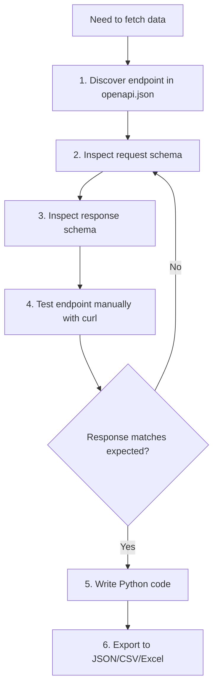

# Programmatic Access to TestIO Data

This resource teaches you how to discover and use the TestIO REST API dynamically.
The API is self-documenting via OpenAPI—no hardcoded documentation to maintain.

## Prerequisites

Start the server in hybrid mode (MCP + REST):

```bash
uvx testio-mcp serve --transport http --port 8080
```

## API Discovery

The OpenAPI schema at `/openapi.json` is your source of truth.

### List All Endpoints

```bash
# Using jq
curl -s http://localhost:8080/openapi.json | jq '.paths | keys'

# Using Python
curl -s http://localhost:8080/openapi.json | python -c "import sys,json; print('\n'.join(json.load(sys.stdin)['paths'].keys()))"
```

### Get Schema for Specific Endpoint

```bash
# Example: quality report endpoint
curl -s http://localhost:8080/openapi.json | jq '.paths["/api/products/{product_id}/quality-report"]'

# Example: analytics query endpoint
curl -s http://localhost:8080/openapi.json | jq '.paths["/api/analytics/query"]'
```

### List Request/Response Models

```bash
# All schema definitions
curl -s http://localhost:8080/openapi.json | jq '.components.schemas | keys'

# Specific model (e.g., QueryMetricsInput for POST /api/analytics/query)
curl -s http://localhost:8080/openapi.json | jq '.components.schemas["QueryMetricsInput"]'
```

## Key Endpoint Categories

| Category | Pattern | Use Case |
|----------|---------|----------|
| Analytics | `POST /api/analytics/query` | Pivot tables (monthly breakdown, platform comparison) — **requires at least 1 dimension** |
| Reports | `GET /api/products/{id}/quality-report` | Product totals without grouping (overview metrics) |
| Products | `GET /api/products` | List/search products |
| Search | `GET /api/search` | Full-text search across entities |

**Common gotcha**: Analytics queries require `dimensions` with at least 1 item. For product-level totals without grouping, use the quality-report endpoint instead:

```bash
# Product totals (no grouping needed)
curl "http://localhost:8080/api/products/24734/quality-report?start_date=2025-01-01&end_date=2025-12-31"

# Grouped by month (requires dimension)
curl -X POST http://localhost:8080/api/analytics/query \
  -H "Content-Type: application/json" \
  -d '{"metrics":["bug_count"],"dimensions":["month"],"filters":{"product_id":24734}}'
```

Consult `openapi.json` for exact parameters, schemas, and response formats.

## Workflow

**CRITICAL**: Always validate schemas before writing code. Do not skip steps.



**Step-by-step:**

1. **Discover**: Query `openapi.json` to find the right endpoint
2. **Inspect request**: Get the schema for request parameters (required fields, types, constraints)
3. **Inspect response**: Get the schema for response structure (field names, nesting)
4. **Test manually**: Run a curl command to verify actual response matches schema
5. **Write code**: Only after validating schemas, write your Python fetch code
6. **Export**: Save to JSON, CSV, or Excel as needed

**Anti-pattern**: Writing code based on assumed field names → runtime KeyError

## Export Patterns

**Important**: Always write files relative to the script location, not the current working directory.

```python
from pathlib import Path

# Script-relative data directory
SCRIPT_DIR = Path(__file__).parent
DATA_DIR = SCRIPT_DIR / "data"
DATA_DIR.mkdir(exist_ok=True)
```

### JSON

```python
import json
from pathlib import Path

SCRIPT_DIR = Path(__file__).parent
DATA_DIR = SCRIPT_DIR / "data"
DATA_DIR.mkdir(exist_ok=True)

with open(DATA_DIR / "metrics.json", "w") as f:
    json.dump(response.json(), f, indent=2)
```

### CSV

```python
import csv
from pathlib import Path

SCRIPT_DIR = Path(__file__).parent
DATA_DIR = SCRIPT_DIR / "data"
DATA_DIR.mkdir(exist_ok=True)

data = response.json()["data"]  # Adjust path based on response structure
if data:
    with open(DATA_DIR / "metrics.csv", "w", newline="") as f:
        writer = csv.DictWriter(f, fieldnames=data[0].keys())
        writer.writeheader()
        writer.writerows(data)
```

### Excel (requires openpyxl)

```python
from pathlib import Path
from openpyxl import Workbook

SCRIPT_DIR = Path(__file__).parent
DATA_DIR = SCRIPT_DIR / "data"
DATA_DIR.mkdir(exist_ok=True)

data = response.json()["data"]
wb = Workbook()
ws = wb.active

# Write headers
if data:
    headers = list(data[0].keys())
    ws.append(headers)

    # Write rows
    for row in data:
        ws.append([row.get(h) for h in headers])

wb.save(DATA_DIR / "metrics.xlsx")
```

## Example: Fetch Monthly Metrics

```python
import httpx

BASE_URL = "http://localhost:8080"

# First, discover the schema
# curl -s http://localhost:8080/openapi.json | jq '.paths["/api/analytics/query"].post'

response = httpx.post(
    f"{BASE_URL}/api/analytics/query",
    json={
        "metrics": ["test_count", "bug_count", "rejection_rate"],
        "dimensions": ["month"],
        "filters": {"product_id": 24734},
        "start_date": "2025-01-01",
        "end_date": "2025-12-31",
        "sort_by": "month",
        "sort_order": "asc",
    },
)
response.raise_for_status()
data = response.json()["data"]
```

## Tips

- Always check `openapi.json` for the latest schema—it's auto-generated from the code
- Use `jq` for quick exploration, Python for scripting
- The `components.schemas` section contains all request/response models
- Response structures vary by endpoint—inspect before writing export code
