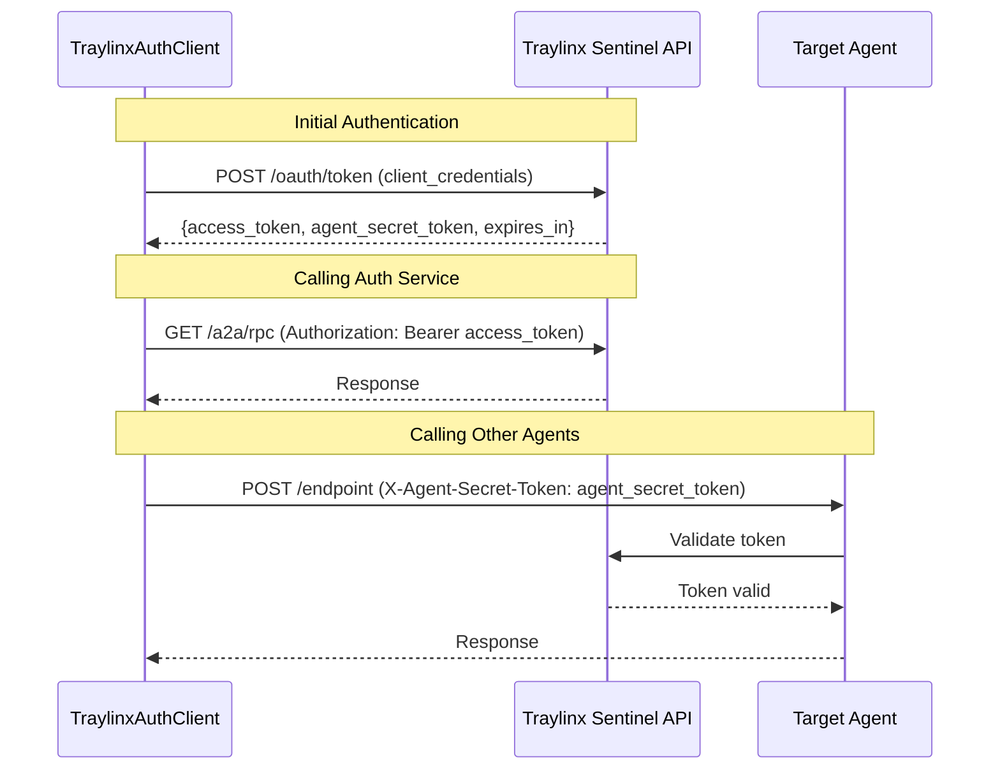

# Traylinx Auth Client (Python)

[](https://badge.fury.io/py/traylinx-auth-client)
[](https://www.python.org/downloads/)
[](https://opensource.org/licenses/MIT)

A robust, enterprise-grade Python library for Traylinx Sentinel Agent-to-Agent (A2A) authentication. This client provides secure token management, automatic retry logic, comprehensive error handling, and seamless integration with FastAPI applications.

## 🚀 Features

- **🔐 Dual Token Authentication**: Handles both `access_token` and `agent_secret_token` with automatic refresh
- **🛡️ Enterprise Security**: Input validation, secure credential handling, and comprehensive error management
- **⚡ High Performance**: Connection pooling, automatic retries with exponential backoff, and efficient token caching
- **🔄 Thread-Safe**: Built-in thread safety for concurrent applications and production environments
- **🎯 FastAPI Integration**: Simple decorators for protecting endpoints with A2A authentication
- **📡 JSON-RPC Support**: Full support for A2A RPC method calls with automatic credential detection
- **🔧 Zero Configuration**: Works with environment variables out of the box
- **📊 Production Ready**: Configurable logging, monitoring, and comprehensive error handling

## 📦 Installation

### Using pip

```bash
pip install traylinx-auth-client
```

### Using Poetry

```bash
poetry add traylinx-auth-client
```

### Requirements

- Python 3.8 or higher
- `requests` >= 2.25.0
- `pydantic` >= 2.0.0

## ⚡ Quick Start (5 lines)

```python
from traylinx_auth_client import make_a2a_request

# Set environment variables: TRAYLINX_CLIENT_ID, TRAYLINX_CLIENT_SECRET, 
# TRAYLINX_API_BASE_URL, TRAYLINX_AGENT_USER_ID

# Make authenticated request to another agent
response = make_a2a_request("GET", "https://other-agent.com/api/data")
print(response)  # JSON response from the agent
```

## 🔧 Configuration

### Environment Variables

Set these environment variables for your agent:

```bash
export TRAYLINX_CLIENT_ID="your-client-id"
export TRAYLINX_CLIENT_SECRET="your-client-secret"  
export TRAYLINX_API_BASE_URL="https://auth.traylinx.com"
export TRAYLINX_AGENT_USER_ID="12345678-1234-1234-1234-123456789abc"
```

### Programmatic Configuration

```python
from traylinx_auth_client import TraylinxAuthClient

client = TraylinxAuthClient(
    client_id="your-client-id",
    client_secret="your-client-secret",
    api_base_url="https://auth.traylinx.com",
    agent_user_id="12345678-1234-1234-1234-123456789abc",
    timeout=30,           # Request timeout in seconds
    max_retries=3,        # Maximum retry attempts
    retry_delay=1.0,      # Base delay between retries
    cache_tokens=True,    # Enable token caching
    log_level="INFO"      # Logging level
)
```

## 📖 Usage Examples

### Making Authenticated Requests

#### Simple Function Approach

```python
from traylinx_auth_client import make_a2a_request

# GET request
data = make_a2a_request("GET", "https://other-agent.com/api/users")

# POST request with JSON data
result = make_a2a_request(
    "POST", 
    "https://other-agent.com/api/process",
    json={"items": ["item1", "item2"]},
    timeout=60
)

# PUT request with custom headers
response = make_a2a_request(
    "PUT",
    "https://other-agent.com/api/update/123",
    json={"status": "completed"},
    headers={"X-Custom-Header": "value"}
)
```

#### Manual Header Management

```python
from traylinx_auth_client import get_agent_request_headers
import requests

# Get headers for calling other agents
headers = get_agent_request_headers()

# Make authenticated request
response = requests.get(
    "https://other-agent.com/api/data",
    headers=headers
)

# Headers include:
# {
#     "X-Agent-Secret-Token": "your-agent-secret-token",
#     "X-Agent-User-Id": "your-agent-user-id"
# }
```

### Protecting FastAPI Endpoints

#### Simple Decorator Approach

```python
from fastapi import FastAPI, Request
from traylinx_auth_client import require_a2a_auth

app = FastAPI()

@app.get("/protected")
@require_a2a_auth
async def protected_endpoint(request: Request):
    return {"message": "This endpoint requires A2A authentication"}

@app.post("/process")
@require_a2a_auth
async def process_data(request: Request, data: dict):
    # This endpoint is automatically protected
    return {"processed": data}
```

#### Manual Validation

```python
from fastapi import FastAPI, Request, HTTPException
from traylinx_auth_client import validate_a2a_request

app = FastAPI()

@app.post("/manual-validation")
async def manual_validation(request: Request):
    if not validate_a2a_request(request.headers):
        raise HTTPException(status_code=401, detail="Invalid A2A token")
    
    return {"message": "Token is valid"}
```

#### Dual Authentication Support (A2A + Bearer)

```python
from traylinx_auth_client import require_dual_auth, detect_auth_mode

@app.get("/flexible-auth")
@require_dual_auth  # Supports both Bearer tokens and custom headers
async def flexible_endpoint(request: Request):
    auth_mode = detect_auth_mode(request.headers)
    return {"auth_mode": auth_mode, "message": "Authenticated successfully"}
```

## 🔧 Advanced Usage

### Using the Client Directly

```python
from traylinx_auth_client import TraylinxAuthClient

# Create client with custom configuration
client = TraylinxAuthClient(
    timeout=60,
    max_retries=5,
    retry_delay=2.0
)

# Get individual tokens
access_token = client.get_access_token()
agent_secret_token = client.get_agent_secret_token()

# Get different header types
auth_headers = client.get_request_headers()      # For auth service calls
agent_headers = client.get_agent_request_headers()  # For agent calls
a2a_headers = client.get_a2a_headers()          # A2A-compatible format

# Validate incoming tokens
is_valid = client.validate_token(
    agent_secret_token="incoming-token",
    agent_user_id="sender-agent-id"
)

# Context manager for automatic cleanup
with TraylinxAuthClient() as client:
    response = client.rpc_health_check()
```

### JSON-RPC Method Calls

```python
from traylinx_auth_client import TraylinxAuthClient

client = TraylinxAuthClient()

# Built-in RPC methods
result = client.rpc_introspect_token(
    agent_secret_token="token-to-validate",
    agent_user_id="agent-id"
)

capabilities = client.rpc_get_capabilities()
health = client.rpc_health_check()

# Custom RPC calls
response = client.rpc_call(
    method="custom_method",
    params={"param1": "value1"},
    rpc_url="https://custom-agent.com/a2a/rpc"
)

# RPC call with explicit credential control
response = client.rpc_call(
    method="auth_service_method",
    params={},
    include_agent_credentials=False  # Uses only access_token
)
```

### Error Handling

```python
from traylinx_auth_client import (
    TraylinxAuthClient, 
    AuthenticationError, 
    NetworkError, 
    ValidationError,
    TokenExpiredError
)

try:
    client = TraylinxAuthClient(
        client_id="invalid-id",
        client_secret="invalid-secret"
    )
    response = client.rpc_health_check()
    
except ValidationError as e:
    print(f"Configuration error: {e}")
    print(f"Error code: {e.error_code}")
    
except AuthenticationError as e:
    print(f"Authentication failed: {e}")
    print(f"Status code: {e.status_code}")
    
except NetworkError as e:
    print(f"Network error: {e}")
    if e.error_code == "TIMEOUT":
        print("Request timed out - check network connectivity")
    elif e.error_code == "RATE_LIMIT":
        print("Rate limited - retry after delay")
        
except TokenExpiredError as e:
    print(f"Token expired: {e}")
    # Token will be automatically refreshed on next request
```

### Concurrent Usage

```python
import threading
from traylinx_auth_client import TraylinxAuthClient

# Thread-safe client usage
client = TraylinxAuthClient()

def worker_function(worker_id):
    try:
        # Each thread can safely use the same client
        headers = client.get_agent_request_headers()
        response = make_a2a_request("GET", f"https://api.com/data/{worker_id}")
        print(f"Worker {worker_id}: {response}")
    except Exception as e:
        print(f"Worker {worker_id} error: {e}")

# Create multiple threads
threads = []
for i in range(10):
    thread = threading.Thread(target=worker_function, args=(i,))
    threads.append(thread)
    thread.start()

# Wait for all threads to complete
for thread in threads:
    thread.join()
```

## 📚 Complete API Reference

### Core Functions

#### `make_a2a_request(method: str, url: str, **kwargs) -> dict`

Make an authenticated A2A request to another agent.

**Parameters:**
- `method` (str): HTTP method (GET, POST, PUT, DELETE, etc.)
- `url` (str): Target agent's URL
- `**kwargs`: Additional arguments for `requests.request()`

**Returns:**
- `dict`: JSON response from the target agent

**Raises:**
- `NetworkError`: For network-related issues
- `AuthenticationError`: For authentication failures
- `ValidationError`: For invalid parameters

**Example:**
```python
response = make_a2a_request("POST", "https://agent.com/api", json={"key": "value"})
```

#### `get_request_headers() -> dict`

Returns headers for calling the auth service (includes access_token).

**Returns:**
```python
{
    "Authorization": "Bearer <access_token>",
    "X-Agent-Secret-Token": "<agent_secret_token>",
    "X-Agent-User-Id": "<agent_user_id>"
}
```

#### `get_agent_request_headers() -> dict`

Returns headers for calling other agents (ONLY agent_secret_token).

**Returns:**
```python
{
    "X-Agent-Secret-Token": "<agent_secret_token>",
    "X-Agent-User-Id": "<agent_user_id>"
}
```

#### `get_a2a_request_headers() -> dict`

Returns A2A-compatible headers using Bearer token format.

**Returns:**
```python
{
    "Authorization": "Bearer <agent_secret_token>",
    "X-Agent-User-Id": "<agent_user_id>"
}
```

#### `require_a2a_auth(func)`

Decorator that protects FastAPI endpoints with A2A authentication.

**Example:**
```python
@app.get("/protected")
@require_a2a_auth
async def protected_endpoint(request: Request):
    return {"message": "Protected"}
```

#### `require_dual_auth(func)`

Enhanced decorator supporting both Bearer tokens and custom headers.

#### `validate_a2a_request(headers: dict) -> bool`

Validates incoming A2A request headers (custom format).

**Parameters:**
- `headers` (dict): Request headers

**Returns:**
- `bool`: True if valid, False otherwise

#### `validate_dual_auth_request(headers: dict) -> bool`

Validates incoming requests supporting both Bearer tokens and custom headers.

#### `detect_auth_mode(headers: dict) -> str`

Detect authentication mode from request headers.

**Returns:**
- `str`: 'bearer', 'custom', or 'none'

### TraylinxAuthClient Class

#### Constructor

```python
TraylinxAuthClient(
    client_id: str = None,           # OAuth client ID
    client_secret: str = None,       # OAuth client secret  
    api_base_url: str = None,        # Traylinx API base URL
    agent_user_id: str = None,       # Agent user UUID
    timeout: int = 30,               # Request timeout (seconds)
    max_retries: int = 3,            # Maximum retry attempts
    retry_delay: float = 1.0,        # Base retry delay (seconds)
    cache_tokens: bool = True,       # Enable token caching
    log_level: str = "INFO"          # Logging level
)
```

**Parameters:**
- All parameters default to corresponding environment variables
- `timeout`: Request timeout in seconds (default: 30)
- `max_retries`: Maximum retry attempts for failed requests (default: 3)
- `retry_delay`: Base delay between retries in seconds (default: 1.0)
- `cache_tokens`: Whether to cache tokens in memory (default: True)
- `log_level`: Logging level - DEBUG, INFO, WARN, ERROR (default: "INFO")

**Raises:**
- `ValidationError`: If configuration parameters are invalid

#### Token Management Methods

##### `get_access_token() -> str`

Get current access token for calling auth service.

**Returns:**
- `str`: Valid access token

**Raises:**
- `TokenExpiredError`: If token is unavailable
- `AuthenticationError`: If token fetch fails

##### `get_agent_secret_token() -> str`

Get current agent secret token for agent-to-agent communication.

**Returns:**
- `str`: Valid agent secret token

**Raises:**
- `TokenExpiredError`: If token is unavailable
- `AuthenticationError`: If token fetch fails

#### Header Generation Methods

##### `get_request_headers() -> dict`

Get headers for calling the auth service (includes access_token).

##### `get_agent_request_headers() -> dict`

Get headers for calling other agents (ONLY agent_secret_token).

##### `get_a2a_headers() -> dict`

Get A2A-compatible authentication headers using Bearer token format.

#### Validation Methods

##### `validate_token(agent_secret_token: str, agent_user_id: str) -> bool`

Validate an agent secret token against the auth service.

**Parameters:**
- `agent_secret_token` (str): Token to validate
- `agent_user_id` (str): Agent user ID associated with token

**Returns:**
- `bool`: True if token is valid and active

**Raises:**
- `AuthenticationError`: If validation request fails
- `NetworkError`: For network-related issues

##### `validate_a2a_request(headers: dict) -> bool`

Validate A2A request supporting both Bearer tokens and custom headers.

##### `detect_auth_mode(headers: dict) -> str`

Detect authentication mode from request headers.

#### JSON-RPC Methods

##### `rpc_call(method: str, params: dict, rpc_url: str = None, include_agent_credentials: bool = None) -> dict`

Make a JSON-RPC call with automatic credential detection.

**Parameters:**
- `method` (str): RPC method name
- `params` (dict): RPC method parameters
- `rpc_url` (str, optional): Custom RPC endpoint URL
- `include_agent_credentials` (bool, optional): Whether to include agent credentials

**Returns:**
- `dict`: JSON-RPC response

**Raises:**
- `ValidationError`: For invalid RPC requests or parameters
- `AuthenticationError`: For authentication failures
- `NetworkError`: For network issues
- `TraylinxAuthError`: For RPC-specific errors

##### `rpc_introspect_token(agent_secret_token: str, agent_user_id: str) -> dict`

Introspect a token via JSON-RPC.

##### `rpc_get_capabilities() -> dict`

Get agent capabilities via JSON-RPC.

##### `rpc_health_check() -> dict`

Perform health check via JSON-RPC.

#### Context Manager Methods

##### `close()`

Close the HTTP session and clean up resources.

##### `__enter__()` and `__exit__()`

Support for context manager usage:

```python
with TraylinxAuthClient() as client:
    response = client.rpc_health_check()
# Automatically cleaned up
```

### Exception Classes

#### `TraylinxAuthError`

Base exception class for all TraylinxAuthClient errors.

**Attributes:**
- `error_code` (str): Specific error code
- `status_code` (int): HTTP status code (if applicable)

#### `ValidationError(TraylinxAuthError)`

Raised for input validation failures.

#### `AuthenticationError(TraylinxAuthError)`

Raised for authentication-related failures.

#### `TokenExpiredError(TraylinxAuthError)`

Raised when tokens are expired or unavailable.

#### `NetworkError(TraylinxAuthError)`

Raised for network-related issues (timeouts, connection errors, etc.).

### Configuration Classes

#### `AuthConfig`

Pydantic model for configuration validation.

**Fields:**
- `client_id` (str): OAuth client ID
- `client_secret` (str): OAuth client secret
- `api_base_url` (HttpUrl): Traylinx API base URL
- `agent_user_id` (str): Agent user UUID
- `timeout` (int): Request timeout in seconds
- `max_retries` (int): Maximum retry attempts
- `retry_delay` (float): Base retry delay
- `cache_tokens` (bool): Enable token caching
- `log_level` (str): Logging level

## 🔐 Authentication Flow

### Dual Token System

Traylinx uses a dual-token authentication system for enhanced security:

1. **`access_token`**: Used for calling Traylinx auth service endpoints
2. **`agent_secret_token`**: Used for agent-to-agent communication

### Authentication Process



### Token Usage Matrix

| Scenario | access_token | agent_secret_token | Headers |
|----------|--------------|-------------------|---------|
| **Auth service calls** | ✅ Required | ❌ Not used | `Authorization: Bearer <access_token>` |
| **Agent-to-agent calls** | ❌ Not used | ✅ Required | `X-Agent-Secret-Token: <agent_secret_token>` |
| **A2A compatible calls** | ❌ Not used | ✅ Required | `Authorization: Bearer <agent_secret_token>` |
| **Token validation** | ✅ Required | ❌ Not used | `Authorization: Bearer <access_token>` |

### Automatic Token Management

1. **Token Acquisition**: Automatically fetches tokens using OAuth2 `client_credentials` grant
2. **Token Caching**: Tokens cached in memory with thread-safe access
3. **Automatic Refresh**: Expired tokens refreshed automatically before requests
4. **Error Recovery**: Handles token expiration and authentication failures gracefully

**Example token response:**
```json
{
    "access_token": "eyJhbGciOiJSUzI1NiIsInR5cCI6IkpXVCJ9...",
    "agent_secret_token": "TqlJuJi5aJa7lz8rg9zWjbRDChND8m9PMr4bsn...",
    "token_type": "Bearer",
    "expires_in": 7200,
    "scope": "a2a"
}
```

## 🛡️ Error Handling & Resilience

### Comprehensive Error Management

The client provides robust error handling with specific exception types:

```python
from traylinx_auth_client import (
    TraylinxAuthError,      # Base exception
    ValidationError,        # Configuration/input validation
    AuthenticationError,    # Authentication failures  
    TokenExpiredError,      # Token expiration
    NetworkError           # Network/connectivity issues
)
```

### Automatic Retry Logic

- **Exponential Backoff**: Automatic retries with increasing delays
- **Configurable Retries**: Set `max_retries` and `retry_delay` parameters
- **Smart Retry Logic**: Only retries on transient failures (429, 5xx errors)
- **Connection Pooling**: Efficient connection reuse for better performance

### Error Scenarios Handled

| Error Type | HTTP Status | Retry | Description |
|------------|-------------|-------|-------------|
| `ValidationError` | 400 | ❌ | Invalid configuration or parameters |
| `AuthenticationError` | 401 | ❌ | Invalid credentials or expired tokens |
| `NetworkError` (Rate Limit) | 429 | ✅ | Rate limiting - automatic retry with backoff |
| `NetworkError` (Timeout) | 408 | ✅ | Request timeout - configurable retry |
| `NetworkError` (Server Error) | 5xx | ✅ | Server errors - automatic retry |
| `NetworkError` (Connection) | 0 | ✅ | Connection failures - automatic retry |

### Production Monitoring

```python
import logging
from traylinx_auth_client import TraylinxAuthClient, NetworkError

# Configure logging
logging.basicConfig(level=logging.INFO)

client = TraylinxAuthClient(log_level="INFO")

try:
    response = client.rpc_health_check()
except NetworkError as e:
    if e.error_code == "RATE_LIMIT":
        logging.warning(f"Rate limited: {e}")
        # Implement backoff strategy
    elif e.error_code == "TIMEOUT":
        logging.error(f"Request timeout: {e}")
        # Check network connectivity
    else:
        logging.error(f"Network error: {e}")
```

## 🔒 Security Best Practices

### Credential Management

✅ **DO:**
- Store credentials in environment variables or secure vaults
- Use different credentials for different environments (dev/staging/prod)
- Regularly rotate client credentials
- Monitor authentication failures and unusual patterns
- Use HTTPS for all communications

❌ **DON'T:**
- Hard-code credentials in source code
- Log sensitive data (tokens, secrets, passwords)
- Share credentials between different applications
- Use production credentials in development/testing

### Secure Configuration

```python
# ✅ Good: Use environment variables
client = TraylinxAuthClient()  # Reads from env vars

# ✅ Good: Use secure credential management
import os
from your_vault import get_secret

client = TraylinxAuthClient(
    client_id=os.getenv("TRAYLINX_CLIENT_ID"),
    client_secret=get_secret("traylinx_client_secret"),
    api_base_url=os.getenv("TRAYLINX_API_BASE_URL"),
    agent_user_id=os.getenv("TRAYLINX_AGENT_USER_ID")
)

# ❌ Bad: Hard-coded credentials
client = TraylinxAuthClient(
    client_id="hardcoded-id",  # Never do this!
    client_secret="hardcoded-secret"  # Never do this!
)
```

### Network Security

- **TLS/HTTPS**: All communications use HTTPS with certificate validation
- **Request Signing**: Tokens provide request authenticity
- **Timeout Protection**: Configurable timeouts prevent hanging requests
- **Rate Limiting**: Built-in protection against rate limiting

### Logging Security

```python
import logging

# ✅ Safe logging - no sensitive data
logging.info("Authentication successful for agent %s", agent_user_id)
logging.error("Authentication failed with status %d", response.status_code)

# ❌ Unsafe logging - exposes sensitive data
logging.info("Token: %s", access_token)  # Never log tokens!
logging.debug("Secret: %s", client_secret)  # Never log secrets!
```

## 🔧 Troubleshooting

### Common Issues

#### Authentication Failures

**Problem**: `AuthenticationError: Invalid credentials`

**Solutions:**
1. Verify environment variables are set correctly
2. Check client_id and client_secret are valid
3. Ensure API base URL is correct
4. Verify agent_user_id is a valid UUID

```bash
# Check environment variables
echo $TRAYLINX_CLIENT_ID
echo $TRAYLINX_CLIENT_SECRET  
echo $TRAYLINX_API_BASE_URL
echo $TRAYLINX_AGENT_USER_ID
```

#### Network Issues

**Problem**: `NetworkError: Connection failed`

**Solutions:**
1. Check network connectivity to API endpoint
2. Verify firewall/proxy settings
3. Increase timeout value
4. Check DNS resolution

```python
# Test connectivity
import requests
response = requests.get("https://your-api-base-url/health")
print(response.status_code)
```

#### Configuration Errors

**Problem**: `ValidationError: Configuration validation failed`

**Solutions:**
1. Ensure agent_user_id is a valid UUID format
2. Verify API base URL is a valid HTTPS URL
3. Check all required parameters are provided

```python
# Validate UUID format
import uuid
try:
    uuid.UUID("your-agent-user-id")
    print("Valid UUID")
except ValueError:
    print("Invalid UUID format")
```

#### Token Issues

**Problem**: `TokenExpiredError: Token is not available`

**Solutions:**
1. Check if initial authentication succeeded
2. Verify network connectivity during token refresh
3. Check if credentials are still valid

### Debug Mode

```python
import logging

# Enable debug logging
logging.basicConfig(level=logging.DEBUG)

client = TraylinxAuthClient(log_level="DEBUG")
# This will show detailed request/response information
```

### Performance Optimization

```python
# Optimize for high-throughput scenarios
client = TraylinxAuthClient(
    timeout=60,          # Longer timeout for slow networks
    max_retries=5,       # More retries for reliability
    retry_delay=0.5,     # Faster initial retry
    cache_tokens=True    # Enable token caching
)

# Use context manager for automatic cleanup
with TraylinxAuthClient() as client:
    # Client automatically cleaned up after use
    response = client.rpc_health_check()
```

## ❓ FAQ

### Q: What's the difference between access_token and agent_secret_token?

**A:** The `access_token` is used for calling Traylinx auth service endpoints, while `agent_secret_token` is used for agent-to-agent communication. They serve different purposes in the dual-token authentication system.

### Q: How do I handle token expiration?

**A:** Token expiration is handled automatically. The client will refresh tokens before they expire and retry failed requests with fresh tokens.

### Q: Can I use the same client instance across multiple threads?

**A:** Yes! The client is thread-safe and can be safely used across multiple threads. Token management is protected with locks.

### Q: How do I customize retry behavior?

**A:** Use the `max_retries` and `retry_delay` parameters:

```python
client = TraylinxAuthClient(
    max_retries=5,      # Retry up to 5 times
    retry_delay=2.0     # Start with 2-second delay
)
```

### Q: What happens if the auth service is down?

**A:** The client will retry requests with exponential backoff. If all retries fail, it will raise a `NetworkError` with details about the failure.

### Q: How do I validate incoming requests in my agent?

**A:** Use the `@require_a2a_auth` decorator or `validate_a2a_request()` function:

```python
@app.post("/endpoint")
@require_a2a_auth
async def my_endpoint(request: Request):
    return {"status": "authenticated"}
```

## 🚀 Development

### Setting Up Development Environment

```bash
# Clone the repository
git clone https://github.com/traylinx/traylinx-auth-client-py.git
cd traylinx-auth-client-py

# Install Poetry (if not already installed)
curl -sSL https://install.python-poetry.org | python3 -

# Install dependencies
poetry install

# Activate virtual environment
poetry shell
```

### Running Tests

```bash
# Run all tests
poetry run pytest

# Run tests with coverage report
poetry run pytest --cov=traylinx_auth_client --cov-report=html

# Run specific test file
poetry run pytest tests/test_client.py

# Run tests with verbose output
poetry run pytest -v

# Run tests and generate coverage report
poetry run pytest --cov=traylinx_auth_client --cov-report=term-missing
```

### Code Quality

```bash
# Format code with Black
poetry run black traylinx_auth_client/ tests/

# Lint with flake8
poetry run flake8 traylinx_auth_client/ tests/

# Type checking with mypy
poetry run mypy traylinx_auth_client/

# Security scan with bandit
poetry run bandit -r traylinx_auth_client/
```

### Building and Publishing

```bash
# Build package
poetry build

# Check package contents
tar -tzf dist/traylinx-auth-client-*.tar.gz

# Test publish to TestPyPI
poetry config repositories.testpypi https://test.pypi.org/legacy/
poetry publish -r testpypi

# Publish to PyPI
poetry publish
```

### Project Structure

```
traylinx_auth_client_py/
├── traylinx_auth_client/
│   ├── __init__.py          # Public API exports
│   ├── main.py              # High-level functions and decorators
│   ├── client.py            # Core TraylinxAuthClient class
│   ├── config.py            # Configuration validation with Pydantic
│   └── exceptions.py        # Custom exception hierarchy
├── tests/
│   ├── test_client.py       # Client class tests
│   ├── test_config.py       # Configuration validation tests
│   ├── test_exceptions.py   # Exception handling tests
│   └── test_main.py         # High-level function tests
├── pyproject.toml           # Project configuration and dependencies
├── README.md                # This file
├── CHANGELOG.md             # Version history
├── CONTRIBUTING.md          # Contribution guidelines
├── SECURITY.md              # Security policy
└── LICENSE                  # MIT license
```

### Adding New Features

1. **Create Feature Branch**: `git checkout -b feature/new-feature`
2. **Write Tests First**: Add tests in appropriate test file
3. **Implement Feature**: Add implementation with proper docstrings
4. **Update Documentation**: Update README and docstrings
5. **Run Quality Checks**: Ensure tests pass and code quality is maintained
6. **Submit Pull Request**: Include description of changes and test results

### Testing Guidelines

- **Unit Tests**: Test individual functions and methods
- **Integration Tests**: Test end-to-end authentication flows
- **Error Tests**: Test all error conditions and edge cases
- **Mock External Services**: Use mocks for HTTP requests to auth service
- **Thread Safety Tests**: Test concurrent access patterns

## 🤝 Contributing

We welcome contributions! Please see [CONTRIBUTING.md](CONTRIBUTING.md) for detailed guidelines.

### Quick Contribution Guide

1. **Fork the repository** on GitHub
2. **Clone your fork** locally
3. **Create a feature branch** from `main`
4. **Make your changes** with tests
5. **Run the test suite** to ensure everything works
6. **Submit a pull request** with a clear description

### Contribution Types

- 🐛 **Bug Fixes**: Fix issues and improve reliability
- ✨ **New Features**: Add new functionality
- 📚 **Documentation**: Improve docs and examples
- 🔧 **Performance**: Optimize performance and efficiency
- 🧪 **Tests**: Add or improve test coverage
- 🎨 **Code Quality**: Refactoring and code improvements

### Code Standards

- Follow PEP 8 style guidelines
- Add type hints for all public functions
- Write comprehensive docstrings
- Maintain test coverage above 90%
- Use meaningful variable and function names

## 📄 License

This project is licensed under the MIT License - see the [LICENSE](LICENSE) file for details.

### MIT License Summary

- ✅ Commercial use allowed
- ✅ Modification allowed  
- ✅ Distribution allowed
- ✅ Private use allowed
- ❌ No warranty provided
- ❌ No liability accepted

## 🆘 Support & Community

### Getting Help

- 📖 **Documentation**: [Traylinx Developer Docs](https://docs.traylinx.com)
- 🐛 **Bug Reports**: [GitHub Issues](https://github.com/traylinx/traylinx-auth-client-py/issues)
- 💬 **Discussions**: [GitHub Discussions](https://github.com/traylinx/traylinx-auth-client-py/discussions)
- 📧 **Email Support**: dev@traylinx.com

### Reporting Issues

When reporting issues, please include:

1. **Python version** and operating system
2. **Library version** (`pip show traylinx-auth-client`)
3. **Minimal code example** that reproduces the issue
4. **Full error traceback** if applicable
5. **Expected vs actual behavior**

### Feature Requests

We welcome feature requests! Please:

1. Check existing issues to avoid duplicates
2. Describe the use case and problem you're solving
3. Provide examples of how the feature would be used
4. Consider contributing the implementation

### Security Issues

For security-related issues, please follow our [Security Policy](SECURITY.md):

- 🔒 **Private Disclosure**: Email security@traylinx.com
- ⏱️ **Response Time**: We aim to respond within 24 hours
- 🛡️ **Responsible Disclosure**: We follow coordinated disclosure practices

---

**Made with ❤️ by the Traylinx Team**

[](https://github.com/traylinx/traylinx-auth-client-py)
[](https://pypi.org/project/traylinx-auth-client/)
[](https://github.com/traylinx/traylinx-auth-client-py/graphs/contributors)
