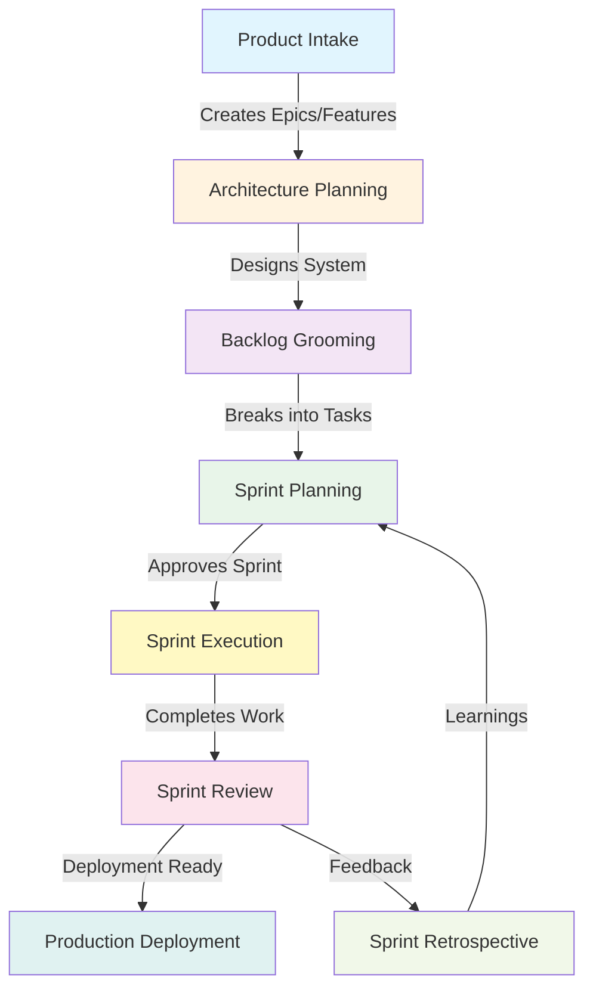
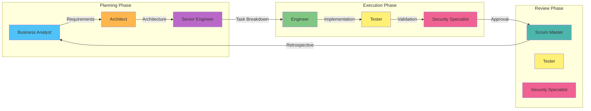
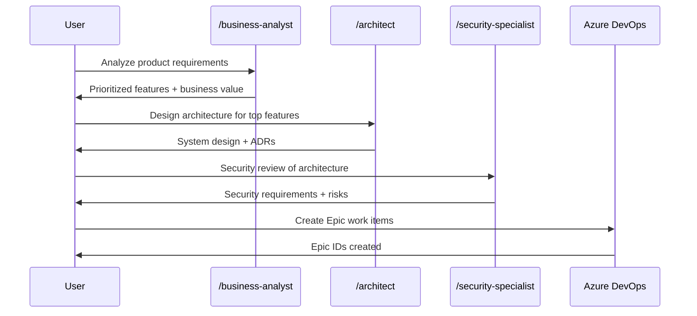
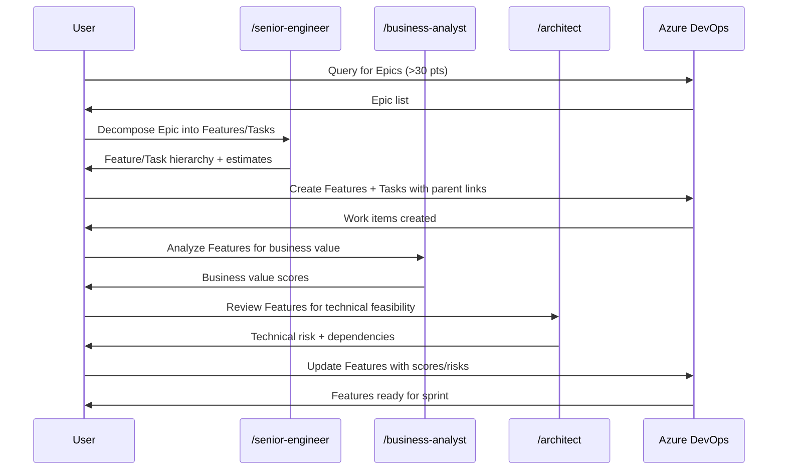
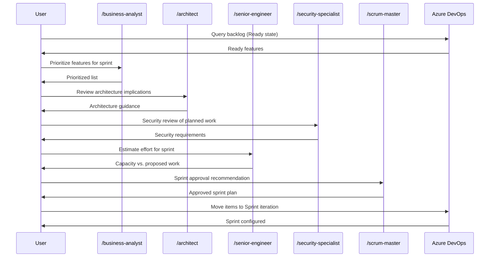
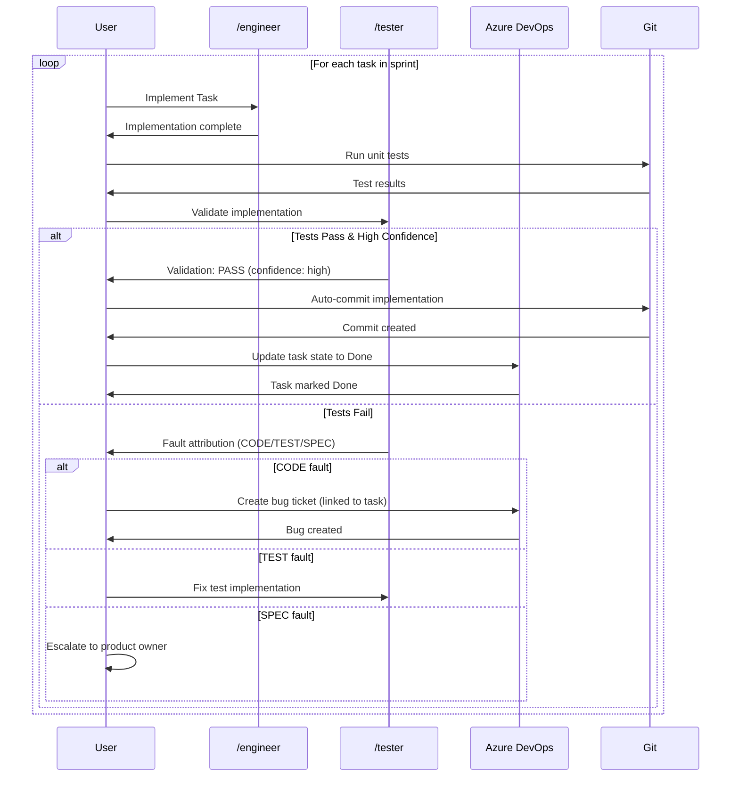
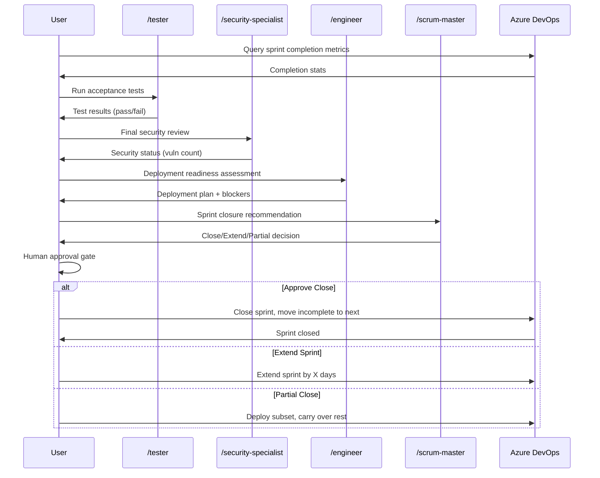

# Workflow Boundaries and Agent Orchestration

## Overview

This guide shows how workflows orchestrate agents across the software development lifecycle (SDLC), with clear boundaries between planning, execution, and review phases.

## SDLC Workflow Flow



## Agent Roles by SDLC Phase



## Workflow Diagrams

### 1. Product Intake → Architecture Planning

**Purpose:** Transform business requirements into technical architecture



**Agents Used:**
- `/business-analyst` - Analyze requirements, score business value
- `/architect` - Design system, create ADRs, assess risks
- `/security-specialist` - Review architecture security

**Output:**
- Epics created in work tracking system
- Architecture documentation in `docs/architecture/`

---

### 2. Backlog Grooming

**Purpose:** Decompose Epics into Features and Tasks



**Agents Used:**
- `/senior-engineer` - Decompose Epics, estimate story points
- `/business-analyst` - Score business value
- `/architect` - Assess technical feasibility

**Output:**
- Features and Tasks created with parent-child links
- Business value and technical risk scores assigned

---

### 3. Sprint Planning

**Purpose:** Select and commit to work for the sprint



**Agents Used:**
- `/business-analyst` - Prioritize features
- `/architect` - Provide architecture guidance
- `/security-specialist` - Security review
- `/senior-engineer` - Estimate effort vs. capacity
- `/scrum-master` - Sprint approval decision

**Output:**
- Sprint backlog configured in work tracking
- Work items assigned to sprint iteration

---

### 4. Sprint Execution (Implementation Cycle)

**Purpose:** Implement and test features iteratively



**Agents Used:**
- `/engineer` - Implement features/fixes
- `/tester` - Validate implementation, fault attribution

**Automated Steps:**
- Auto-commit on PASS + high confidence
- Auto-create bug tickets for CODE faults

**Output:**
- Implemented features committed to git
- Tasks marked Done in work tracking
- Bug tickets created for failures

---

### 5. Sprint Review

**Purpose:** Validate sprint deliverables ready for deployment



**Agents Used:**
- `/tester` - Run acceptance tests
- `/security-specialist` - Final security review
- `/engineer` - Deployment readiness
- `/scrum-master` - Closure recommendation

**Output:**
- Acceptance test report
- Security review report
- Deployment readiness assessment
- Sprint closure decision

---

## Agent Boundaries

### Business Analyst
- **Input:** Requirements, features, backlog items
- **Output:** Business value scores, prioritized lists
- **Used In:** Product intake, backlog grooming, sprint planning

### Architect
- **Input:** Features, system requirements, constraints
- **Output:** System design, ADRs, technical risk assessment
- **Used In:** Architecture planning, backlog grooming, sprint planning

### Senior Engineer
- **Input:** Epics, features, estimation requests
- **Output:** Task breakdown, story point estimates, capacity analysis
- **Used In:** Backlog grooming, sprint planning

### Engineer (Context-Driven)
- **Input:** Tasks, bugs, performance issues, deployment needs
- **Output:** Implemented code, CI/CD pipelines, optimized systems
- **Used In:** Sprint execution, deployment
- **Contexts:** Software dev, DevOps, Performance

### Tester (Context-Driven)
- **Input:** Implementations, test plans, failing tests
- **Output:** Test plans, validation results, fault attribution
- **Used In:** Sprint planning, sprint execution, sprint review
- **Contexts:** Test planning, adversarial testing, fault attribution

### Security Specialist
- **Input:** Architecture, code changes, deployment plans
- **Output:** Security requirements, vulnerability reports, approval
- **Used In:** Architecture planning, sprint planning, sprint review

### Scrum Master
- **Input:** Sprint metrics, completion status, blockers
- **Output:** Sprint recommendations, retrospective insights
- **Used In:** Sprint planning, sprint review, retrospectives

---

## Workflow Handoffs

### Epic → Features (Backlog Grooming)

```
┌─────────────────────────────────────────┐
│ INPUT: Epic (50 story points)           │
│ - Epic WI-1050: User Management         │
│ - Description: User CRUD + Auth         │
└─────────────────────────────────────────┘
                   ↓
          /senior-engineer
          (decomposition)
                   ↓
┌─────────────────────────────────────────┐
│ OUTPUT: Features + Tasks                │
│ - Feature WI-1051: User CRUD (15 pts)   │
│   - Task WI-1052: Create user (5 pts)   │
│   - Task WI-1053: Update user (5 pts)   │
│   - Task WI-1054: Delete user (5 pts)   │
│ - Feature WI-1055: Auth (20 pts)        │
│   - Task WI-1056: OAuth2 (8 pts)        │
│   - Task WI-1057: JWT (7 pts)           │
│   - Task WI-1058: Refresh (5 pts)       │
│ - Feature WI-1059: Permissions (15 pts) │
│   - Task WI-1060: RBAC (8 pts)          │
│   - Task WI-1061: ACLs (7 pts)          │
└─────────────────────────────────────────┘
```

### Task → Implementation (Sprint Execution)

```
┌─────────────────────────────────────────┐
│ INPUT: Task WI-1052: Create user (5pts) │
│ - Acceptance Criteria:                  │
│   - POST /api/users endpoint            │
│   - Validate email format               │
│   - Return 201 Created                  │
└─────────────────────────────────────────┘
                   ↓
           /engineer
        (implementation)
                   ↓
┌─────────────────────────────────────────┐
│ OUTPUT: Implementation                  │
│ - Code: src/api/users.py                │
│ - Tests: tests/test_users.py            │
│ - Commit: "Implement user creation"     │
└─────────────────────────────────────────┘
                   ↓
            /tester
         (validation)
                   ↓
┌─────────────────────────────────────────┐
│ OUTPUT: Validation                      │
│ - Status: PASS                          │
│ - Confidence: high                      │
│ - Coverage: 95%                         │
│ → Auto-commit triggered                 │
│ → Task marked Done in ADO               │
└─────────────────────────────────────────┘
```

---

## Key Principles

### 1. Fresh Context Per Agent

Each agent spawned via Task tool gets **fresh context window**:
- No context pollution from previous agents
- Explicit handoff of data between agents
- Workflow orchestrates agent sequence

### 2. External Verification

Workflows verify via **external source of truth** (Azure DevOps), not AI claims:
- After creating work items, query ADO to verify they exist
- After updating tasks, query ADO to verify state changed
- After commits, git log to verify commit created

### 3. Human Approval Gates

Critical decisions require **human approval**:
- Sprint planning → Human approves work items
- Sprint closure → Human approves deployment
- Architecture decisions → Human approves ADRs

### 4. State Checkpointing

Workflows save state after each step for **re-entrancy**:
- Checkpoint after Epic decomposition
- Checkpoint after Feature creation
- Checkpoint after Task implementation
- Resume from last checkpoint on failure

---

## Visual Summary

```
┌──────────────────────────────────────────────────────────────────────┐
│                        TRUSTABLE AI WORKFLOW                         │
│                                                                      │
│  Product Intake → Architecture → Backlog → Sprint → Execution       │
│       │               │           │         │         │             │
│       ↓               ↓           ↓         ↓         ↓             │
│   business-     architect    senior-     scrum-    engineer         │
│   analyst                   engineer    master     tester           │
│                                                   security           │
│                                                                      │
│  ┌────────┐   ┌────────┐   ┌────────┐   ┌────────┐   ┌────────┐  │
│  │ Epics  │ → │ Design │ → │Features│ → │ Sprint │ → │  Code  │  │
│  │        │   │  Docs  │   │ Tasks  │   │ Backlog│   │ Commits│  │
│  └────────┘   └────────┘   └────────┘   └────────┘   └────────┘  │
│                                                                      │
│       ↓                                                    ↓         │
│  Sprint Review ← Retrospective ← Deployment ← Validation            │
│       │                                          │                   │
│       ↓                                          ↓                   │
│   scrum-master                                tester                │
│   security-specialist                         security              │
│   engineer                                                          │
└──────────────────────────────────────────────────────────────────────┘
```

Each box represents a workflow phase, with agents working within that phase's boundaries.

---

## Conclusion

Workflows orchestrate agents through the SDLC with:
- **Clear boundaries** between planning, execution, and review
- **Fresh agent contexts** via Task tool
- **External verification** via work tracking system
- **Human approval** for critical decisions
- **State checkpointing** for re-entrancy

This architecture makes AI failures **visible and recoverable** through structured processes.
