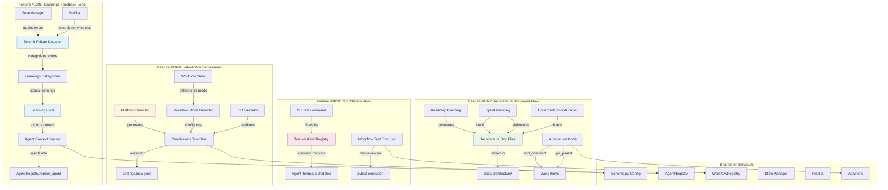

# Technical Architecture Design: QoL Improvements for Trustable AI Development Workbench

**Initiative**: QoL Improvements
**Date**: 2025-12-07
**Features**: #1025, #1026, #1027, #1030
**Architect**: Project Architect Agent (claude-opus-4)
**Status**: Proposed

---

## Executive Summary

This document presents the technical architecture for four Quality-of-Life improvement features for the Trustable AI Development Workbench. These features address key usability and reliability gaps: recurring tool failures due to lack of learnings feedback (#1025), excessive permission prompts (#1026), loss of architecture decisions between planning and implementation (#1027), and inconsistent test classification (#1030).

The architecture follows the framework's core principles of **State Persistence** (Pillar #4), **Verifiable Workflows** (Pillar #2), and **Fresh Contexts** (Pillar #5). All four features integrate with existing infrastructure (state_manager, profiler, context loaders, skills system) without requiring fundamental changes to core components. The features are designed to be backward-compatible, maintaining existing workflow behavior while progressively enhancing reliability and developer experience.

---

## System Architecture

### Component Integration Diagram



---

## Component Design

### Feature #1025: Integrate Active Learnings Feedback Loop

#### Architecture Overview

The learnings feedback loop extends the existing `LearningsSkill` and `StateManager` to automatically detect tool failures, categorize them, and inject relevant learnings into agent contexts before invocation.

#### Component: ErrorFailureDetector

**Location**: `core/error_detector.py`

**Responsibilities**:
- Parse stderr and exit codes from tool executions
- Classify errors as retriable vs. learning-worthy
- Extract error patterns for categorization
- Track error frequency for efficiency metrics

**Integration Points**:
- Called by workflows after any tool execution returns non-zero
- Reports to `StateManager.record_error()` with enhanced metadata
- Triggers `LearningsSkill.capture()` for learning-worthy errors

**Interface**:
```python
class ErrorFailureDetector:
    def detect_and_classify(
        self,
        stderr: str,
        exit_code: int,
        command: str,
        context: Dict[str, Any]
    ) -> ErrorClassification:
        """Classify error and determine action."""
```

#### Component: LearningsContextInjector

**Location**: `core/learnings_injector.py`

**Responsibilities**:
- Determine which learning categories apply to each agent
- Fetch relevant learnings via `LearningsSkill.export_for_context()`
- Inject learnings into agent context during rendering

**Integration with AgentRegistry**:
```python
class AgentRegistry:
    def render_agent(
        self,
        agent_name: str,
        additional_context: Optional[Dict[str, Any]] = None,
        inject_learnings: bool = True
    ) -> str:
        # Inject learnings before rendering
```

**Agent-Category Mapping** (in `.claude/config.yaml`):
```yaml
learnings_config:
  agent_category_mapping:
    engineer: ["azure-devops", "git", "pytest", "general"]
    architect: ["architecture", "infrastructure", "general"]
    tester: ["pytest", "testing", "general"]
    security-specialist: ["security", "vulnerabilities", "general"]
  max_learnings_per_category: 5
  max_total_tokens: 1000
```

---

### Feature #1026: Default Safe-Action Permissions Configuration

#### Architecture Overview

Provides platform-aware permission templates that auto-approve safe operations while requiring approval for destructive ones. Integrates with Claude Code's `settings.local.json` permission system.

#### Component: PlatformDetector

**Location**: `cli/platform_detector.py`

**Responsibilities**:
- Detect OS platform (Windows, Linux, macOS)
- Identify platform-specific command patterns
- Generate appropriate permission rules

#### Component: PermissionsTemplateGenerator

**Location**: `cli/permissions_generator.py`

**Safe Operations**:
- Git read-only: `git status`, `git diff`, `git log`
- Git local writes: `git add`, `git commit`
- Work tracking CRUD (not delete): `az boards work-item create/update/show`
- File reads: `cat`, `ls`, `grep`
- Test execution: `pytest`

**Require Approval**:
- Destructive: `git push`, `rm -rf`
- Production: deployment commands
- Work item deletion
- Web search

---

### Feature #1027: Enhance Artifact Flow - Architecture Decisions in Work Items

#### Architecture Overview

Creates a persistent architecture document system that flows from roadmap planning through sprint planning to implementation. Documents stored in file system, referenced via work item comments.

#### Document Storage Structure

```
docs/architecture/
├── roadmap-q1-2025/
│   ├── README.md
│   ├── epic-{id}-{slug}.md
├── sprint-{n}/
│   ├── README.md
│   ├── feature-{id}-{slug}.md
├── decisions/
│   ├── ADR-001-{title}.md
└── index.yaml
```

#### Adapter Method Extensions

**New methods for all adapters**:
```python
def add_comment(work_item_id: int, comment: str) -> Dict[str, Any]
def get_comments(work_item_id: int) -> List[Dict[str, Any]]
def get_parent_work_item(work_item_id: int) -> Optional[Dict[str, Any]]
def add_architecture_reference(work_item_id: int, doc_path: str, git_commit: str) -> Dict[str, Any]
```

#### Workflow Integration

- **Roadmap Planning**: Generates architecture docs, commits to git, adds references to Epics
- **Sprint Planning**: Loads prior architecture, elaborates implementation details
- **Daily Development**: Loads full architecture context (roadmap + sprint)

---

### Feature #1030: Test Classification Tags for Workflow-Aware Test Execution

#### Architecture Overview

**Framework-agnostic test classification system** that instructs Engineer and Tester agents to apply consistent test classifications regardless of testing framework (pytest, Jest, JUnit, etc.) or language (Python, JavaScript, Java, etc.).

The framework provides:
1. **Universal test taxonomy** (test types + test levels)
2. **Agent template instructions** for applying classifications in any test framework
3. **Framework-specific examples** in agent context (pytest for Python, Jest for JS, JUnit for Java, etc.)
4. **Workflow guidance** on which test classifications to run per workflow phase

#### Universal Test Taxonomy

**Test Types** (What is being tested):
- **functional**: Business logic, features, functionality
- **security**: Authentication, authorization, vulnerabilities, data protection
- **performance**: Speed, throughput, resource usage, scalability
- **usability**: UI/UX, accessibility, user workflows

**Test Levels** (Scope of testing):
- **unit**: Isolated components/functions
- **integration**: Component interactions
- **system**: End-to-end workflows
- **acceptance**: User acceptance criteria
- **validation**: Release validation

**Execution Modifiers**:
- **slow**: Tests taking >10 seconds
- **requires-db**: Tests requiring database
- **requires-network**: Tests requiring network access
- **flaky**: Tests with known intermittent failures

#### Agent Template Instructions

**Instructions injected into Engineer and Tester agents**:

```markdown
## Test Classification Standards

Apply consistent test classifications to all tests using your project's test framework syntax:

### Required Classifications

Every test MUST have:
1. **Test Level** (exactly one): unit | integration | system | acceptance | validation
2. **Test Type** (at least one): functional | security | performance | usability

### Framework-Specific Syntax

**Python (pytest)**:
```python
@pytest.mark.unit
@pytest.mark.functional
def test_user_login():
    pass
```

**JavaScript (Jest)**:
```javascript
describe('user login', () => {
  it('authenticates valid credentials', () => {
    // Tags: unit, functional
  });
});
```

**Java (JUnit)**:
```java
@Test
@Tag("unit")
@Tag("functional")
public void testUserLogin() {
}
```

**Other frameworks**: Use comments or framework-native tagging mechanism:
```
// Test: unit, functional
```

### Workflow-Aware Execution

Different workflows run different test scopes:
- **Sprint Execution**: unit + integration + functional
- **Sprint Completion**: unit + integration + functional + acceptance
- **Release Validation**: ALL test levels and types
- **Security Review**: security tests only
```

#### Configuration Template Generation

When `trustable-ai init` runs, detect project language/framework and generate appropriate test classification config:

**Python projects** → `pytest.ini` with markers
**JavaScript projects** → Update `jest.config.js` or `package.json` with test patterns
**Java projects** → JUnit 5 tagging guidance
**Generic projects** → Comment-based classification guidance

#### Workflow Integration

Workflows provide test execution guidance based on classification:

```markdown
## Sprint Execution Testing

Run tests classified as:
- **Levels**: unit, integration
- **Types**: functional

Skip:
- system, acceptance tests (too slow for daily execution)
- performance tests (run separately)

**Command examples**:
- pytest: `pytest -m "unit or integration"`
- Jest: `npm test -- --testNamePattern="unit|integration"`
- JUnit: Run with tag filter `unit | integration`
```

#### No Framework CLI Command

**Important**: The framework does NOT provide a `trustable-ai test` command because:
- Test execution is project-specific (use pytest, Jest, JUnit, etc. directly)
- Framework only provides **classification taxonomy** and **agent instructions**
- Projects use their native test runners with classification filters

---

## Data Models & Schemas

### Learnings Data Model (Enhanced)

```yaml
id: azure-devops-20251206121342
title: "Azure DevOps Bug work items use 'Done' not 'Resolved' state"
content: |
  When updating Azure DevOps Bug work items, use 'System.State=Done'...
category: azure-devops
tags: [work-items, state-transitions]
created_at: "2025-12-06T12:13:42Z"

# New fields for #1025
error_pattern: "The field 'State' contains the value 'Resolved'"
error_category: "invalid-field-value"
prevention_count: 0
applicable_agents: [engineer, tester, scrum-master]
```

### Permissions Configuration Schema

```json
{
  "permissions": {
    "allow": [
      "Bash(git status:*)",
      "Bash(az boards work-item create:*)",
      "Bash(python -m pytest:*)"
    ],
    "deny": [
      "Bash(git push --force:*)",
      "Bash(rm -rf /:*)"
    ],
    "ask": [
      "Bash(git push:*)"
    ]
  },
  "platform": "linux",
  "version": "1.0.0"
}
```

### Architecture Document Index

```yaml
version: "1.0"
documents:
  - id: "epic-auth-system"
    path: "roadmap-q1-2025/epic-auth-system.md"
    type: "epic"
    work_item_id: 1001
    git_commit: "abc123"
    status: "approved"
```

---

## Implementation Sequence

### Phase 1: Foundation (Week 1-2)

1. **#1030: Test Classification Tags**
   - Define marker registry and pytest.ini
   - Update agent templates
   - Add CLI test command
   - Self-contained, immediately useful

2. **#1026: Safe-Action Permissions**
   - Implement PlatformDetector
   - Create PermissionsTemplateGenerator
   - Add CLI validate command
   - Immediate UX improvement

### Phase 2: Core Enhancements (Week 3-4)

3. **#1025: Learnings Feedback Loop**
   - Implement ErrorFailureDetector
   - Create LearningsContextInjector
   - Extend AgentRegistry
   - Add efficiency metrics
   - Most complex, needs careful testing

### Phase 3: Integration (Week 5-6)

4. **#1027: Architecture Document Flow**
   - Define document schema
   - Implement ArchitectureLoader
   - Add adapter methods
   - Update workflows
   - Most invasive, should be last

---

## Technical Risk Assessment

### Risk 1: Learnings Injection Performance Overhead
**Severity**: Medium

**Mitigation**:
- Cache learnings by category with TTL (5 minutes)
- Pre-filter at capture time
- Hard limit: 5 learnings, 1000 tokens per agent
- Add performance metrics to profiler

### Risk 2: Permission Pattern Compatibility Across Platforms
**Severity**: Medium

**Mitigation**:
- Extensive testing on all platforms
- Conservative defaults (require approval when uncertain)
- Platform-specific pattern variants
- Validation command

### Risk 3: Architecture Document Sync with Work Items
**Severity**: High

**Mitigation**:
- Store git commit SHA with references
- Validation command for integrity checks
- Clear error messages for broken references
- Workflow step to update references on moves

### Risk 4: Test Marker Enforcement Friction
**Severity**: Low

**Mitigation**:
- Start with warnings, not errors
- Automated marker suggestion
- Escape hatch for legacy tests
- Gradual enforcement (new tests only)

### Risk 5: Azure CLI Error Pattern Changes
**Severity**: Medium

**Mitigation**:
- Pattern versioning by CLI version
- Fallback to "general" category
- Regular pattern review (quarterly)
- User-contributed patterns

---

## Architecture Decision Records

See separate ADR files in `docs/architecture/decisions/`:

- **ADR-001**: Learnings Injection Strategy (per-agent with caching)
- **ADR-002**: Permission Pattern Syntax (glob patterns with platform variants)
- **ADR-003**: Architecture Document Storage Location (project repo under docs/architecture/)
- **ADR-004**: Test Marker Taxonomy (pytest.mark.* with registry)

---

## Conclusion

This architecture provides a comprehensive plan for four QoL improvements that:

1. **Reduce recurring failures** through automated learnings injection (#1025)
2. **Improve developer experience** through safe-action permission defaults (#1026)
3. **Ensure architecture continuity** through document flow integration (#1027)
4. **Enable targeted testing** through standardized test classification (#1030)

All features integrate with existing infrastructure and maintain backward compatibility while delivering incremental value.
