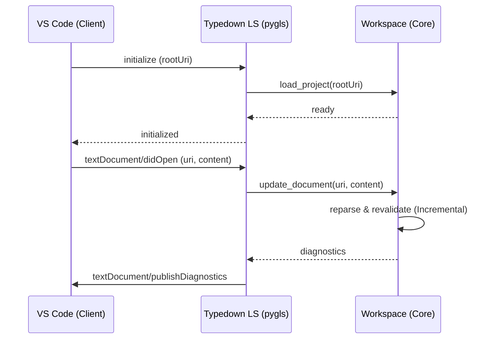

# ADR 0010: 语言服务器 (LSP) 架构

## 状态

已提议

## 背景

Typedown 的核心引擎（Parser, Compiler, Validator）目前主要通过 CLI (`td test`) 以批处理模式运行。为了提供 IDE 级别的开发体验（实时错误提示、自动补全、跳转定义），我们需要一个能够常驻内存、维护项目状态并处理增量更新的后台进程。

Visual Studio Code 及现代编辑器普遍采用 **Language Server Protocol (LSP)** 标准。

## 决策

1. **采用 LSP 协议**: 不设计自定义的 Socket 协议，而是直接实现 LSP 标准。这将使 Typedown 天然支持 VS Code, Neovim, JetBrains (via plugin) 等编辑器。
2. **使用 `pygls`**: 选用 `pygls` (Python Generic Language Server) 库作为 LSP 的基础框架。它是 Python 生态中最成熟的异步 LSP 框架，基于 `asyncio`，适合处理 IO 密集型任务。
3. **有状态的工作区 (Stateful Workspace)**:
   - 当前的 `Workspace` 类需要改造，使其从“一次性脚本”变为“长活对象”。
   - 实现增量更新接口：`update_document(uri, content, version)`。
   - **Overlay 机制**: LSP Server 将维护一个内存中的文件覆盖层 (Overlay)，优先使用编辑器中未保存的内容，而非磁盘内容。

## 详细设计

### 1. 架构图

### 4. 变更传播策略 (Change Propagation Strategy)

为了即时响应用户编辑，同时避免无效计算，我们需要建立精准的变更传播机制。

#### A. 变更识别 (Detect)

LSP 协议提供了 `textDocument/didChange` 通知。

- **单文件更新**: Server 接收到变更内容后，调用 `Workspace.update_file(path, content)`。
- **内存覆盖 (Overlay)**: `Workspace` 内部需维护一个 `overlay_cache`，用于存储未落盘的文件内容。解析器 (Parser) 在读取文件时，必须检查此 Cache。

#### B. 影响分析与重算 (Impact Analysis)

当文件 A 发生变化时，受影响的范围可能包括：

1. **A 本身**: 必须重新 Parse。
2. **引用了 A 的实体**: 如果 A 定义了 `entity:X`，而 B 中有 `former: X` 或 `[[X.field]]`，则 B 也需要重新 Evaluate/Validate。
3. **同目录/子目录上下文**: 如果 A 是 `config.td`，其所在的目录及所有子目录下的文件上下文都可能改变，需要大范围重算（Invalidate Folder）。

**策略**:

- **P0 (初期)**: 简单粗暴。任何文件变更 -> 重新 Parse 该文件 -> 全量 Resolve (构建依赖图 -> 排序 -> Materialize)。由于当前项目规模尚小，且依赖图构建非常快，全量重算是可接受的。
- **P1 (后期)**: 基于依赖图的反向查找 (Reverse Dependency Graph)。
  - 维护 `usage_graph`: `Entity A -> used_by -> [Entity B, Entity C]`。
  - 变更 A 时，仅将 A 加入 `dirty_queue`，并递归将 `used_by` 节点加入队列。
  - 仅重算 `dirty_queue` 中的实体。

### 5. 验证触发策略 (Validation Strategy)

#### A. 实时验证 (On-Type / On-Change)

- **触发**: 用户停止输入的短暂停顿后 (Debounce ~300ms)。
- **范围**: 仅执行 **Parser** 和 **Lightweight Resolver**。
- **目标**: 快速反馈语法错误 (Syntax Error) 和简单的引用中断 (Reference Error)。
- **限制**: 不运行耗时的 Spec 检查 (Pytest)。

#### B. 全量验证 (On-Save)

- **触发**: 用户保存文件 (`textDocument/didSave`)。
- **范围**: 执行 **Heavyweight Validator** 和 **Spec Runner**。
- **目标**: 运行完整的 Pytest 测试套件，确保业务规则的一致性。
- **理由**: Spec 检查可能涉及复杂的逻辑运算或外部已编译代码，不适合在打字过程中高频触发。

### 6. 功能特性矩阵 (Feature Matrix)

#### P0: 核心体验 (MVP)

- **Diagnostics (诊断)**:
  - 实时报告 YAML 语法错误、Pydantic 校验错误及无效引用。
- **Go To Definition (跳转定义)**:
  - 支持 `[[EntityID]]` 跳转到定义处。
  - 支持 `former: EntityID` 跳转。
- **Completion (自动补全)**:
  - 在 `former:` 后补全 Entity ID。
  - 输入 `[[` 触发 Entity ID 补全列表。

#### P1: 开发效率 (Enhanced)

- **Hover (悬停提示)**:
  - 悬停在 `[[EntityID]]` 上显示该实体的摘要（如类型、关键属性值）。
- **Schema Completion (架构补全)**:
  - 在 YAML 块中，根据当前 `entity:Type` 提供字段名补全。
  - 在 `entity:` 后补全项目上下文中的 Class 名称。
- **Document Symbols (大纲)**:
  - 提供文件内 Entity 和 Spec 的结构化大纲视图。

#### P2: 高级特性 (Advanced)

- **Find References (查找引用)**:
  - 反向查找某 Entity 被哪些文件引用。
- **Rename (重命名)**:
  - 全局重命名 Entity ID，自动更新所有 `[[...]]` 及 `former` 引用。
- **Code Lens**:
  - 在 Entity 定义上方显示 "Run Tests" 按钮（运行相关的 Spec）。

### 7. 日志与反馈 (Logging & Feedback)

为了弥补 Diagnostics（红波浪线）在展示复杂错误上下文（如循环依赖链、长篇的构建日志）时的不足，LS 将利用 **Output Channel** 进行辅助展示。

- **Output Channel ("Typedown")**:
  - 展示完整的构建流水线日志（"Building dependency graph...", "Processed 50 entities"）。
  - 在发生复杂错误（如 Circular Dependency）时，打印完整的引用链供排查。
  - **有序性**: 相比于 Problems 面板按文件排序，Output Channel 按时间/逻辑顺序展示验证过程，有助于理解错误产生的因果关系。

## 后果

- **正向**: 获得标准化的 IDE 支持能力；复用核心逻辑。
- **挑战**:
  - **增量编译**: 目前的 `resolve()` 是全量构建依赖图。在大型项目中，每次按键都全量重算可能太慢。初期可以接受全量（项目规模较小），后期需要优化为增量图更新。
  - **错误恢复**: Parser 需要具备更强的容错能力 (Error Tolerance)，在语法错误时仍能提供部分 AST 以支持补全。
