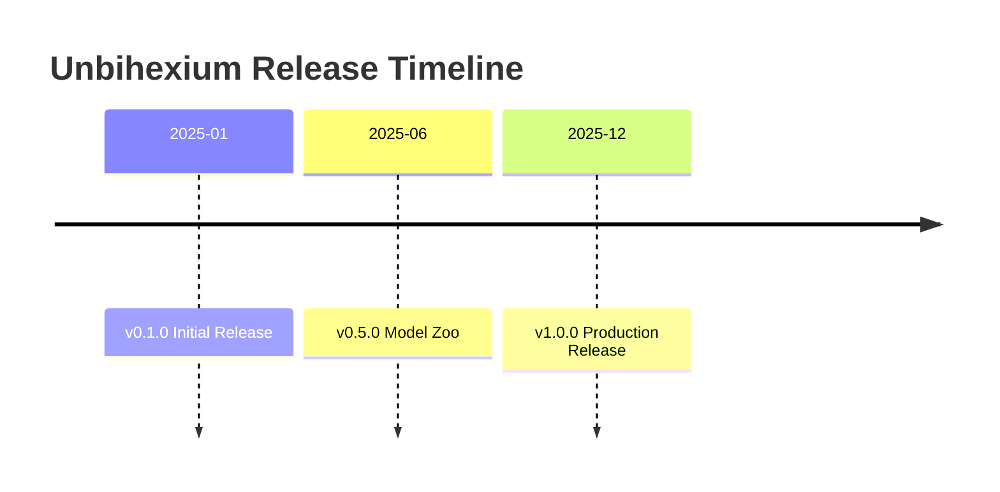

# Changelog

All notable changes to Unbihexium are documented in this file.

## Purpose

This changelog follows [Keep a Changelog](https://keepachangelog.com/) format and adheres to [Semantic Versioning](https://semver.org/).

## Version History

## Semantic Versioning

Version numbers follow the pattern:

$$
\text{MAJOR}.\text{MINOR}.\text{PATCH}
$$

Where:

- MAJOR: Incompatible API changes
- MINOR: Backwards-compatible features
- PATCH: Backwards-compatible fixes

## Releases

| Version | Date | Type |
| ------- | ---------- | ---------- |
| 1.0.0 | 2025-12-19 | Production |
| 0.5.0 | 2025-06-01 | Beta |
| 0.1.0 | 2025-01-15 | Alpha |

---

## [1.0.0] - 2025-12-19

### Added (1.0.0)

- Complete Model Zoo with 130 models and 520 variants
- Production-grade pipeline framework
- CLI with inference and pipeline commands
- Comprehensive documentation with 130 notebooks
- SHA256 verification for all models

### Changed (1.0.0)

- Upgraded to ONNX Runtime for inference
- Standardized model naming convention

### Security (1.0.0)

- Added supply chain security measures
- Implemented model integrity verification

---

## [0.5.0] - 2025-06-01

### Added (0.5.0)

- Initial model zoo structure
- Basic pipeline framework
- Core capability registry

---

## [0.1.0] - 2025-01-15

### Added (0.1.0)

- Project initialization
- Basic architecture
- Development tooling
