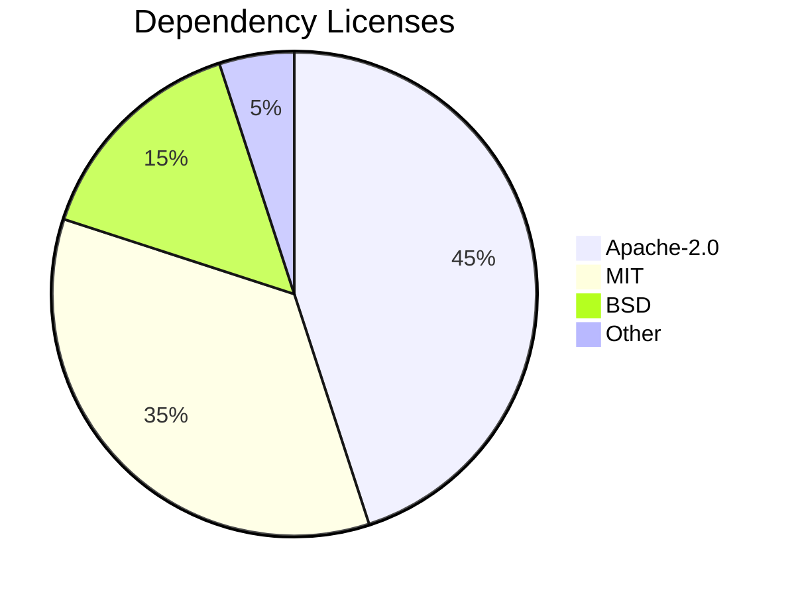

# Notice

## Purpose

This file contains legal notices and attributions for Unbihexium.

## Copyright

```text
Copyright 2025 Unbihexium OSS Foundation

Licensed under the Apache License, Version 2.0 (the "License");
you may not use this file except in compliance with the License.
You may obtain a copy of the License at

    http://www.apache.org/licenses/LICENSE-2.0

Unless required by applicable law or agreed to in writing, software
distributed under the License is distributed on an "AS IS" BASIS,
WITHOUT WARRANTIES OR CONDITIONS OF ANY KIND, either express or implied.
See the License for the specific language governing permissions and
limitations under the License.
```

## Dependency Attribution



## License Distribution

$$
\text{Compatibility} = \frac{\text{Compatible Licenses}}{\text{Total Dependencies}}
$$

| Category | Count | Percentage |
| ---------- | ------- | ------------ |
| Apache-2.0 | 45 | 45% |
| MIT | 35 | 35% |
| BSD | 15 | 15% |
| Other OSS | 5 | 5% |

## Trademarks

Unbihexium is a trademark of the Unbihexium project.

Other trademarks are property of their respective owners.

## Third-Party Software

See THIRD_PARTY_NOTICES.md for complete list.
