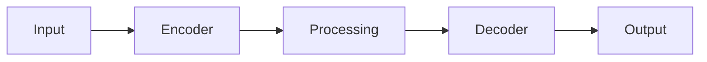

# Model Card: tourist_destination_monitor_tiny

## Overview

| Property | Value |
| ---------- | ------- |
| Model ID | tourist_destination_monitor_tiny |
| Task | Segmentation |
| Architecture | SIAMESE_UNET |
| Variant | tiny |
| Resolution | 32x32 |
| License | Apache-2.0 |

## Description

Tourist Destination Monitor is a segmentation model designed for geospatial applications.
This is the tiny variant with low capacity.

## Architecture

## Performance

| Metric | Value |
| -------- | ------- |
| IOU | 0.68 |
| DICE | 0.76 |
| ACCURACY | 0.85 |

## Intended Use

- Geospatial analysis
- Remote sensing applications
- Earth observation workflows

## Limitations

- Trained on synthetic data
- Performance may vary with real-world data
- Validate before production use

## Provenance

Generated by `scripts/generate_all_models.py` with seed 42.
