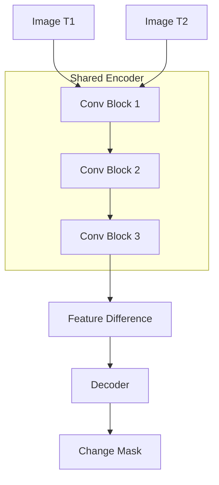

# Model Card: ubx-change-siamese-1.0.0

## Model Overview

| Property | Value |
| ---------- | ------- |
| Model ID | ubx-change-siamese-1.0.0 |
| Task | Change Detection |
| Architecture | Siamese Network |
| Version | 1.0.0 |
| License | Apache-2.0 |
| Status | Production |

## Description

Siamese network for detecting changes between two temporal images. Uses shared encoder weights to extract features from both images, then computes differences to identify changed regions.

## Architecture

## Input Format

The model expects a concatenated tensor of shape [B, 6, H, W]:

- Channels 0-2: Image at time T1
- Channels 3-5: Image at time T2

## Performance Metrics

| Metric | Value |
| -------- | ------- |
| IoU | 0.68 |
| F1 Score | 0.75 |
| Precision | 0.78 |
| Recall | 0.72 |

### F1 Score Formula

$$
F_1 = 2 \cdot \frac{\text{Precision} \cdot \text{Recall}}{\text{Precision} + \text{Recall}}
$$

## Intended Use

- Urban expansion monitoring
- Deforestation detection
- Disaster damage assessment
- Infrastructure monitoring

## Limitations

- Requires co-registered images
- Binary change output only
- Sensitive to radiometric differences
- Trained on synthetic changes

## Ethical Considerations

- Not suitable for evidence in legal proceedings
- Verify results with ground truth
- Avoid use for surveillance without consent

## Provenance

- Architecture: `src/unbihexium/ai/change_detection/siamese.py`
- Training: `scripts/train_all_models.py`
- Seed: 42
