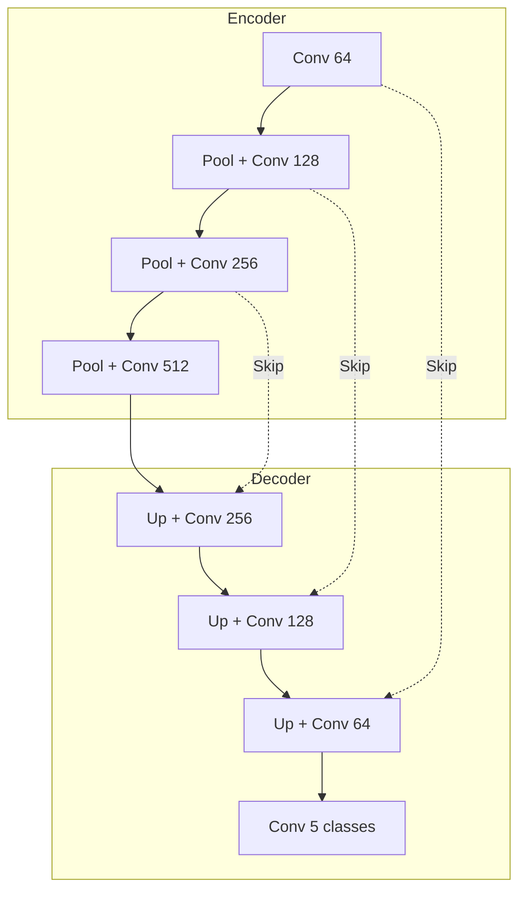

# Model Card: ubx-seg-multiclass-unet-1.0.0

## Model Overview

| Property | Value |
| ---------- | ------- |
| Model ID | ubx-seg-multiclass-unet-1.0.0 |
| Task | Semantic Segmentation |
| Architecture | UNet |
| Version | 1.0.0 |
| License | Apache-2.0 |
| Status | Production |

## Description

UNet-based semantic segmentation model for multi-class land cover classification. The encoder-decoder architecture with skip connections enables precise boundary delineation for remote sensing applications.

## Architecture

## Classes

| ID | Class | Description |
| ---- | ------- | ------------- |
| 0 | Background | Unclassified |
| 1 | Water | Water bodies |
| 2 | Vegetation | Crops and forest |
| 3 | Urban | Built-up areas |
| 4 | Bare Soil | Exposed ground |

## Performance Metrics

| Metric | Value |
| -------- | ------- |
| IoU (mean) | 0.72 |
| Dice | 0.81 |
| Accuracy | 0.89 |

### IoU Formula

$$
\text{IoU} = \frac{| A \cap B | }{ | A \cup B |} = \frac{TP}{TP + FP + FN}
$$

## Intended Use

- Land use / land cover mapping
- Water body detection
- Urban area delineation
- Change analysis input

## Limitations

- 64x64 input tile size
- 5-class output only
- Trained on synthetic data
- May require domain adaptation for specific regions

## Ethical Considerations

- Results should be validated before policy decisions
- Not suitable for legal boundary determination
- Acknowledge synthetic training data limitations

## Provenance

- Architecture: `src/unbihexium/ai/models/unet.py`
- Training: `scripts/train_all_models.py`
- Seed: 42
