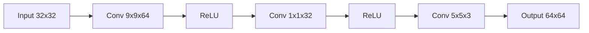

# Model Card: ubx-sr-srcnn-1.0.0

## Model Overview

| Property | Value |
| ---------- | ------- |
| Model ID | ubx-sr-srcnn-1.0.0 |
| Task | Super-Resolution |
| Architecture | SRCNN |
| Version | 1.0.0 |
| License | Apache-2.0 |
| Status | Production |

## Description

SRCNN (Super-Resolution Convolutional Neural Network) is a pioneering deep learning approach for image super-resolution. This implementation provides 2x upscaling capability for remote sensing and Earth observation imagery.

## Architecture

The network consists of three convolutional layers:

1. **Patch extraction**: 9x9 kernels extract features
2. **Non-linear mapping**: 1x1 kernels map to HR space
3. **Reconstruction**: 5x5 kernels reconstruct the image

## Intended Use

- Enhancement of low-resolution satellite imagery
- Pre-processing for downstream detection tasks
- Visual quality improvement for presentation

## Performance Metrics

| Metric | Value |
| -------- | ------- |
| PSNR | 28.5 dB |
| SSIM | 0.85 |
| MSE | 0.001 |

### PSNR Formula

$$
\text{PSNR} = 10 \cdot \log_{10}\left(\frac{MAX_I^2}{MSE}\right)
$$

Where $MAX_I$ is the maximum pixel value (1.0 for normalized images).

## Limitations

- Fixed 2x upscaling factor
- Trained on synthetic data only
- May introduce artifacts on complex textures
- Not suitable for professional cartographic production

## Training Data

Trained on deterministic synthetic RGB imagery generated with fixed seed for reproducibility.

## Ethical Considerations

- Output should be clearly labeled as enhanced/synthetic
- Not to be used for evidence fabrication
- Users should verify quality for specific applications

## Provenance

- Training script: `scripts/train_all_models.py`
- Export script: `scripts/export_all_models.py`
- Reproducible with seed 42
