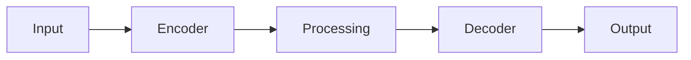

# Model Card: wildlife_habitat_analyzer_large

## Overview

| Property | Value |
| ---------- | ------- |
| Model ID | wildlife_habitat_analyzer_large |
| Task | Regression |
| Architecture | MLP |
| Variant | large |
| Resolution | 128x128 |
| License | Apache-2.0 |

## Description

Wildlife Habitat Analyzer is a regression model designed for geospatial applications.
This is the large variant with high capacity.

## Architecture

## Performance

| Metric | Value |
| -------- | ------- |
| RMSE | 0.15 |
| R2 | 0.82 |
| MAE | 0.12 |

## Intended Use

- Geospatial analysis
- Remote sensing applications
- Earth observation workflows

## Limitations

- Trained on synthetic data
- Performance may vary with real-world data
- Validate before production use

## Provenance

Generated by `scripts/generate_all_models.py` with seed 42.
