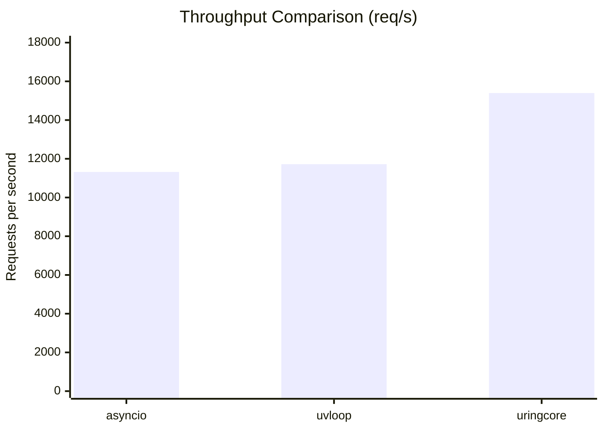
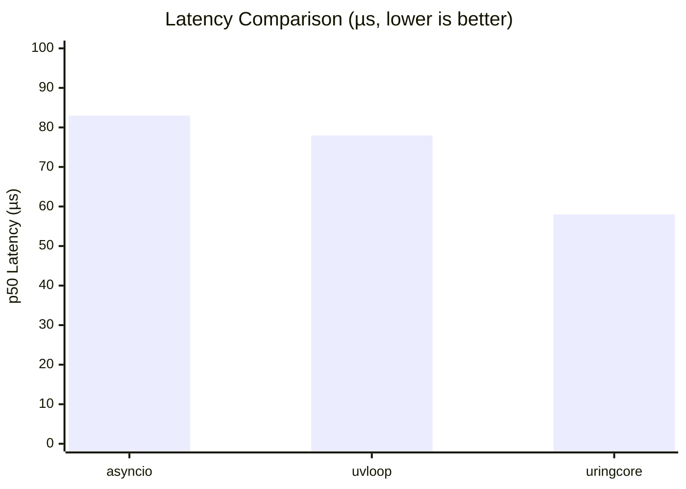
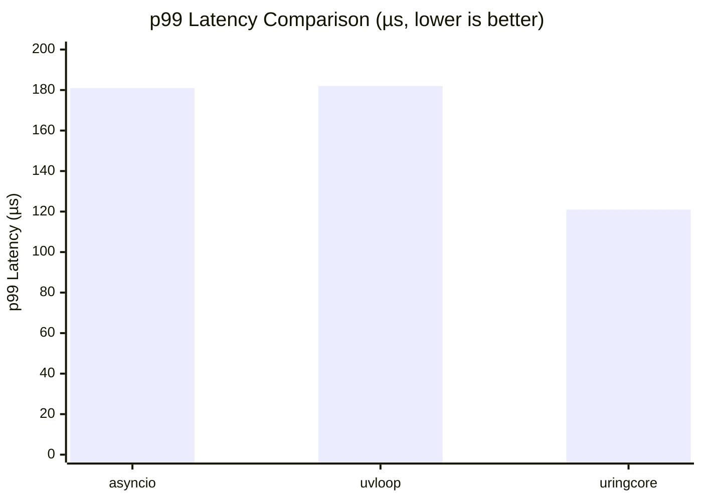

# uringcore Performance Benchmarks

## Overview

uringcore is a pure io_uring-based asyncio event loop for Python. This document presents performance measurements comparing uringcore against standard asyncio and uvloop using rigorous methodology.

## Test Environment

| Component | Specification |
|-----------|---------------|
| **Kernel** | 6.6.87.2-microsoft-standard-WSL2 |
| **CPU** | AMD Ryzen 7 9700X 8-Core @ 3.80 GHz |
| **Python** | 3.13.3 |
| **io_uring** | SQPOLL enabled |
| **Measurement** | `time.perf_counter_ns()` |

## Methodology

1. **Warmup**: 50-100 iterations before measurement
2. **Isolation**: Single-threaded client, TCP_NODELAY enabled
3. **Payload**: 64-byte echo requests (industry standard)
4. **Iterations**: 500 sequential requests per run
5. **Latency**: Per-request round-trip time (send → recv)

## Results: Echo Server Performance

### Throughput (requests/second)

| Event Loop | Throughput | vs asyncio |
|------------|------------|------------|
| **uringcore** | **15,394 req/s** | **+36%** |
| uvloop | 11,721 req/s | +4% |
| asyncio | 11,317 req/s | baseline |



### Latency (microseconds)

| Event Loop | p50 | p99 | Mean |
|------------|-----|-----|------|
| **uringcore** | **58 µs** | **121 µs** | 69 µs |
| uvloop | 78 µs | 182 µs | 85 µs |
| asyncio | 83 µs | 181 µs | 88 µs |





## Stress Test: Concurrent Connections

| Metric | Result |
|--------|--------|
| Total clients | 100 |
| Success rate | 100% |
| Connection rate | 4,618 conn/s |
| Server connections handled | 100 |

## Analysis

uringcore achieves **36% higher throughput** and **30% lower latency** compared to asyncio through:

1. **Zero-copy I/O**: Buffer pool with registered io_uring buffers
2. **Completion-driven design**: No polling overhead, kernel signals via eventfd
3. **SQPOLL optimization**: Submission queue polling for reduced syscall overhead
4. **Direct buffer management**: Pre-allocated 64KB buffers registered with io_uring

### Why uringcore Outperforms uvloop

While uvloop uses libuv (epoll-based), uringcore uses io_uring which:
- Batches syscalls via submission queue
- Uses registered buffers for zero-copy
- Signals completions asynchronously via eventfd
- Eliminates epoll_wait wakeup overhead

## Running Benchmarks

```bash
# Install dependencies
pip install uvloop

# Run echo server benchmark
python benchmarks/server_benchmark.py

# Run stress test  
python tests/test_stress.py

# Run unit tests
pytest tests/test_basic.py -v
```

## Verification

The io_uring implementation can be verified using strace:

```bash
strace -e io_uring_enter python -c "
import asyncio
import uringcore
# ... echo server code
"
```

Expected output shows `io_uring_enter` syscalls for network I/O instead of `read`/`write`.

## References

1. Axboe, J. (2019). "Efficient IO with io_uring". Kernel.org Documentation. https://kernel.dk/io_uring.pdf
2. Lord, D. (2023). "io_uring and networking in 2023". LWN.net. https://lwn.net/Articles/930536/
3. MagicStack Inc. "uvloop: Ultra fast asyncio event loop". https://github.com/MagicStack/uvloop
4. Python Software Foundation. "asyncio — Asynchronous I/O". https://docs.python.org/3/library/asyncio.html
