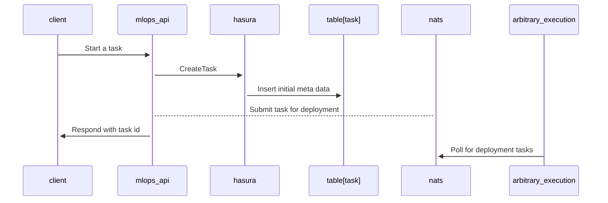
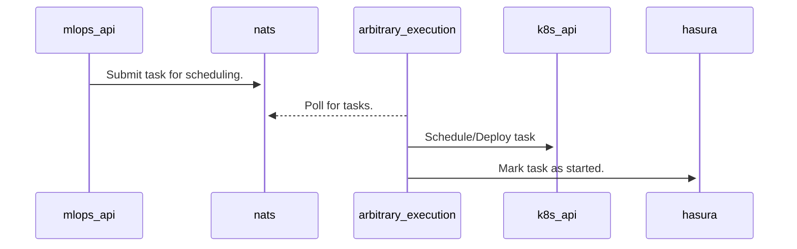
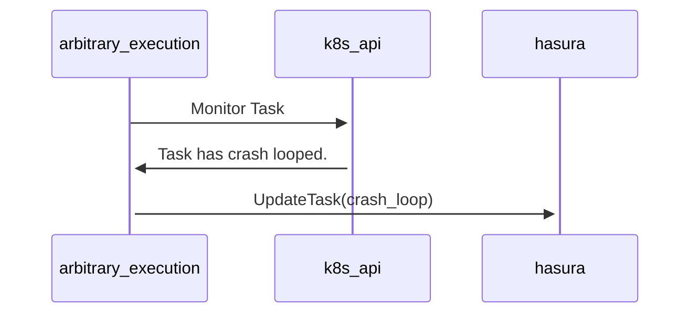
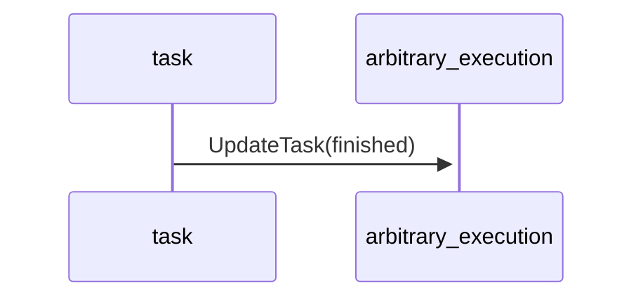
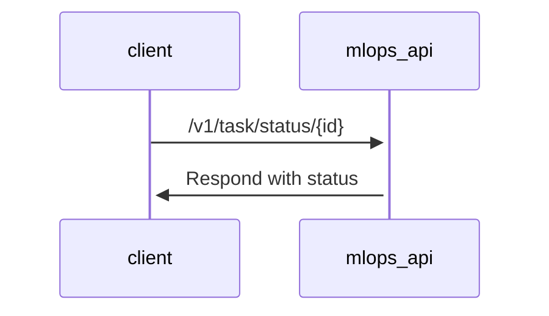

## Summary

API Calls for managing metadata around [tasks](https://github.com/WallarooLabs/platform/blob/main/adrs/arbitrary_code_execution.md). 
These are planned pre queried fields.

## ENUM

There are several enum fields present in the task section.
Defined as [Hasura Graphql enums](https://hasura.io/docs/latest/schema/postgres/enums/)

* `task_type` The type of task, used for scheduling.
* `task_flavor` The flavor the task corresponds with (*i.e. `model_conversion` or `data_connector`*)
* `task_status` The current status of the task.

## Computed Fields 

### Next Task Attempt

A [computed field](https://hasura.io/docs/latest/schema/postgres/computed-fields/) is present on `task` table.
Called `next_attempt`. This will determine the next increment attempt number. As an example if the last
attempt was `1` it would return `2`.

### Attempt Output

A secondary field `attempt_output` will join on the recent `attempt` field on `task` with `id`, 
to `task_output`. Allowing to get the most recent output along with the task id. 

## Flows

### Creating a Task

A client will call into the `MLOps` api to create a task. This does not schedule the task.
It creates an entry in the `task` table that the `deployment manager` will pick up later.
The return body will include a `id` that can be used to query for the task in the future.

`MLOps` api after creating the initial data, will publish a message to `deployment manager`.
That it needs to schedule a job

```python
model_convert_task = client.convert_model(model_name, mlflow_config)
print(model_convert_task.id)
```



### Starting a Task

*Starting a task, means logging a new attempt.*

`Deployment Manager` on scheduling a task. Will mark the task as `started`.
This sets the initial start time, and attempt to `scheduled`. 




### Updating a Task

Updating a task is meant for several areas.

* Changing the status, i.e. `scheduled -> started`
* Amending output `error|output`
* Changing the end time

There are several target callers

* Deployment Manger
  * Task has failed to schedule
  * Task has hit a crash loop
  * Task hit resource limit
* Task 
  * Task finished
  * Task encountered an exception
* etc.

Deployment manager flow, monitoring a task noting it has entered a crash loop state.



Task Flow where a task has finished. 

*This was (*to be determined*), but there was an initial thought of not having the task call `MLOps api`. A rest endpoint would be exposed in `arbitrary_execution`, to update the task. This is due to `MLOps` being read only or create of task only, i.e. not able to update a task.`*



### Polling for Task

The client is meant to poll `MLOps` api on a timed basis, checking the `status` and 
closing the `poll` when either a timeout or desired status is reached. The endpoint 
will be either.

* `/v1/$flavor/status`
* `/v1/task/status`





