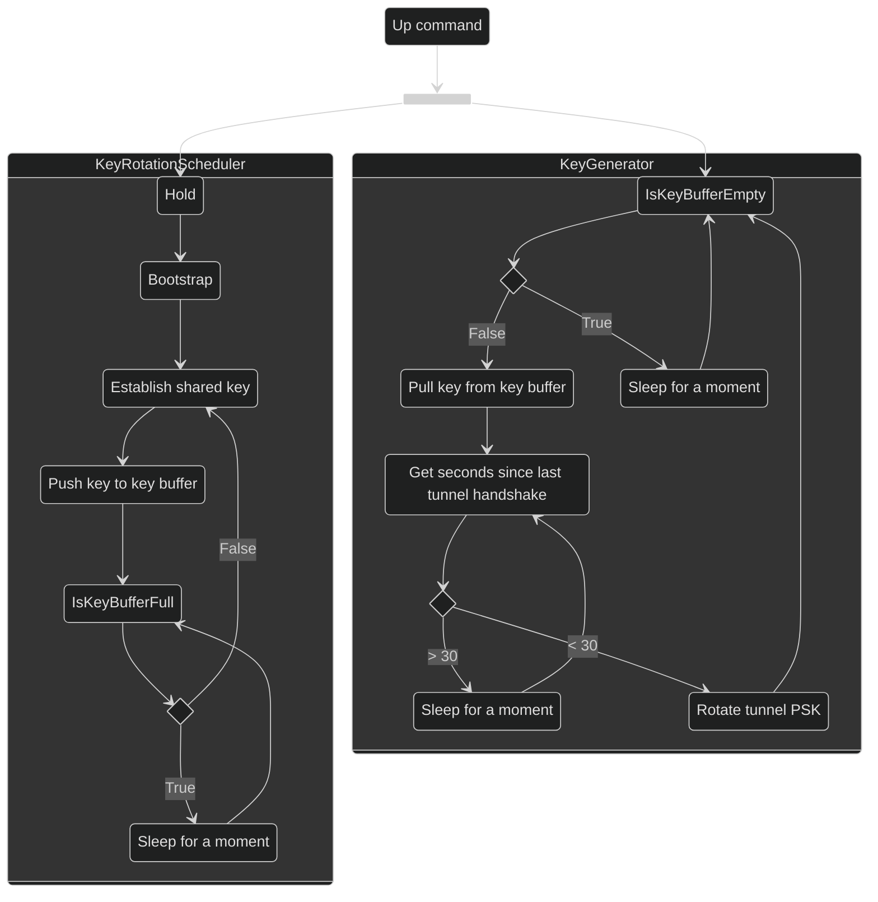

# Program journey

Each rotator passes through various high-level logical stages that are summarized in the state diagram bellow. The overall workflow of a rotator is described next.

{: .warning }
Even though the workflow described in this page is true to the implementation. Known (and also unknown) implementation specificities still apply that can make the program deviate from its normal path or get stuck in a state due to an exception.

## 1. The rotator has started

By starting a rotator with the [`up`](/cli/up.html) command, a new process is created and detached from the user's terminal session. For each peer indicated in the configuration file, two threads are created - one for the `KeyRotationScheduler` and another for the `KeyGenerator`. For example, if three peers were indicated in the configuration file, six new threads are created.

One can look at the `KeyGenerator` as the producer of keys and the `KeyRotationScheduler` as the consumer. They share a key buffer that for each pair of `KeyGenerator` and `KeyRotationScheduler`, the `KeyGenerator` ensures that it is always full and the `KeyRotationScheduler` retrieves keys from it has necessary. 

## 2. Bootstrap

To each rotator is assigned one role, `server` or `client`. Consequently, to each `KeyGenerator` managing one tunnel is assign a role. The `server` awaits for its client to send an initialization message containing information important parameters to the bootstrap of the rotator. If the `server` agrees with these parameters, it sends an acknowledgement. After this, they are ready to start establishing keys.

## 3. Key establishment

The `KeyGenerator` with the `client` role is always assessing whether the key buffer is full. If it notices that is not full, it starts the key establishment procedure. 

The key establishment can be divided into three stages:
1. QKD key establishment;
2. post-quantum key establishment; 
3. key verification.

### QKD key establishment

After detecting that the buffer is not full, the `client` retrieves a 32 byte key from the KMS and send the respective ID of the key to its peer. The `server` upon the receiving of this ID, also requests the key to its respective KMS. If everything goes as expected, the `server` answers with an acknowledgement.

### Post-quantum key establishment

Before performing the key exchange, both the `client` and `server` generate an ephemeral key-pair for the selected KEM and send the respective public key to the peer.  

For each KEM, the `client` encapsulates a 32 byte random secret and sends it to the `server`. The `server` decapsulates the secret and also encapsulates a random secret of its own and sends to the `client`. After the `client` performing the decapsulation, both have two 32 byte values that are XORed, this way constituting the shared key for the given KEM.

If more than one KEM is configured, this procedure is performed as many times as needed. The final key established using post-quantum cryptography is the result of the XOR of all keys established.

Since PQ-KEs are considered optional, this step is also optional.

### Key verification

The final key that was generated is the result of the XOR of the QKD and post-quantum keys. To ensure its integrity, the `client` hashes the key using SHA-512 with a combination of the SAE IDs as the salt. The `client` sends the digest to the `server` that verifies it by performing the same hashing procedure. If the verification passes successfully, it answers with an acknowledgement.

After a successful key establishment, the freshly generated key is pushed to the key buffer, and loops back to the starting condition of whether the key buffer is full or not.

## 4. Key rotation

The `KeyRotationScheduler` is continuously checking if the key buffer was keys. If it was, it retrieves it, and starts monitoring the underlying WireGuard tunnel to check if it is safe to rotate the key or not. When the right time comes, it sets the key as the tunnel's PSK, and returns to the initial starting condition. 

A key is only rotated within the first 30 seconds after the tunnel's handshake. Knowing that WireGuard only performs two consecutive handshakes at minimum every two minutes, this ensures that a PSK is only set when there's no chance of WireGuard triggering a handshake. 
