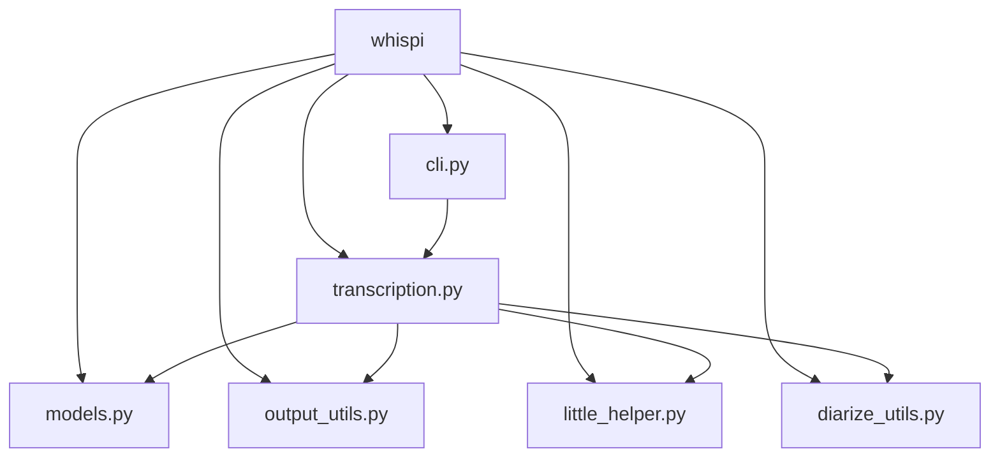

# CLAUDE.md

This file provides guidance to Claude Code (claude.ai/code) when working with code in this repository.

---

# whispi

> 使用 OpenAI Whisper 快速转录、标注和生成音视频字幕！

## 项目愿景

whispi 是一个统一的音视频转录工具包，整合了两种 Whisper 实现（faster-whisper、mlx-whisper），为不同硬件平台（CPU、NVIDIA GPU、Apple Silicon MLX）提供最快的转录体验。

**模型策略**：为优化中英文转录质量，whispi 保留 3 个精选模型：
- **原版 Whisper（多语言通用）**：
  - `large-v3-turbo`（默认）：速度快、精度高，全平台支持
  - `large-v3`：最高精度，适合需要极致准确度的场景
- **Belle-whisper 中文优化版**：
  - `belle-large-v3-zh`：中文最高精度，性能提升 24-65%

## 架构总览

```
whispi/
|-- cli.py              # 基于 Typer 的 CLI 入口 (whispi run/list)
|-- transcription.py    # 核心 TranscriptionHandler 类
|-- models.py           # Whisper 模型注册表和选择逻辑
|-- output_utils.py     # 导出写入器 (JSON, TXT, SRT, WEBVTT)
|-- little_helper.py    # 设备检测、文件格式工具
|-- diarize_utils.py    # 基于 pyannote 的说话人分离
```

## 模块结构图



## 模块索引

| 模块 | 功能 | 关键类/函数 |
|------|------|-------------|
| `cli.py` | Typer CLI，包含 2 个命令：`run`、`list` | `cli_app`, `run_cmd`, `list_cmd` |
| `transcription.py` | 核心 `TranscriptionHandler`，包含设备特定的转录方法 | `TranscriptionHandler` |
| `models.py` | `WHISPER_MODELS` 注册表，映射模型名称到实现 | `set_supported_model` |
| `output_utils.py` | `OutputWriter` 类，用于多格式导出 | `OutputWriter`, `ExportFormats` |
| `little_helper.py` | 设备检测、文件格式转换、工具函数 | `get_device`, `FilePathProcessor` |
| `diarize_utils.py` | 通过 pyannote.audio 进行说话人分离 | `diarize` |

## 运行与开发

### 包管理

本项目使用 [uv](https://github.com/astral-sh/uv) 进行包管理和依赖管理。

### 开发环境设置

```bash
# 安装 uv（如果尚未安装）
curl -LsSf https://astral.sh/uv/install.sh | sh

# 同步依赖并创建虚拟环境
uv sync

# 安装 MLX 扩展（仅适用于 Apple Silicon）
uv sync --extra mlx

# 运行开发版本
uv run whispi run -f <文件>

# 测试单个文件
uv run whispi run -f tests/sample.mp3 -v

# 测试带说话人标注（需要 HF_TOKEN 环境变量）
uv run whispi run -f tests/sample.mp3 -a --hf_token $HF_TOKEN
```

### HuggingFace 认证设置

说话人标注功能需要 HuggingFace token。推荐使用 CLI 登录方式：

```bash
# 一次性登录（token 会被保存）
pip install huggingface-hub
hf auth login

# 之后可直接使用标注功能，无需传递 token
uv run whispi run -f audio.mp3 -a
```

### CLI 命令

```bash
whispi run -f <文件|文件夹|.list> [选项]
whispi list                 # 显示各设备可用的模型
```

### 主要 CLI 选项

- `-f/--files`：输入文件、文件夹或 .list 文件
- `-d/--device`：auto、cpu、gpu、mlx
- `-m/--model`：Whisper 模型（默认：large-v3-turbo）
- `-a/--annotate`：启用说话人分离
- `-s/--subtitle`：生成 SRT/WEBVTT 字幕
- `-e/--export`：json、txt、srt、webvtt、all

### 依赖要求

- Python 3.10-3.13
- FFmpeg（系统依赖）
- HuggingFace token（用于说话人标注）

## 测试策略

仓库中目前没有测试套件。测试目录通过 `.gitignore` 排除。

## 编码规范

- **包管理**：使用 uv 进行依赖管理和虚拟环境管理
- **框架**：纯 Python，使用 Typer（CLI）
- **格式化**：标准 Python 风格，无显式格式化配置
- **日志**：使用 Python `logging` 模块，输出到 `./logs/` 目录
- **类型注解**：广泛使用，特别是在函数签名中
- **Rich 库**：用于控制台输出和进度条

## 关键实现细节

### 设备选择流程 (`little_helper.py:33-74`)
1. AUTO：检测 CUDA > MLX > CPU
2. GPU：如果可用则使用 CUDA
3. MLX：Apple Silicon 加速
4. CPU：回退方案

### 转录流水线 (`transcription.py:709-809`)
1. 文件格式验证/转换为 WAV（16kHz 单声道）
2. 如未提供则检测语言
3. 设备特定的转录方法选择：
   - MLX：`transcribe_with_mlx_whisper()` (transcription.py:341-442)
   - CPU/CUDA：`transcribe_with_faster_whisper()` (transcription.py:443-624)
4. 可选的说话人标注（通过 `diarize_utils.diarize()` 和 pyannote.audio）
5. 按请求格式导出

### 模型注册表 (`models.py:3-23`)
将用户友好的模型名称映射到实现特定的标识符：
- `faster-whisper`：Systran CTranslate2 模型
- `mlx-whisper`：MLX Community 模型

## 代码修改指南

修改此代码库时，必须遵循以下架构约束：

### 核心架构原则

1. **设备处理流程**（`little_helper.py:33-74`）：
   - 始终使用 `little_helper.get_device()` 进行设备选择
   - 设备优先级：CUDA > MLX > CPU
   - 切勿绕过设备检测逻辑

2. **模型选择与回退**（`models.py:59-67`）：
   - 使用 `models.set_supported_model()` 确保模型兼容性
   - 系统会自动回退到支持的默认模型
   - 不支持的模型会显示蓝色提示信息
   - Belle-whisper 模型不支持 MLX 设备

3. **转录实现选择**（`transcription.py:760-784`）：
   - MLX 设备：始终使用 `mlx-whisper`
   - CPU/CUDA：统一使用 `faster-whisper` + `diarize_utils.diarize()`（支持说话人标注和字幕）
   - 说话人标注通过 pyannote.audio 实现，设备无关（自动检测 CUDA > CPU）

4. **文件处理规范**（`little_helper.py:128-274`）：
   - 使用 `FilePathProcessor` 进行输入验证
   - 支持文件、文件夹、.list 文件三种输入
   - 自动规范化文件名（移除特殊字符）

5. **音频格式转换**（`little_helper.py:320-409`）：
   - 所有输入必须转换为 16kHz 单声道 WAV
   - 使用 `check_file_format()` 进行转换
   - 通过 ffmpeg-python 库执行转换

6. **输出格式处理**（`output_utils.py:26-352`）：
   - 使用 `determine_export_formats()` (26-63) 验证导出格式
   - 使用 `OutputWriter` 类 (65-352) 进行所有文件导出
   - 支持格式：json, txt, srt, webvtt
   - `--export=srt` 或 `--export=webvtt` 必须配合 `--subtitle` 使用

7. **进度显示**（`little_helper.py:456-466`）：
   - 对所有耗时操作使用 `run_with_progress()`
   - 保持一致的进度条格式和颜色方案

8. **日志记录**（`transcription.py:13-21`）：
   - 通过 Python `logging` 模块记录到 `./logs/` 目录
   - 日志文件名格式：`log_whispi_YYYY-MM-DD.log`
   - 关键操作都必须记录日志

### 说话人标注流程

**统一实现**（所有设备）：
- 使用 `diarize_utils.diarize()` 调用 pyannote.audio
- 基于 `pyannote/speaker-diarization-community-1` 模型
- 设备自动检测（CUDA > CPU）
- 通过时间戳对齐将说话人标签分配给词块

### HuggingFace Token 处理

优先级顺序（`cli.py:118-134`）：
1. `hf auth login` 保存的 token（通过 huggingface_hub.HfFolder）
2. `--hf_token` CLI 参数
3. `HF_TOKEN` 环境变量

### 避免常见错误

错误做法：
- 直接修改 `WHISPER_MODELS` 字典而不理解模型支持矩阵
- 在 MLX 设备上使用 faster-whisper
- 跳过音频格式转换步骤
- 不使用 `run_with_progress()` 进行耗时操作

正确做法：
- 参考 `models.py` 中的模型支持矩阵
- 遵循设备与实现的对应关系（MLX -> mlx-whisper, CPU/GPU -> faster-whisper）
- 所有文件处理经过 `FilePathProcessor`
- 所有输出通过 `OutputWriter`

## 变更记录

| 日期 | 变更 |
|------|------|
| 2025-12-23 | 移除 RTTM 格式支持：由于 MLX Whisper 不生成词级别时间戳，RTTM 文件生成失败。移除相关代码和文档。 |
| 2025-12-23 | 更新 CLAUDE.md：修正英文前缀、更新所有代码引用行号、添加 HuggingFace 认证设置指南（使用 `hf auth login`） |
| 2025-12-23 | 升级说话人分离模型：pyannote/speaker-diarization-3.1 → pyannote/speaker-diarization-community-1，同时升级 pyannote.audio 3.4.0 → 4.0.2，并升级 rich 13.7.1 → >=13.9.4 以满足依赖要求 |
| 2025-12-22 | 完整代码扫描，更新 `.claude/index.json`，模块文档更新准确行数 |
| 2025-12-22 | 迁移到 uv 包管理器，使用现代 PEP 621 格式的 pyproject.toml，构建后端从 setuptools 改为 hatchling |
| 2025-12-22 | 添加 Belle-whisper 中文优化模型（belle-large-v3-zh），中文性能提升 24-65% |
| 2025-12-22 | 移除 whisperX 依赖，统一使用 faster-whisper + pyannote.audio 架构，代码减少约 650 行，支持所有 3 个模型（包括 large-v3-turbo） |
| 2025-12-22 | 移除 MPS 设备支持和 insanely-fast-whisper 实现，简化为 MLX (Apple Silicon) + faster-whisper (CUDA/CPU) 架构 |
| 2025-12-22 | 简化模型列表：从 16 个模型精简为 3 个（2 个原版 + 1 个 Belle 中文优化），优化中英文转录场景 |
| 2025-12-22 | 移除翻译为英文功能 |
| 2025-12-22 | 移除 post_correction 和 output_templates 模块，不再输出 HTML 格式 |
| 2025-12-22 | 移除 Gradio Web 应用功能（app.py、app_helpers.py） |
| 2025-12-22 | 移除 URL/YouTube 下载功能（download_utils.py） |
| 2025-12-22 | 通过 init-architect 扫描生成初始 CLAUDE.md |
