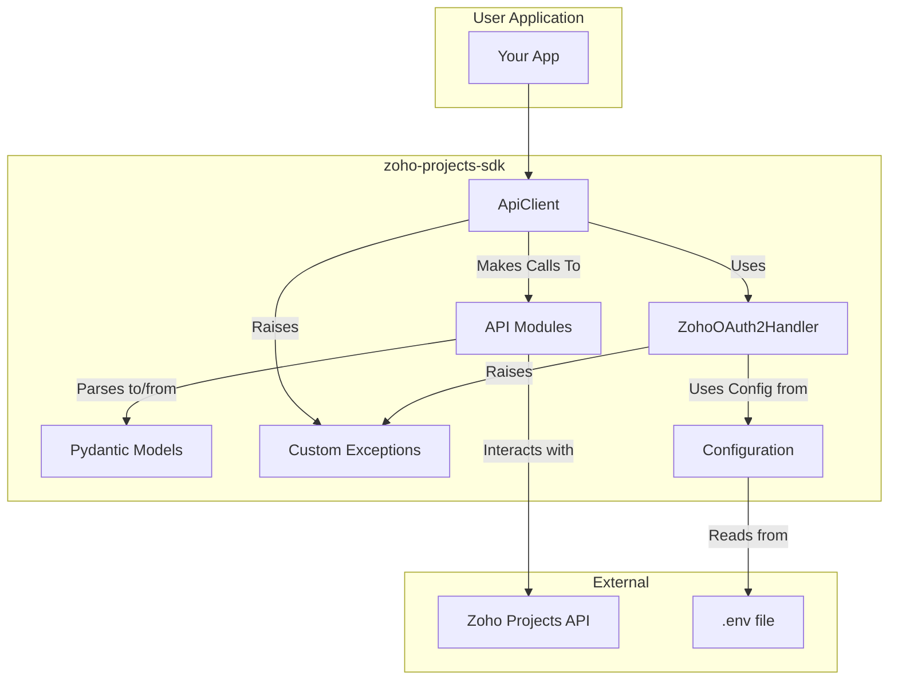

# Zoho Projects SDK

[](https://pypi.org/project/zoho-projects-sdk)
[](https://pypi.org/project/zoho-projects-sdk)
[](https://github.com/carlospaiva/zoho-projects-sdk/actions)
[](https://opensource.org/licenses/MIT)

A modern, asynchronous, and type-safe Python SDK for the Zoho Projects API V3.

> ⚠️ **Project status:** Active development.

## Table of Contents

1. [Overview](#overview)
2. [Highlights](#highlights)
3. [Installation](#installation)
4. [Configuration](#configuration)
5. [Quick Start](#quick-start)
6. [Usage Examples](#usage-examples)
7. [Architecture](#architecture)
8. [Implemented API Modules](#implemented-api-modules)
9. [Error Handling & Logging](#error-handling--logging)
10. [Development Workflow](#development-workflow)
11. [Testing Strategy](#testing-strategy)
12. [Contributing](#contributing)
13. [Support & Resources](#support--resources)
14. [License](#license)

## Overview

`zoho-projects-sdk` wraps the Zoho Projects API with an async-first interface that manages authentication, retries, and data validation for you. The SDK is built on top of `httpx`, `tenacity`, and Pydantic V2, giving you a strongly typed client that integrates naturally into modern Python applications.

## Highlights

- **Async by default:** Every API call is asynchronous to keep your applications responsive under heavy I/O loads.
- **OAuth2 made simple:** Automatic access-token refresh handled via `ZohoOAuth2Handler` with environment-driven configuration.
- **Strong typing everywhere:** Responses map to Pydantic models so you get IDE autocomplete and runtime validation for free.
- **Resilient networking:** Built-in retries with exponential backoff for transient HTTP errors thanks to `tenacity` integration.
- **Extensible surface:** Resource-specific service classes (projects, tasks, timelogs, etc.) keep the codebase modular and easy to extend.

## Installation

Requires Python **3.9+**.

```bash
pip install zoho-projects-sdk
```

Or with `uv`:

```bash
uv pip install zoho-projects-sdk
```

## Configuration

The SDK reads credentials from environment variables (directly or via `.env`).

```ini
# .env
ZOHO_PROJECTS_CLIENT_ID="your_client_id"
ZOHO_PROJECTS_CLIENT_SECRET="your_client_secret"
ZOHO_PROJECTS_REFRESH_TOKEN="your_refresh_token"
ZOHO_PROJECTS_PORTAL_ID="your_portal_id"
```

You can also pass credentials explicitly when instantiating `ZohoProjects`:

```python
from zoho_projects_sdk.client import ZohoProjects

client = ZohoProjects(
    client_id="...",
    client_secret="...",
    refresh_token="...",
    portal_id="...",
)
```

## Quick Start

```python
import asyncio
from zoho_projects_sdk.client import ZohoProjects


async def main() -> None:
    async with ZohoProjects() as client:
        projects = await client.projects.get_all()
        for project in projects:
            print(project.name)


if __name__ == "__main__":
    asyncio.run(main())
```

The async context manager ensures the underlying HTTP connection pool is closed cleanly when you are done.

## Usage Examples

### Fetch a single project

```python
project = await client.projects.get(project_id=123456789)
print(project.id, project.status)
```

### Create a project

```python
from zoho_projects_sdk.models.project_models import Project

new_project = Project(
    name="SDK Launch",
    description="Ship the SDK to production",
)

created = await client.projects.create(new_project)
print(created.id)
```

### Update existing data

```python
updated = await client.projects.update(project_id=created.id, project_data=new_project)
print(updated.updated_time)
```

### Timelog queries with filters

```python
entries = await client.timelogs.get_by_user(user_id=987654321, from_date="2024-01-01", to_date="2024-01-31")
total_hours = sum(entry.hours for entry in entries)
print(total_hours)
```

> Explore the `timelogs`, `tasks`, `issues`, and other service modules for more endpoint-specific helpers. They follow the same async pattern documented above.

### Ready-to-run scripts

- [`examples/basic_usage.py`](examples/basic_usage.py) – list projects and optionally the first project's tasks using an async workflow.
- [`examples/timelog_report.py`](examples/timelog_report.py) – aggregate billable vs. non-billable hours for a project across a date range.
- [`examples/issue_management.py`](examples/issue_management.py) – list recent issues and optionally create/update/delete a sample issue for demonstration purposes.

## Architecture



Key components:

- **`ZohoProjects` client:** User-facing façade exposing resource-specific services.
- **`ApiClient`:** Internal HTTP wrapper providing retry logic, default headers, and auth injection.
- **`ZohoOAuth2Handler`:** Refreshes tokens and handles credential loading.
- **`models/`:** Pydantic schemas for the Zoho Projects domain.
- **`api/`:** One module per resource grouping, each delegating network concerns to `ApiClient`.
- **`exceptions.py`:** Rich error metadata for diagnosing failures.
- **`utils/logger.py`:** Centralized logging setup for consistent formatting.@src/zoho_projects_sdk/utils/logger.py#1-36

## Implemented API Modules

The following resource modules are currently available (more coming soon):

- Attachments
- Baselines
- Business Hours
- Clients
- Comments
- Contacts
- Events
- Issues
- Milestones
- Phases
- Portals
- Projects
- Roles
- Tags
- Tasklists
- Tasks
- Timelogs
- Users

See [`src/zoho_projects_sdk/api`](src/zoho_projects_sdk/api/) for endpoint-level details.

## Error Handling & Logging

- API failures raise `APIError` with status details and payload context.
- Network-level problems (timeouts, connectivity, rate limits) are retried automatically up to three times with exponential backoff before surfacing.
- Configure logging via `zoho_projects_sdk.utils.get_logger` to feed SDK logs into your existing observability pipeline.

## Development Workflow

1. Clone the repository:

   ```bash
   git clone https://github.com/carlospaiva/zoho-projects-sdk.git
   cd zoho-projects-sdk
   ```

2. Install dependencies (production + development):

   ```bash
   uv pip install -e .[dev]
   ```

3. Keep code formatted and linted:

   ```bash
   uv run format
   uv run lint
   uv run type-check
   ```

4. Run the aggregated quality gate:

   ```bash
   uv run check
   ```

## Testing Strategy

We target **100% line and branch coverage** across unit, integration, and end-to-end suites.

- Run everything:

  ```bash
  uv run test
  ```

- Unit tests only:

  ```bash
  uv run pytest tests/unit
  ```

- Integration tests (requires live credentials):

  ```bash
  uv run pytest tests/integration
  ```

Integration suites expect a populated `.env` so they can hit the live Zoho Projects API responsibly.

## Contributing

We welcome issues and pull requests. Please:

1. Follow the [Conventional Commits](https://www.conventionalcommits.org/en/v1.0.0/) specification for commit messages.
2. Ensure `uv run check` and `uv run test` both pass before opening a PR.
3. Include tests and documentation updates covering your changes.
4. Provide clear reproduction steps when reporting bugs.

## Support & Resources

- [Examples](examples/) — start with [`basic_usage.py`](examples/basic_usage.py)
- [Issue tracker](https://github.com/carlospaiva/zoho-projects-sdk/issues)

For security-sensitive disclosures, please use responsible reporting practices rather than filing a public issue.

## License

Distributed under the MIT License. See [LICENSE](LICENSE) for details.
